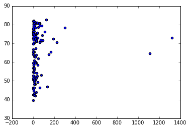
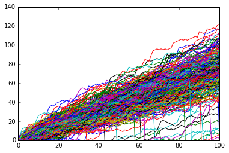

---

[TOC]

---

**Foreword**

Code snippets and excerpts from the courses (Introduction and Intermediate). Python 3. From DataCamp.

---

## 1, Introduction

### Basic operations

**Print is a function**

- In Python 3:

```python
print()
```

- While in Python 2:

```python
print "test"
print "-" * 25
print 10
print 5 + 5
print variable
print function()
```

```python
print("Python 3.x")
```

    Python 3.x
 
- Addition and subtraction.

```python
print(5 + 5)
print(5 - 5)
```

    10
    0 

- Multiplication and division.

```python
print(3 * 5)
print(10 / 2)
```

    15
    5.0

- Exponentiation.

```python
print(4 ** 2)
```

    16

- Modulo.

```python
print(18 % 7)
```

    4

- How much is your $100 worth after 7 years?

```python
print(100 * ((1 + 0.10)**7))
```

    194.87171000000012
 
```python
# Create a variable savings
savings = 100

# Create a variable factor
factor = 1.10

# Calculate result
result = savings * factor ** 7

# Print out result
print(result)
```

    194.87171000000012

- Several variables to experiment with.

```python
savings = 100
factor = 1.10
desc = "compound interest"

# Assign product of factor and savings to year1
year1 = savings * factor

# Print the type of year1
print(type(year1))
```

    <class 'float'>

```python
# Assign sum of  desc and  desc to doubledesc.
doubledesc = desc + desc

# Print out doubledesc
print(doubledesc)
```

    compound interestcompound interest

```python
# Definition of savings and result
savings = 100
result = 100 * 1.10 ** 7
print(result)
```

    194.87171000000012

### Concatenating, help, printing, listing

**Concatenation**

```python
print("I started with $" + str(savings) + " and now have $" + str(result) + ". Awesome!")
```

    I started with $100 and now have $194.87171000000012. Awesome!

```python
# Definition of pi_string
pi_string = "3.1415926"

# Convert pi_string into float: pi_float
pi_float = float(pi_string)
print(pi_float)
```

    3.1415926

**Help**

```python
# Inline
help(max)
```

    Help on built-in function max in module builtins:
    
    max(...)
        max(iterable, *[, default=obj, key=func]) -> value
        max(arg1, arg2, *args, *[, key=func]) -> value
        
        With a single iterable argument, return its biggest item. The
        default keyword-only argument specifies an object to return if
        the provided iterable is empty.
        With two or more arguments, return the largest argument.
 
```python
# Offline
?max
```

**Contiguous printing**

~ horizontal, print~

```python
# Print out room and room_up
print('room'); print('room_up')
```

    room
    room_up

**Index**

```python
# Create list areas
areas = [11.25, 18.0, 20.0, 10.75, 9.50]

# Print out the index of the element 20.0
print(areas.index(20.0))
```

    2

```python
# Create list baseball 
baseball = [180, 215, 210, 210, 188, 176, 209, 200]

# Print out the first and last elements
print(baseball[1]); print(baseball[-1])
```

    215
    200

### NumPy: arrays

- An overview with an simple array.
- Import the `numpy` package as `np`.

```python
import numpy as np
```

- Create a Numpy array from `baseball`: `np_baseball`.
- Transform a list into an array.

```python
np_baseball = np.array(baseball)

# Print out type of np_baseball
print(type(np_baseball))
```

    <class 'numpy.ndarray'>

- Again.

```python
# Height list
height = [68, 78, 76, 80, 75, 79, 78, 80]
weight = baseball

# Create array from height with correct units: np_height_m
np_height_m = np.array(height) * 0.0254

# Create array from weight with correct units: np_weight_kg 
np_weight_kg = np.array(weight) * 0.453592

# Calculate the BMI: bmi
bmi = np_weight_kg / (np_height_m ** 2)

# Print out bmi
print(bmi)
```

    [ 27.36860318  24.84546948  25.56171941  23.06945176  23.49812856
      19.82697406  24.15210754  21.97090644]

```python
# Store weight and height lists as numpy arrays
np_weight = np.array(weight)
np_height = np.array(height)

# Print out the weight at index 5
print(np_weight[5])

# Print out sub-array of np_height: index 100 up to and including index 110
print(np_height[1:2])
```

    176
    [78]

**List to array**

- A list in an array is a 2D array or a tabular array.

~ 2 dimension, 2d, 2-d~

```python
# Create baseball, a list of lists
baseball = [[180, 78.4],
            [215, 102.7],
            [210, 98.5],
            [188, 75.2]]
```

```python
# Create a Numpy array from baseball: np_baseball
np_baseball = np.array(baseball)

# Print out the type of np_baseball
print(type(np_baseball))

# Print out the shape of np_baseball
print(np_baseball.shape)

# Print out the 4th row of np_baseball
print(np_baseball[3,:])

# Select the entire second column of np_baseball: np_weight
np_weight = np_baseball[:,1]

# Print out height of 4th player
print(np_baseball[3,0])
```

    <class 'numpy.ndarray'>
    (4, 2)
    [ 188.    75.2]
    188.0
 
```python
# Create np_height from np_baseball
np_height = np_baseball[:,1]

# Print out the mean of np_height
print(np.mean(np_height))

# Print out the median of np_height
print(np.median(np_height))
```

    88.7
    88.45

```python
# Print mean weight
avg = np.mean(np_baseball[:,0])
print("Average: " + str(avg))

# Print median weight. Replace 'None'
med = np.median(np_baseball[:,0])
print("Median: " + str(med))

# Print out the standard deviation on weight. Replace 'None'
stddev = np.std(np_baseball[:,0])
print("Standard Deviation: " + str(stddev))
```

    Average: 198.25
    Median: 199.0
    Standard Deviation: 14.6351460533

```python
# Print out correlation between first and second column. Replace 'None'
corr = np.corrcoef(np_baseball[:,0], np_baseball[:,1])
print("Correlation: " + str(corr))
```

    Correlation: [[ 1.          0.95865738]
     [ 0.95865738  1.        ]]

**Arrays and logicals**

```python
# Create the arrays
my_house = np.array([18.0, 20.0, 10.75, 9.50])
your_house = np.array([14.0, 24.0, 14.25, 9.0])
```

```python
# Which areas in my_house are greater than or equal to 18
print(my_house >= 18)

# compare two Numpy arrays element-wise
# which areas in my_house are smaller than the ones in your_house
print(my_house[my_house < your_house])
```

    [ True  True False False]
    [ 20.    10.75]

```python
# np.logical_and(), np.logical_or() and np.logical_not()

# my_house greater than 18.5 or smaller than 10
print(np.logical_or(my_house > 18.5, my_house < 10))

# Both my_house and your_house smaller than 11
print(np.logical_and(my_house < 11, your_house < 11))
```

    [False  True False  True]
    [False False False  True]

## 2, Intermediate

### Plotting basics

- In this section, we use the `matplolib` package for plotting and charting.
- In IPython, the package is 'stacked' with the `numpy` packages and other scientific packages under the magic command `%pylab`. 
- Calling `%pylab` is calling the entire scientific stack or Scipy Stack.

**Line plot**

```python
year = [1950, 1970, 1990, 2010]
pop = [2.519, 3.692, 5.263, 6.972]

# Print the last item from year and pop
print(year[-1])
print(pop[-1])
```

    2010
    6.972

```python
% pylab inline
```

    Populating the interactive namespace from numpy and matplotlib

- With `inline`, graphics will be printed within the notebook as opposed to being printed in another window (a new window which pops open).

```python
# Make a line plot: year on the x-axis, pop on the y-axis
plt.plot(year, pop)
plt.show()
```


**Scatter plot**

```python
eco = np.recfromcsv('economic.csv', delimiter=';', names=True, dtype=None)

# gdp_cap, life_exp, pop
gdp_cap = eco['gdp_cap']
life_exp = eco['life_exp']
pop = eco['pop']
```

```python
# Change the line plot to a scatter plot
plt.scatter(gdp_cap, life_exp)

# Put the x-axis on a logarithmic scale
plt.xscale('log')

# Show plot
plt.show()
```


```python
# Build Scatter plot
plt.scatter(pop, life_exp)

# Show plot
plt.show()

# There's no clear relationship between population and life expectancy, which makes perfect sense.
```


**Histograms**

```python
# Create histogram of life_exp data (bins = 10 by default)
plt.hist(life_exp)

# Display histogram
plt.show()
```


```python
# Build histogram with 5 bins
plt.hist(life_exp, bins = 5)

# Show and clean up plot
plt.show()
plt.clf() # clean up

# Build histogram with 20 bins
plt.hist(life_exp, bins = 20)

# Show and clean up again
plt.show()
plt.clf()
```


    <matplotlib.figure.Figure at 0x7578cf8>

**Label**

~ x, y, label~

```python
# Basic scatter plot, log scale
plt.scatter(gdp_cap, life_exp)
plt.xscale('log') 

# Strings
xlab = 'GDP per Capita [in USD]'
ylab = 'Life Expectancy [in years]'
title = 'World Development in 2007'

# Add axis labels
plt.xlabel(xlab)
plt.ylabel(ylab)

# Add title
plt.title(title)

# After customizing, display the plot
plt.show()
```


```python
# Scatter plot
plt.scatter(gdp_cap, life_exp)

# Previous customizations
plt.xscale('log') 
plt.xlabel('GDP per Capita [in USD]')
plt.ylabel('Life Expectancy [in years]')
plt.title('World Development in 2007')

# Definition of tick_val and tick_lab
tick_val = [1000,10000,100000]
tick_lab = ['1k','10k','100k']

# Adapt the ticks on the x-axis
plt.xticks(tick_val, tick_lab)

# After customizing, display the plot
plt.show()
```


### A plotting project: Gapminder

**Size, the 3rd dimension**

- A little project that emulates [Gapminder](https://www.gapminder.org/).

```python
# Store pop as a numpy array: np_pop
np_pop = np.array(pop)
# array([])

# Double np_pop
np_pop = np_pop * 2

# Update: set s argument to np_pop
plt.scatter(gdp_cap, life_exp, s = np_pop) # s = size of the bubble

# Previous customizations
plt.xscale('log') 
plt.xlabel('GDP per Capita [in USD]')
plt.ylabel('Life Expectancy [in years]')
plt.title('World Development in 2007')
plt.xticks([1000, 10000, 100000],['1k', '10k', '100k'])

# Display the plot
plt.show()
```


**Colors**

```python
# adding con
con = ['red', 'green', 'blue', 'blue', 'yellow', 'black', 'green', 'red', 'red', 'green', 'blue', 'yellow', 'green', 'blue', 'yellow', 'green', 'blue', 'blue', 'red', 'blue', 'yellow', 'blue', 'blue', 'yellow', 'red', 'yellow', 'blue', 'blue', 'blue', 'yellow', 'blue', 'green', 'yellow', 'green', 'green', 'blue', 'yellow', 'yellow', 'blue', 'yellow', 'blue', 'blue', 'blue', 'green', 'green', 'blue', 'blue', 'green', 'blue', 'green', 'yellow', 'blue', 'blue', 'yellow', 'yellow', 'red', 'green', 'green', 'red', 'red', 'red', 'red', 'green', 'red', 'green', 'yellow', 'red', 'red', 'blue', 'red', 'red', 'red', 'red', 'blue', 'blue', 'blue', 'blue', 'blue', 'red', 'blue', 'blue', 'blue', 'yellow', 'red', 'green', 'blue', 'blue', 'red', 'blue', 'red', 'green', 'black', 'yellow', 'blue', 'blue', 'green', 'red', 'red', 'yellow', 'yellow', 'yellow', 'red', 'green', 'green', 'yellow', 'blue', 'green', 'blue', 'blue', 'red', 'blue', 'green', 'blue', 'red', 'green', 'green', 'blue', 'blue', 'green', 'red', 'blue', 'blue', 'green', 'green', 'red', 'red', 'blue', 'red', 'blue', 'yellow', 'blue', 'green', 'blue', 'green', 'yellow', 'yellow', 'yellow', 'red', 'red', 'red', 'blue', 'blue']
print(con)
```

    ['red', 'green', 'blue', 'blue', 'yellow', 'black', 'green', 'red', 'red', 'green', 'blue', 'yellow', 'green', 'blue', 'yellow', 'green', 'blue', 'blue', 'red', 'blue', 'yellow', 'blue', 'blue', 'yellow', 'red', 'yellow', 'blue', 'blue', 'blue', 'yellow', 'blue', 'green', 'yellow', 'green', 'green', 'blue', 'yellow', 'yellow', 'blue', 'yellow', 'blue', 'blue', 'blue', 'green', 'green', 'blue', 'blue', 'green', 'blue', 'green', 'yellow', 'blue', 'blue', 'yellow', 'yellow', 'red', 'green', 'green', 'red', 'red', 'red', 'red', 'green', 'red', 'green', 'yellow', 'red', 'red', 'blue', 'red', 'red', 'red', 'red', 'blue', 'blue', 'blue', 'blue', 'blue', 'red', 'blue', 'blue', 'blue', 'yellow', 'red', 'green', 'blue', 'blue', 'red', 'blue', 'red', 'green', 'black', 'yellow', 'blue', 'blue', 'green', 'red', 'red', 'yellow', 'yellow', 'yellow', 'red', 'green', 'green', 'yellow', 'blue', 'green', 'blue', 'blue', 'red', 'blue', 'green', 'blue', 'red', 'green', 'green', 'blue', 'blue', 'green', 'red', 'blue', 'blue', 'green', 'green', 'red', 'red', 'blue', 'red', 'blue', 'yellow', 'blue', 'green', 'blue', 'green', 'yellow', 'yellow', 'yellow', 'red', 'red', 'red', 'blue', 'blue']

```python
# The Gapminder data contains a list continent with the continent each country belongs to.
# A dictionary is constructed that maps continents onto colors:
dict = {
    'Asia':'red',
    'Europe':'green',
    'Africa':'blue',
    'Americas':'yellow',
    'Oceania':'black'
}

# Specify c and alpha inside plt.scatter()
plt.scatter(x = gdp_cap, y = life_exp, s = np_pop * 2, c = con, alpha = 0.8)

# Previous customizations
plt.xscale('log') 
plt.xlabel('GDP per Capita [in USD]')
plt.ylabel('Life Expectancy [in years]')
plt.title('World Development in 2007')
plt.xticks([1000,10000,100000], ['1k','10k','100k'])

# Show the plot
plt.show()
```


**Additional Customizations**

```python
# Scatter plot
plt.scatter(x = gdp_cap, y = life_exp, s = np_pop * 2, c = con, alpha = 0.8)

# Previous customizations
plt.xscale('log') 
plt.xlabel('GDP per Capita [in USD]')
plt.ylabel('Life Expectancy [in years]')
plt.title('World Development in 2007')
plt.xticks([1000,10000,100000], ['1k','10k','100k'])

# Additional customizations
plt.text(1550, 71, 'India')
plt.text(5700, 80, 'China')

# Add grid() call
plt.grid(True)

# Show the plot
plt.show()
```


**List**

```python
# Definition of countries and capital
countries = ['spain', 'france', 'germany', 'norway']
capitals = ['madrid', 'paris', 'berlin', 'oslo']

# Get index of 'germany': ind_ger
ind_ger = countries.index('germany')
print(ind_ger)

# Use ind_ger to print out capital of Germany
print(capitals[ind_ger])
```

    2
    berlin
    
**Dictionary**

```python
# Definition of dictionary
europe = {'spain':'madrid', 'france':'paris', 'germany':'berlin', 'norway':'oslo' }

# Print out the keys in europe
print(europe.keys())

# Print out value that belongs to key 'norway'
print(europe['norway'])
```

    dict_keys(['france', 'norway', 'spain', 'germany'])
    oslo
 
```python
# Add italy to europe
europe['italy'] = 'rome'

# Print out italy in europe
print('italy' in europe)
```

    True

```python
# Add italy to europe
europe['italy'] = 'rome'

# Print out italy in europe
print('italy' in europe)
```

    True

```python
# Definition of dictionary
europe = {'spain':'madrid', 'france':'paris', 'germany':'bonn', 
          'norway':'oslo', 'italy':'rome', 'poland':'warsaw', 
          'australia':'vienna' }

# Update capital of germany
europe['germany'] = 'berlin'

# Remove australia
del(europe['australia'])

# Print europe
print(europe)
```

    {'france': 'paris', 'norway': 'oslo', 'poland': 'warsaw', 'italy': 'rome', 'spain': 'madrid', 'germany': 'berlin'}

```python
# Dictionary of dictionaries
europe = { 'spain': { 'capital':'madrid', 'population':46.77 },
           'france': { 'capital':'paris', 'population':66.03 },
           'germany': { 'capital':'berlin', 'population':80.62 },
           'norway': { 'capital':'oslo', 'population':5.084 } }
           
           
# Print out the capital of France
print(europe['france']['capital'])

# Create sub-dictionary data
data = {
    'capital': 'rome',
    'population': 59.83
}

# Add data to europe under key 'italy'
europe['italy'] = data

# Print europe
print(europe)
```

    paris
    {'france': {'capital': 'paris', 'population': 66.03}, 'italy': {'capital': 'rome', 'population': 59.83}, 'norway': {'capital': 'oslo', 'population': 5.084}, 'spain': {'capital': 'madrid', 'population': 46.77}, 'germany': {'capital': 'berlin', 'population': 80.62}}

### Pandas: data frame

- An Overview.
- Tabular data are rectangular or 2D. Numpy can handle that.
-  But, Numpy is good with similar data: all str, all float or all integer.
- Pandas is a data frame that can mix diverse data: str, float, and integer.
- Import the `pandas` package as `np`.

```python
import pandas as pd
```

- Start with pre-defined lists.

```python
names = ['United States', 'Australia', 'Japan', 'India', 'Russia', 'Morocco', 'Egypt']
dr =  [True, False, False, False, True, True, True]
cpc = [809, 731, 588, 18, 200, 70, 45]
```

```python
# Create dictionary my_dict with three key:value pairs: my_dict
my_dict = {
    'country': names,
    'drives_right': dr,
    'cars_per_cap': cpc
}
```

- Build DataFrame `cars` from `my_dict`: `cars`.

~ convert, dictionary, data frame~

```python
cars = pd.DataFrame(my_dict)

# Print cars
print(cars)
```

       cars_per_cap        country drives_right
    0           809  United States         True
    1           731      Australia        False
    2           588          Japan        False
    3            18          India        False
    4           200         Russia         True
    5            70        Morocco         True
    6            45          Egypt         True
    
- Add row labels.

```python
row_labels = ['US', 'AUS', 'JAP', 'IN', 'RU', 'MOR', 'EG']

# Specify row labels of cars
cars.index = row_labels

# Print cars again
print(cars)
```
         cars_per_cap        country drives_right
    US            809  United States         True
    AUS           731      Australia        False
    JAP           588          Japan        False
    IN             18          India        False
    RU            200         Russia         True
    MOR            70        Morocco         True
    EG             45          Egypt         True
    
- Import data: 'cars.csv' to create DataFrame `cars`.

```python
cars2 = pd.read_csv('cars.csv', sep = ';')
```

Other parameters: `index_col`, `header`, `delimiter`, `names`, `index_col`.

- Above all, here are a few commands to extract, subset, parse:

```python
my_array[r, c]

my_pandas['col'] as a series
my_pandas[['col']] as a d.f.
my_pandas[['col1', 'col2']]

my_pandas[1]
my_pandas[1:3]

my_pandas.loc['row'] as a series
my_pandas.loc[['row']] as a d.f
my_pandas.loc[['row1', 'row2']] 

my_pandas.loc[['col1', 'col2'], ['row1', 'row2']] 
my_pandas.loc[:, ['row1', 'row2']] 
my_pandas.loc[['col1', 'col2'], :] 

my_pandas.iloc[1] as a series
my_pandas.iloc[[1]] as a d.f
my_pandas.iloc[[1,2]] 

my_pandas.iloc[[1, 2], [1, 2]] 
my_pandas.iloc[:, [1, 2]] 
my_pandas.iloc[[1, 2], :]
```

- Apply these commands.

```python
# Print out country column as Pandas Series
print(cars2['country'])

# Print out country column as Pandas DataFrame
print(cars2[['country']])

# Print out DataFrame with country and drives_right columns
print(cars2[['country', 'drives_right']])
```

    0    United States
    1        Australia
    2            Japan
    3            India
    4           Russia
    5          Morocco
    6            Egypt
    Name: country, dtype: object
             country
    0  United States
    1      Australia
    2          Japan
    3          India
    4         Russia
    5        Morocco
    6          Egypt
             country drives_right
    0  United States         True
    1      Australia        False
    2          Japan        False
    3          India        False
    4         Russia         True
    5        Morocco         True
    6          Egypt         True
    
```python
# Print out first 3 observations
print(cars[0:3])

# Print out fourth, fifth and sixth observation
print(cars[3:6])
```

         cars_per_cap        country drives_right
    US            809  United States         True
    AUS           731      Australia        False
    JAP           588          Japan        False
         cars_per_cap  country drives_right
    IN             18    India        False
    RU            200   Russia         True
    MOR            70  Morocco         True

```python
# Print out observation for Japan
print(cars.loc[['JAP']])

# Print out observations for Australia and Egypt
print(cars.loc[['AUS', 'EG']])
```
         cars_per_cap country drives_right
    JAP           588   Japan        False
         cars_per_cap    country drives_right
    AUS           731  Australia        False
    EG             45      Egypt         True
    
```python
# Print out drives_right value of Morocco
print(cars.loc[['MOR'], ['drives_right']])

# Print sub-DataFrame
print(cars.loc[['RU', 'MOR'], ['country', 'drives_right']])
```

        drives_right
    MOR         True
         country drives_right
    RU    Russia         True
    MOR  Morocco         True
    
```python
# Print out drives_right column as Series
print(cars.loc[:,'drives_right'])

# Print out drives_right column as DataFrame
print(cars.loc[:,['drives_right']])

# Print out car;, s_per_cap and drives_right as DataFrame
print(cars.loc[:, ['cars_per_cap', 'drives_right']])
```

    US      True
    AUS    False
    JAP    False
    IN     False
    RU      True
    MOR     True
    EG      True
    Name: drives_right, dtype: bool
        drives_right
    US          True
    AUS        False
    JAP        False
    IN         False
    RU          True
    MOR         True
    EG          True
         cars_per_cap drives_right
    US            809         True
    AUS           731        False
    JAP           588        False
    IN             18        False
    RU            200         True
    MOR            70         True
    EG             45         True
    
- A series is `[]`.
- A data frame is `[[]]`.

```python
# Extract drives_right column as Series: dr
dr = cars.loc[:,'drives_right'] # or cars['drives_right']

# cars.iloc[:,2]
print(dr)
```

    US      True
    AUS    False
    JAP    False
    IN     False
    RU      True
    MOR     True
    EG      True
    Name: drives_right, dtype: bool

- Use `dr`, a boolean series, to subset (row job) `cars`.

```python
# dr will extract the True (1) rows
sel = cars[dr]

# Or, convert code to a one-liner
sel = cars[cars['drives_right'] == True]

# Print sel
print(sel)
```

         cars_per_cap        country drives_right
    US            809  United States         True
    RU            200         Russia         True
    MOR            70        Morocco         True
    EG             45          Egypt         True
    
```python
# Create series car_maniac: observations that have a cars_per_cap over 500
cpc = cars.loc[:, 'cars_per_cap']
many_cars = cpc > 500
car_maniac = cars[many_cars]

# Print car_maniac
print(car_maniac)
```

         cars_per_cap        country drives_right
    US            809  United States         True
    AUS           731      Australia        False
    JAP           588          Japan        False

```python
# Create medium: observations with cars_per_cap between 100 and 500
cpc = cars.loc[:,'cars_per_cap']
between = np.logical_and(cpc > 100, cpc < 500) # Numpy
medium = cars[between]

# Print medium
print(medium)
```

        cars_per_cap country drives_right
    RU           200  Russia         True
    
### Looping

**Loops**

```python
# areas list
areas = [11.25, 18.0, 20.0, 10.75, 9.50]
```

- Change for-loop to use `enumerate()`.

~ enumerate~

```python
for index, a in enumerate(areas) :
    print("room " + str(index) + ": " + str(a))
```

    room 0: 11.25
    room 1: 18.0
    room 2: 20.0
    room 3: 10.75
    room 4: 9.5
    
- Another loop.

```python
# house list of lists
house = [["hallway", 11.25], 
         ["kitchen", 18.0], 
         ["living room", 20.0], 
         ["bedroom", 10.75], 
         ["bathroom", 9.50]]
```

```python
# Build a for-loop from scratch
for room in house:
    print("the " + room[0].capitalize() + " is " + str(room[1]) + " sqm")
```

    the Hallway is 11.25 sqm
    the Kitchen is 18.0 sqm
    the Living room is 20.0 sqm
    the Bedroom is 10.75 sqm
    the Bathroom is 9.5 sqm

- Another loop.

```python
# Definition of dictionary
europe = {'spain':'madrid', 'france':'paris', 'germany':'bonn', 
          'norway':'oslo', 'italy':'rome', 'poland':'warsaw', 'australia':'vienna' }
```

```python
# Iterate over europe
for country, capital in europe.items():
    print("the capital of " + str(country) + " is " + str(capital))	
```

    the capital of australia is vienna
    the capital of france is paris
    the capital of norway is oslo
    the capital of poland is warsaw
    the capital of italy is rome
    the capital of spain is madrid
    the capital of germany is bonn
    
**Loop over a NumPy array**

- If you're dealing with a 1D Numpy array, looping over all elements can be as simple as: `for x in my_array : ...`

- If you're dealing with a 2D Numpy array, it's more complicated. 
- A 2D array is built up of multiple 1D arrays. 
- To explicitly iterate over all separate elements of a multi-dimensional array, you'll need this syntax: `for x in np.nditer(my_array) : ...`

- Two Numpy arrays that you might recognize from the intro course are available in your Python session: np_height, a Numpy array containing the heights of Major League Baseball players, and np_baseball, a 2D Numpy array that contains both the heights (first column) and weights (second column) of those players.

**Loop over a Pandas data frame**

- Iterating over a Pandas DataFrame is typically done with the iterrows() method. 
- Used in a for loop, every observation is iterated over and on every iteration the row label and actual row contents are available: `for lab, row in brics.iterrows() : ...`
- In this and the following exercises you will be working on the cars DataFrame. 
- It contains information on the cars per capita and whether people drive right or left for seven countries in the world.

```python
# Iterate over rows of cars
for lab, row in cars.iterrows():
    print(lab) # row label
    print(row) # row content
```

    US
    cars_per_cap              809
    country         United States
    drives_right             True
    Name: US, dtype: object
    AUS
    cars_per_cap          731
    country         Australia
    drives_right        False
    Name: AUS, dtype: object
    JAP
    cars_per_cap      588
    country         Japan
    drives_right    False
    Name: JAP, dtype: object
    IN
    cars_per_cap       18
    country         India
    drives_right    False
    Name: IN, dtype: object
    RU
    cars_per_cap       200
    country         Russia
    drives_right      True
    Name: RU, dtype: object
    MOR
    cars_per_cap         70
    country         Morocco
    drives_right       True
    Name: MOR, dtype: object
    EG
    cars_per_cap       45
    country         Egypt
    drives_right     True
    Name: EG, dtype: object
 
```python
# Adapt the for-loop
for lab, row in cars.iterrows() :
    print(str(lab) + ": " + str(row['cars_per_cap']))
```

- Code a for-loop that adds the `COUNTRY` column with uppercase version of the `country` names in the `country` column.

```python
for lab, row in cars.iterrows():
    cars.loc[lab, "COUNTRY"] = (row["country"].upper())
    
# Print cars
print(cars)
```

         cars_per_cap        country drives_right        COUNTRY
    US            809  United States         True  UNITED STATES
    AUS           731      Australia        False      AUSTRALIA
    JAP           588          Japan        False          JAPAN
    IN             18          India        False          INDIA
    RU            200         Russia         True         RUSSIA
    MOR            70        Morocco         True        MOROCCO
    EG             45          Egypt         True          EGYPT
 
- Replace the for-loop with a one-liner that uses `.apply(str.upper)`. 
- The call should give the same result: a column `COUNTRY `should be added to cars, containing an uppercase version of the country names.

```python
cars["COUNTRY"] = cars["country"].apply(str.upper)
print(cars)
```

         cars_per_cap        country drives_right        COUNTRY
    US            809  United States         True  UNITED STATES
    AUS           731      Australia        False      AUSTRALIA
    JAP           588          Japan        False          JAPAN
    IN             18          India        False          INDIA
    RU            200         Russia         True         RUSSIA
    MOR            70        Morocco         True        MOROCCO
    EG             45          Egypt         True          EGYPT

### A NumPy project: random walk & Monte Carlo simulation

```python
# Set the seed
np.random.seed(123)

# Generate and print random float between 0 and 1
print(np.random.rand())
```

    0.6964691855978616

```python
# Use randint() to simulate a dice (1,2,3,4,5,6)
print(np.random.randint(1, 7))
print(np.random.randint(1, 7))
print(np.random.randint(1, 7))
print(np.random.randint(1, 7))
print(np.random.randint(1, 7))
print(np.random.randint(1, 7))
print(np.random.randint(1, 7))
```

    5
    3
    2
    4
    3
    4
    2
    
- Build a random walk.

```python
# Starting step
step = 50

# Roll the dice
dice = np.random.randint(1,7)

# Finish the control construct
'''
If dice is 1 or 2, you go one step down.
if dice is 3, 4 or 5, you go one step up.
Else, you throw the dice again. The number of eyes is the number of steps you go up.
'''
if dice <= 2 :
    step = step - 1
elif dice <= 5 :
    step = step + 1
else :
    step = step + np.random.randint(1,7)

# Print out dice and step
print(dice), print(step)
```

    2
    49
 
    (None, None)

```python
outcomes = []

for x in range(10) :
    coin = np.random.randint(0, 2)
if coin == 0 :
    outcomes.append("heads")
else :
    outcomes.append("tails")

print(outcomes)
```

    ['tails']

```python
tails = [0]

for x in range(10) :
    coin = np.random.randint(0, 2)
    
    tails.append(coin)

print(tails)
```

    [0, 0, 0, 1, 0, 1, 1, 1, 0, 1, 1]

- Initialize `random_walk`.

```python
random_walk = [0]

# Complete the ___
for x in range(100) :
    # Set step: last element in random_walk
    step = random_walk[-1]

    # Roll the dice
    dice = np.random.randint(1,7)

    # Determine next step
    if dice <= 2:
        step = max(0, step - 1) # make sure that 'step' never goes below 0 when you decrease it
    elif dice <= 5:
        step = step + 1
    else:
        step = step + np.random.randint(1,7)

    # append next_step to random_walk
    random_walk.append(step)

# Print random_walk
print(random_walk)
```

    [0, 1, 2, 3, 4, 5, 6, 5, 6, 7, 8, 10, 12, 11, 12, 13, 16, 15, 16, 15, 16, 17, 18, 17, 18, 17, 18, 19, 21, 20, 19, 20, 21, 20, 22, 23, 24, 25, 26, 27, 28, 27, 28, 29, 34, 35, 34, 33, 32, 31, 32, 33, 34, 39, 40, 39, 40, 41, 42, 43, 44, 45, 44, 43, 44, 43, 49, 48, 49, 48, 49, 48, 49, 53, 57, 59, 61, 60, 61, 63, 62, 68, 69, 71, 72, 71, 72, 73, 74, 73, 74, 75, 76, 78, 77, 76, 77, 83, 88, 87, 86]

- Plot `random_walk`.

```python
plt.plot(range(101), random_walk)

# Show the plot
plt.show()
```


- Build a Monte Carlo as an alternative.

```python
# Initialize all_walks
all_walks = []

# Simulate random walk 10 times
for i in range(10) :

    # Code from before
    random_walk = [0]
    for x in range(100) :
        step = random_walk[-1]
        dice = np.random.randint(1,7)

        if dice <= 2:
            step = max(0, step - 1)
        elif dice <= 5:
            step = step + 1
        else:
            step = step + np.random.randint(1,7)
        random_walk.append(step)

    # Append random_walk to all_walks
    all_walks.append(random_walk) 

# Print all_walks
print(all_walks)
```

    [[0, 4, 5, 6, 7, 9, 8, 9, 8, 9, 8, 7, 13, 12, 13, 14, 15, 16, 17, 18, 19, 20, 19, 20, 19, 18, 19, 18, 19, 18, 19, 20, 24, 25, 24, 30, 29, 28, 29, 28, 27, 28, 27, 31, 30, 31, 30, 31, 30, 31, 33, 32, 31, 30, 31, 30, 35, 36, 37, 36, 35, 36, 35, 36, 35, 40, 41, 40, 39, 38, 37, 38, 39, 43, 49, 50, 51, 52, 53, 52, 53, 55, 56, 57, 58, 57, 56, 57, 56, 57, 58, 59, 58, 59, 60, 61, 60, 59, 60, 61, 66], [0, 1, 2, 7, 6, 7, 6, 7, 8, 9, 10, 9, 15, 14, 15, 14, 13, 14, 18, 19, 20, 21, 22, 21, 20, 19, 18, 17, 18, 19, 20, 21, 22, 23, 22, 23, 24, 23, 24, 25, 28, 27, 28, 27, 28, 31, 32, 33, 34, 33, 32, 35, 36, 37, 38, 37, 36, 37, 40, 41, 46, 47, 46, 47, 46, 47, 46, 52, 51, 50, 51, 53, 52, 51, 50, 51, 52, 53, 54, 58, 63, 64, 65, 66, 69, 70, 71, 72, 73, 74, 75, 74, 73, 74, 75, 74, 80, 79, 80, 81, 80], [0, 0, 1, 0, 0, 6, 5, 4, 5, 6, 5, 4, 3, 2, 3, 9, 10, 13, 14, 20, 21, 22, 28, 27, 33, 32, 33, 34, 35, 34, 40, 41, 40, 41, 40, 41, 40, 41, 40, 41, 45, 46, 48, 47, 48, 47, 46, 47, 46, 47, 46, 50, 54, 53, 52, 51, 52, 53, 57, 58, 59, 63, 62, 61, 60, 61, 62, 64, 63, 62, 63, 64, 66, 69, 74, 75, 74, 75, 76, 77, 78, 79, 78, 79, 80, 86, 85, 90, 89, 93, 92, 96, 95, 98, 99, 98, 99, 105, 104, 103, 102], [0, 4, 3, 2, 3, 4, 3, 4, 5, 6, 7, 6, 5, 4, 5, 4, 3, 7, 8, 10, 14, 20, 19, 18, 19, 20, 21, 20, 21, 20, 21, 22, 21, 20, 21, 22, 23, 24, 25, 26, 27, 28, 29, 30, 36, 35, 38, 39, 38, 37, 38, 39, 40, 39, 38, 37, 36, 37, 38, 39, 40, 41, 42, 43, 42, 43, 44, 46, 45, 46, 47, 50, 52, 53, 52, 51, 50, 49, 48, 49, 48, 49, 51, 52, 53, 52, 53, 52, 51, 52, 51, 50, 49, 50, 49, 48, 49, 50, 51, 53, 54], [0, 1, 0, 0, 1, 7, 6, 7, 8, 13, 12, 13, 12, 13, 14, 13, 14, 15, 21, 22, 23, 24, 23, 25, 26, 27, 28, 27, 28, 29, 30, 31, 30, 31, 30, 31, 32, 31, 32, 36, 37, 40, 41, 45, 46, 45, 46, 47, 46, 45, 50, 51, 52, 51, 50, 51, 52, 53, 52, 56, 55, 56, 57, 58, 59, 60, 61, 62, 61, 60, 59, 60, 61, 65, 66, 65, 66, 67, 66, 72, 73, 74, 75, 74, 75, 76, 79, 78, 79, 78, 77, 76, 77, 78, 80, 81, 82, 86, 87, 86, 85], [0, 1, 2, 1, 0, 1, 2, 3, 2, 1, 2, 3, 4, 3, 4, 5, 4, 3, 2, 3, 4, 5, 6, 7, 12, 16, 15, 16, 15, 14, 13, 14, 13, 14, 15, 14, 18, 19, 18, 19, 18, 17, 18, 17, 21, 22, 23, 24, 25, 26, 25, 26, 27, 28, 29, 30, 29, 34, 35, 36, 35, 36, 35, 36, 37, 36, 37, 42, 43, 44, 43, 44, 45, 46, 45, 46, 45, 46, 47, 46, 45, 44, 45, 46, 45, 44, 43, 44, 48, 49, 50, 51, 52, 53, 52, 53, 54, 53, 54, 59, 60], [0, 0, 0, 1, 0, 0, 0, 4, 5, 6, 7, 6, 7, 8, 9, 10, 11, 10, 9, 12, 11, 10, 9, 8, 9, 15, 16, 15, 16, 17, 16, 15, 16, 17, 18, 17, 21, 22, 21, 23, 24, 23, 24, 25, 26, 27, 28, 29, 28, 27, 28, 29, 28, 29, 30, 29, 28, 27, 31, 32, 33, 34, 35, 36, 37, 38, 39, 40, 39, 40, 41, 42, 43, 44, 43, 42, 48, 49, 50, 49, 48, 47, 51, 52, 56, 55, 61, 62, 63, 67, 68, 67, 66, 67, 68, 69, 70, 69, 75, 76, 75], [0, 4, 5, 4, 5, 4, 10, 16, 17, 16, 17, 18, 19, 20, 21, 20, 23, 22, 24, 25, 31, 30, 31, 32, 31, 30, 31, 30, 31, 32, 33, 34, 35, 36, 37, 38, 39, 40, 41, 42, 43, 44, 43, 44, 45, 46, 45, 44, 43, 44, 43, 47, 46, 45, 46, 48, 49, 54, 53, 54, 55, 59, 58, 59, 60, 59, 58, 59, 60, 61, 60, 59, 58, 59, 58, 57, 58, 57, 56, 55, 56, 57, 56, 55, 54, 55, 56, 57, 56, 55, 56, 57, 58, 59, 58, 59, 58, 59, 60, 61, 62], [0, 1, 6, 11, 10, 11, 12, 11, 12, 18, 17, 18, 17, 18, 17, 18, 19, 20, 19, 18, 19, 20, 21, 20, 19, 18, 20, 21, 22, 21, 20, 19, 20, 21, 22, 21, 20, 21, 24, 29, 32, 33, 34, 40, 41, 42, 43, 42, 44, 49, 50, 51, 52, 53, 54, 55, 54, 55, 56, 57, 58, 59, 61, 65, 66, 67, 68, 69, 73, 78, 77, 76, 75, 74, 77, 78, 79, 80, 79, 78, 81, 82, 81, 80, 79, 80, 81, 82, 83, 82, 83, 82, 83, 84, 83, 84, 85, 86, 87, 88, 89], [0, 1, 0, 0, 1, 2, 5, 6, 5, 4, 5, 6, 7, 12, 11, 10, 9, 8, 7, 6, 7, 6, 5, 6, 9, 8, 7, 8, 9, 10, 9, 10, 11, 12, 13, 14, 15, 16, 17, 20, 26, 27, 28, 29, 30, 31, 30, 29, 28, 29, 30, 31, 32, 34, 35, 36, 37, 39, 43, 42, 41, 40, 39, 40, 41, 42, 41, 40, 39, 38, 37, 36, 37, 41, 45, 46, 47, 46, 45, 46, 47, 48, 54, 55, 54, 53, 54, 53, 54, 53, 54, 55, 54, 55, 54, 53, 54, 55, 54, 55, 54]]

```python
all_walks = []
for i in range(10) :
    random_walk = [0]
    for x in range(100) :
        step = random_walk[-1]
        dice = np.random.randint(1,7)
        if dice <= 2:
            step = max(0, step - 1)
        elif dice <= 5:
            step = step + 1
        else:
            step = step + np.random.randint(1,7)
        random_walk.append(step)
    all_walks.append(random_walk)

# Convert all_walks to Numpy array: np_aw
# all_walks is a list of 10 lists
np_aw = np.array(all_walks)
# np_aw is an array of 10 horizontal vectors (a matrix...)

# Plot np_aw and show
plt.plot(np_aw)
plt.show()
```


- Now every row in `np_all_walks` represents the position after 1 throw (of dice) for the 10 random walks.

```python
# Clear the figure
plt.clf()

# Transpose np_aw: np_aw_t
np_aw_t = np.transpose(np_aw)

# Plot np_aw_t and show
plt.plot(np_aw_t)
plt.show()
```


- 10 randoms walks from 0 to 100 (the dice only had 6 possibilities).

```python
import matplotlib.pyplot as plt
import numpy as np
np.random.seed(123)
all_walks = []

# Simulate random walk 250 times
for i in range(250) :
    random_walk = [0]
    for x in range(100) :
        step = random_walk[-1]
        dice = np.random.randint(1,7)
        if dice <= 2:
            step = max(0, step - 1)
        elif dice <= 5:
            step = step + 1
        else:
            step = step + np.random.randint(1,7)

        # Implement clumsiness
        # if a random float is less or equal to 0.001
        # randint = integer
        # rand = float
        if np.random.rand() <= 0.001 :
            step = 0

        random_walk.append(step)
    all_walks.append(random_walk)

# Create and plot np_aw_t
np_aw_t = np.transpose(np.array(all_walks))
plt.plot(np_aw_t)
plt.show()
```



- What are the odds that you'll reach 60 steps high on the Empire State Building? 
- Basically, you want to know about the end points of all the random walks you've simulated. 
- These end points have a certain distribution that you can visualize with a histogram.

```python
import matplotlib.pyplot as plt
import numpy as np
np.random.seed(123)
all_walks = []

# Simulate random walk 1000 times
for i in range(1000) :
    random_walk = [0]
    for x in range(100) :
        step = random_walk[-1]
        dice = np.random.randint(1,7)
        if dice <= 2:
            step = max(0, step - 1)
        elif dice <= 5:
            step = step + 1
        else:
            step = step + np.random.randint(1,7)
        if np.random.rand() <= 0.001 :
            step = 0
        random_walk.append(step)
    all_walks.append(random_walk)

# Create and plot np_aw_t
np_aw_t = np.transpose(np.array(all_walks))

# Select last row from np_aw_t: ends
ends = np_aw_t[-1]

# Plot histogram of ends, display plot
plt.hist(ends)
plt.show()
```


- The histogram of the previous exercise was created from a Numpy array `ends`, that contains 1,000 integers. 
- Each integer represents the end point of a random walk. 
- To calculate the change that this end point is higher than or equal to 60, you can count the number of integers in ends that are greater than or equal to 60 and divide that number by 1000, the total number of simulations.
- Well then, what's the estimated chance that you'll reach 60 steps high if you play this Empire State Building game? 
- The `ends` array is everything you need.

```python
sum(ends >= 60) / 1000

# 78.8%
```

    0.78800000000000003


