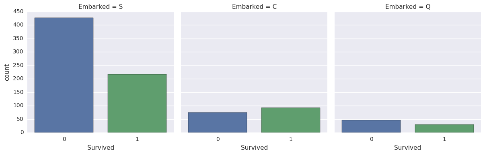
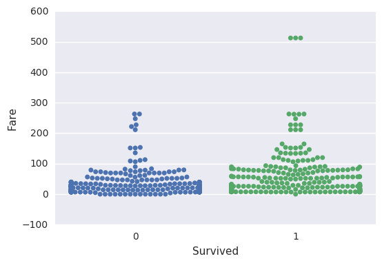
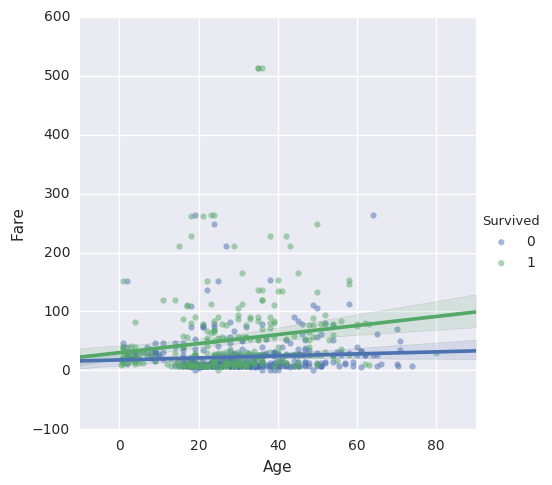
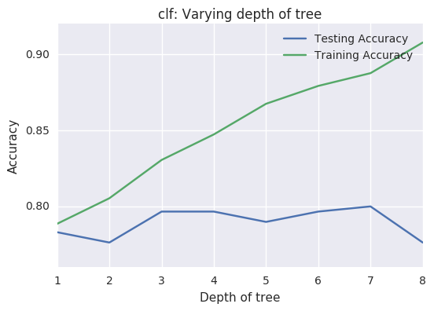

---

[TOC]

---

**Foreword**

Code snippets and excerpts from the tutorial. Python 3. From DataCamp.

---

# Exploratory Data Analysis (EDA) prior to Machine Learning

Supervised learning models with the help of exploratory data analysis (EDA) on the Titanic data.

## How to Start with Supervised Learning (Take 1)

Approach supervised learning is the following:

- Perform an Exploratory Data Analysis (EDA) on a dataset;
- Build a quick and dirty model, or a baseline model, which can serve as a comparison against later models that we will build;
- Iterate this process. We will do more EDA and build another model;
- Engineer features: take the features that we already have and combine them or extract more information from them to eventually come to the last point, which is
- Get a model that performs better.

## Import the Data and Explore it


```python
# Import modules
import pandas as pd
import matplotlib.pyplot as plt
import seaborn as sns
from sklearn import tree
from sklearn.metrics import accuracy_score

# Figures inline and set visualization style
%matplotlib inline
sns.set()
```


```python
# Import test and train datasets
df_train = pd.read_csv('data/train.csv')
df_test = pd.read_csv('data/test.csv')

# View first lines of training data
df_train.head(3)
```


<div>
<style>
    .dataframe thead tr:only-child th {
        text-align: right;
    }

    .dataframe thead th {
        text-align: left;
    }

    .dataframe tbody tr th {
        vertical-align: top;
    }
</style>
<table border="1" class="dataframe">
  <thead>
    <tr style="text-align: right;">
      <th></th>
      <th>PassengerId</th>
      <th>Survived</th>
      <th>Pclass</th>
      <th>Name</th>
      <th>Sex</th>
      <th>Age</th>
      <th>SibSp</th>
      <th>Parch</th>
      <th>Ticket</th>
      <th>Fare</th>
      <th>Cabin</th>
      <th>Embarked</th>
    </tr>
  </thead>
  <tbody>
    <tr>
      <th>0</th>
      <td>1</td>
      <td>0</td>
      <td>3</td>
      <td>Braund, Mr. Owen Harris</td>
      <td>male</td>
      <td>22.0</td>
      <td>1</td>
      <td>0</td>
      <td>A/5 21171</td>
      <td>7.2500</td>
      <td>NaN</td>
      <td>S</td>
    </tr>
    <tr>
      <th>1</th>
      <td>2</td>
      <td>1</td>
      <td>1</td>
      <td>Cumings, Mrs. John Bradley (Florence Briggs Th...</td>
      <td>female</td>
      <td>38.0</td>
      <td>1</td>
      <td>0</td>
      <td>PC 17599</td>
      <td>71.2833</td>
      <td>C85</td>
      <td>C</td>
    </tr>
    <tr>
      <th>2</th>
      <td>3</td>
      <td>1</td>
      <td>3</td>
      <td>Heikkinen, Miss. Laina</td>
      <td>female</td>
      <td>26.0</td>
      <td>0</td>
      <td>0</td>
      <td>STON/O2. 3101282</td>
      <td>7.9250</td>
      <td>NaN</td>
      <td>S</td>
    </tr>
  </tbody>
</table>
</div>


- The target variable is the variable we are trying to predict;
- Other variables are known as "features" (or "predictor variables", the features that we are using to predict the target variable).

Note that the `df_test` DataFrame doesn't have the `Survived` column because this is what we will try to predict!


```python
# View first lines of test data
df_test.head(3)
```


<div>
<style>
    .dataframe thead tr:only-child th {
        text-align: right;
    }

    .dataframe thead th {
        text-align: left;
    }

    .dataframe tbody tr th {
        vertical-align: top;
    }
</style>
<table border="1" class="dataframe">
  <thead>
    <tr style="text-align: right;">
      <th></th>
      <th>PassengerId</th>
      <th>Pclass</th>
      <th>Name</th>
      <th>Sex</th>
      <th>Age</th>
      <th>SibSp</th>
      <th>Parch</th>
      <th>Ticket</th>
      <th>Fare</th>
      <th>Cabin</th>
      <th>Embarked</th>
    </tr>
  </thead>
  <tbody>
    <tr>
      <th>0</th>
      <td>892</td>
      <td>3</td>
      <td>Kelly, Mr. James</td>
      <td>male</td>
      <td>34.5</td>
      <td>0</td>
      <td>0</td>
      <td>330911</td>
      <td>7.8292</td>
      <td>NaN</td>
      <td>Q</td>
    </tr>
    <tr>
      <th>1</th>
      <td>893</td>
      <td>3</td>
      <td>Wilkes, Mrs. James (Ellen Needs)</td>
      <td>female</td>
      <td>47.0</td>
      <td>1</td>
      <td>0</td>
      <td>363272</td>
      <td>7.0000</td>
      <td>NaN</td>
      <td>S</td>
    </tr>
    <tr>
      <th>2</th>
      <td>894</td>
      <td>2</td>
      <td>Myles, Mr. Thomas Francis</td>
      <td>male</td>
      <td>62.0</td>
      <td>0</td>
      <td>0</td>
      <td>240276</td>
      <td>9.6875</td>
      <td>NaN</td>
      <td>Q</td>
    </tr>
  </tbody>
</table>
</div>


```python
df_train.info()
```

    <class 'pandas.core.frame.DataFrame'>
    RangeIndex: 891 entries, 0 to 890
    Data columns (total 12 columns):
    PassengerId    891 non-null int64
    Survived       891 non-null int64
    Pclass         891 non-null int64
    Name           891 non-null object
    Sex            891 non-null object
    Age            714 non-null float64
    SibSp          891 non-null int64
    Parch          891 non-null int64
    Ticket         891 non-null object
    Fare           891 non-null float64
    Cabin          204 non-null object
    Embarked       889 non-null object
    dtypes: float64(2), int64(5), object(5)
    memory usage: 83.6+ KB


```python
df_train.describe()
```


<div>
<style>
    .dataframe thead tr:only-child th {
        text-align: right;
    }

    .dataframe thead th {
        text-align: left;
    }

    .dataframe tbody tr th {
        vertical-align: top;
    }
</style>
<table border="1" class="dataframe">
  <thead>
    <tr style="text-align: right;">
      <th></th>
      <th>PassengerId</th>
      <th>Survived</th>
      <th>Pclass</th>
      <th>Age</th>
      <th>SibSp</th>
      <th>Parch</th>
      <th>Fare</th>
    </tr>
  </thead>
  <tbody>
    <tr>
      <th>count</th>
      <td>891.000000</td>
      <td>891.000000</td>
      <td>891.000000</td>
      <td>714.000000</td>
      <td>891.000000</td>
      <td>891.000000</td>
      <td>891.000000</td>
    </tr>
    <tr>
      <th>mean</th>
      <td>446.000000</td>
      <td>0.383838</td>
      <td>2.308642</td>
      <td>29.699118</td>
      <td>0.523008</td>
      <td>0.381594</td>
      <td>32.204208</td>
    </tr>
    <tr>
      <th>std</th>
      <td>257.353842</td>
      <td>0.486592</td>
      <td>0.836071</td>
      <td>14.526497</td>
      <td>1.102743</td>
      <td>0.806057</td>
      <td>49.693429</td>
    </tr>
    <tr>
      <th>min</th>
      <td>1.000000</td>
      <td>0.000000</td>
      <td>1.000000</td>
      <td>0.420000</td>
      <td>0.000000</td>
      <td>0.000000</td>
      <td>0.000000</td>
    </tr>
    <tr>
      <th>25%</th>
      <td>223.500000</td>
      <td>0.000000</td>
      <td>2.000000</td>
      <td>20.125000</td>
      <td>0.000000</td>
      <td>0.000000</td>
      <td>7.910400</td>
    </tr>
    <tr>
      <th>50%</th>
      <td>446.000000</td>
      <td>0.000000</td>
      <td>3.000000</td>
      <td>28.000000</td>
      <td>0.000000</td>
      <td>0.000000</td>
      <td>14.454200</td>
    </tr>
    <tr>
      <th>75%</th>
      <td>668.500000</td>
      <td>1.000000</td>
      <td>3.000000</td>
      <td>38.000000</td>
      <td>1.000000</td>
      <td>0.000000</td>
      <td>31.000000</td>
    </tr>
    <tr>
      <th>max</th>
      <td>891.000000</td>
      <td>1.000000</td>
      <td>3.000000</td>
      <td>80.000000</td>
      <td>8.000000</td>
      <td>6.000000</td>
      <td>512.329200</td>
    </tr>
  </tbody>
</table>
</div>


## Visual Exploratory Data Analysis (EDA) and a First Model

With seaborn.


```python
sns.countplot(x='Survived', data=df_train)
```


    <matplotlib.axes._subplots.AxesSubplot at 0x7fc65fa0e668>


**Take-away**: in the training set, less people survived than didn't. Let's then build a first model that predicts that nobody survived.

This is a bad model as we know that people survived. But it gives us a **baseline**: any model that we build later needs to do better than this one.

- Create a column `Survived` for `df_test` that encodes 'did not survive' for all rows;
- Save `PassengerId` and `Survived` columns of `df_test` to a .csv and submit to Kaggle.


```python
df_test['Survived'] = 0
df_test[['PassengerId', 'Survived']].to_csv('results/no_survivors.csv', index=False)
```

### Submit to Kaggle (1st)

- Go to [Kaggle](https://www.kaggle.com), log in, and search for *Titanic: Machine Learning from Disaster*. 
- Join the competition and submit the .csv file.
- Add a description and submit.
- Kaggle returns a ranking.
- At the time of the first submission: score 0.63679, rank 9387.


## EDA on Feature Variables

Do some more Exploratory Data Analysis and build another model!


```python
sns.countplot(x='Sex', data=df_train);
```


```python
# kind is the facets
sns.factorplot(x='Survived', col='Sex', kind='count', data=df_train)
```


    <seaborn.axisgrid.FacetGrid at 0x7fc65fa35a20>


**Take-away**: Women were more likely to survive than men.

With this take-away, we can use pandas to figure out how many women and how many men survived:


```python
df_train.head(1)
```


<div>
<style>
    .dataframe thead tr:only-child th {
        text-align: right;
    }

    .dataframe thead th {
        text-align: left;
    }

    .dataframe tbody tr th {
        vertical-align: top;
    }
</style>
<table border="1" class="dataframe">
  <thead>
    <tr style="text-align: right;">
      <th></th>
      <th>PassengerId</th>
      <th>Survived</th>
      <th>Pclass</th>
      <th>Name</th>
      <th>Sex</th>
      <th>Age</th>
      <th>SibSp</th>
      <th>Parch</th>
      <th>Ticket</th>
      <th>Fare</th>
      <th>Cabin</th>
      <th>Embarked</th>
    </tr>
  </thead>
  <tbody>
    <tr>
      <th>0</th>
      <td>1</td>
      <td>0</td>
      <td>3</td>
      <td>Braund, Mr. Owen Harris</td>
      <td>male</td>
      <td>22.0</td>
      <td>1</td>
      <td>0</td>
      <td>A/5 21171</td>
      <td>7.25</td>
      <td>NaN</td>
      <td>S</td>
    </tr>
  </tbody>
</table>
</div>


```python
# Chain a group by Sex, sum Survived
df_train.groupby(['Sex']).Survived.sum()
```


    Sex
    female    233
    male      109
    Name: Survived, dtype: int64


```python
# Chain calculations
print(df_train[df_train.Sex == 'female'].Survived.sum() /
      df_train[df_train.Sex == 'female'].Survived.count())

print(df_train[df_train.Sex == 'male'].Survived.sum() /
      df_train[df_train.Sex == 'male'].Survived.count())
```

    0.742038216561
    0.188908145581


74% of women survived, while 19% of men survived.

Build a second model and predict that all women survived and all men didn't.

- Create a column `Survived` for `df_test` that encodes the above prediction.
- Save `PassengerId` and `Survived` columns of `df_test` to a .csv and submit to Kaggle.


```python
df_test['Survived'] = df_test.Sex == 'female'
df_test['Survived'] = df_test.Survived.apply(lambda x: int(x))
df_test.head(3)
```


<div>
<style>
    .dataframe thead tr:only-child th {
        text-align: right;
    }

    .dataframe thead th {
        text-align: left;
    }

    .dataframe tbody tr th {
        vertical-align: top;
    }
</style>
<table border="1" class="dataframe">
  <thead>
    <tr style="text-align: right;">
      <th></th>
      <th>PassengerId</th>
      <th>Pclass</th>
      <th>Name</th>
      <th>Sex</th>
      <th>Age</th>
      <th>SibSp</th>
      <th>Parch</th>
      <th>Ticket</th>
      <th>Fare</th>
      <th>Cabin</th>
      <th>Embarked</th>
      <th>Survived</th>
    </tr>
  </thead>
  <tbody>
    <tr>
      <th>0</th>
      <td>892</td>
      <td>3</td>
      <td>Kelly, Mr. James</td>
      <td>male</td>
      <td>34.5</td>
      <td>0</td>
      <td>0</td>
      <td>330911</td>
      <td>7.8292</td>
      <td>NaN</td>
      <td>Q</td>
      <td>0</td>
    </tr>
    <tr>
      <th>1</th>
      <td>893</td>
      <td>3</td>
      <td>Wilkes, Mrs. James (Ellen Needs)</td>
      <td>female</td>
      <td>47.0</td>
      <td>1</td>
      <td>0</td>
      <td>363272</td>
      <td>7.0000</td>
      <td>NaN</td>
      <td>S</td>
      <td>1</td>
    </tr>
    <tr>
      <th>2</th>
      <td>894</td>
      <td>2</td>
      <td>Myles, Mr. Thomas Francis</td>
      <td>male</td>
      <td>62.0</td>
      <td>0</td>
      <td>0</td>
      <td>240276</td>
      <td>9.6875</td>
      <td>NaN</td>
      <td>Q</td>
      <td>0</td>
    </tr>
  </tbody>
</table>
</div>


```python
df_test[['PassengerId', 'Survived']].to_csv('results/women_survived.csv', index=False)
```

### Submit to Kaggle (2nd)

- Go to [Kaggle](https://www.kaggle.com), log in, and search for *Titanic: Machine Learning from Disaster*. 
- Join the competition and submit the .csv file.
- Add a description and submit.
- Kaggle returns a ranking.
- At the time of the first submission: score 0.76555 (from 0.62679), rank 7274 (a jump of 2122 places).


## Explore the Data More!


```python
# kind is the facets
sns.factorplot(x='Survived', col='Pclass', kind='count', data=df_train)
```


    <seaborn.axisgrid.FacetGrid at 0x7fc65f8dcf98>


**Take-away**: Passengers that travelled in first class were more likely to survive. On the other hand, passengers travelling in third class were more unlikely to survive. 


```python
# kind is the facets
sns.factorplot(x='Survived', col='Embarked', kind='count', data=df_train)
```


    <seaborn.axisgrid.FacetGrid at 0x7fc65f937c50>





**Take-away**: Passengers that embarked in Southampton were less likely to survive. 

## EDA with Numeric Variables


```python
sns.distplot(df_train.Fare, kde=False)
```


    <matplotlib.axes._subplots.AxesSubplot at 0x7fc6633fb9e8>


**Take-away**: Most passengers paid less than 100 for travelling with the Titanic.


```python
# Group by Survived, trace histograms of Fare with alpha color 0.6
df_train.groupby('Survived').Fare.hist(alpha=0.6)
```


    Survived
    0    Axes(0.125,0.125;0.775x0.775)
    1    Axes(0.125,0.125;0.775x0.775)
    Name: Fare, dtype: object


**Take-away**: It looks as though those that paid more had a higher chance of surviving.


```python
# Remove NaN
df_train_drop = df_train.dropna()

sns.distplot(df_train_drop.Age, kde=False)
```


    <matplotlib.axes._subplots.AxesSubplot at 0x7fc65f64be80>


```python
# Alternative to bars or scatter
sns.stripplot(x='Survived', 
              y='Fare', 
              data=df_train, 
              alpha=0.3, jitter=True)
```


    <matplotlib.axes._subplots.AxesSubplot at 0x7fc65f5cca58>


```python
# Alternative to bars or scatter
sns.swarmplot(x='Survived', 
              y='Fare', 
              data=df_train)
```


    <matplotlib.axes._subplots.AxesSubplot at 0x7fc65f2e4ef0>





**Take-away**: Fare definitely seems to be correlated with survival aboard the Titanic.


```python
# Group by Survived, describe Fare (descriptive statistics)
df_train.groupby('Survived').Fare.describe()
```


<div>
<style>
    .dataframe thead tr:only-child th {
        text-align: right;
    }

    .dataframe thead th {
        text-align: left;
    }

    .dataframe tbody tr th {
        vertical-align: top;
    }
</style>
<table border="1" class="dataframe">
  <thead>
    <tr style="text-align: right;">
      <th></th>
      <th>count</th>
      <th>mean</th>
      <th>std</th>
      <th>min</th>
      <th>25%</th>
      <th>50%</th>
      <th>75%</th>
      <th>max</th>
    </tr>
    <tr>
      <th>Survived</th>
      <th></th>
      <th></th>
      <th></th>
      <th></th>
      <th></th>
      <th></th>
      <th></th>
      <th></th>
    </tr>
  </thead>
  <tbody>
    <tr>
      <th>0</th>
      <td>549.0</td>
      <td>22.117887</td>
      <td>31.388207</td>
      <td>0.0</td>
      <td>7.8542</td>
      <td>10.5</td>
      <td>26.0</td>
      <td>263.0000</td>
    </tr>
    <tr>
      <th>1</th>
      <td>342.0</td>
      <td>48.395408</td>
      <td>66.596998</td>
      <td>0.0</td>
      <td>12.4750</td>
      <td>26.0</td>
      <td>57.0</td>
      <td>512.3292</td>
    </tr>
  </tbody>
</table>
</div>


```python
sns.lmplot(x='Age', 
           y='Fare', 
           hue='Survived', 
           data=df_train, 
           fit_reg=False, scatter_kws={'alpha':0.5})
```


    <seaborn.axisgrid.FacetGrid at 0x7fc65f5ccba8>


```python
sns.lmplot(x='Age', 
           y='Fare', 
           hue='Survived', 
           data=df_train, 
           fit_reg=True, scatter_kws={'alpha':0.5})
```


    <seaborn.axisgrid.FacetGrid at 0x7fc65f22d710>





**Take-away**: It looks like those who survived either paid quite a bit for their ticket or they were young.


```python
sns.pairplot(df_train_drop, hue='Survived')
```


    <seaborn.axisgrid.PairGrid at 0x7fc65f8826d8>


# A First Machine Learning Model

A decision tree classifier, with the Python scikit-learn.

## How to Start with Supervised Learning (Take 2)

Now that we have done our homeworks with EDA...


```python
# Import modules
import pandas as pd
import matplotlib.pyplot as plt
import seaborn as sns
import re
import numpy as np
from sklearn import tree
from sklearn.model_selection import train_test_split
from sklearn.linear_model import LogisticRegression
from sklearn.model_selection import GridSearchCV

# Figures inline and set visualization style
%matplotlib inline
sns.set()
```


```python
# Import data
df_train = pd.read_csv('data/train.csv')
df_test = pd.read_csv('data/test.csv')
```


```python
df_train.info()
```

    <class 'pandas.core.frame.DataFrame'>
    RangeIndex: 891 entries, 0 to 890
    Data columns (total 12 columns):
    PassengerId    891 non-null int64
    Survived       891 non-null int64
    Pclass         891 non-null int64
    Name           891 non-null object
    Sex            891 non-null object
    Age            714 non-null float64
    SibSp          891 non-null int64
    Parch          891 non-null int64
    Ticket         891 non-null object
    Fare           891 non-null float64
    Cabin          204 non-null object
    Embarked       889 non-null object
    dtypes: float64(2), int64(5), object(5)
    memory usage: 83.6+ KB


```python
df_test.info()
```

    <class 'pandas.core.frame.DataFrame'>
    RangeIndex: 418 entries, 0 to 417
    Data columns (total 11 columns):
    PassengerId    418 non-null int64
    Pclass         418 non-null int64
    Name           418 non-null object
    Sex            418 non-null object
    Age            332 non-null float64
    SibSp          418 non-null int64
    Parch          418 non-null int64
    Ticket         418 non-null object
    Fare           417 non-null float64
    Cabin          91 non-null object
    Embarked       418 non-null object
    dtypes: float64(2), int64(4), object(5)
    memory usage: 36.0+ KB


```python
# Store target variable of training data in a safe place
survived_train = df_train.Survived

# Concatenate (along the index or axis=1) training and test sets
# to preprocess the data a little bit
# and make sure that any operations that
# we perform on the training set are also
# being done on the test data set
data = pd.concat([df_train.drop(['Survived'], axis=1), df_test])
```


```python
# The combined datasets (891+418 entries)
data.info()
```

    <class 'pandas.core.frame.DataFrame'>
    Int64Index: 1309 entries, 0 to 417
    Data columns (total 11 columns):
    PassengerId    1309 non-null int64
    Pclass         1309 non-null int64
    Name           1309 non-null object
    Sex            1309 non-null object
    Age            1046 non-null float64
    SibSp          1309 non-null int64
    Parch          1309 non-null int64
    Ticket         1309 non-null object
    Fare           1308 non-null float64
    Cabin          295 non-null object
    Embarked       1307 non-null object
    dtypes: float64(2), int64(4), object(5)
    memory usage: 122.7+ KB


Missing values for the `Age` and `Fare` columns! Also notice that `Cabin` and `Embarked` are also missing values and we will need to deal with that also at some point. However, now we will focus on fixing the numerical variables `Age` and `Fare`, using the median of the of these variables where we know them. It's perfect for dealing with outliers. In other words, the median is useful to use when the distribution of data is skewed. Other ways to impute the missing values would be to use the mean or the mode.


```python
# Impute missing numerical variables where NaN
data['Age'] = data.Age.fillna(data.Age.median())
data['Fare'] = data.Fare.fillna(data.Fare.median())

# Check out info of data
data.info()
```

    <class 'pandas.core.frame.DataFrame'>
    Int64Index: 1309 entries, 0 to 417
    Data columns (total 11 columns):
    PassengerId    1309 non-null int64
    Pclass         1309 non-null int64
    Name           1309 non-null object
    Sex            1309 non-null object
    Age            1309 non-null float64
    SibSp          1309 non-null int64
    Parch          1309 non-null int64
    Ticket         1309 non-null object
    Fare           1309 non-null float64
    Cabin          295 non-null object
    Embarked       1307 non-null object
    dtypes: float64(2), int64(4), object(5)
    memory usage: 122.7+ KB


Encode the data with numbers with `.get_dummies()`. 

It creates a new column for female, called `Sex_female`, and then a new column for `Sex_male`, which encodes whether that row was male or female (1 if that row is a male - and a 0 if that row is female). Because of `drop_first` argument, we dropped `Sex_female` because, essentially, these new columns, `Sex_female` and `Sex_male`, encode the same information.


```python
data = pd.get_dummies(data, columns=['Sex'], drop_first=True)
data.head(3)
```


<div>
<style>
    .dataframe thead tr:only-child th {
        text-align: right;
    }

    .dataframe thead th {
        text-align: left;
    }

    .dataframe tbody tr th {
        vertical-align: top;
    }
</style>
<table border="1" class="dataframe">
  <thead>
    <tr style="text-align: right;">
      <th></th>
      <th>PassengerId</th>
      <th>Pclass</th>
      <th>Name</th>
      <th>Age</th>
      <th>SibSp</th>
      <th>Parch</th>
      <th>Ticket</th>
      <th>Fare</th>
      <th>Cabin</th>
      <th>Embarked</th>
      <th>Sex_male</th>
    </tr>
  </thead>
  <tbody>
    <tr>
      <th>0</th>
      <td>1</td>
      <td>3</td>
      <td>Braund, Mr. Owen Harris</td>
      <td>22.0</td>
      <td>1</td>
      <td>0</td>
      <td>A/5 21171</td>
      <td>7.2500</td>
      <td>NaN</td>
      <td>S</td>
      <td>1</td>
    </tr>
    <tr>
      <th>1</th>
      <td>2</td>
      <td>1</td>
      <td>Cumings, Mrs. John Bradley (Florence Briggs Th...</td>
      <td>38.0</td>
      <td>1</td>
      <td>0</td>
      <td>PC 17599</td>
      <td>71.2833</td>
      <td>C85</td>
      <td>C</td>
      <td>0</td>
    </tr>
    <tr>
      <th>2</th>
      <td>3</td>
      <td>3</td>
      <td>Heikkinen, Miss. Laina</td>
      <td>26.0</td>
      <td>0</td>
      <td>0</td>
      <td>STON/O2. 3101282</td>
      <td>7.9250</td>
      <td>NaN</td>
      <td>S</td>
      <td>0</td>
    </tr>
  </tbody>
</table>
</div>


```python
# Select columns and view head
data = data[['Sex_male', 'Fare', 'Age','Pclass', 'SibSp']]
data.head(3)
```


<div>
<style>
    .dataframe thead tr:only-child th {
        text-align: right;
    }

    .dataframe thead th {
        text-align: left;
    }

    .dataframe tbody tr th {
        vertical-align: top;
    }
</style>
<table border="1" class="dataframe">
  <thead>
    <tr style="text-align: right;">
      <th></th>
      <th>Sex_male</th>
      <th>Fare</th>
      <th>Age</th>
      <th>Pclass</th>
      <th>SibSp</th>
    </tr>
  </thead>
  <tbody>
    <tr>
      <th>0</th>
      <td>1</td>
      <td>7.2500</td>
      <td>22.0</td>
      <td>3</td>
      <td>1</td>
    </tr>
    <tr>
      <th>1</th>
      <td>0</td>
      <td>71.2833</td>
      <td>38.0</td>
      <td>1</td>
      <td>1</td>
    </tr>
    <tr>
      <th>2</th>
      <td>0</td>
      <td>7.9250</td>
      <td>26.0</td>
      <td>3</td>
      <td>0</td>
    </tr>
  </tbody>
</table>
</div>


```python
data.info()
```

    <class 'pandas.core.frame.DataFrame'>
    Int64Index: 1309 entries, 0 to 417
    Data columns (total 5 columns):
    Sex_male    1309 non-null uint8
    Fare        1309 non-null float64
    Age         1309 non-null float64
    Pclass      1309 non-null int64
    SibSp       1309 non-null int64
    dtypes: float64(2), int64(2), uint8(1)
    memory usage: 52.4 KB


All the entries are non-null now.

## Build a Decision Tree Classifier

"Was `Sex_male`" less than 0.5? In other words, was the data point a female. If the answer to this question is `True`, we can go down to the left and we get `Survived`. If `False`, we go down the right and we get `Dead`.


That the first branch is on `Male` or not and that `Male` results in a prediction of `Dead`. The gini coefficient is used to make these decisions.

Before fitting a model to the data, split it back into training and test sets:


```python
data_train = data.iloc[:891]
data_test = data.iloc[891:]
```

scikit-learn requires the data as arrays, not DataFrames. Transform them.


```python
X = data_train.values
test = data_test.values

# and from above: survived_train = df_train.Survived
y = survived_train.values
```


```python
X
```


    array([[  1.    ,   7.25  ,  22.    ,   3.    ,   1.    ],
           [  0.    ,  71.2833,  38.    ,   1.    ,   1.    ],
           [  0.    ,   7.925 ,  26.    ,   3.    ,   0.    ],
           ..., 
           [  0.    ,  23.45  ,  28.    ,   3.    ,   1.    ],
           [  1.    ,  30.    ,  26.    ,   1.    ,   0.    ],
           [  1.    ,   7.75  ,  32.    ,   3.    ,   0.    ]])


Build a decision tree classifier! First create such a model with `max_depth=3` and then fit it the data. Name the model `clf`, which is short for "Classifier".


```python
# Instantiate model and fit to data
# The max depth is set at 3
clf = tree.DecisionTreeClassifier(max_depth=3)

# X is the indenpendent variables, y is the dependent variable
clf.fit(X, y)
```


    DecisionTreeClassifier(class_weight=None, criterion='gini', max_depth=3,
                max_features=None, max_leaf_nodes=None,
                min_impurity_decrease=0.0, min_impurity_split=None,
                min_samples_leaf=1, min_samples_split=2,
                min_weight_fraction_leaf=0.0, presort=False, random_state=None,
                splitter='best')


Make predictions on the test set.


```python
# Make predictions and store in 'Survived' column of df_test
Y_pred = clf.predict(test)
df_test['Survived'] = Y_pred

# Save it
df_test[['PassengerId', 'Survived']].to_csv('results/1st_dec_tree.csv',
                                            index=False)
```

### Submit to Kaggle (3rd)

- Go to [Kaggle](https://www.kaggle.com), log in, and search for *Titanic: Machine Learning from Disaster*. 
- Join the competition and submit the .csv file.
- Add a description and submit.
- Kaggle returns a ranking.
- At the time of the first submission: score 0.77990 (from 0.76555), rank 4828 (a jump of 2434 places).


```python
# Compute accuracy on the training set
train_accuracy = clf.score(X, y)
train_accuracy
```


    0.8271604938271605


## A Decision Tree Classifier in More Details

The Decision Tree Classifier we just built had a max_depth=3 and it looks like this:


The maximal distance between the first decision and the last is 3, so that's `max_depth=3`.

Generate images with [graphviz](http://scikit-learn.org/stable/modules/tree.html).


```python
import graphviz

tree_data = tree.export_graphviz(clf, out_file=None) 
graph = graphviz.Source(tree_data)
# Save the pdf
graph.render("img/tree_data")
```


    'img/tree_data.pdf'


We get a tree_data test file (the code for generating the image) and a pdf file. We can generate an image.


```python
feature_names = list(data_train)
feature_names
```


    ['Sex_male', 'Fare', 'Age', 'Pclass', 'SibSp']


```python
#data_train
#data_test
tree_data = tree.export_graphviz(clf, out_file=None, 
                                feature_names=feature_names,
                                class_names=None,
                                filled=True, rounded=True,
                                special_characters=True)  
graph = graphviz.Source(tree_data)  
graph 
```


In building this model, what we are essentially doing is creating a [decision boundary](http://scikit-learn.org/stable/auto_examples/ensemble/plot_voting_decision_regions.html) in the space of feature variables.


## Why Choose `max_depth=3`?

The depth of the tree is known as a hyperparameter, which means a parameter we need to decide before we fit the model to the data. If we choose a larger `max_depth`, we will get a more complex decision boundary;  the bias-variance trade-off.

- If the decision boundary is too complex, we can overfit to the data, which means that the model will be describing noise as well as signal.
- If the `max_depth` is too small, we might be underfitting the data, meaning that the model doesn't contain enough of the signal.

One way is to hold out a test set from the training data. We can then fit the model to the training data, make predictions on the test set and see how well the prediction does on the test set.

Split the original training data into training and test sets:


```python
X_train, X_test, y_train, y_test = train_test_split(X, y, test_size=0.33, random_state=42, stratify=y)
```

Iterate over values of `max_depth` ranging from 1 to 9 and plot the accuracy of the models on training and test sets:


```python
# Setup arrays to store train and test accuracies
dep = np.arange(1, 9)
train_accuracy = np.empty(len(dep))
test_accuracy = np.empty(len(dep))

# Loop over different values of k
for i, k in enumerate(dep):
    # Setup a k-NN Classifier with k neighbors: knn
    clf = tree.DecisionTreeClassifier(max_depth=k)

    # Fit the classifier to the training data
    clf.fit(X_train, y_train)

    # Compute accuracy on the training set
    train_accuracy[i] = clf.score(X_train, y_train)

    # Compute accuracy on the testing set
    test_accuracy[i] = clf.score(X_test, y_test)

# Generate plot
plt.title('clf: Varying depth of tree')
plt.plot(dep, test_accuracy, label = 'Testing Accuracy')
plt.plot(dep, train_accuracy, label = 'Training Accuracy')
plt.legend()
plt.xlabel('Depth of tree')
plt.ylabel('Accuracy')
plt.show()
```





At `max_depth-3`, we get the same results as with the model before (around 82%).

As we increase the max_depth, we are going to fit better and better to the training data because we will make decisions that describe the training data. The accuracy for the training data will go up and up, but we see that this doesn't happen for the test data: we are overfitting.

So that's why we chose `max_depth=3`. 

# Feature Engineering

https://www.datacamp.com/community/tutorials/feature-engineering-kaggle

A process where we use domain knowledge of the data to create additional relevant features (create new columns, transform variables and more) that increase the predictive power of the learning algorithm and make the machine learning models perform even better.

## How to Start with Feature Engineering


```python
# Imports
import pandas as pd
import matplotlib.pyplot as plt
import seaborn as sns
import re
import numpy as np
from sklearn import tree
from sklearn.model_selection import GridSearchCV

# Figures inline and set visualization style
%matplotlib inline
sns.set()
```


```python
# Import data
df_train = pd.read_csv('data/train.csv')
df_test = pd.read_csv('data/test.csv')

# Store target variable of training data in a safe place
survived_train = df_train.Survived

# Concatenate training and test sets
data = pd.concat([df_train.drop(['Survived'], axis=1), df_test])

# View head
data.info()
```

    <class 'pandas.core.frame.DataFrame'>
    Int64Index: 1309 entries, 0 to 417
    Data columns (total 11 columns):
    PassengerId    1309 non-null int64
    Pclass         1309 non-null int64
    Name           1309 non-null object
    Sex            1309 non-null object
    Age            1046 non-null float64
    SibSp          1309 non-null int64
    Parch          1309 non-null int64
    Ticket         1309 non-null object
    Fare           1308 non-null float64
    Cabin          295 non-null object
    Embarked       1307 non-null object
    dtypes: float64(2), int64(4), object(5)
    memory usage: 122.7+ KB


## Why Feature Engineer At All?

### Titanic's Passenger Titles


```python
# View head of 'Name' column
data.Name.tail()
```


    413              Spector, Mr. Woolf
    414    Oliva y Ocana, Dona. Fermina
    415    Saether, Mr. Simon Sivertsen
    416             Ware, Mr. Frederick
    417        Peter, Master. Michael J
    Name: Name, dtype: object


These titles of course give us information on social status, profession, etc., which in the end could tell us something more about survival. use regular expressions to extract the title and store it in a new column 'Title':


```python
# Extract Title from Name, store in column and plot barplot
# One upper character, one lower character, one dot
data['Title'] = data.Name.apply(lambda x: re.search(' ([A-Z][a-z]+)\.', x).group(1))
```


```python
# New column Title is a new feature of the dataset 
data.Title.head(3)
```


    0      Mr
    1     Mrs
    2    Miss
    Name: Title, dtype: object


```python
sns.countplot(x='Title', data=data);
plt.xticks(rotation=45);
```


```python
# Substitute some title with their English form
data['Title'] = data['Title'].replace({'Mlle':'Miss', 'Mme':'Mrs', 'Ms':'Miss'})
# Gather exceptions
data['Title'] = data['Title'].replace(['Don', 'Dona', 'Rev', 'Dr', 'Major', 'Lady', 'Sir', 'Col', 'Capt', 'Countess', 'Jonkheer'],'Special')
```


```python
data.Title.head(3)
```


    0      Mr
    1     Mrs
    2    Miss
    Name: Title, dtype: object


```python
sns.countplot(x='Title', data=data);
plt.xticks(rotation=45);
```


```python
# View tail of data (for change)
data.tail(3)
```


<div>
<style>
    .dataframe thead tr:only-child th {
        text-align: right;
    }

    .dataframe thead th {
        text-align: left;
    }

    .dataframe tbody tr th {
        vertical-align: top;
    }
</style>
<table border="1" class="dataframe">
  <thead>
    <tr style="text-align: right;">
      <th></th>
      <th>PassengerId</th>
      <th>Pclass</th>
      <th>Name</th>
      <th>Sex</th>
      <th>Age</th>
      <th>SibSp</th>
      <th>Parch</th>
      <th>Ticket</th>
      <th>Fare</th>
      <th>Cabin</th>
      <th>Embarked</th>
      <th>Title</th>
    </tr>
  </thead>
  <tbody>
    <tr>
      <th>415</th>
      <td>1307</td>
      <td>3</td>
      <td>Saether, Mr. Simon Sivertsen</td>
      <td>male</td>
      <td>38.5</td>
      <td>0</td>
      <td>0</td>
      <td>SOTON/O.Q. 3101262</td>
      <td>7.2500</td>
      <td>NaN</td>
      <td>S</td>
      <td>Mr</td>
    </tr>
    <tr>
      <th>416</th>
      <td>1308</td>
      <td>3</td>
      <td>Ware, Mr. Frederick</td>
      <td>male</td>
      <td>NaN</td>
      <td>0</td>
      <td>0</td>
      <td>359309</td>
      <td>8.0500</td>
      <td>NaN</td>
      <td>S</td>
      <td>Mr</td>
    </tr>
    <tr>
      <th>417</th>
      <td>1309</td>
      <td>3</td>
      <td>Peter, Master. Michael J</td>
      <td>male</td>
      <td>NaN</td>
      <td>1</td>
      <td>1</td>
      <td>2668</td>
      <td>22.3583</td>
      <td>NaN</td>
      <td>C</td>
      <td>Master</td>
    </tr>
  </tbody>
</table>
</div>


### Passenger's Cabins

There are several NaNs or missing values in the `Cabin` column. Those NaNs didn't have a cabin, which could tell us something about survival.


```python
# View head of data
data[['Name', 'PassengerId', 'Ticket', 'Cabin']].head()
```


<div>
<style>
    .dataframe thead tr:only-child th {
        text-align: right;
    }

    .dataframe thead th {
        text-align: left;
    }

    .dataframe tbody tr th {
        vertical-align: top;
    }
</style>
<table border="1" class="dataframe">
  <thead>
    <tr style="text-align: right;">
      <th></th>
      <th>Name</th>
      <th>PassengerId</th>
      <th>Ticket</th>
      <th>Cabin</th>
    </tr>
  </thead>
  <tbody>
    <tr>
      <th>0</th>
      <td>Braund, Mr. Owen Harris</td>
      <td>1</td>
      <td>A/5 21171</td>
      <td>NaN</td>
    </tr>
    <tr>
      <th>1</th>
      <td>Cumings, Mrs. John Bradley (Florence Briggs Th...</td>
      <td>2</td>
      <td>PC 17599</td>
      <td>C85</td>
    </tr>
    <tr>
      <th>2</th>
      <td>Heikkinen, Miss. Laina</td>
      <td>3</td>
      <td>STON/O2. 3101282</td>
      <td>NaN</td>
    </tr>
    <tr>
      <th>3</th>
      <td>Futrelle, Mrs. Jacques Heath (Lily May Peel)</td>
      <td>4</td>
      <td>113803</td>
      <td>C123</td>
    </tr>
    <tr>
      <th>4</th>
      <td>Allen, Mr. William Henry</td>
      <td>5</td>
      <td>373450</td>
      <td>NaN</td>
    </tr>
  </tbody>
</table>
</div>


```python
# Did they have a Cabin?
# Return True is the passenger has a cabin
data['Has_Cabin'] = ~data.Cabin.isnull()

# # View head of data
data[['Name', 'PassengerId', 'Ticket', 'Cabin', 'Has_Cabin']].head()
```


<div>
<style>
    .dataframe thead tr:only-child th {
        text-align: right;
    }

    .dataframe thead th {
        text-align: left;
    }

    .dataframe tbody tr th {
        vertical-align: top;
    }
</style>
<table border="1" class="dataframe">
  <thead>
    <tr style="text-align: right;">
      <th></th>
      <th>Name</th>
      <th>PassengerId</th>
      <th>Ticket</th>
      <th>Cabin</th>
      <th>Has_Cabin</th>
    </tr>
  </thead>
  <tbody>
    <tr>
      <th>0</th>
      <td>Braund, Mr. Owen Harris</td>
      <td>1</td>
      <td>A/5 21171</td>
      <td>NaN</td>
      <td>False</td>
    </tr>
    <tr>
      <th>1</th>
      <td>Cumings, Mrs. John Bradley (Florence Briggs Th...</td>
      <td>2</td>
      <td>PC 17599</td>
      <td>C85</td>
      <td>True</td>
    </tr>
    <tr>
      <th>2</th>
      <td>Heikkinen, Miss. Laina</td>
      <td>3</td>
      <td>STON/O2. 3101282</td>
      <td>NaN</td>
      <td>False</td>
    </tr>
    <tr>
      <th>3</th>
      <td>Futrelle, Mrs. Jacques Heath (Lily May Peel)</td>
      <td>4</td>
      <td>113803</td>
      <td>C123</td>
      <td>True</td>
    </tr>
    <tr>
      <th>4</th>
      <td>Allen, Mr. William Henry</td>
      <td>5</td>
      <td>373450</td>
      <td>NaN</td>
      <td>False</td>
    </tr>
  </tbody>
</table>
</div>


Drop these columns, except `Has_Cabin`, in the actual `data` DataFrame; make sure to use the `inplace` argument in the `.drop()` method and set it to `True`:


```python
# Drop columns and view head
data.drop(['Cabin', 'Name', 'PassengerId', 'Ticket'], axis=1, inplace=True)
data.head()
```


<div>
<style>
    .dataframe thead tr:only-child th {
        text-align: right;
    }

    .dataframe thead th {
        text-align: left;
    }

    .dataframe tbody tr th {
        vertical-align: top;
    }
</style>
<table border="1" class="dataframe">
  <thead>
    <tr style="text-align: right;">
      <th></th>
      <th>Pclass</th>
      <th>Sex</th>
      <th>Age</th>
      <th>SibSp</th>
      <th>Parch</th>
      <th>Fare</th>
      <th>Embarked</th>
      <th>Title</th>
      <th>Has_Cabin</th>
    </tr>
  </thead>
  <tbody>
    <tr>
      <th>0</th>
      <td>3</td>
      <td>male</td>
      <td>22.0</td>
      <td>1</td>
      <td>0</td>
      <td>7.2500</td>
      <td>S</td>
      <td>Mr</td>
      <td>False</td>
    </tr>
    <tr>
      <th>1</th>
      <td>1</td>
      <td>female</td>
      <td>38.0</td>
      <td>1</td>
      <td>0</td>
      <td>71.2833</td>
      <td>C</td>
      <td>Mrs</td>
      <td>True</td>
    </tr>
    <tr>
      <th>2</th>
      <td>3</td>
      <td>female</td>
      <td>26.0</td>
      <td>0</td>
      <td>0</td>
      <td>7.9250</td>
      <td>S</td>
      <td>Miss</td>
      <td>False</td>
    </tr>
    <tr>
      <th>3</th>
      <td>1</td>
      <td>female</td>
      <td>35.0</td>
      <td>1</td>
      <td>0</td>
      <td>53.1000</td>
      <td>S</td>
      <td>Mrs</td>
      <td>True</td>
    </tr>
    <tr>
      <th>4</th>
      <td>3</td>
      <td>male</td>
      <td>35.0</td>
      <td>0</td>
      <td>0</td>
      <td>8.0500</td>
      <td>S</td>
      <td>Mr</td>
      <td>False</td>
    </tr>
  </tbody>
</table>
</div>


New features such as `Title` and `Has_Cabin`. 

Features that don't add any more useful information for the machine learning model are now dropped from the DataFrame.

### Handling Missing Values


```python
data.info()
```

    <class 'pandas.core.frame.DataFrame'>
    Int64Index: 1309 entries, 0 to 417
    Data columns (total 9 columns):
    Pclass       1309 non-null int64
    Sex          1309 non-null object
    Age          1046 non-null float64
    SibSp        1309 non-null int64
    Parch        1309 non-null int64
    Fare         1308 non-null float64
    Embarked     1307 non-null object
    Title        1309 non-null object
    Has_Cabin    1309 non-null bool
    dtypes: bool(1), float64(2), int64(3), object(3)
    memory usage: 133.3+ KB


Missing values in `Age`, `Fare`, and `Embarked`. Impute these missing values with the help of `.fillna()` and use the median to fill in the columns (or the mean, the mode, etc.).


```python
# Impute missing values for Age, Fare, Embarked
data['Age'] = data.Age.fillna(data.Age.median())
data['Fare'] = data.Fare.fillna(data.Fare.median())
data['Embarked'] = data['Embarked'].fillna('S')
data.info()
```

    <class 'pandas.core.frame.DataFrame'>
    Int64Index: 1309 entries, 0 to 417
    Data columns (total 9 columns):
    Pclass       1309 non-null int64
    Sex          1309 non-null object
    Age          1309 non-null float64
    SibSp        1309 non-null int64
    Parch        1309 non-null int64
    Fare         1309 non-null float64
    Embarked     1309 non-null object
    Title        1309 non-null object
    Has_Cabin    1309 non-null bool
    dtypes: bool(1), float64(2), int64(3), object(3)
    memory usage: 133.3+ KB


```python
data.head(3)
```


<div>
<style>
    .dataframe thead tr:only-child th {
        text-align: right;
    }

    .dataframe thead th {
        text-align: left;
    }

    .dataframe tbody tr th {
        vertical-align: top;
    }
</style>
<table border="1" class="dataframe">
  <thead>
    <tr style="text-align: right;">
      <th></th>
      <th>Pclass</th>
      <th>Sex</th>
      <th>Age</th>
      <th>SibSp</th>
      <th>Parch</th>
      <th>Fare</th>
      <th>Embarked</th>
      <th>Title</th>
      <th>Has_Cabin</th>
    </tr>
  </thead>
  <tbody>
    <tr>
      <th>0</th>
      <td>3</td>
      <td>male</td>
      <td>22.0</td>
      <td>1</td>
      <td>0</td>
      <td>7.2500</td>
      <td>S</td>
      <td>Mr</td>
      <td>False</td>
    </tr>
    <tr>
      <th>1</th>
      <td>1</td>
      <td>female</td>
      <td>38.0</td>
      <td>1</td>
      <td>0</td>
      <td>71.2833</td>
      <td>C</td>
      <td>Mrs</td>
      <td>True</td>
    </tr>
    <tr>
      <th>2</th>
      <td>3</td>
      <td>female</td>
      <td>26.0</td>
      <td>0</td>
      <td>0</td>
      <td>7.9250</td>
      <td>S</td>
      <td>Miss</td>
      <td>False</td>
    </tr>
  </tbody>
</table>
</div>


### Binning Numerical Data


```python
# Binning numerical columns
# q=4 means 4 quantiles 0, 1, 2, 3
# labels=False are numbers, not characters
data['CatAge'] = pd.qcut(data.Age, q=4, labels=False )
data['CatFare']= pd.qcut(data.Fare, q=4, labels=False)
data.head(3)
```


<div>
<style>
    .dataframe thead tr:only-child th {
        text-align: right;
    }

    .dataframe thead th {
        text-align: left;
    }

    .dataframe tbody tr th {
        vertical-align: top;
    }
</style>
<table border="1" class="dataframe">
  <thead>
    <tr style="text-align: right;">
      <th></th>
      <th>Pclass</th>
      <th>Sex</th>
      <th>Age</th>
      <th>SibSp</th>
      <th>Parch</th>
      <th>Fare</th>
      <th>Embarked</th>
      <th>Title</th>
      <th>Has_Cabin</th>
      <th>CatAge</th>
      <th>CatFare</th>
    </tr>
  </thead>
  <tbody>
    <tr>
      <th>0</th>
      <td>3</td>
      <td>male</td>
      <td>22.0</td>
      <td>1</td>
      <td>0</td>
      <td>7.2500</td>
      <td>S</td>
      <td>Mr</td>
      <td>False</td>
      <td>0</td>
      <td>0</td>
    </tr>
    <tr>
      <th>1</th>
      <td>1</td>
      <td>female</td>
      <td>38.0</td>
      <td>1</td>
      <td>0</td>
      <td>71.2833</td>
      <td>C</td>
      <td>Mrs</td>
      <td>True</td>
      <td>3</td>
      <td>3</td>
    </tr>
    <tr>
      <th>2</th>
      <td>3</td>
      <td>female</td>
      <td>26.0</td>
      <td>0</td>
      <td>0</td>
      <td>7.9250</td>
      <td>S</td>
      <td>Miss</td>
      <td>False</td>
      <td>1</td>
      <td>1</td>
    </tr>
  </tbody>
</table>
</div>


```python
# Drop the 'Age' and 'Fare' columns
data = data.drop(['Age', 'Fare'], axis=1)
data.head(3)
```


<div>
<style>
    .dataframe thead tr:only-child th {
        text-align: right;
    }

    .dataframe thead th {
        text-align: left;
    }

    .dataframe tbody tr th {
        vertical-align: top;
    }
</style>
<table border="1" class="dataframe">
  <thead>
    <tr style="text-align: right;">
      <th></th>
      <th>Pclass</th>
      <th>Sex</th>
      <th>SibSp</th>
      <th>Parch</th>
      <th>Embarked</th>
      <th>Title</th>
      <th>Has_Cabin</th>
      <th>CatAge</th>
      <th>CatFare</th>
    </tr>
  </thead>
  <tbody>
    <tr>
      <th>0</th>
      <td>3</td>
      <td>male</td>
      <td>1</td>
      <td>0</td>
      <td>S</td>
      <td>Mr</td>
      <td>False</td>
      <td>0</td>
      <td>0</td>
    </tr>
    <tr>
      <th>1</th>
      <td>1</td>
      <td>female</td>
      <td>1</td>
      <td>0</td>
      <td>C</td>
      <td>Mrs</td>
      <td>True</td>
      <td>3</td>
      <td>3</td>
    </tr>
    <tr>
      <th>2</th>
      <td>3</td>
      <td>female</td>
      <td>0</td>
      <td>0</td>
      <td>S</td>
      <td>Miss</td>
      <td>False</td>
      <td>1</td>
      <td>1</td>
    </tr>
  </tbody>
</table>
</div>


### Number of Members in Family Onboard

Create a new column, which is the number of members in families that were onboard of the Titanic.


```python
# Create column of number of Family members onboard
data['Fam_Size'] = data.Parch + data.SibSp

# Drop columns
data = data.drop(['SibSp','Parch'], axis=1)
data.head(3)
```


<div>
<style>
    .dataframe thead tr:only-child th {
        text-align: right;
    }

    .dataframe thead th {
        text-align: left;
    }

    .dataframe tbody tr th {
        vertical-align: top;
    }
</style>
<table border="1" class="dataframe">
  <thead>
    <tr style="text-align: right;">
      <th></th>
      <th>Pclass</th>
      <th>Sex</th>
      <th>Embarked</th>
      <th>Title</th>
      <th>Has_Cabin</th>
      <th>CatAge</th>
      <th>CatFare</th>
      <th>Fam_Size</th>
    </tr>
  </thead>
  <tbody>
    <tr>
      <th>0</th>
      <td>3</td>
      <td>male</td>
      <td>S</td>
      <td>Mr</td>
      <td>False</td>
      <td>0</td>
      <td>0</td>
      <td>1</td>
    </tr>
    <tr>
      <th>1</th>
      <td>1</td>
      <td>female</td>
      <td>C</td>
      <td>Mrs</td>
      <td>True</td>
      <td>3</td>
      <td>3</td>
      <td>1</td>
    </tr>
    <tr>
      <th>2</th>
      <td>3</td>
      <td>female</td>
      <td>S</td>
      <td>Miss</td>
      <td>False</td>
      <td>1</td>
      <td>1</td>
      <td>0</td>
    </tr>
  </tbody>
</table>
</div>


### Transforming all Variables into Numerical Variables

Transform all variables into numeric ones. We do this because machine learning models generally take numeric input.


```python
# Transform into binary variables
# Has_Cabin is a boolean
# Sex becomes Sex_male=1 or 0
# Embarked becomes Embarked_Q=1 or 0, Embarked_...
# Title becomes Title_Miss=1 or 0, ...
# The former variables are dropped, only the later variables remain
data_dum = pd.get_dummies(data, drop_first=True)
data_dum.head(3)
```


<div>
<style>
    .dataframe thead tr:only-child th {
        text-align: right;
    }

    .dataframe thead th {
        text-align: left;
    }

    .dataframe tbody tr th {
        vertical-align: top;
    }
</style>
<table border="1" class="dataframe">
  <thead>
    <tr style="text-align: right;">
      <th></th>
      <th>Pclass</th>
      <th>Has_Cabin</th>
      <th>CatAge</th>
      <th>CatFare</th>
      <th>Fam_Size</th>
      <th>Sex_male</th>
      <th>Embarked_Q</th>
      <th>Embarked_S</th>
      <th>Title_Miss</th>
      <th>Title_Mr</th>
      <th>Title_Mrs</th>
      <th>Title_Special</th>
    </tr>
  </thead>
  <tbody>
    <tr>
      <th>0</th>
      <td>3</td>
      <td>False</td>
      <td>0</td>
      <td>0</td>
      <td>1</td>
      <td>1</td>
      <td>0</td>
      <td>1</td>
      <td>0</td>
      <td>1</td>
      <td>0</td>
      <td>0</td>
    </tr>
    <tr>
      <th>1</th>
      <td>1</td>
      <td>True</td>
      <td>3</td>
      <td>3</td>
      <td>1</td>
      <td>0</td>
      <td>0</td>
      <td>0</td>
      <td>0</td>
      <td>0</td>
      <td>1</td>
      <td>0</td>
    </tr>
    <tr>
      <th>2</th>
      <td>3</td>
      <td>False</td>
      <td>1</td>
      <td>1</td>
      <td>0</td>
      <td>0</td>
      <td>0</td>
      <td>1</td>
      <td>1</td>
      <td>0</td>
      <td>0</td>
      <td>0</td>
    </tr>
  </tbody>
</table>
</div>


First, split the data back into training and test sets. Then, transform them into arrays:


```python
# Split into test.train
data_train = data_dum.iloc[:891]
data_test = data_dum.iloc[891:]

# Transform into arrays for scikit-learn
X = data_train.values
test = data_test.values
y = survived_train.values
```

## Building models with a New Dataset!

Build a decision tree on a brand new feature-engineered dataset. To choose the hyperparameter `max_depth`, we will use a variation on test train split called "cross validation".


Split the dataset into 5 groups or folds. Then we hold out the first fold as a test set, fit the model on the remaining four folds, predict on the test set and compute the metric of interest. Next, we hold out the second fold as the test set, fit on the remaining data, predict on the test set and compute the metric of interest. Then similarly with the third, fourth and fifth.

As a result, we get five values of accuracy, from which we can compute statistics of interest, such as the median and/or mean and 95% confidence intervals.

We do this for each value of each hyperparameter that we are tuning and choose the set of hyperparameters that performs the best. This is called grid search.

In the following, we will use cross validation and grid search to choose the best `max_depth` for the new feature-engineered dataset:


```python
# Setup the hyperparameter grid
dep = np.arange(1,9)
param_grid = {'max_depth' : dep}

# Instantiate a decision tree classifier: clf
clf = tree.DecisionTreeClassifier()

# Instantiate the GridSearchCV object: clf_cv
clf_cv = GridSearchCV(clf, param_grid=param_grid, cv=5)

# Fit it to the data
clf_cv.fit(X, y)

# Print the tuned parameter and score
print("Tuned Decision Tree Parameters: {}".format(clf_cv.best_params_))
print("Best score is {}".format(clf_cv.best_score_))
```

    Tuned Decision Tree Parameters: {'max_depth': 3}
    Best score is 0.8294051627384961


Make predictions on the test set, create a new column `Survived` and store the predictions in it.

Save the `PassengerId` and `Survived` columns of `df_test` to a .csv and submit it to Kaggle.


```python
Y_pred = clf_cv.predict(test)
df_test['Survived'] = Y_pred
df_test[['PassengerId', 'Survived']].to_csv('results/dec_tree_feat_eng.csv', index=False)
```

### Submit to Kaggle (4th)

- Go to [Kaggle](https://www.kaggle.com), log in, and search for *Titanic: Machine Learning from Disaster*. 
- Join the competition and submit the .csv file.
- Add a description and submit.
- Kaggle returns a ranking.
- At the time of the first submission: score 0.78468 (from 0.77980), rank 4009 (a jump of 819 places).


