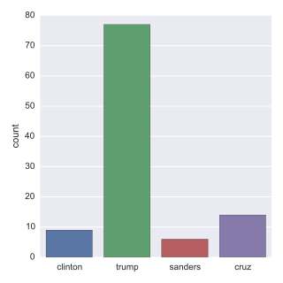

---

[TOC]

---

**Foreword**

Code snippets and excerpts from the courses. Python 3. From DataCamp.

---

## 1, Importing from Flat Files

- Load the script and run it.

```python
# %load "Importing Data in Python.py"
file = open('moby_dick.txt', 'r')

# Print it
print(file.read())

# Check whether file is closed
print(file.closed)

# Close file
file.close()

# Check whether file is closed
print(file.closed)
```

    CHAPTER 1. Loomings.
        
    Call me Ishmael. Some years ago--never mind how long precisely--having
    little or no money in my purse, and nothing particular to interest me on
    shore, I thought I would sail about a little and see the watery part of
    the world. It is a way I have of driving off the spleen and regulating
    the circulation. Whenever I find myself growing grim about the mouth;
    whenever it is a damp, drizzly November in my soul; whenever I find
    myself involuntarily pausing before coffin warehouses, and bringing up
    the rear of every funeral I meet; and especially whenever my hypos get
    such an upper hand of me, that it requires a strong moral principle to
    prevent me from deliberately stepping into the street, and methodically
    knocking people's hats off--then, I account it high time to get to sea
    as soon as I can. This is my substitute for pistol and ball. With a
    philosophical flourish Cato throws himself upon his sword; I quietly
    take to the ship. There is nothing surprising in this. If they but knew
    it, almost all men in their degree, some time or other, cherish very
    nearly the same feelings towards the ocean with me.
    False
    True
    


```python
# Read & print the first 3 lines
with open('moby_dick.txt') as file:
    print(file.readline())
    print(file.readline())
    print(file.readline())
    print(file.readline(10))
    print(file.readline(50))
    print(file.readline(50))
```

    CHAPTER 1. Loomings.
    
    Call me Ishmael. Some years ago--never mind how long precisely--having
    
    little or 
    no money in my purse, and nothing particular to in
    terest me on

- `this` is a special package about PEP 20.


```python
import this
```

    The Zen of Python, by Tim Peters
    
    Beautiful is better than ugly.
    Explicit is better than implicit.
    Simple is better than complex.
    Complex is better than complicated.
    Flat is better than nested.
    Sparse is better than dense.
    Readability counts.
    Special cases aren't special enough to break the rules.
    Although practicality beats purity.
    Errors should never pass silently.
    Unless explicitly silenced.
    In the face of ambiguity, refuse the temptation to guess.
    There should be one-- and preferably only one --obvious way to do it.
    Although that way may not be obvious at first unless you're Dutch.
    Now is better than never.
    Although never is often better than *right* now.
    If the implementation is hard to explain, it's a bad idea.
    If the implementation is easy to explain, it may be a good idea.
    Namespaces are one honking great idea -- let's do more of those!
    
- BDFL: Benevolent Dictator For Life, a.k.a. Guido van Rossum, Python’s creator.

### Numpy

- NumPy arrays are a standard for storing numerical data.
- Arrays are essential to other packages such as the `scikit-learn`, for machine learning.
- Import `numpy` and `matplotlib` (or invoke them with the `%pylab` magic command).

```python
import numpy as np
import matplotlib.pyplot as plt
```

```python
# or...
%pylab inline

# no need for preceeding functions (methods) with np. or plt.
```

    Populating the interactive namespace from numpy and matplotlib
    

- Import a csv file and assign the content to an array.

```python
file = 'digits.csv'

# Load the file as an array called digits
digits = loadtxt(file, delimiter = ',')

# Print the datatype of digits
print(type(digits))

print(digits)

# Select a row
im = digits[2, 2:]
print(im)
```

    <class 'numpy.ndarray'>
    [[ 1.  0.  0.  0.  0.  0.]
     [ 0.  0.  0.  0.  0.  0.]
     [ 1.  0.  0.  0.  0.  0.]
     [ 2.  0.  0.  0.  0.  0.]
     [ 0.  0.  0.  0.  0.  0.]
     [ 5.  0.  0.  0.  0.  0.]]
    [ 0.  0.  0.  0.]
    
- Import a txt file. The `delimiter` can be `'\t'`, `','`, `';'`, etc. 
- Skip the first 90 rows.

```python
file = 'digits_header.txt'

# Load the data into array data
data = loadtxt(file, delimiter='  ', skiprows = 90)

# Print data
print(data)
```

    [[ 3.  0.]
     [ 6.  0.]
     [ 4.  0.]
     [ 6.  0.]
     [ 2.  0.]
     [ 9.  0.]
     [ 1.  0.]
     [ 2.  0.]
     [ 0.  0.]
     [ 5.  0.]]

- Import a txt file, but only the last rows and first column.

```python
data2 = loadtxt(file, delimiter='  ', skiprows = 90, usecols = [0])

# Print data
print(data2)
```

    [ 3.  6.  4.  6.  2.  9.  1.  2.  0.  5.]

- Import a txt file as string.

```python
file = 'seaslug.txt'

# Import file: data
data = loadtxt(file, delimiter = ' ', dtype = str)

# Print the first element of data
print(data[0])
```

    ['b"b\'Time\'"' 'b"b\'Percent\'"']

- Import a txt file as float numbers.


```python
file = 'seaslug2.txt'

# Import data as floats and skip the first row: data_float
data_float = loadtxt(file, delimiter='   ', dtype = float, skiprows = 1)

# Print the 10th element of data_float
print(data_float[9])

# Plot a scatterplot of the data
scatter(data_float[:, 0], data_float[:, 1])
xlabel('time (min.)')
ylabel('percentage of larvae')

show()
```

    [ 0.     0.357]


- Import a csv file. Format the data.

```python
data = genfromtxt('titanic.csv', delimiter = ',', names = True, dtype = None)
```

```python
 # A structred array
shape(data)
```

    (891,)

- Extract a row, a column.

```python
# to get the ith row, merely execute data[i]
print(data[0:10])
```

    [ (1, 0, 3, b" b'male'", 22.0, 1, 0, b" b'A/5 21171'", 7.25, b" b''", b" b'S'")
     (2, 1, 1, b" b'female'", 38.0, 1, 0, b" b'PC 17599'", 71.2833, b" b'C85'", b" b'C'")
     (3, 1, 3, b" b'female'", 26.0, 0, 0, b" b'STON/O2. 3101282'", 7.925, b" b''", b" b'S'")
     (4, 1, 1, b" b'female'", 35.0, 1, 0, b" b'113803'", 53.1, b" b'C123'", b" b'S'")
     (5, 0, 3, b" b'male'", 35.0, 0, 0, b" b'373450'", 8.05, b" b''", b" b'S'")
     (6, 0, 3, b" b'male'", nan, 0, 0, b" b'330877'", 8.4583, b" b''", b" b'Q'")
     (7, 0, 1, b" b'male'", 54.0, 0, 0, b" b'17463'", 51.8625, b" b'E46'", b" b'S'")
     (8, 0, 3, b" b'male'", 2.0, 3, 1, b" b'349909'", 21.075, b" b''", b" b'S'")
     (9, 1, 3, b" b'female'", 27.0, 0, 2, b" b'347742'", 11.1333, b" b''", b" b'S'")
     (10, 1, 2, b" b'female'", 14.0, 1, 0, b" b'237736'", 30.0708, b" b''", b" b'C'")]
 
```python
# to get the column with name 'Fare', execute data['Fare']
print(data['Fare'][0:10])
```

    [  7.25    71.2833   7.925   53.1      8.05     8.4583  51.8625  21.075
      11.1333  30.0708]

- Import a csv file. 
- Format the data.


```python
# default dtype is None
data2 = recfromcsv('titanic.csv', delimiter = ',', names = True, dtype = None)
```


```python
# Print out first three entries
print(data2[:3])
```

    [ (1, 0, 3, b" b'male'", 22.0, 1, 0, b" b'A/5 21171'", 7.25, b" b''", b" b'S'")
     (2, 1, 1, b" b'female'", 38.0, 1, 0, b" b'PC 17599'", 71.2833, b" b'C85'", b" b'C'")
     (3, 1, 3, b" b'female'", 26.0, 0, 0, b" b'STON/O2. 3101282'", 7.925, b" b''", b" b'S'")]

### Pandas

- Two-dimensional labeled data structure(s) or  data frame (DataFrame).
- Pythonic analog of R's dataframes.
- Columns can be of potentially different types.
- Excellent object for: 
    - Manipulate, slice, reshape, groupby, join, merge.
    - Perform statistics.
    - Work with time series data.
    - Exploratory data analysis.
    - Data wrangling.
    - Data preprocessing.
    - Building models.
    - Visualization.
- There exists standards and best practices to use pandas.

```python
# Import pandas
import pandas as pd
```

- Pandas is not part of `%pylab`.
- Import a file.

```python
file = 'titanic.csv'

# Read the file into a DataFrame: df
df = pd.read_csv(file)

# View the head of the DataFrame
print(df.head())
```

       Passengerid   Survived   Pclass         Sex    Age   SibSp   Parch  \
    0            1          0        3     b'male'   22.0       1       0   
    1            2          1        1   b'female'   38.0       1       0   
    2            3          1        3   b'female'   26.0       0       0   
    3            4          1        1   b'female'   35.0       1       0   
    4            5          0        3     b'male'   35.0       0       0   
    
                     Ticket     Fare     Cabin  Embarked  
    0          b'A/5 21171'   7.2500       b''      b'S'  
    1           b'PC 17599'  71.2833    b'C85'      b'C'  
    2   b'STON/O2. 3101282'   7.9250       b''      b'S'  
    3             b'113803'  53.1000   b'C123'      b'S'  
    4             b'373450'   8.0500       b''      b'S'  
    
- Import another file; no header and some rows.

```python
file = 'digits2.csv'

# Read the first 5 rows of the file into a DataFrame: data
data = pd.read_csv(file, nrows = 5, header = None)

# Print the datatype of data
print(type(data))

# Build a numpy array from the DataFrame: data_array
data_array = data.values

# Print the datatype of data_array to the shell
print(type(data_array))
```

    <class 'pandas.core.frame.DataFrame'>
    <class 'numpy.ndarray'>
    
- Import another file; replace the missing data (NA).

```python
file = 'titanic_corrupt.csv'

# Assign filename: file
file = 'titanic_corrupt.csv'

# Import file: data
data = pd.read_csv(file, sep = ';', comment = '#', na_values = ['Nothing'])

# Print the head of the DataFrame
print(data.head())
```

       PassengerId  Survived  Pclass     Sex   Age  SibSp  Parch   \
    0            1         0       3    male  22.0      1       0   
    1            2         1       1  female  38.0      1       0   
    2            3         1       3  female  26.0      0       0   
    3            4         1       1  female  35.0      1       0   
    4            5         0       3    male  35.0      0       0   
    
                 Ticket   Fare Cabin Embarked  
    0         A/5 21171   7,25   NaN        S  
    1          PC 17599    NaN   NaN      NaN  
    2  STON/O2. 3101282  7,925   NaN        S  
    3            113803   53,1  C123        S  
    4            373450   8,05   NaN        S  
    
- Plot the `Age` variable in a histogram.

```python
pd.DataFrame.hist(data[['Age']])
plt.xlabel('Age (years)')
plt.ylabel('count')

plt.show()
```


## 2, Importing from Other Files

- With Pandas... and a bit of Numpy.
- Excel spreadsheets.
- MATLAB files.
- SAS files.
- Stata files.
- HDF5 files (large datasets, scientific, legal, etc.).
- Feather.
- Julia.
- Pickled files (binary).

```python
import os

wd = os.getcwd()
os.listdir(wd)
```

    ['.ipynb_checkpoints',
     'a_movie.json',
     'cars.csv',
     'count.svg',
     'CYratioCyt.png',
     'CYratioCyt.svg',
     'digits.csv',
     'digits2.csv',
     'digits_header.txt',
     'disa10.png',
     'disa10.svg',
     'economic.csv',
     'economic2.xls',
     'Importing Data into Python 3.ipynb',
     'importing_python_ch1_pdf_slides.pdf',
     'importing_python_ch2_pdf_slides.pdf',
     'importing_python_ch3_pdf_slides.pdf',
     'importing_python_ch4_pdf_slides.pdf',
     'importing_python_ch5_pdf_slides.pdf',
     'intermediate_python_ch1_slides.pdf',
     'intermediate_python_ch2_slides.pdf',
     'intermediate_python_ch3_slides.pdf',
     'intermediate_python_ch4_slides.pdf',
     'intermediate_python_ch5_slides.pdf',
     'intro_python_ch1_slides.pdf',
     'intro_python_ch2_slides.pdf',
     'intro_python_ch3_slides.pdf',
     'intro_python_ch4_slides.pdf',
     'moby_dick.txt',
     'new1.py',
     'p.png',
     'PRIO_bd3.0.xls',
     'Python 3.ipynb',
     'Python3.py',
     'sales.sas7bdat',
     'save.p',
     'seaslug.txt',
     'seaslug2.txt',
     'strain.png',
     'strain.svg',
     'Thumbs.db',
     'titanic.csv',
     'titanic_corrupt.csv',
     'tweets_figure.png',
     'tweets_figure.svg',
     'winequality-red.csv']

**Pickled files**

- There are a number of datatypes that cannot be saved easily to flat files, such as lists and dictionaries. 
- If you want your files to be human readable, you may want to save them as text files in a clever manner (JSONs, which you will see in a later chapter, are appropriate for Python dictionaries).
- If, however, you merely want to be able to import them into Python, you can serialize them. 
- All this means is converting the object into a sequence of bytes, or bytestream.
- Import it.

```python
import pickle

# Save a dictionary into a pickle file.
fav = {'Airline' : '8', 'Aug' : '85', 'June' : '69.4', 'Mar' : '84.4'}
pickle.dump(fav, open("save.p", "wb"))

# save.p

# Open pickle file and load data: d

with open('save.p', 'rb') as file:
    d = pickle.load(file)

# Print d
print(d)

# Print datatype of d
print(type(d))
```

    {'Aug': '85', 'Airline': '8', 'Mar': '84.4', 'June': '69.4'}
    <class 'dict'>

**Excel files**

```python
file = 'PRIO_bd3.0.xls'

# Load spreadsheet: xl
xl = pd.ExcelFile(file)

# Print sheet names
print(xl.sheet_names)
```

    ['bdonly']

- Parse the sheets. 
- By name or by number (first, second, ...).

```python
df1 = xl.parse('bdonly')
```

```python
df2 = xl.parse(0)
```

- Options: parse the first sheet by index, skip the first row of data, then name the columns 'Country' and 'AAM due to War (2002)'

```python
df2 = xl.parse(0, parse_cols = [0], skiprows = [0], names = ['Country', 'AAM due to War (2002)'])
```

- Options: parse the second sheet, parse only the first column, skip the first row and rename the column 'Country'.

```python
df2 = xl.parse(1, parse_cols = [0], skiprows = [0], names = ['Country'])
```

- Print the head of the DataFrame.

```python
print(df1.head())
```

       id  year  bdeadlow  bdeadhig  bdeadbes  annualdata  source  bdversion  \
    0   1  1946      1000      9999      1000           2       1          3   
    1   1  1952       450      3000      -999           2       1          3   
    2   1  1967        25       999        82           2       1          3   
    3   2  1946        25       999      -999           0       0          3   
    4   2  1947        25       999      -999           0       0          3   
    
       location    sidea   ...    epend  ependdate ependprec  gwnoa gwnoa2nd  \
    0   Bolivia  Bolivia   ...        1 1946-07-21     -99.0    145      NaN   
    1   Bolivia  Bolivia   ...        1 1952-04-12     -99.0    145      NaN   
    2   Bolivia  Bolivia   ...        1 1967-10-16     -99.0    145      NaN   
    3  Cambodia   France   ...        0        NaT       NaN    220      NaN   
    4  Cambodia   France   ...        0        NaT       NaN    220      NaN   
    
       gwnob  gwnob2nd  gwnoloc region  version  
    0    NaN       NaN      145      5   2009-4  
    1    NaN       NaN      145      5   2009-4  
    2    NaN       NaN      145      5   2009-4  
    3    NaN       NaN      811      3   2009-4  
    4    NaN       NaN      811      3   2009-4  
    
    [5 rows x 32 columns]
    
- We process images since we cheat a little. 
- Many packages are not installed. 
- We are not be able to import some data. 
- Images will then present the final results.

```python
from IPython.display import Image
# for the following pictures...
```

**SAS files**

- Advanced analytics
- Multivariate analysis
- Business intelligence
- Data management
- Predictive analytics
- Standard for computational analysis
- Code (instead of importing the package):

```python
# Import sas7bdat package
from sas7bdat import SAS7BDAT

# Save file to a DataFrame: df_sas
with SAS7BDAT('sales.sas7bdat') as file:
    df_sas = file.to_data_frame()

# Print head of DataFrame
print(df_sas.head())

# Plot histogram of DataFrame features
pd.DataFrame.hist(df_sas[['P']])
plt.ylabel('count')

plt.show()
```

- The data are adapted from the website of the undergraduate text book Principles of Economics by Hill, Griffiths and Lim (http://www.principlesofeconometrics.com/sas/).
- The chart would be:

```python
Image('p.png')
```


**Stata files**

- The data consist of disease extent for several diseases in various countries (more information can be found at http://www.cid.harvard.edu/ciddata/geog/readme_disarea.html).

```python
# Import pandas
import pandas as pd

# Load Stata file into a pandas DataFrame: df
df = pd.read_stata('disarea.dta')

# Print the head of the DataFrame df
print(df.head())
```

      wbcode               country  disa1  disa2  disa3  disa4  disa5  disa6  \
    0    AFG           Afghanistan   0.00   0.00   0.76   0.73    0.0   0.00   
    1    AGO                Angola   0.32   0.02   0.56   0.00    0.0   0.00   
    2    ALB               Albania   0.00   0.00   0.02   0.00    0.0   0.00   
    3    ARE  United Arab Emirates   0.00   0.00   0.00   0.00    0.0   0.00   
    4    ARG             Argentina   0.00   0.24   0.24   0.00    0.0   0.23   
    
       disa7  disa8   ...    disa16  disa17  disa18  disa19  disa20  disa21  \
    0   0.00    0.0   ...       0.0     0.0     0.0    0.00    0.00     0.0   
    1   0.56    0.0   ...       0.0     0.4     0.0    0.61    0.00     0.0   
    2   0.00    0.0   ...       0.0     0.0     0.0    0.00    0.00     0.0   
    3   0.00    0.0   ...       0.0     0.0     0.0    0.00    0.00     0.0   
    4   0.00    0.0   ...       0.0     0.0     0.0    0.00    0.05     0.0   
    
       disa22  disa23  disa24  disa25  
    0    0.00    0.02    0.00    0.00  
    1    0.99    0.98    0.61    0.00  
    2    0.00    0.00    0.00    0.16  
    3    0.00    0.00    0.00    0.00  
    4    0.00    0.01    0.00    0.11  
    
    [5 rows x 27 columns]
    
- Plot histogram of one column of the DataFrame.

```python
pd.DataFrame.hist(df[['disa10']])
plt.xlabel('Extent of disease')
plt.ylabel('Number of coutries')

plt.show()
```


**HDF5 files**

- Standard for storing large quantities of numerical data.
- Datasets can be hundreds of gigabytes or terabytes.
- HDF5 can scale to exabytes.
- Code (instead of importing the package):

```python
# Import packages
import numpy as np
import h5py

# Assign filename: file
file = 'LIGO_data.hdf5' 

# Load file: data
data = h5py.File(file, 'r')

# Print the datatype of the loaded file
print(type(data))

# Print the keys of the file
for key in data.keys():
    print(key)

# Get the HDF5 group: group
group = data['strain']

# Check out keys of group
for key in group.keys():
    print(key)

# Set variable equal to time series data: strain
strain = data['strain']['Strain'].value

# Set number of time points to sample: num_samples
num_samples = 10000

# Set time vector
time = np.arange(0, 1, 1/num_samples)

# Plot data
plt.plot(time, strain[:num_samples])
plt.xlabel('GPS Time (s)')
plt.ylabel('strain')
plt.show()
```

- You can find the LIGO data plus loads of documentation and tutorials (https://losc.ligo.org/events/GW150914/) and (https://losc.ligo.org/s/events/GW150914/GW150914_tutorial.html) is a great tutorial on Signal Processing with the data.

```python
Image('strain.png')
```


**MATLAB**

- “Matrix Laboratory”.
- Industry standard in engineering and science.
- Code (instead of importing the package):

```python
# Import package
import scipy.io

# Load MATLAB file: mat
mat = scipy.io.loadmat('albeck_gene_expression.mat')

# Print the datatype type of mat
print(type(mat))

# Print the keys of the MATLAB dictionary
print(mat.keys())

# Print the type of the value corresponding to the key 'CYratioCyt'
print(type(mat['CYratioCyt']))

# Print the shape of the value corresponding to the key 'CYratioCyt'
print(np.shape(mat['CYratioCyt']))

# Subset the array and plot it
data = mat['CYratioCyt'][25, 5:]
fig = plt.figure()
plt.plot(data)
plt.xlabel('time (min.)')
plt.ylabel('normalized fluorescence (measure of expression)')
plt.show()
```

- This file contains gene expression data from the Albeck Lab at UC Davis (https://www.mcb.ucdavis.edu/faculty-labs/albeck/workshop.htm). You can find the data and some great documentation.

```python
Image('CYratioCyt.png')
```


## 3, Working with Relational Databases

**Relational Database Management System**

- PostgreSQL.
- MySQL.
- SQLite.
- Code (instead of importing the package):

```python
# Import necessary module
from sqlalchemy import create_engine

# Create engine: engine
engine = create_engine('sqlite:///Chinook.sqlite')
```

`'sqlite:///Northwind.sqlite'` is called the connection string to the SQLite database.

- The Chinook database (http://chinookdatabase.codeplex.com/) contains information about a semi-fictional digital media store in which media data is real and customer, employee and sales data has been manually created.
- Code (instead of importing the package):

```python
# Save the table names to a list: table_names
table_names = engine.table_names()

# Print the table names to the shell
print(table_names)
```

**Query the DB**

- The final `;` is facultative.
- Code (instead of importing the package):

```python
# Create engine: engine
engine = create_engine('sqlite:///Chinook.sqlite')

# Open engine connection: con
con = engine.connect()

# Perform query: rs
rs = con.execute('SELECT * FROM Album')

# Save results of the query to DataFrame: df
df = pd.DataFrame(rs.fetchall())

# Close connection
con.close()

# Print head of DataFrame df
print(df.head())
```

**Customize queries**

- Code (instead of importing the package):
    
```python
# Create engine: engine
engine = create_engine('sqlite:///Chinook.sqlite') # becomes facultative with many queries

# Open engine in context manager
# Perform query and save results to DataFrame: df
with engine.connect() as con:
    rs = con.execute('SELECT LastName, Title FROM Employee')
    df = pd.DataFrame(rs.fetchmany(size = 3))
    df.columns = rs.keys() # set the DataFrame's column names to the corresponding names of the table columns

# Print the length of the DataFrame df
print(len(df))

# Print the head of the DataFrame df
print(df.head())
```

- Code (instead of importing the package):

```python
# Create engine: engine
engine = create_engine('sqlite:///Chinook.sqlite') # becomes facultative with many queries

# Open engine in context manager
# Perform query and save results to DataFrame: df
with engine.connect() as con:
    rs = con.execute("SELECT * FROM Employee WHERE EmployeeId >= 6")
    df = pd.DataFrame(rs.fetchall())
    df.columns = rs.keys()

# Print the head of the DataFrame df
print(df.head())
```

- Code (instead of importing the package):

```python
# Create engine: engine
engine = create_engine('sqlite:///Chinook.sqlite')

# Open engine in context manager
with engine.connect() as con:
    rs = con.execute('SELECT * FROM Employee ORDER BY BirthDate')
    df = pd.DataFrame(rs.fetchall())

    # Set the DataFrame's column names
    df.columns = rs.keys()

# Print head of DataFrame
print(df.head())
```

**Query the DB the Pandas way**

- Simpler code (instead of importing the package)!!!

```python
# Import packages
from sqlalchemy import create_engine
import pandas as pd

# Create engine: engine
engine = create_engine('sqlite:///Chinook.sqlite')

# Execute query and store records in DataFrame: df
df = pd.read_sql_query("SELECT * FROM Album", engine)

# Print head of DataFrame
print(df.head())

# Open engine in context manager
# Perform query and save results to DataFrame: df1
with engine.connect() as con:
    rs = con.execute("SELECT * FROM Album")
    df1 = pd.DataFrame(rs.fetchall())
    df1.columns = rs.keys()

# Confirm that both methods yield the same result: does df = df1 ?   
print(df.equals(df1))
```

- Code (instead of importing the package):

```python
# Import packages
from sqlalchemy import create_engine
import pandas as pd

# Create engine: engine
engine = create_engine('sqlite:///Chinook.sqlite')

# Execute query and store records in DataFrame: df
df = pd.read_sql_query("SELECT * FROM Employee WHERE EmployeeId >= 6 ORDER BY BirthDate", engine)

# Print head of DataFrame
print(df.head())
```

**INNER JOIN**

- Code (instead of importing the package):

```python
import pandas as pd
from sqlalchemy import create_engine

engine = create_engine('sqlite:///Chinook.sqlite')

# Open engine in context manager
# Perform query and save results to DataFrame: df
with engine.connect() as con:
    rs = con.execute("SELECT Title, Name FROM Album INNER JOIN Artist on Album.ArtistID = Artist.ArtistID")
    df = pd.DataFrame(rs.fetchall())
    df.columns = rs.keys()

# Print head of DataFrame df
print(df.head())
```

- Alternative code:

```python
df = pd.read_sql_query("SELECT Title, Name FROM Album INNER JOIN Artist on Album.ArtistID = Artist.ArtistID", engine)

# Print head of DataFrame df
print(df.head())
```

- Code (instead of importing the package):

```python
# Execute query and store records in DataFrame: df
df = pd.read_sql_query("SELECT * FROM PlaylistTrack INNER JOIN Track on PlaylistTrack.TrackId = Track.TrackId WHERE Milliseconds < 250000", engine)

# Print head of DataFrame
print(df.head())
```

## 4, Importing Flat Files from the Web (Web Scraping)

~ scrape, wrangle, munge, wrangling, munging~ 

- Import and locally save datasets from the web.
- Load datasets into pandas DataFrames.
- Make HTTP requests (GET requests).
- Scrape web data such as HTML.
- Parse HTML into useful data (BeautifulSoup).
- Use the urllib and requests packages.

**Using the `urllib` package on csv files**

- Import the package.

```python
from urllib.request import urlretrieve

# import pandas as pd

# Assign url of file: url
url = 'http://archive.ics.uci.edu/ml/machine-learning-databases/wine-quality/winequality-red.csv'

# Save file locally
urlretrieve(url, 'winequality-red.csv')

# Read file into a DataFrame and print its head
df = pd.read_csv('winequality-red.csv', sep=';')
print(df.head())
```

       fixed acidity  volatile acidity  citric acid  residual sugar  chlorides  \
    0            7.4              0.70         0.00             1.9      0.076   
    1            7.8              0.88         0.00             2.6      0.098   
    2            7.8              0.76         0.04             2.3      0.092   
    3           11.2              0.28         0.56             1.9      0.075   
    4            7.4              0.70         0.00             1.9      0.076   
    
       free sulfur dioxide  total sulfur dioxide  density    pH  sulphates  \
    0                 11.0                  34.0   0.9978  3.51       0.56   
    1                 25.0                  67.0   0.9968  3.20       0.68   
    2                 15.0                  54.0   0.9970  3.26       0.65   
    3                 17.0                  60.0   0.9980  3.16       0.58   
    4                 11.0                  34.0   0.9978  3.51       0.56   
    
       alcohol  quality  
    0      9.4        5  
    1      9.8        5  
    2      9.8        5  
    3      9.8        6  
    4      9.4        5  

```python
# import matplotlib.pyplot as plt
# import pandas as pd

# Assign url of file: url
url = 'http://archive.ics.uci.edu/ml/machine-learning-databases/wine-quality/winequality-red.csv'

# Read file into a DataFrame: df
df = pd.read_csv(url, sep = ';')

# Print the head of the DataFrame
print(df.head())

# Plot first column of df
pd.DataFrame.hist(df.ix[:, 0:1])
plt.xlabel('fixed acidity (g(tartaric acid)/dm$^3$)')
plt.ylabel('count')
plt.show()
```

       fixed acidity  volatile acidity  citric acid  residual sugar  chlorides  \
    0            7.4              0.70         0.00             1.9      0.076   
    1            7.8              0.88         0.00             2.6      0.098   
    2            7.8              0.76         0.04             2.3      0.092   
    3           11.2              0.28         0.56             1.9      0.075   
    4            7.4              0.70         0.00             1.9      0.076   
    
       free sulfur dioxide  total sulfur dioxide  density    pH  sulphates  \
    0                 11.0                  34.0   0.9978  3.51       0.56   
    1                 25.0                  67.0   0.9968  3.20       0.68   
    2                 15.0                  54.0   0.9970  3.26       0.65   
    3                 17.0                  60.0   0.9980  3.16       0.58   
    4                 11.0                  34.0   0.9978  3.51       0.56   
    
       alcohol  quality  
    0      9.4        5  
    1      9.8        5  
    2      9.8        5  
    3      9.8        6  
    4      9.4        5  
 


**Using the `urllib` package on Excel files**

```python
# import pandas as pd

# Assign url of file: url
url = 'http://s3.amazonaws.com/assets.datacamp.com/course/importing_data_into_r/latitude.xls'

# Read in all sheets of Excel file: xl
xl = pd.read_excel(url, sheetname = None)

# Print the sheetnames (keys) to the shell !!!
print(xl.keys())

# Print the head of the first sheet (using its name, NOT its index)
print(xl['1700'].head())
```

    dict_keys(['1700', '1900'])
                     country       1700
    0            Afghanistan  34.565000
    1  Akrotiri and Dhekelia  34.616667
    2                Albania  41.312000
    3                Algeria  36.720000
    4         American Samoa -14.307000
    

**HTTP requests to import files from the web**

- `requests` is one of the most downloaded Python packages.
- `requests` works with `urllib`.
- Import the package.

```python
from urllib.request import urlopen, Request

# Specify the url
url = "http://www.datacamp.com/teach/documentation"

# This packages the request: request
request = Request(url)

# Send the request and catches the response: response
response = urlopen(request)

# Print the datatype of response
print(type(response))

# Be polite and close the response!
response.close()
```

    <class 'http.client.HTTPResponse'>

```python
from urllib.request import urlopen, Request

url = "http://docs.datacamp.com/teach/"

request = Request(url)

response = urlopen(request)


# Extract the response: html
html = response.read()

# Print the html
print(html)

# Be polite and close the response!
response.close()
```

    b'<!DOCTYPE html>\n<link rel="shortcut icon" href="images/favicon.ico" />\n<html>\n\n  <head>\n  <meta charset="utf-8">\n  <meta http-equiv="X-UA-Compatible" content="IE=edge">\n  <meta name="viewport" content="width=device-width, initial-scale=1">\n\n  <title>Home</title>\n  <meta name="description" content="All Documentation on Course Creation">\n\n  <link rel="stylesheet" href="/teach/css/main.css">\n  <link rel="canonical" href="/teach/">\n  <link rel="alternate" type="application/rss+xml" title="DataCamp Teach Documentation" href="/teach/feed.xml" />\n</head>\n\n\n  <body>\n\n    <header class="site-header">\n\n  <div class="wrapper">\n\n    <a class="site-title" href="/teach/">DataCamp Teach Documentation</a>\n\n  </div>\n\n</header>\n\n\n    <div class="page-content">\n      <div class="wrapper">\n        <p>The Teach Documentation has been moved to <a href="https://www.datacamp.com/teach/documentation">https://www.datacamp.com/teach/documentation</a>!</p>\n\n<!-- Everybody can teach on DataCamp. The resources on this website explain all the steps to build your own course on DataCamp\'s interactive data science platform.\n\nInterested in partnering with DataCamp? Head over to the [Course Material](/teach/course-material.html) page to get an idea of the requirements to build your own interactive course together with DataCamp!\n\n## Table of Contents\n\n- [Course Material](/teach/course-material.html) - Content required to build a DataCamp course.\n- [Video Lectures](/teach/video-lectures.html) - Details on video recording and editing.\n- [DataCamp Teach](https://www.datacamp.com/teach) - Use the DataCamp Teach website to create DataCamp courses (preferred).\n- [datacamp R Package](https://github.com/datacamp/datacamp/wiki) - Use R Package to create DataCamp courses (legacy).\n- [Code DataCamp Exercises](/teach/code-datacamp-exercises.html)\n- [SCT Design (R)](https://github.com/datacamp/testwhat/wiki)\n- [SCT Design (Python)](https://github.com/datacamp/pythonwhat/wiki)\n- [Style Guide](/teach/style-guide.html) -->\n\n\n      </div>\n    </div>\n\n    \n\n  </body>\n\n</html>\n'

**Using `requests`**

```python
import requests

url = "http://docs.datacamp.com/teach/"

r = requests.get(url)

text = r.text

# Print part of the html (split the paragraphs) instead of all with  print(text)
head = text.split('\n\n')

print(head[0])
print('')
print(head[1])
print('')
print(head[2])
print('')
print(head[3])
```

    <!DOCTYPE html>
    <link rel="shortcut icon" href="images/favicon.ico" />
    <html>
    
      <head>
      <meta charset="utf-8">
      <meta http-equiv="X-UA-Compatible" content="IE=edge">
      <meta name="viewport" content="width=device-width, initial-scale=1">
    
      <title>Home</title>
      <meta name="description" content="All Documentation on Course Creation">
    
      <link rel="stylesheet" href="/teach/css/main.css">
      <link rel="canonical" href="/teach/">
      <link rel="alternate" type="application/rss+xml" title="DataCamp Teach Documentation" href="/teach/feed.xml" />
    </head>

**Scraping the web**

~ scrape, wrangle, munge~

- Scrape unstructured data.
- Scrape structured data, parse it and extract the data from HTML using the `BeautifulSoup` package.
- Import the packages.

```python
import requests
from bs4 import BeautifulSoup

url = 'https://www.python.org/~guido/'

r = requests.get(url)

html_doc = r.text

# Create a BeautifulSoup object from the HTML: soup
soup = BeautifulSoup(html_doc, 'lxml')

# Prettify the BeautifulSoup object: pretty_soup
pretty_soup = soup.prettify()

# Print the response
print(type(pretty_soup))

# Print part of the html (split the text), not all with  print(pretty_soup)
head = pretty_soup.split('</h3>')

print(head[0])
```

    <class 'str'>
    <html>
     <head>
      <title>
       Guido's Personal Home Page
      </title>
     </head>
     <body bgcolor="#FFFFFF" text="#000000">
      <h1>
       <a href="pics.html">
        
       </a>
       Guido van Rossum - Personal Home Page
      </h1>
      <p>
       <a href="http://www.washingtonpost.com/wp-srv/business/longterm/microsoft/stories/1998/raymond120398.htm">
        <i>
         "Gawky and proud of it."
        </i>
       </a>
      </p>
      <h3>
       <a href="http://metalab.unc.edu/Dave/Dr-Fun/df200004/df20000406.jpg">
        Who
    I Am
       </a>
 
- Other operations with `BeautifulSoup`.

```python
import requests
from bs4 import BeautifulSoup

url = 'https://www.python.org/~guido/'

r = requests.get(url)

html_doc = r.text


# Create a BeautifulSoup object from the HTML: soup
soup = BeautifulSoup(html_doc, 'lxml')

# Get the title of Guido's webpage: guido_title
guido_title = soup.title # attribute

# Print the title of Guido's webpage to the shell
print(guido_title)

# Get Guido's text: guido_text
guido_text = soup.get_text() # method

# Print Guido's text to the shell
print(guido_text)
```

    <title>Guido's Personal Home Page</title>
    
    Guido's Personal Home Page
     
    Guido van Rossum - Personal Home Page
    "Gawky and proud of it."
    Who
    I Am
    I am the author of the Python
    programming language.  See also my resume
    and my publications list, a brief bio, assorted writings, presentations and interviews (all about Python), some
    pictures of me,
    my new blog, and
    my old
    blog on Artima.com.  I am
    @gvanrossum on Twitter.  I
    also have
    a G+
    profile.
    
    In January 2013 I joined
    Dropbox.  I work on various Dropbox
    products and have 50% for my Python work, no strings attached.
    Previously, I have worked for Google, Elemental Security, Zope
    Corporation, BeOpen.com, CNRI, CWI, and SARA.  (See
    my resume.)  I created Python while at CWI.
    
    How to Reach Me
    You can send email for me to guido (at) python.org.
    I read everything sent there, but if you ask
    me a question about using Python, it's likely that I won't have time
    to answer it, and will instead refer you to
    help (at) python.org,
    comp.lang.python or
    StackOverflow.  If you need to
    talk to me on the phone or send me something by snail mail, send me an
    email and I'll gladly email you instructions on how to reach me.
    
    My Name
    My name often poses difficulties for Americans.
    
    Pronunciation: in Dutch, the "G" in Guido is a hard G,
    pronounced roughly like the "ch" in Scottish "loch".  (Listen to the
    sound clip.)  However, if you're
    American, you may also pronounce it as the Italian "Guido".  I'm not
    too worried about the associations with mob assassins that some people
    have. :-)
    
    Spelling: my last name is two words, and I'd like keep it
    that way, the spelling on some of my credit cards notwithstanding.
    Dutch spelling rules dictate that when used in combination with my
    first name, "van" is not capitalized: "Guido van Rossum".  But when my
    last name is used alone to refer to me, it is capitalized, for
    example: "As usual, Van Rossum was right."
    
    Alphabetization: in America, I show up in the alphabet under
    "V".  But in Europe, I show up under "R".  And some of my friends put
    me under "G" in their address book...
    
    More Hyperlinks
    
    Here's a collection of essays relating to Python
    that I've written, including the foreword I wrote for Mark Lutz' book
    "Programming Python".
    I own the official 
    Python license.
    
    The Audio File Formats FAQ
    I was the original creator and maintainer of the Audio File Formats
    FAQ.  It is now maintained by Chris Bagwell
    at http://www.cnpbagwell.com/audio-faq.  And here is a link to
    SOX, to which I contributed
    some early code.
     
    "On the Internet, nobody knows you're
    a dog."

- More.

```python
import requests
from bs4 import BeautifulSoup

url = 'https://www.python.org/~guido/'

r = requests.get(url)

html_doc = r.text

# create a BeautifulSoup object from the HTML: soup
soup = BeautifulSoup(html_doc, 'lxml')

# Print the title of Guido's webpage
print(soup.title)

# Find all 'a' tags (which define hyperlinks): a_tags
a_tags = soup.find_all('a') # for <a>, hyperlinks

# Print the URLs to the shell
for link in a_tags:
    print( link.get('href'))
```

    <title>Guido's Personal Home Page</title>
    pics.html
    http://www.washingtonpost.com/wp-srv/business/longterm/microsoft/stories/1998/raymond120398.htm
    http://metalab.unc.edu/Dave/Dr-Fun/df200004/df20000406.jpg
    http://www.python.org
    Resume.html
    Publications.html
    bio.html
    http://legacy.python.org/doc/essays/
    http://legacy.python.org/doc/essays/ppt/
    interviews.html
    pics.html
    http://neopythonic.blogspot.com
    http://www.artima.com/weblogs/index.jsp?blogger=12088
    https://twitter.com/gvanrossum
    https://plus.google.com/u/0/115212051037621986145/posts
    http://www.dropbox.com
    Resume.html
    http://groups.google.com/groups?q=comp.lang.python
    http://stackoverflow.com
    guido.au
    http://legacy.python.org/doc/essays/
    images/license.jpg
    http://www.cnpbagwell.com/audio-faq
    http://sox.sourceforge.net/
    images/internetdog.gif

## 5, Introduction to APIs and JSONs

- API or Application Programming Interface are protocols and routines providing access to websites and web apps like OMDb, Wikipedia, Uber, Uber Developers, BGG, ImDB, Facebook, Instagram, and Twitter.
- Most of data coming from APIS are JSON files.

**Import the `json` package**

```python
import json

# Load JSON: json_data
with open('a_movie.json', 'r') as json_file:
    json_data = json.load(json_file)

print(type(json_data))
print(json_data['Title'])
print(json_data['Year'])
print('')

# Print each key-value pair in json_data
for k in json_data.keys():
    print(k + ': ', json_data[k])
```

    <class 'dict'>
    The Social Network
    2010
    
    Response:  True
    Rated:  PG-13
    Poster:  http://ia.media-imdb.com/images/M/MV5BMTM2ODk0NDAwMF5BMl5BanBnXkFtZTcwNTM1MDc2Mw@@._V1_SX300.jpg
    imdbID:  tt1285016
    Year:  2010
    Awards:  Won 3 Oscars. Another 161 wins & 162 nominations.
    Metascore:  95
    Language:  English, French
    Country:  USA
    Plot:  Harvard student Mark Zuckerberg creates the social networking site that would become known as Facebook, but is later sued by two brothers who claimed he stole their idea, and the co-founder who was later squeezed out of the business.
    imdbRating:  7.7
    Actors:  Jesse Eisenberg, Rooney Mara, Bryan Barter, Dustin Fitzsimons
    Title:  The Social Network
    imdbVotes:  478,258
    Released:  01 Oct 2010
    Runtime:  120 min
    Genre:  Biography, Drama
    Type:  movie
    Director:  David Fincher
    Writer:  Aaron Sorkin (screenplay), Ben Mezrich (book)
 
**The `requests` package again**

- Pull some movie data down from the Open Movie Database (OMDB) using their API.
- Pull it as text.

```python
import requests

url = 'http://www.omdbapi.com/?t=social+network'

r = requests.get(url)

print(type(r))
print('')

# Print the text of the response
print(r.text)
```

    <class 'requests.models.Response'>
    
    {"Title":"The Social Network","Year":"2010","Rated":"PG-13","Released":"01 Oct 2010","Runtime":"120 min","Genre":"Biography, Drama","Director":"David Fincher","Writer":"Aaron Sorkin (screenplay), Ben Mezrich (book)","Actors":"Jesse Eisenberg, Rooney Mara, Bryan Barter, Dustin Fitzsimons","Plot":"Harvard student Mark Zuckerberg creates the social networking site that would become known as Facebook, but is later sued by two brothers who claimed he stole their idea, and the co-founder who was later squeezed out of the business.","Language":"English, French","Country":"USA","Awards":"Won 3 Oscars. Another 161 wins & 162 nominations.","Poster":"http://ia.media-imdb.com/images/M/MV5BMTM2ODk0NDAwMF5BMl5BanBnXkFtZTcwNTM1MDc2Mw@@._V1_SX300.jpg","Metascore":"95","imdbRating":"7.7","imdbVotes":"478,258","imdbID":"tt1285016","Type":"movie","Response":"True"}
 
- Pull it as JSON or a dictionary.

```python
import requests

url = 'http://www.omdbapi.com/?t=social+network'

r = requests.get(url)

# Decode the JSON data into a dictionary: json_data
json_data = r.json()

print(type(json_data))
print('')

# Print each key-value pair in json_data
for k in json_data.keys():
    print(k + ': ', json_data[k])
```

    <class 'dict'>
    
    Response:  True
    Rated:  PG-13
    Poster:  http://ia.media-imdb.com/images/M/MV5BMTM2ODk0NDAwMF5BMl5BanBnXkFtZTcwNTM1MDc2Mw@@._V1_SX300.jpg
    imdbID:  tt1285016
    Year:  2010
    Metascore:  95
    Language:  English, French
    Country:  USA
    Awards:  Won 3 Oscars. Another 161 wins & 162 nominations.
    Plot:  Harvard student Mark Zuckerberg creates the social networking site that would become known as Facebook, but is later sued by two brothers who claimed he stole their idea, and the co-founder who was later squeezed out of the business.
    Director:  David Fincher
    imdbRating:  7.7
    Actors:  Jesse Eisenberg, Rooney Mara, Bryan Barter, Dustin Fitzsimons
    imdbVotes:  478,258
    Released:  01 Oct 2010
    Runtime:  120 min
    Genre:  Biography, Drama
    Type:  movie
    Title:  The Social Network
    Writer:  Aaron Sorkin (screenplay), Ben Mezrich (book)

- Search the Library of Congress.
- Pull a dictionary of dictionaries.

```python
import requests

url = 'http://chroniclingamerica.loc.gov/search/titles/results/?terms=new%20york&format=json'

r = requests.get(url)

# Decode the JSON data into a dictionary: json_data
json_data = r.json()

# Select the first element in the list json_data['items']: nyc_loc
# dict of dict
nyc_loc = json_data['items'][0]

# Print each key-value pair in nyc_loc
for k in nyc_loc.keys():
    print(k + ': ', nyc_loc[k])
```

    county:  ['New York']
    place_of_publication:  New York
    oclc:  12928956
    subject:  ['New York (N.Y.)--Newspapers.', 'New York (State)--New York.--fast--(OCoLC)fst01204333']
    alt_title:  []
    title:  The New York thrice-a-week world.
    type:  title
    edition:  New York and Pennsylvania ed.
    id:  /lccn/sn85047837/
    note:  ['Democrat.', 'Description based on: Vol. 36, no. 3,670 (Oct. 4, 1895).', 'The words "New York thrice-a-week" appear in title ornament.']
    place:  ['New York--New York--New York']
    essay:  []
    start_year:  1890
    end_year:  1999
    publisher:  Press Pub. Co.
    lccn:  sn85047837
    holding_type:  ['Unspecified']
    state:  ['New York']
    city:  ['New York']
    language:  ['English']
    country:  New York
    title_normal:  new york thrice-a-week world.
    url:  http://chroniclingamerica.loc.gov/lccn/sn85047837.json
    frequency:  Three times a week

- The Wikipedia API.
- Documentation: https://www.mediawiki.org/wiki/API:Main_page
- Dictionary of dictionary of dictionary.

```python
import requests

url = 'https://en.wikipedia.org/w/api.php?action=query&prop=extracts&format=json&exintro=&titles=pizza'

r = requests.get(url)

# Decode the JSON data into a dictionary: json_data
json_data = r.json()

# Print the Wikipedia page extract
pizza_extract = json_data['query']['pages']['24768']['extract']
print(pizza_extract)
```

    <p><b>Pizza</b> is a flatbread generally topped with tomato sauce and cheese and baked in an oven. It is commonly topped with a selection of meats, vegetables and condiments. The term was first recorded in the 10th century, in a Latin manuscript from Gaeta in Central Italy. The modern pizza was invented in Naples, Italy, and the dish and its variants have since become popular in many areas of the world.</p>
    <p>In 2009, upon Italy's request, Neapolitan pizza was safeguarded in the European Union as a Traditional Speciality Guaranteed dish. The Associazione Verace Pizza Napoletana (the True Neapolitan Pizza Association) is a non-profit organization founded in 1984 with headquarters in Naples. It promotes and protects the "true Neapolitan pizza".</p>
    <p>Pizza is sold fresh or frozen, either whole or in portions, and is a common fast food item in Europe and North America. Various types of ovens are used to cook them and many varieties exist. Several similar dishes are prepared from ingredients commonly used in pizza preparation, such as calzone and stromboli.</p>
    <p></p>

**The Twitter API and Authentification**

- Twitter has many APIs: the main API, the REST API, Streaming APIs (private, public), Firehouse (expensive), etc.
- Field Guide: https://dev.twitter.com/overview/api/tweets
- Consult the documentation to set an authentification key (available online).

**`tweepy` package**

- The authentication looks like the following:
- Code:

```python
# Import package
import tweepy, json

# Store OAuth authentication credentials in relevant variables
access_token = "1092294848-aHN7DcRP9B4VMTQIhwqOYiB14YkW92fFO8k8EPy"
access_token_secret = "X4dHmhPfaksHcQ7SCbmZa2oYBBVSD2g8uIHXsp5CTaksx"
consumer_key = "nZ6EA0FxZ293SxGNg8g8aP0HM"
consumer_secret = "fJGEodwe3KiKUnsYJC3VRndj7jevVvXbK2D5EiJ2nehafRgA6i"

# Pass OAuth details to tweepy's OAuth handler
auth = tweepy.OAuthHandler(consumer_key, consumer_secret)
auth.set_access_token(access_token, access_token_secret)
```

**Start streaming tweets**

- Code:

```python
# Initialize Stream listener
l = MyStreamListener()

# Create you Stream object with authentication
stream = tweepy.Stream(auth, l)


# Filter Twitter Streams to capture data by the keywords:
stream.filter(track = ['clinton', 'trump', 'sanders', 'cruz'])
```

- Code of `MyStreamListener()`:
- Creates a file called tweets.txt, collects streaming tweets as .jsons and writes them to the file tweets.txt; once 100 tweets have been streamed, the listener closes the file and stops listening. 

```python
class MyStreamListener(tweepy.StreamListener):


    def __init__(self, api=None):
    
        super(MyStreamListener, self).__init__()
        self.num_tweets = 0
        self.file = open("tweets.txt", "w")

    def on_status(self, status):
    
        tweet = status._json
        self.file.write( json.dumps(tweet) + '\n' )
        tweet_list.append(status)
        self.num_tweets += 1
        if self.num_tweets < 100:
            return True
        else:
            return False
        self.file.close()

    def on_error(self, status):
        print(status)
```

**Load and explore your Twitter data**

- Code:

```python
# Import package
import json

# String of path to file: tweets_data_path
tweets_data_path = 'tweets.txt'

# Initialize empty list to store tweets: tweets_data
tweets_data = []

# Open connection to file
tweets_file = open(tweets_data_path, "r")

# Read in tweets and store in list: tweets_data
for line in tweets_file:
    tweet = json.loads(line)
    tweets_data.append(tweet)

# Close connection to file
tweets_file.close()

# Print the keys of the first tweet dict
print(tweets_data[0].keys())
```

**Send the Twitter data to DataFrame**

- Twitter data in a list of dictionaries `tweets_data`, where each dictionary corresponds to a single tweet. 
- The text in a tweet `t1` is stored as the value `t1['text']`; similarly, the language is stored in `t1['lang']`. 
- Code:

```python
# Import package
import pandas as pd

# Build DataFrame of tweet texts and languages
df = pd.DataFrame(tweets_data, columns=['text', 'lang'])

# Print head of DataFrame
print(df.head())
```

**Analyze the tweets (NLP, regex)**

- A little bit of Twitter text analysis and plotting. 
- Use the statistical data visualization library seaborn: https://stanford.edu/%7Emwaskom/software/seaborn/
- Code:

```python
# Import the regular expressions library
import re

# The function tells you whether the first argument (a word) occurs within the 2nd argument (a tweet)
def word_in_text(word, tweet):
    word = word.lower()
    text = tweet.lower()
    match = re.search(word, tweet)

    if match:
        return True
    return False

# Initialize list to store tweet counts
[clinton, trump, sanders, cruz] = [0, 0, 0, 0]

# Iterate through df, counting the number of tweets in which
# each candidate is mentioned
for index, row in df.iterrows():
    clinton += word_in_text('clinton', row['text'])
    trump += word_in_text('trump', row['text'])
    sanders += word_in_text('sanders', row['text'])
    cruz += word_in_text('cruz', row['text'])

# Import packages
import matplotlib.pyplot as plt
import seaborn as sns

# Set seaborn style
sns.set(color_codes=True)

# Create a list of labels:cd
cd = ['clinton', 'trump', 'sanders', 'cruz']

# Plot histogram
ax = sns.barplot(cd, [clinton, trump, sanders, cruz])
ax.set(ylabel="count")
plt.show()
```

```python
from IPython.display import Image
# for the following pictures...
```

```python
Image('tweets_figure.png')
```




