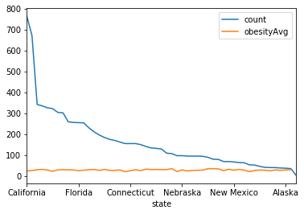

---

[TOC]

---

**Foreword**

Code snippets and excerpts from the course. Python 3. From DataCamp.

---

# Introduction

Open data is at the heart of [data.world](https://data.world/integrations/python). 

Open an account, log in, find a dataset, download it or copy URL or integrate data.world with Python/R/Tableau by installing dw in the terminal. In Python for example.

`pip install datadotworld[pandas]` or `conda install datadotworld-py`

then,

`dw configure`

Pull the API token from the account and enter it.

There are similar procedures for R and Tableau. Everything is documented on the website (when trying to download any dataset, more options appear for Python/R/Tableau).

Option 1: use the data.world Jupyter Notebook template as a way to jump-start a project with Python.

Option 2:


```python
%pylab inline
import pandas as pd
import os

# Import the datadotworld module as dw
import datadotworld as dw
```

    Populating the interactive namespace from numpy and matplotlib


# Working with Datasets

## Import a Dataset

Once the module is loaded, there are two ways to import a dataset.


```python
# First
# Import the city council votes dataset
dataset = dw.load_dataset('stephen-hoover/chicago-city-council-votes')
```

The dataset is now in the cache.


```python
# Second
# Import the city council votes dataset
dataset = dw.load_dataset('https://data.world/stephen-hoover/chicago-city-council-votes')
```

## Working with Datasets

From the beginning.


```python
# Import the datadotworld module as dw
import datadotworld as dw
# Import the Pretty Print module
import pprint as pp
```


```python
# Import the city council votes dataset
dataset = dw.load_dataset('https://data.world/stephen-hoover/chicago-city-council-votes')

# Use describe() 
# Review all the metadata that is downloaded with the dataset
# Print it to the screen using pp.pprint()
pp.pprint(dataset.describe())
```

    {'description': 'Chicago city council voting records from May 2006 to March '
                    '2017\n'
                    '\n'
                    '# About this project\n'
                    'This dataset aims to increase transparency into the Chicago '
                    "city government by publishing each Alderman's voting record "
                    'in an easily machine-readable format. These data come from '
                    'pdfs [published by the Office of the City '
                    'Clerk](http://www.chicityclerk.com/legislation-records/journals-and-reports/council-meeting-reports).\n'
                    '\n'
                    'This work was done as part of the Data for Democracy '
                    '["Chicago '
                    'Lobbyists"](https://data.world/lilianhj/chicago-lobbyists) '
                    'project.\n'
                    '\n'
                    'The code which produced these data is at '
                    'https://github.com/stephen-hoover/data-processing/blob/master/scraping/Scrape%20Chicago%20City%20Clerk%20Website.ipynb '
                    '.\n'
                    '\n'
                    '# Still to-do\n'
                    'It would be useful to include more information about each '
                    'measure -- sponsors, full text, and subject tags would be '
                    'particularly good to have.\n'
                    '\n'
                    'Aldermen names in the voting records are not fully '
                    'standardized yet. Ideally the same person would always have '
                    'exactly the same string.\n'
                    '\n'
                    '# External resources\n'
                    '[City council meeting '
                    'reports](http://www.chicityclerk.com/legislation-records/journals-and-reports/council-meeting-reports)\n'
                    '\n'
                    '[Chicago Councilmatic](https://chicago.councilmatic.org)\n'
                    '\n'
                    '[City of Chicago Legislative Information '
                    'Center](https://chicago.legistar.com)',
     'homepage': 'https://data.world/stephen-hoover/chicago-city-council-votes',
     'keywords': ['chicago', 'government'],
     'license': 'Public Domain',
     'name': 'stephen-hoover_chicago-city-council-votes',
     'resources': [{'format': 'csv',
                    'name': 'alderman_votes',
                    'path': 'data/alderman_votes.csv'},
                   {'format': 'csv',
                    'name': 'legislation_titles',
                    'path': 'data/legislation_titles.csv'},
                   {'bytes': 428918,
                    'format': 'csv',
                    'keywords': ['clean data'],
                    'mediatype': 'text/csv',
                    'name': 'original/alderman_votes.csv',
                    'path': 'original/alderman_votes.csv'},
                   {'bytes': 29658,
                    'description': 'These are titles for each of the issues in the '
                                   'alderman_votes.csv document. Join on "Record".',
                    'format': 'csv',
                    'keywords': ['clean data'],
                    'mediatype': 'text/csv',
                    'name': 'original/legislation_titles.csv',
                    'path': 'original/legislation_titles.csv'}],
     'title': 'Chicago City Council Votes'}


```python
# Use describe() again
# Get a description of a specific resource: alderman_votes
# Print it to the screen
pp.pprint(dataset.describe('alderman_votes'))
```

    {'format': 'csv',
     'name': 'alderman_votes',
     'path': 'data/alderman_votes.csv',
     'schema': {'fields': [{'description': 'Note that some entries contain a full '
                                           'name and others only have a last name.',
                            'name': 'alderman',
                            'rdfType': 'http://www.w3.org/2001/XMLSchema#string',
                            'title': 'Alderman',
                            'type': 'string'},
                           {'description': 'VOTE KEY: Y=Yes; N=No; A=Absent; '
                                           'NV=Not Voting;  E=Excused; V=Vacant '
                                           'R=Recusals from voting',
                            'name': 'vote',
                            'rdfType': 'http://www.w3.org/2001/XMLSchema#string',
                            'title': 'Vote',
                            'type': 'string'},
                           {'name': 'ward',
                            'rdfType': 'http://www.w3.org/2001/XMLSchema#integer',
                            'title': 'Ward',
                            'type': 'integer'},
                           {'description': 'YYYY-MM-DD',
                            'name': 'date',
                            'rdfType': 'http://www.w3.org/2001/XMLSchema#date',
                            'title': 'Date',
                            'type': 'date'},
                           {'name': 'record',
                            'rdfType': 'http://www.w3.org/2001/XMLSchema#string',
                            'title': 'Record',
                            'type': 'string'}]}}


## Reading the metadata

All fields begin with `{`. The `alderman_votes` variable has 5 fields.

## Accessing the data

We have access to three properties: `raw_data`, `tables`, and `dataframes`. Each of these returns a dictionary of values, just in different formats: `bytes`, `list` and `pandas.DataFrame` objects.


```python
# Use the dataframes property
# Assign the alderman_votes table to the variable votes_dataframe
votes_dataframe = dataset.dataframes['alderman_votes']

# Use the pandas shape property
# Get rows/columns size for the `votes_dataframe` dataframe
pp.pprint(votes_dataframe.shape)
```

    (10850, 5)


```python
# Use the pandas head function
# Print the first 3 rows of the `votes_dataframe` dataframe
pp.pprint(votes_dataframe.head(3))
```

                    alderman vote  ward       date       record
    0          Manuel Flores    N     1 2006-07-26  SO2006-3086
    1  Madeline L. Haithcock    N     2 2006-07-26  SO2006-3086
    2     Dorothy J. Tillman    N     3 2006-07-26  SO2006-3086


# Working with multiple datasets


```python
import datadotworld as dw

# Loaded two datasets
int_dataset = dw.load_dataset('https://data.world/jonloyens/intermediate-data-world')
fipsCodes_dataset = dw.load_dataset('https://data.world/uscensusbureau/fips-state-codes')
```


```python
# Create two dataframes:
# police_shootings from the 'fatal_police_shootings_data' table of int_dataset and
# state_abbrvs, from the 'statesfipscodes' table of fipsCodes_dataset
police_shootings = int_dataset.dataframes['fatal_police_shootings_data']
state_abbrvs = fipsCodes_dataset.dataframes['statesfipscodes']

# Merge the two datasets together
# on the state and stusab fields
# Assign to a merged_dataframe variable
merged_dataframe = police_shootings.merge(state_abbrvs,
                                          how = 'left',
                                          left_on = 'state',
                                          right_on='stusab')

# Add a 'citystate' column to the merged_dataframe dataframe,
# populating it with the concatinated values from the 'city' and 'state_name' columns,
# separated by ', '
merged_dataframe["citystate"] = merged_dataframe["city"] + \
                                ", " + merged_dataframe["state_name"]

## Print head of merged_dataframe
pp.pprint(merged_dataframe.head(5))
```

       id                name        date   manner_of_death       armed   age  \
    0   3          Tim Elliot  2015-01-02              shot         gun  53.0   
    1   4    Lewis Lee Lembke  2015-01-02              shot         gun  47.0   
    2   5  John Paul Quintero  2015-01-03  shot and Tasered     unarmed  23.0   
    3   8     Matthew Hoffman  2015-01-04              shot  toy weapon  32.0   
    4   9   Michael Rodriguez  2015-01-04              shot    nail gun  39.0   
    
      gender race           city state  signs_of_mental_illness threat_level  \
    0      M    A        Shelton    WA                     True       attack   
    1      M    W          Aloha    OR                    False       attack   
    2      M    H        Wichita    KS                    False        other   
    3      M    W  San Francisco    CA                     True       attack   
    4      M    H          Evans    CO                    False       attack   
    
              flee  body_camera  state_fips stusab  state_name  statens  \
    0  Not fleeing        False          53     WA  Washington  1779804   
    1  Not fleeing        False          41     OR      Oregon  1155107   
    2  Not fleeing        False          20     KS      Kansas   481813   
    3  Not fleeing        False           6     CA  California  1779778   
    4  Not fleeing        False           8     CO    Colorado  1779779   
    
                       citystate  
    0        Shelton, Washington  
    1              Aloha, Oregon  
    2            Wichita, Kansas  
    3  San Francisco, California  
    4            Evans, Colorado  


# Querying with data.world

Another way to pull data in from data.world is to use the `query()` method to use SQL or SPARQL to query one or more datasets. Check out the full dwSQL [documentation](https://docs.data.world/tutorials/dwsql/).

## SQL: Querying a table


```python
import datadotworld as dw

# Run a SQL query
# Select all rows from the `unhcr_all` table where `Year` equals 2010
# Assign the query string to a `sql_query` variable
sql_query = "SELECT * FROM `unhcr_all` WHERE Year = 2010"

# Use the `query` method of the datadotworld module
# Run the `sql_query`
# Assign the results to a `query2010` variable
query2010 = dw.query('https://data.world/agriculture/national-farmers-markets', sql_query)

# Use the dataframe property of the resulting query
# Create a dataframe variable named `unhcr2010`
unhcr2010 = query2010.dataframe

# Print the first 5 rows using the head method
pp.pprint(unhcr2010.head(5))
```

## SQL: Query multiple tables (join)

Write queries against multiple tables within a single dataset or across many datasets! 


```python
import datadotworld as dw

# Run a SQL query
# Select state, the count of farmers markets (fmid),
# and average obesity rate 
# from agriculture.`national-farmers-markets`.export,
# LEFT JOINED against health.`obesity-by-state-2014`
# adult_obese on state and location
sql_query = "SELECT state, count(fmid) as count, Avg(obesity.Value) as obesityAvg FROM Export LEFT JOIN health.`obesity-by-state-2014`.`adult_obese` as obesity ON state = obesity.location GROUP BY state ORDER BY count desc"

# Use the `query` method of the datadotworld module
# Run the `sql_query` against the `https://data.world/agriculture/national-farmers-markets` dataset
# Assign the results to a `queryResults` variable
queryResults = dw.query('https://data.world/agriculture/national-farmers-markets', \
                        sql_query)

# Use the dataframes property of the resulting query
# Create a dataframe variable named `stateStats`
stateStats = queryResults.dataframe
```


```python
import matplotlib.pyplot as plt

# Plot the stateStats results using state as the x-axis
stateStats.plot(x='state')

plt.show()
```




## SPARQL: Querying linked data

Behind the scenes, data.world is converting all tabular data files into linked data using Semantic Web technologies. This allows to upload any tabular format, like xlsx, csv, tsv or json, and instantly be able to query and join them without issue. SQL is great for this, but SPARQL - which is the query language for linked data - can be more robust and flexible than SQL, allowing for more complex queries.

Check out the full SPARQL [documentation](https://docs.data.world/documentation/api/sparql.html).


```python
import datadotworld as dw

# A SPARQL query assigned to the `sparql_query` variable: 
sparql_query = "PREFIX GOT: <https://tutorial.linked.data.world/d/sparqltutorial/> SELECT ?FName ?LName WHERE {?person GOT:col-got-house \"Stark\" . ?person GOT:col-got-fname ?FName . ?person GOT:col-got-lname ?LName .}"

# Use the pre-defined SPARQL query
# Query dataset http://data.world/tutorial/sparqltutorial and
# return the results to a queryResults variable
queryResults = dw.query('http://data.world/tutorial/sparqltutorial', \
                        sparql_query, query_type='sparql')

# Use the dataframe property of the resulting query
# Create a dataframe variable named `houseStark`
houseStark = queryResults.dataframe

# Use pp.pprint() to print the dataframe to the screen
pp.pprint(houseStark)
```

        FName  LName
    0    Robb  Stark
    1     Jon   Snow
    2   Sansa  Stark
    3    Arya  Stark
    4    Bran  Stark
    5  Rickon  Stark


# Wrap up


```python
import datadotworld as dw
# Import the sys module
import sys

# Import a dataset
refugee_dataset = dw.load_dataset('nrippner/refugee-host-nations')

# Get the size of the dataset:
sys.getsizeof(refugee_dataset)
```


    56


```python
# List all of the data files:
dataframes = refugee_dataset.dataframes
for df in dataframes:
    pp.pprint(df)
```

    'refugees2011_15'
    'refugees_all_years'
    'refugees_per_capita'
    'unhcr_2015'
    'unhcr_all'
    'worldbank_data_dict'
    'worldbank_indicators'


```python
# Print all of the files in a dataset:
resources = refugee_dataset.describe()['resources']
pp.pprint('name:')
for r in resources:
    pp.pprint(r['name'])
pp.pprint('\ntype of file:')
for r in resources:
    pp.pprint(r['format'])
```

    'name:'
    'refugees2011_15'
    'refugees_all_years'
    'refugees_per_capita'
    'unhcr_2015'
    'unhcr_all'
    'worldbank_data_dict'
    'worldbank_indicators'
    'original/Refugees.ipynb'
    'original/refs.py'
    'original/refugees2011-15.csv'
    'original/refugees_all_years.csv'
    'original/refugees_per_capita.csv'
    'original/unhcr_2015.csv'
    'original/unhcr_all.csv'
    'original/worldbank_data_dict.csv'
    'original/worldbank_indicators.csv'
    '\ntype of file:'
    'csv'
    'csv'
    'csv'
    'csv'
    'csv'
    'csv'
    'csv'
    'ipynb'
    'py'
    'csv'
    'csv'
    'csv'
    'csv'
    'csv'
    'csv'
    'csv'


# Advanced SDK Functionality

The data.world Python SDK includes a variety of API wrappers, available via the `ApiClient` class, to create, replace, update, and delete a dataset. In this section, we walk through a few common tasks:

- Use `api_client()` to get an instance of the `ApiClient`
- Create a dataset
- Add a file from a dataframe: we write to a local csv and the upload the file
- Add a file from a source URL: this is an easy way to add external data to the dataset and keep it up to date. We use a file from GitHub as an example, but we can use any URL source that points to a file.
- Sync the dataset: this simple call reloads any files with a source URL, to ensure the latest version.
- Update the dataset: after creating a dataset, use `update_dataset` to change attiributes like description, summary or tags.

Use `help(api_client)` to learn more about each available function or see the full [data.world API documentation](https://docs.data.world/documentation/api/).

## Open the API


```python
import datadotworld as dw

# Create an instance of the ApiClient using `api_client()`
api_client = dw.api_client()

# See api_client documentation
help(api_client)
```

    Help on RestApiClient in module datadotworld.client.api object:
    
    class RestApiClient(builtins.object)
     |  REST API client
     |  
     |  Parameters
     |  ----------
     |  profile : str, optional
     |      Name of the configuration profile to use
     |  
     |  Methods defined here:
     |  
     |  __init__(self, config)
     |      Initialize self.  See help(type(self)) for accurate signature.
     |  
     |  add_files_via_url(self, dataset_key, files={})
     |      Add or update dataset files linked to source URLs
     |      
     |      Parameters
     |      ----------
     |      dataset_key : str
     |          Dataset identifier, in the form of owner/id
     |      files : dict
     |          File names and source URLs to add or update
     |      
     |      Raises
     |      ------
     |      RestApiException
     |          If a server error occurs
     |      
     |      Examples
     |      --------
     |      >>> import datadotworld as dw
     |      >>> url = 'http://www.acme.inc/example.csv'
     |      >>> api_client = dw.api_client()
     |      >>> api_client.add_files_via_url(
     |      ...    'username/test-dataset',
     |      ...    {'example.csv': url})  # doctest: +SKIP
     |  
     |  create_dataset(self, owner_id, **kwargs)
     |      Create a new dataset
     |      
     |      Parameters
     |      ----------
     |      owner_id : str
     |          Username of the owner of the new dataset
     |      title : str
     |          Dataset title (will be used to generate dataset id on creation)
     |      description : str, optional
     |          Dataset description
     |      summary : str, optional
     |          Dataset summary markdown
     |      tags : list, optional
     |          Dataset tags
     |      license : {'Public Domain', 'PDDL', 'CC-0', 'CC-BY', 'ODC-BY',
     |                 'CC-BY-SA', 'ODC-ODbL', 'CC BY-NC', 'CC BY-NC-SA', 'Other'}
     |          Dataset license
     |      visibility : {'OPEN', 'PRIVATE'}
     |          Dataset visibility
     |      files : dict, optional
     |          File names and source URLs
     |      
     |      Returns
     |      -------
     |      str
     |          Newly created dataset key
     |      
     |      Raises
     |      ------
     |      RestApiException
     |          If a server error occurs
     |      
     |      Examples
     |      --------
     |      >>> import datadotworld as dw
     |      >>> api_client = dw.api_client()
     |      >>> api_client.create_dataset(
     |      ...     'username', title='Test dataset', visibility='PRIVATE',
     |      ...     license='Public Domain')  # doctest: +SKIP
     |  
     |  delete_files(self, dataset_key, names)
     |      Delete dataset file(s)
     |      
     |      Parameters
     |      ----------
     |      dataset_key : str
     |          Dataset identifier, in the form of owner/id
     |      names : list of str
     |          The list of names for files to be deleted
     |      
     |      Raises
     |      ------
     |      RestApiException
     |          If a server error occurs
     |      
     |      Examples
     |      --------
     |      >>> import datadotworld as dw
     |      >>> api_client = dw.api_client()
     |      >>> api_client.delete_files(
     |      ...     'username/test-dataset', ['example.csv'])  # doctest: +SKIP
     |  
     |  download_datapackage(self, dataset_key, dest_dir)
     |      Download and unzip a dataset's datapackage
     |      
     |      Parameters
     |      ----------
     |      dataset_key : str
     |          Dataset identifier, in the form of owner/id
     |      dest_dir : str or path
     |          Directory under which datapackage should be saved
     |      
     |      Returns
     |      -------
     |      path
     |          Location of the datapackage descriptor (datapackage.json) in the
     |          local filesystem
     |      
     |      Raises
     |      ------
     |      RestApiException
     |          If a server error occurs
     |      
     |      Examples
     |      >>> import datadotworld as dw
     |      >>> api_client = dw.api_client()
     |      >>> datapackage_descriptor = api_client.download_datapackage(
     |      ...     'jonloyens/an-intro-to-dataworld-dataset', '/tmp/test')
     |      >>> datapackage_descriptor
     |      '/tmp/test/datapackage.json'
     |  
     |  get_dataset(self, dataset_key)
     |      Retrieve an existing dataset definition
     |      
     |      This method retrieves metadata about an existing
     |      
     |      Parameters
     |      ----------
     |      dataset_key : str
     |          Dataset identifier, in the form of owner/id
     |      
     |      Returns
     |      -------
     |      dict
     |          Dataset definition, with all attributes
     |      
     |      Raises
     |      ------
     |      RestApiException
     |          If a server error occurs
     |      
     |      Examples
     |      --------
     |      >>> import datadotworld as dw
     |      >>> api_client = dw.api_client()
     |      >>> intro_dataset = api_client.get_dataset(
     |      ...     'jonloyens/an-intro-to-dataworld-dataset')
     |      >>> intro_dataset['title']
     |      'An Intro to data.world Dataset'
     |  
     |  replace_dataset(self, dataset_key, **kwargs)
     |      Replace an existing dataset
     |      
     |      *This method will completely overwrite an existing dataset.*
     |      
     |      Parameters
     |      ----------
     |      description : str, optional
     |          Dataset description
     |      summary : str, optional
     |          Dataset summary markdown
     |      tags : list, optional
     |          Dataset tags
     |      license : {'Public Domain', 'PDDL', 'CC-0', 'CC-BY', 'ODC-BY',
     |                 'CC-BY-SA', 'ODC-ODbL', 'CC BY-NC', 'CC BY-NC-SA', 'Other'}
     |          Dataset license
     |      visibility : {'OPEN', 'PRIVATE'}
     |          Dataset visibility
     |      files : dict, optional
     |          File names and source URLs to add or update
     |      
     |      Raises
     |      ------
     |      RestApiException
     |          If a server error occurs
     |      
     |      Examples
     |      --------
     |      >>> import datadotworld as dw
     |      >>> api_client = dw.api_client()
     |      >>> api_client.replace_dataset(
     |      ...    'username/test-dataset',
     |      ...    visibility='PRIVATE', license='Public Domain',
     |      ...    description='A better description')  # doctest: +SKIP
     |  
     |  sync_files(self, dataset_key)
     |      Trigger synchronization process to update all dataset files linked to
     |      source URLs.
     |      
     |      Parameters
     |      ----------
     |      dataset_key : str
     |          Dataset identifier, in the form of owner/id
     |      
     |      Raises
     |      ------
     |      RestApiException
     |          If a server error occurs
     |      
     |      Examples
     |      --------
     |      >>> import datadotworld as dw
     |      >>> api_client = dw.api_client()
     |      >>> api_client.sync_files('username/test-dataset')  # doctest: +SKIP
     |  
     |  update_dataset(self, dataset_key, **kwargs)
     |      Update an existing dataset
     |      
     |      Parameters
     |      ----------
     |      description : str, optional
     |          Dataset description
     |      summary : str, optional
     |          Dataset summary markdown
     |      tags : list, optional
     |          Dataset tags
     |      license : {'Public Domain', 'PDDL', 'CC-0', 'CC-BY', 'ODC-BY',
     |                 'CC-BY-SA', 'ODC-ODbL', 'CC BY-NC', 'CC BY-NC-SA', 'Other'}
     |          Dataset license
     |      visibility : {'OPEN', 'PRIVATE'}, optional
     |          Dataset visibility
     |      files : dict, optional
     |          File names and source URLs to add or update
     |      
     |      Raises
     |      ------
     |      RestApiException
     |          If a server error occurs
     |      
     |      Examples
     |      --------
     |      >>> import datadotworld as dw
     |      >>> api_client = dw.api_client()
     |      >>> api_client.update_dataset(
     |      ...    'username/test-dataset',
     |      ...    tags=['demo', 'datadotworld'])  # doctest: +SKIP
     |  
     |  upload_files(self, dataset_key, files)
     |      Upload dataset files
     |      
     |      Parameters
     |      ----------
     |      dataset_key : str
     |          Dataset identifier, in the form of owner/id
     |      files : list of str
     |          The list of names/paths for files stored in the local filesystem
     |      
     |      Raises
     |      ------
     |      RestApiException
     |          If a server error occurs
     |      
     |      Examples
     |      --------
     |      >>> import datadotworld as dw
     |      >>> api_client = dw.api_client()
     |      >>> api_client.upload_files(
     |      ...     'username/test-dataset',
     |      ...     ['/my/local/example.csv'])  # doctest: +SKIP
     |  
     |  ----------------------------------------------------------------------
     |  Data descriptors defined here:
     |  
     |  __dict__
     |      dictionary for instance variables (if defined)
     |  
     |  __weakref__
     |      list of weak references to the object (if defined)
    


## Create a dataset using create_dataset method

`api_client.create_dataset(owner_id="<YOUR_USERNAME>", title="<DATASET_TITLE>", visibility='PRIVATE')`


```python
import datadotworld as dw

# Replace the < > items with your username and desired dataset title
# Visibility can be changed to 'OPEN' if you choose
api_client.create_dataset(owner_id="ugo", title="intermediate-data-world", visibility='OPEN')
```


    'https://data.world/ugo/intermediate-data-world'


## Write a dataframe to a local file and upload to dataset

Add file to the dataset using upload_files(). Replace the < > items with the dataset values.

`api_client.upload_files('<YOUR_USERNAME>/<DATASET_TITLE>',['police_shootings.csv'])`


```python
import os

cwd = os.getcwd()
#print(cwd)
```


```python
import datadotworld as dw

# Create a dataframe
police_shootings = dw.load_dataset('https://data.world/jonloyens/intermediate-data-world').dataframes['fatal_police_shootings_data']

# Write dataframe to local csv using pandas to_csv() method
# in the current working directory (cwd)
police_shootings.to_csv('police_shootings.csv', encoding='utf-8')
```

Check the current working directory.

## Update dataset

Add a file from an external source URL. In this example we use GitHub. 
Replace the < > items with the dataset values

`api_client.add_files_via_url('<YOUR_USERNAME>/<DATASET_TITLE>',{'shootings_of_police.csv': 'https://github.com/fivethirtyeight/data/blob/master/police-deaths/all_data.csv’})`

For files added with `add_files_via_url`, fetch the latest version using the `sync()` method:

`api_client.sync_files('<YOUR_USERNAME>/<DATASET_TITLE>')`
                                                                
Use the `update_dataset()` method to update the metadata after dataset creation:

`api_client.update_dataset('<YOUR_USERNAME>/<DATASET_TITLE>', description='Dataset created to test out the python SDK functionality.', tags=['test', 'datacamp'])`
