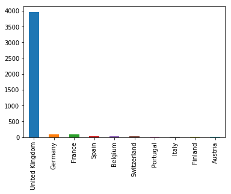

<!--
---

[TOC]
-->
---

**Foreword**

Notes.

---

# What is Customer Segmentation?

Customer segmentation is a method of dividing customers into groups or clusters on the basis of common characteristics.

- The market researcher can segment customers into the B2C model using various customer's demographic characteristics such as occupation, gender, age, location, and marital status.
- Psychographic characteristics such as social class, lifestyle and personality characteristics and behavioral characteristics such as spending, consumption habits, product/service usage, and previously purchased products.
- In the B2B model using various company's characteristics such as the size of the company, type of industry, and location.

# Need of Customer Segmentation

In the Retail sector, the various chain of hypermarkets generating an exceptionally large amount of data. This data is generated on a daily basis across the stores.  
This extensive database of customers transactions needs to analyze for designing profitable strategies.  
All customers have different-different kind of needs. With the increase in customer base and transaction, it is not easy to understand the requirement of each customer.  
Segmentation can play a better role in grouping those customers into various segments:

- It helps in identifying the most potential customers.
- It helps managers to easily communicate with a targetted group of the audience.
- It helps in selecting the best medium for communicating with the targetted segment.
- It improves the quality of service, loyalty, and retention.
- It improves customer relationship via better understanding needs of segments.
- It provides opportunities for upselling and cross-selling.
- It helps managers to design special offers for targetted customers, to encourage them to buy more products.
- It helps companies to stay a step ahead of competitors.
- It also helps in identifying new products that customers could be interested in.


# Types of Segmentation


# Customer Segmentation using RFM analysis

RFM (Recency, Frequency, Monetary) analysis is a behavior-based approach grouping customers into segments.  
It groups the customers on the basis of their previous purchase transactions. How recently, how often, and how much did a customer buy.  
RFM filters customers into various groups for the purpose of better service.

- Recency (R): Who have purchased recently? Number of days since last purchase (least recency).
- Frequency (F): Who has purchased frequently? It means the total number of purchases. ( high frequency).
- Monetary Value(M): Who have high purchase amount? It means the total money customer spent (high monetary value).

Steps of RFM(Recency, Frequency, Monetary):

- Calculate the Recency, Frequency, Monetary values for each customer.
- Add segment bin values to RFM table using quartile.
- Sort the customer RFM score in ascending order.


# RFM in Python

## Importing Data

The [dataset](http://archive.ics.uci.edu/ml/datasets/online+retail) is over 500K lines!


```python
# Importing the necessary modules
import pandas as pd
import matplotlib.pyplot as plt
import seaborn as sns
import datetime as dt
```


```python
# Loading the dataset
data = pd.read_csv("Online_Retail.csv", sep=';', decimal=',')
```


```python
# Examining the data
data.head(3)
```


<div>
<style scoped>
    .dataframe tbody tr th:only-of-type {
        vertical-align: middle;
    }

    .dataframe tbody tr th {
        vertical-align: top;
    }

    .dataframe thead th {
        text-align: right;
    }
</style>
<table border="1" class="dataframe">
  <thead>
    <tr style="text-align: right;">
      <th></th>
      <th>InvoiceNo</th>
      <th>StockCode</th>
      <th>Description</th>
      <th>Quantity</th>
      <th>InvoiceDate</th>
      <th>UnitPrice</th>
      <th>CustomerID</th>
      <th>Country</th>
    </tr>
  </thead>
  <tbody>
    <tr>
      <th>0</th>
      <td>536365</td>
      <td>85123A</td>
      <td>WHITE HANGING HEART T-LIGHT HOLDER</td>
      <td>6</td>
      <td>2010-12-01 08:26</td>
      <td>2.55</td>
      <td>17850.0</td>
      <td>United Kingdom</td>
    </tr>
    <tr>
      <th>1</th>
      <td>536365</td>
      <td>71053</td>
      <td>WHITE METAL LANTERN</td>
      <td>6</td>
      <td>2010-12-01 08:26</td>
      <td>3.39</td>
      <td>17850.0</td>
      <td>United Kingdom</td>
    </tr>
    <tr>
      <th>2</th>
      <td>536365</td>
      <td>84406B</td>
      <td>CREAM CUPID HEARTS COAT HANGER</td>
      <td>8</td>
      <td>2010-12-01 08:26</td>
      <td>2.75</td>
      <td>17850.0</td>
      <td>United Kingdom</td>
    </tr>
  </tbody>
</table>
</div>


```python
# Examining the fields (culomns)
data.info()
```

    <class 'pandas.core.frame.DataFrame'>
    RangeIndex: 541909 entries, 0 to 541908
    Data columns (total 8 columns):
    InvoiceNo      541909 non-null object
    StockCode      541909 non-null object
    Description    540455 non-null object
    Quantity       541909 non-null int64
    InvoiceDate    541909 non-null object
    UnitPrice      541909 non-null float64
    CustomerID     406829 non-null float64
    Country        541909 non-null object
    dtypes: float64(2), int64(1), object(5)
    memory usage: 33.1+ MB


```python
data['InvoiceDate'] = data['InvoiceDate'].astype('datetime64[ns]')
data.info()
```

    <class 'pandas.core.frame.DataFrame'>
    RangeIndex: 541909 entries, 0 to 541908
    Data columns (total 8 columns):
    InvoiceNo      541909 non-null object
    StockCode      541909 non-null object
    Description    540455 non-null object
    Quantity       541909 non-null int64
    InvoiceDate    541909 non-null datetime64[ns]
    UnitPrice      541909 non-null float64
    CustomerID     406829 non-null float64
    Country        541909 non-null object
    dtypes: datetime64[ns](1), float64(2), int64(1), object(4)
    memory usage: 33.1+ MB


```python
# Removing null ID
data = data[pd.notnull(data['CustomerID'])]
```


```python
# Removing duplicates
filtered_data = data[['Country','CustomerID']].drop_duplicates()
```

## Data Insights


```python
# Filtering the top ten country's customer
# Counting the number of occurrence by country
filtered_data.Country.value_counts()[:10].plot(kind='bar');
```





```python
# Filtering for the United Kingdom
uk_data = data[data.Country=='United Kingdom']

uk_data.info()
```

    <class 'pandas.core.frame.DataFrame'>
    Int64Index: 361878 entries, 0 to 541893
    Data columns (total 8 columns):
    InvoiceNo      361878 non-null object
    StockCode      361878 non-null object
    Description    361878 non-null object
    Quantity       361878 non-null int64
    InvoiceDate    361878 non-null datetime64[ns]
    UnitPrice      361878 non-null float64
    CustomerID     361878 non-null float64
    Country        361878 non-null object
    dtypes: datetime64[ns](1), float64(2), int64(1), object(4)
    memory usage: 24.8+ MB


```python
# Getting summary statistics for the UK
uk_data.describe()
```


<div>
<style scoped>
    .dataframe tbody tr th:only-of-type {
        vertical-align: middle;
    }

    .dataframe tbody tr th {
        vertical-align: top;
    }

    .dataframe thead th {
        text-align: right;
    }
</style>
<table border="1" class="dataframe">
  <thead>
    <tr style="text-align: right;">
      <th></th>
      <th>Quantity</th>
      <th>UnitPrice</th>
      <th>CustomerID</th>
    </tr>
  </thead>
  <tbody>
    <tr>
      <th>count</th>
      <td>361878.000000</td>
      <td>361878.000000</td>
      <td>361878.000000</td>
    </tr>
    <tr>
      <th>mean</th>
      <td>11.077029</td>
      <td>3.256007</td>
      <td>15547.871368</td>
    </tr>
    <tr>
      <th>std</th>
      <td>263.129266</td>
      <td>70.654731</td>
      <td>1594.402590</td>
    </tr>
    <tr>
      <th>min</th>
      <td>-80995.000000</td>
      <td>0.000000</td>
      <td>12346.000000</td>
    </tr>
    <tr>
      <th>25%</th>
      <td>2.000000</td>
      <td>1.250000</td>
      <td>14194.000000</td>
    </tr>
    <tr>
      <th>50%</th>
      <td>4.000000</td>
      <td>1.950000</td>
      <td>15514.000000</td>
    </tr>
    <tr>
      <th>75%</th>
      <td>12.000000</td>
      <td>3.750000</td>
      <td>16931.000000</td>
    </tr>
    <tr>
      <th>max</th>
      <td>80995.000000</td>
      <td>38970.000000</td>
      <td>18287.000000</td>
    </tr>
  </tbody>
</table>
</div>


```python
# Some of the customers have ordered in a negative quantity
# Which is not possible
# Filter Quantity greater than zero

# Filtering quantity greater than zero
uk_data = uk_data[(uk_data['Quantity'] > 0)]

uk_data.info()
```

    <class 'pandas.core.frame.DataFrame'>
    Int64Index: 354345 entries, 0 to 541893
    Data columns (total 8 columns):
    InvoiceNo      354345 non-null object
    StockCode      354345 non-null object
    Description    354345 non-null object
    Quantity       354345 non-null int64
    InvoiceDate    354345 non-null datetime64[ns]
    UnitPrice      354345 non-null float64
    CustomerID     354345 non-null float64
    Country        354345 non-null object
    dtypes: datetime64[ns](1), float64(2), int64(1), object(4)
    memory usage: 24.3+ MB


```python
# Filtering the required columns
# for RFM analysis

# InvoiceNo helps you to count the number of time transaction
# performed(frequency)
# Quantity purchased in each transaction and
# UnitPrice of each unit purchased by the customer
# helps calculating the total purchased amount
uk_data = uk_data[['CustomerID',
                   'InvoiceDate',
                   'InvoiceNo',
                   'Quantity',
                   'UnitPrice']]


uk_data['TotalPrice'] = uk_data['Quantity'] * \
    uk_data['UnitPrice']

# InvoiceDate help you calculate recency of purchase
uk_data['InvoiceDate'].min(), uk_data['InvoiceDate'].max()
```


    (Timestamp('2010-12-01 08:26:00'), Timestamp('2011-12-09 12:49:00'))


```python
# Creating a constant
PRESENT = dt.datetime(2011,12,10)

# InvoiceDate help you calculate recency of purchase
uk_data['InvoiceDate'] = pd.to_datetime(uk_data['InvoiceDate'])
```


```python
uk_data.head()
```


<div>
<style scoped>
    .dataframe tbody tr th:only-of-type {
        vertical-align: middle;
    }

    .dataframe tbody tr th {
        vertical-align: top;
    }

    .dataframe thead th {
        text-align: right;
    }
</style>
<table border="1" class="dataframe">
  <thead>
    <tr style="text-align: right;">
      <th></th>
      <th>CustomerID</th>
      <th>InvoiceDate</th>
      <th>InvoiceNo</th>
      <th>Quantity</th>
      <th>UnitPrice</th>
      <th>TotalPrice</th>
    </tr>
  </thead>
  <tbody>
    <tr>
      <th>0</th>
      <td>17850.0</td>
      <td>2010-12-01 08:26:00</td>
      <td>536365</td>
      <td>6</td>
      <td>2.55</td>
      <td>15.30</td>
    </tr>
    <tr>
      <th>1</th>
      <td>17850.0</td>
      <td>2010-12-01 08:26:00</td>
      <td>536365</td>
      <td>6</td>
      <td>3.39</td>
      <td>20.34</td>
    </tr>
    <tr>
      <th>2</th>
      <td>17850.0</td>
      <td>2010-12-01 08:26:00</td>
      <td>536365</td>
      <td>8</td>
      <td>2.75</td>
      <td>22.00</td>
    </tr>
    <tr>
      <th>3</th>
      <td>17850.0</td>
      <td>2010-12-01 08:26:00</td>
      <td>536365</td>
      <td>6</td>
      <td>3.39</td>
      <td>20.34</td>
    </tr>
    <tr>
      <th>4</th>
      <td>17850.0</td>
      <td>2010-12-01 08:26:00</td>
      <td>536365</td>
      <td>6</td>
      <td>3.39</td>
      <td>20.34</td>
    </tr>
  </tbody>
</table>
</div>


## RFM Analysis

- For Recency, calculate the number of days between present date and date of last purchase each customer.
- For Frequency, calculate the number of orders for each customer.
- For Monetary, calculate the sum of purchase price for each customer.


```python
rfm = uk_data.groupby('CustomerID'). \
    agg({'InvoiceDate': lambda date: (PRESENT - date.max()).days,
         'InvoiceNo': lambda num: len(num),
         'TotalPrice': lambda price: price.sum()})

rfm.columns
```


    Index(['InvoiceDate', 'InvoiceNo', 'TotalPrice'], dtype='object')


```python
# Change the name of columns
rfm.columns = ['monetary','recency','frequency']

rfm['recency'] = rfm['recency'].astype(int)
```


```python
rfm.head(3)
```


<div>
<style scoped>
    .dataframe tbody tr th:only-of-type {
        vertical-align: middle;
    }

    .dataframe tbody tr th {
        vertical-align: top;
    }

    .dataframe thead th {
        text-align: right;
    }
</style>
<table border="1" class="dataframe">
  <thead>
    <tr style="text-align: right;">
      <th></th>
      <th>monetary</th>
      <th>recency</th>
      <th>frequency</th>
    </tr>
    <tr>
      <th>CustomerID</th>
      <th></th>
      <th></th>
      <th></th>
    </tr>
  </thead>
  <tbody>
    <tr>
      <th>12346.0</th>
      <td>325</td>
      <td>1</td>
      <td>77183.60</td>
    </tr>
    <tr>
      <th>12747.0</th>
      <td>2</td>
      <td>103</td>
      <td>4196.01</td>
    </tr>
    <tr>
      <th>12748.0</th>
      <td>0</td>
      <td>4596</td>
      <td>33719.73</td>
    </tr>
  </tbody>
</table>
</div>


## Computing Quantile of RFM values

Customers with the lowest recency, highest frequency and monetary amounts considered as top customers.

`qcut` isquantile-based discretization function.  
`qcut` bins the data based on sample quantiles.  
For example, 1000 values for 4 quantiles would produce a categorical object indicating quantile membership for each customer.


```python
rfm['r_quartile'] = pd.qcut(rfm['recency'], 4, ['1','2','3','4'])
rfm['f_quartile'] = pd.qcut(rfm['frequency'], 4, ['4','3','2','1'])
rfm['m_quartile'] = pd.qcut(rfm['monetary'], 4, ['4','3','2','1'])

rfm.head(3)
```


<div>
<style scoped>
    .dataframe tbody tr th:only-of-type {
        vertical-align: middle;
    }

    .dataframe tbody tr th {
        vertical-align: top;
    }

    .dataframe thead th {
        text-align: right;
    }
</style>
<table border="1" class="dataframe">
  <thead>
    <tr style="text-align: right;">
      <th></th>
      <th>monetary</th>
      <th>recency</th>
      <th>frequency</th>
      <th>r_quartile</th>
      <th>f_quartile</th>
      <th>m_quartile</th>
    </tr>
    <tr>
      <th>CustomerID</th>
      <th></th>
      <th></th>
      <th></th>
      <th></th>
      <th></th>
      <th></th>
    </tr>
  </thead>
  <tbody>
    <tr>
      <th>12346.0</th>
      <td>325</td>
      <td>1</td>
      <td>77183.60</td>
      <td>1</td>
      <td>1</td>
      <td>1</td>
    </tr>
    <tr>
      <th>12747.0</th>
      <td>2</td>
      <td>103</td>
      <td>4196.01</td>
      <td>4</td>
      <td>1</td>
      <td>4</td>
    </tr>
    <tr>
      <th>12748.0</th>
      <td>0</td>
      <td>4596</td>
      <td>33719.73</td>
      <td>4</td>
      <td>1</td>
      <td>4</td>
    </tr>
  </tbody>
</table>
</div>


## RFM Result Interpretation


```python
rfm['RFM_Score'] = rfm.r_quartile.astype(str)+ rfm.f_quartile.astype(str) + rfm.m_quartile.astype(str)

rfm.head(5)
```


<div>
<style scoped>
    .dataframe tbody tr th:only-of-type {
        vertical-align: middle;
    }

    .dataframe tbody tr th {
        vertical-align: top;
    }

    .dataframe thead th {
        text-align: right;
    }
</style>
<table border="1" class="dataframe">
  <thead>
    <tr style="text-align: right;">
      <th></th>
      <th>monetary</th>
      <th>recency</th>
      <th>frequency</th>
      <th>r_quartile</th>
      <th>f_quartile</th>
      <th>m_quartile</th>
      <th>RFM_Score</th>
    </tr>
    <tr>
      <th>CustomerID</th>
      <th></th>
      <th></th>
      <th></th>
      <th></th>
      <th></th>
      <th></th>
      <th></th>
    </tr>
  </thead>
  <tbody>
    <tr>
      <th>12346.0</th>
      <td>325</td>
      <td>1</td>
      <td>77183.60</td>
      <td>1</td>
      <td>1</td>
      <td>1</td>
      <td>111</td>
    </tr>
    <tr>
      <th>12747.0</th>
      <td>2</td>
      <td>103</td>
      <td>4196.01</td>
      <td>4</td>
      <td>1</td>
      <td>4</td>
      <td>414</td>
    </tr>
    <tr>
      <th>12748.0</th>
      <td>0</td>
      <td>4596</td>
      <td>33719.73</td>
      <td>4</td>
      <td>1</td>
      <td>4</td>
      <td>414</td>
    </tr>
    <tr>
      <th>12749.0</th>
      <td>3</td>
      <td>199</td>
      <td>4090.88</td>
      <td>4</td>
      <td>1</td>
      <td>4</td>
      <td>414</td>
    </tr>
    <tr>
      <th>12820.0</th>
      <td>3</td>
      <td>59</td>
      <td>942.34</td>
      <td>3</td>
      <td>2</td>
      <td>4</td>
      <td>324</td>
    </tr>
  </tbody>
</table>
</div>


```python
# Filter out Top/Best customers
rfm[rfm['RFM_Score']=='111'].sort_values('monetary',
                                         ascending=False).head()
```


<div>
<style scoped>
    .dataframe tbody tr th:only-of-type {
        vertical-align: middle;
    }

    .dataframe tbody tr th {
        vertical-align: top;
    }

    .dataframe thead th {
        text-align: right;
    }
</style>
<table border="1" class="dataframe">
  <thead>
    <tr style="text-align: right;">
      <th></th>
      <th>monetary</th>
      <th>recency</th>
      <th>frequency</th>
      <th>r_quartile</th>
      <th>f_quartile</th>
      <th>m_quartile</th>
      <th>RFM_Score</th>
    </tr>
    <tr>
      <th>CustomerID</th>
      <th></th>
      <th></th>
      <th></th>
      <th></th>
      <th></th>
      <th></th>
      <th></th>
    </tr>
  </thead>
  <tbody>
    <tr>
      <th>16754.0</th>
      <td>372</td>
      <td>2</td>
      <td>2002.4</td>
      <td>1</td>
      <td>1</td>
      <td>1</td>
      <td>111</td>
    </tr>
    <tr>
      <th>12346.0</th>
      <td>325</td>
      <td>1</td>
      <td>77183.6</td>
      <td>1</td>
      <td>1</td>
      <td>1</td>
      <td>111</td>
    </tr>
    <tr>
      <th>15749.0</th>
      <td>235</td>
      <td>10</td>
      <td>44534.3</td>
      <td>1</td>
      <td>1</td>
      <td>1</td>
      <td>111</td>
    </tr>
    <tr>
      <th>16698.0</th>
      <td>226</td>
      <td>5</td>
      <td>1998.0</td>
      <td>1</td>
      <td>1</td>
      <td>1</td>
      <td>111</td>
    </tr>
    <tr>
      <th>13135.0</th>
      <td>196</td>
      <td>1</td>
      <td>3096.0</td>
      <td>1</td>
      <td>1</td>
      <td>1</td>
      <td>111</td>
    </tr>
  </tbody>
</table>
</div>


