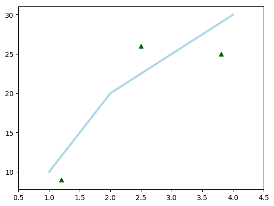
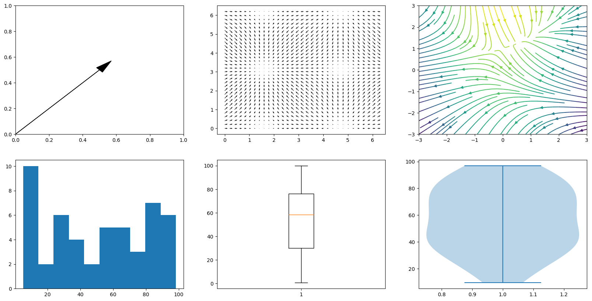
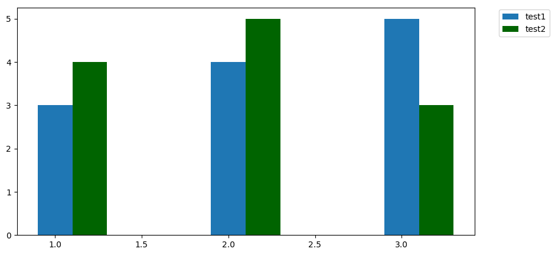

---

[TOC]

---

**Foreword**

Code snippets and excerpts from the tutorial. Python 3. From DataCamp.

---

# A Matplotlib Python Plot

Imports, prepare some data, and start plotting.


```python
%matplotlib inline

# Import the necessary packages and modules
import matplotlib.pyplot as plt
import numpy as np

# Prepare the plot
import matplotlib as mpl
mpl.rcParams['lines.linewidth'] = 1
plt.style.use("default")
```


```python
# Prepare the data
x = np.linspace(0, 10, 100)
print(x)
```

    [  0.           0.1010101    0.2020202    0.3030303    0.4040404
       0.50505051   0.60606061   0.70707071   0.80808081   0.90909091
       1.01010101   1.11111111   1.21212121   1.31313131   1.41414141
       1.51515152   1.61616162   1.71717172   1.81818182   1.91919192
       2.02020202   2.12121212   2.22222222   2.32323232   2.42424242
       2.52525253   2.62626263   2.72727273   2.82828283   2.92929293
       3.03030303   3.13131313   3.23232323   3.33333333   3.43434343
       3.53535354   3.63636364   3.73737374   3.83838384   3.93939394
       4.04040404   4.14141414   4.24242424   4.34343434   4.44444444
       4.54545455   4.64646465   4.74747475   4.84848485   4.94949495
       5.05050505   5.15151515   5.25252525   5.35353535   5.45454545
       5.55555556   5.65656566   5.75757576   5.85858586   5.95959596
       6.06060606   6.16161616   6.26262626   6.36363636   6.46464646
       6.56565657   6.66666667   6.76767677   6.86868687   6.96969697
       7.07070707   7.17171717   7.27272727   7.37373737   7.47474747
       7.57575758   7.67676768   7.77777778   7.87878788   7.97979798
       8.08080808   8.18181818   8.28282828   8.38383838   8.48484848
       8.58585859   8.68686869   8.78787879   8.88888889   8.98989899
       9.09090909   9.19191919   9.29292929   9.39393939   9.49494949
       9.5959596    9.6969697    9.7979798    9.8989899   10.        ]


```python
# Plot the data
plt.plot(x, x, label='linear')

# Add a legend
plt.legend()

# Show the plot
plt.show()
```


- Figure.
- Title, sub, text, legend.
- Axes with `plot()` and `scatter()` with ticks, labels, etc.


- `ax.plot()` calls `plt.plot()`.
- `ax.scatter` calls `plt.scatter`.
- `ax.set_xlim` call `plt.xlim`.

With multiple axes, be explicit and prefer the first snippet to the second. See below.


```python
import matplotlib.pyplot as plt

fig = plt.figure()
ax = fig.add_subplot(111)

ax.plot([1, 2, 3, 4], [10, 20, 25, 30], color='lightblue', linewidth=3)
ax.scatter([0.3, 3.8, 1.2, 2.5], [11, 25, 9, 26], color='darkgreen', marker='^')
ax.set_xlim(0.5, 4.5)

plt.show()
```


```python
import matplotlib.pyplot as plt

plt.plot([1, 2, 3, 4], [10, 20, 25, 30], color='lightblue', linewidth=3)
plt.scatter([0.3, 3.8, 1.2, 2.5], [11, 25, 9, 26], color='darkgreen', marker='^')
plt.xlim(0.5, 4.5)

plt.show()
```





- Each Axes has an x-axis and a y-axis, which contain ticks, which have major and minor ticklines and ticklabels.
- The axis labels, title, and legend.
- Spines are lines that connect the axis tick marks and that designate the boundaries of the data area. The right and top spines are set to invisible.


- Everything drawn using `matplotlib` is part of the Artist module. The containers to plot the data, such as Axis, Axes, and Figure, and other graphical objects such as text, patches, etc.
- [GALLERY](https://matplotlib.org/gallery.html).

# `matplotlib`, `pyplot` and `pylab`: how are they related?

`pyplot` is a module in `matplotlib` to implicitly and automatically create figures and axes. Everything can be customized though.

`%pylab` and `%pylab inline` import `pyplot` and `numpy`. `%matplotlib` and `%matplotlib inline` import `pyplot`.

`matplotlib` can save images to the local file system.

# Create a Plot


```python
# Import `pyplot`
import matplotlib.pyplot as plt

# Initialize a Figure 
fig = plt.figure()

# Add Axes to the Figure
fig.add_axes([0,0,1,1])
```


    <matplotlib.axes._axes.Axes at 0x7f796d5c7ac8>


## A Subplot

Axes and subplot are synonymous. There is, however, a difference between the `add_axes()` and the `add_subplots()` function.


```python
# Import the necessary packages and modules
import matplotlib.pyplot as plt
import numpy as np

# Create a Figure
fig = plt.figure()

# Set up Axes
ax = fig.add_subplot(111)

# Scatter the data
ax.scatter(np.linspace(0, 1, 5), np.linspace(0, 5, 5))

# Show the plot
plt.show()
```


`111` designates the number of rows (1), the number of columns (1) and the plot number (1); it means one subplot.


```python
# Create a Figure
fig = plt.figure()

# Set up Axes of no 1
ax = fig.add_subplot(121)

# Scatter the data
ax.scatter(np.linspace(0, 1, 5), np.linspace(0, 5, 5))

# Set up Axes of no 2
ax = fig.add_subplot(122)

# Scatter the data
ax.scatter(np.linspace(0, 1, 5), np.linspace(0, 5, 5))

# Show the plots
plt.show()
```


## The Difference Between `add_axes()` and `add_subplot()`

- `add_axes()` is the lower left point, the width, and the height. In cases where the positioning matters.
- `add_subplot()` is a grid: the number of rows, columns, and the plot number.

# Change the Size of Figures

`plt.figure(figsize=(3,4))` for the width and height in inches.


```python
import matplotlib.pyplot as plt

# Initialize the plot
fig = plt.figure(figsize=(20,10))
ax1 = fig.add_subplot(121)
ax2 = fig.add_subplot(122)

ax1.bar([1,2,3],[3,4,5])
ax2.barh([0.5,1,2.5],[0,1,2])

plt.show()
```


```python
import matplotlib.pyplot as plt

# Initialize the plot
fig, (ax1, ax2) = plt.subplots(1,2, figsize=(20,10))

ax1.bar([1,2,3],[3,4,5])
ax2.barh([0.5,1,2.5],[0,1,2])

plt.show()
```


# Working With Pyplot: Plotting Routines

Common plots.

- `ax.bar()`: Vertical rectangles.
- `ax.barh()`: Horizontal rectangles.
- `ax.axhline()`: Horizontal line across axes.
- `ax.axvline()`: Vertical line across axes.
- `ax.fill()`: Filled polygons.
- `ax.fill_between()`: Fill between y-values and 0 (area plot).
- `ax.stackplot()`: Stack plot.


```python
import matplotlib.pyplot as plt

fig = plt.figure(figsize=(20,10))
ax1 = fig.add_subplot(231)
ax2 = fig.add_subplot(232)
ax3 = fig.add_subplot(233)
ax4 = fig.add_subplot(234)
ax5 = fig.add_subplot(235)
ax6 = fig.add_subplot(236)

ax1.bar([1,2,3],[3,4,5])
ax1.axvline(1.65, color='red', linewidth=2)

ax2.barh([0.5,1,2.5],[0,1,2])
ax2.axhline(1.45, color='red', linewidth=2)

ax3.scatter([1,2,3],[3,4,8], marker='^')

ax4.plot([1, 2, 3, 4], [10, 20, 25, 30], color='lightblue', linewidth=3)

ax5.fill_between([1,2,3],[3,4,8])

ax6.stackplot([1,2,3],[3,4,8])

plt.show()
```


Specialized plots.

- `ax.arrow()`:	Arrow.
- `ax.quiver()`: 2D field of arrows.
- `ax.streamplot()`: 2D vector fields.
- `ax.hist()`: Histogram.
- `ax.boxplot()`: Boxplot.
- `ax.violinplot()`: Violinplot.


```python
import matplotlib.pyplot as plt

fig = plt.figure(figsize=(20,10))
ax1 = fig.add_subplot(231)
ax2 = fig.add_subplot(232)
ax3 = fig.add_subplot(233)
ax4 = fig.add_subplot(234)
ax5 = fig.add_subplot(235)
ax6 = fig.add_subplot(236)

ax1.arrow(0, 0, 0.5, 0.5, head_width=0.05, head_length=0.1, fc='k', ec='k')

X, Y = np.meshgrid(np.arange(0, 2 * np.pi, .2), np.arange(0, 2 * np.pi, .2))
U = np.cos(X)
V = np.sin(Y)
ax2.quiver(X, Y, U, V, units='width')

Y, X = np.mgrid[-3:3:100j, -3:3:100j]
U = -1 - X**2 + Y
V = 1 + X - Y**2
speed = np.sqrt(U*U + V*V)
ax3.streamplot(X, Y, U, V, color=U)

ax4.hist(np.random.rand(50) * 100)

ax5.boxplot(np.random.rand(50) * 100)

ax6.violinplot(np.random.rand(50) * 100)

plt.show()
```





And more specialized plots.

- `ax.pcolor()`: Pseudocolor plot.
- `ax.pcolormesh()`: Pseudocolor plot.
- `ax.contour()`: Contour plot.
- `ax.contourf()`: Filled contour plot.
- `ax.clabel()`: Labeled contour plot.

Contour plots are used to explore the potential relationship between three variables. Pseudocolor plots can be used for this purpose since they are surface plot seen from above. 

# Customize `pyplot`

See the online plot [Gallery](https://matplotlib.org/gallery.html)

## Delete an Axis


```python
import matplotlib.pyplot as plt
import numpy as np

fig = plt.figure(figsize=(20,10))
ax1 = fig.add_subplot(131)
ax2 = fig.add_subplot(132)
ax3 = fig.add_subplot(133)

ax1.bar([1,2,3],[3,4,5])
ax1.axvline(0.65, color='red')

ax2.barh([0.5,1,2.5],[0,1,2])
ax2.axhline(0.45, color='red')

ax3.scatter(np.linspace(0, 1, 5), np.linspace(0, 5, 5))

# Delete `ax3` !!! (add them back further down)
fig.delaxes(ax3)

plt.show()
```


```python
import matplotlib.pyplot as plt
import numpy as np

fig = plt.figure(figsize=(20,10))
ax1 = fig.add_subplot(131)
ax2 = fig.add_subplot(132)
ax3 = fig.add_subplot(133)

ax1.bar([1,2,3],[3,4,5])
ax1.axvline(0.65, color='red')

ax2.barh([0.5,1,2.5],[0,1,2])
ax2.axhline(0.45, color='red')

ax3.scatter(np.linspace(0, 1, 5), np.linspace(0, 5, 5))

# Delete `ax3` !!!
fig.delaxes(ax3)
# Add them back !!!
fig.add_axes(ax3)

plt.show()
```


## Put the Legend out of the Plot

`legend()` with many options.


```python
import matplotlib.pyplot as plt

fig = plt.figure(figsize=(10,5))
ax = fig.add_subplot(111)
ax.bar([1,2,3],[3,4,5], width=0.2, align='center', label="test1")
ax.bar([1.2,2.2,3.2],[4,5,3], color='darkgreen', width=0.2, align='center', label="test2")

ax.legend(bbox_to_anchor=(1.05, 1), loc=2, borderaxespad=0.2)
                 
plt.show()
```





## Set Plot Title and Axes Labels

- `ax.set(title="A title", xlabel="x", ylabel="y")` or `ax.set_xlim()`, `ax.set_ylim()` or `ax.set_title()`. 
- `plt.title()`, `plt.xlabel()`, `plt.ylabel()`.


```python
import matplotlib.pyplot as plt

fig = plt.figure(figsize=(10,5))
ax = fig.add_subplot(111)
ax.bar([1,2,3],[3,4,5], width=0.2, align='center', label="test1")
ax.bar([1.2,2.2,3.2],[4,5,3], color='darkgreen', width=0.2, align='center', label="test2")

ax.set(title="A title", xlabel="x-axis", ylabel="y-axis")
                 
plt.show()
```


## Set the Plot Layout

- `plt.tight_layout()` before `plt.show()`.
- `subplots_adjust(left=None, bottom=None, right=None, top=None, wspace=None, hspace=None)`, which allows to manually set the width and height reserved for blank space between subplots, and also fix the left and right sides, and the top and bottom of the subplots.


```python
import matplotlib.pyplot as plt

fig = plt.figure(figsize=(10,5))
ax = fig.add_subplot(111)
ax.bar([1,2,3],[3,4,5], width=0.2, align='center', label="test1")
ax.bar([1.2,2.2,3.2],[4,5,3], color='darkgreen', width=0.2, align='center', label="test2")

plt.tight_layout()         
plt.show()
```


```python
import matplotlib.pyplot as plt
import numpy as np

fig = plt.figure(figsize=(15,7))
ax1 = fig.add_subplot(121)
ax2 = fig.add_subplot(122)

ax1.bar([1,2,3],[3,4,5])
ax1.axvline(0.65, color='red')

ax2.barh([0.5,1,2.5],[0,1,2])
ax2.axhline(0.45, color='red')

plt.subplots_adjust(top=0.9)
plt.show()
```


# Show, Save, and Close the Plot


```python
# Import the necessary packages and modules
import matplotlib.pyplot as plt
import numpy as np

# Prepare the data
x = np.linspace(0, 10, 100)

# Plot the data
plt.plot(x, x, label='linear')

# Add a legend
plt.legend()

# Show the plot
plt.show()
```


## Save a Plot to an Image File


```python
import matplotlib.pyplot as plt
import numpy as np

x = np.linspace(0, 10, 100)

plt.plot(x, x, label='linear')

plt.legend()

# Save Figure
plt.savefig("foo1.png")

# Save Transparent (alpha layer) Figure
plt.savefig("foo2.png", transparent=True)
```


Bring back the image:

foo1.png: 

## Save a Plot to a Pdf File


```python
import matplotlib.pyplot as plt
import numpy as np

from matplotlib.backends.backend_pdf import PdfPages

x = np.linspace(0, 10, 100)

plt.plot(x, x, label='linear')

plt.legend()

# Initialize the pdf file
pp = PdfPages('multipage.pdf')

# Save the figure to the file
pp.savefig()

# Close the file
pp.close()
```


## Use `cla()`, `clf()` or `close()`

Tell `matplotlib` to close down the plot and move on. When plotting in a pop-up window.

- `plt.cla()` to clear an axis.
- `plt.clf()` to clear the entire figure.
- `plt.close()` to close a window that has popped up to show the plot.


```python
import matplotlib.pyplot as plt
import numpy as np

# 1
x = np.linspace(0, 10, 100)

plt.plot(x, x, label='linear')

plt.legend()

plt.show()

# 2
x = np.linspace(0, 20, 100)

plt.plot(x, x, label='linear', color='red')

plt.legend()

plt.show()
```


# Customizing Matplotlib

[Customizing](https://matplotlib.org/users/customizing.html) `matplotlib`.

## Use a ggplot2 Style


```python
# Import `pyplot` 
import matplotlib.pyplot as plt

# Set the style to `ggplot`
plt.style.use("ggplot")

x = np.linspace(0, 10, 100)

plt.plot(x, x, label='linear')

plt.legend()

plt.show()

plt.style.use("default")
```


## rc Settings

Automatically **r**un and **c**onfigure settings.


```python
import matplotlib as mpl
import matplotlib.pyplot as plt
import numpy as np

# Uncomment following line to see the effect 
mpl.rcParams['lines.linewidth'] = 5

x = np.linspace(0, 10, 100)

plt.plot(x, x, label='linear')

plt.legend()

plt.show()

mpl.rcParams['lines.linewidth'] = 1
```


To work more statically, there is a `matplotlibrc` configuration file which  can be used to customize all kinds of properties.

```python
import matplotlib

matplotlib.matplotlib_fname()
```

Run the commands, go to the subdir indicated by the result, pull up the file, change the parameters, save the file and see the results on the next plots.
