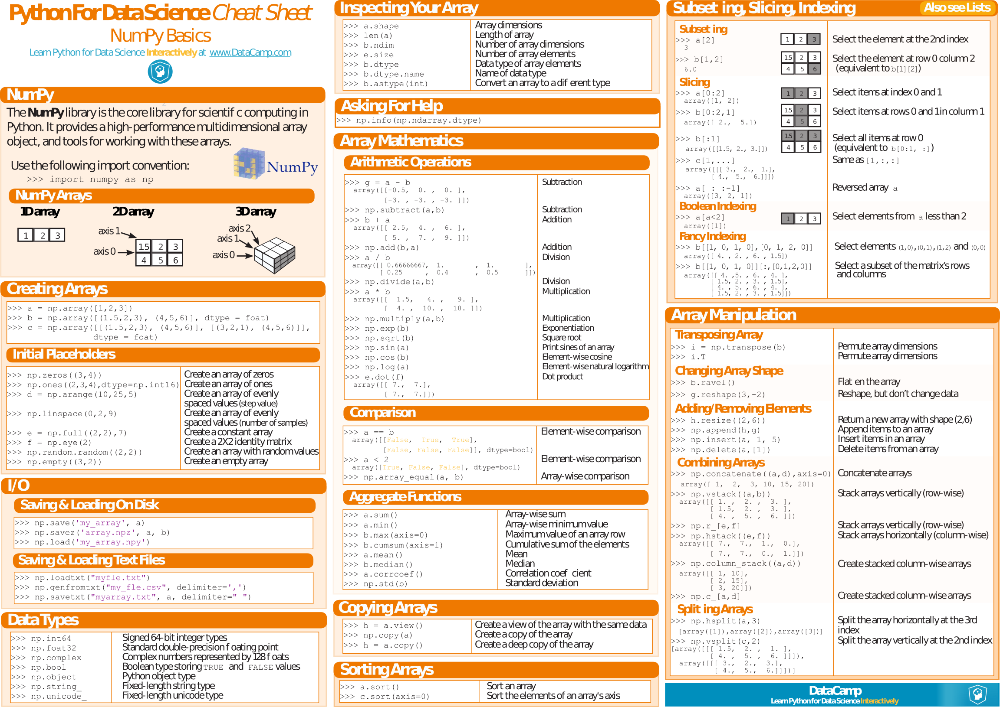
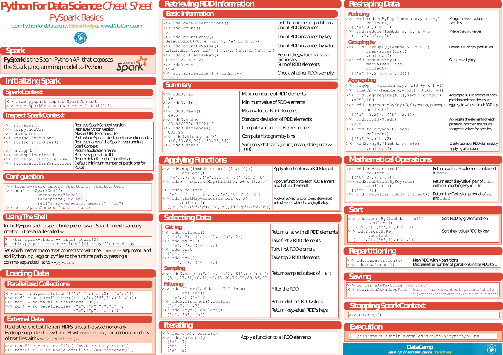

---

[TOC]

---

**Foreword**

Cheat sheets.

---

## Data Mining

- [NumPy](Numpy_Python_Cheat_Sheet.pdf).

---

- [SciPy Linear Algebra](Python_SciPy_Cheat_Sheet_Linear_Algebra.pdf).

---

- [pandas](PandasPythonForDataScience.pdf).

---

- [pandas DataFrame Notes](Pandas-DataFrame-Notes.pdf).

## Machine Learning

.

---

- [Data Mining](4127-rc183-010d-data-mining_2.pdf). PDF only.
- [PySpark](PySpark_Cheat_Sheet_Python.pdf).

---

- [scikit-learn](Scikit_Learn_Cheat_Sheet_Python.pdf).

*Add: TensorFlow, neural nets, deep learning, orange*

## Visualization

- [Matplotlib](Python_Matplotlib_Cheat_Sheet.pdf).

---

- [Matplotlib Notes](Matplotlib-Notes.pdf). PDF only.
- [Bokeh](Python_Bokeh_Cheat_Sheet.pdf).

