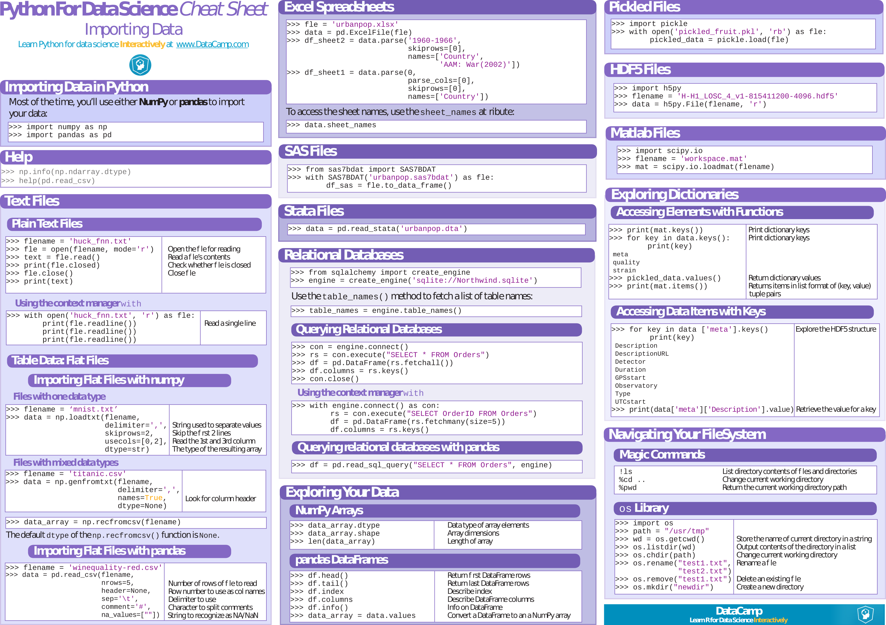
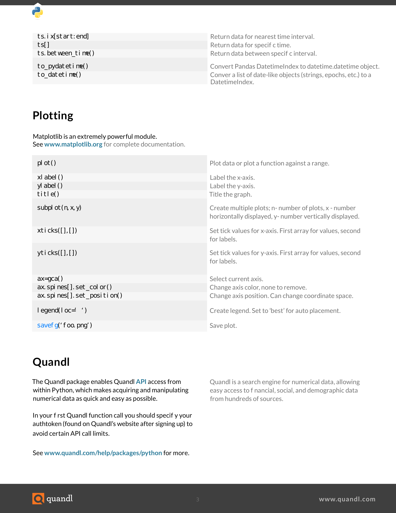
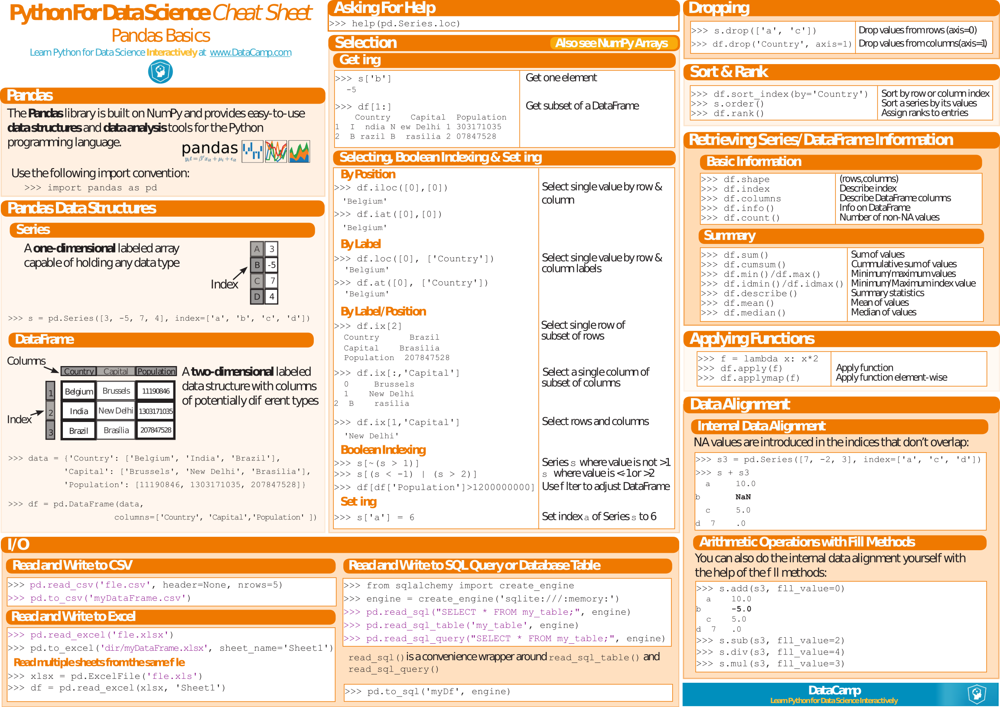
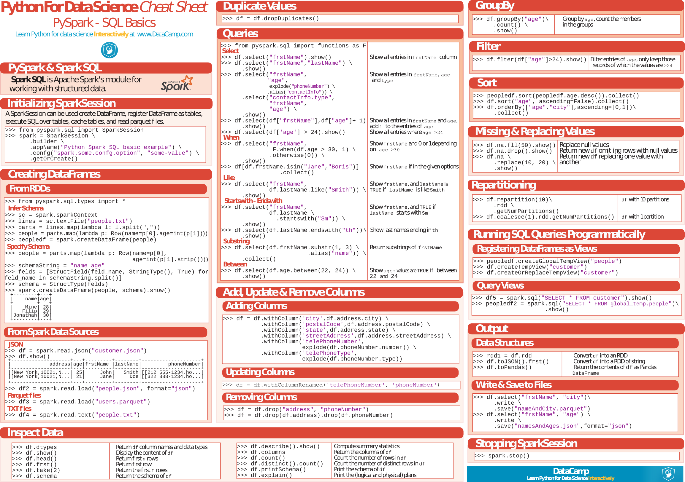

<!--
---

[TOC]
-->
---

**Foreword**

Cheat sheets.

---

# Importing Data

- [Importing Data](Importing_Data.pdf). PDF.

# Data Mining, Wrangling (Numpy, Pandas)

- [Data Mining](4127-rc183-010d-data-mining_2.pdf). PDF only.

---

- [NumPy/SciPy/Pandas Cheat Sheet](NumPy_SciPy_Pandas_Quandl_Cheat_Sheet.pdf). PDF.

---

- [Numpy](Numpy_Python_Cheat_Sheet.pdf). PDF.

---

- [Linear Algebra](linear_algebra_in_4_pages.pdf). PDF only.
- [SciPy Linear Algebra](Python_SciPy_Cheat_Sheet_Linear_Algebra.pdf). PDF.

---

- [Pandas DataFrame Notes](Pandas_DataFrame_Notes.pdf). PDF only.
- [Pandas](PandasPythonForDataScience.pdf). PDF.

- [Pandas](pandas-cheat-sheet.pdf). PDF.

- [Data Wrangling with Pandas](Pandas_Cheat_Sheet.pdf). PDF.

# Machine Learning, Spark, NN

.

---

- [scikit-learn](Scikit_Learn_Cheat_Sheet_Python.pdf). PDF.

---

- [PySpark](PySpark_Cheat_Sheet_Python.pdf). PDF.

---

- [PySpark SQL](PySpark_SQL_Cheat_Sheet_Python.pdf). PDF.

---

- [Keras](Keras_Cheat_Sheet_Python.pdf). PDF.

# Visualization (Matplotlib, Seaborn, Bokeh, Plotly, Folium)

- [Matplotlib Notes](Matplotlib_Notes.pdf). PDF only.
- [Matplotlib](Python_Matplotlib_Cheat_Sheet.pdf). PDF.

---

- [Seaborn](Python_Seaborn_Cheat_Sheet.pdf). PDF.

---

- [Bokeh](Python_Bokeh_Cheat_Sheet.pdf). PDF.

---

- [Plotly](plotly_python_cheat_sheet.pdf). PDF only.

---

- [Folium](Folium.pdf). PDF.

