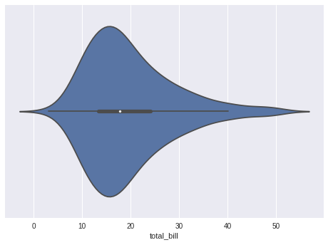
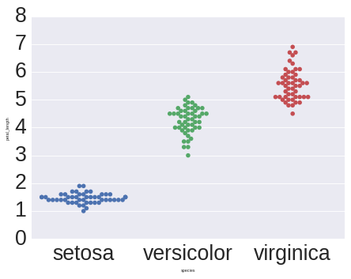
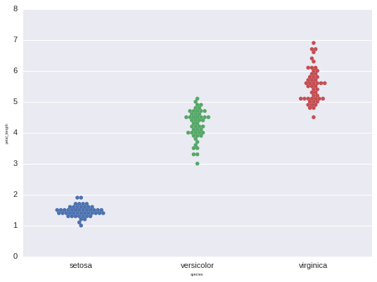
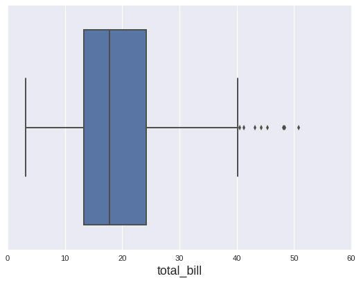
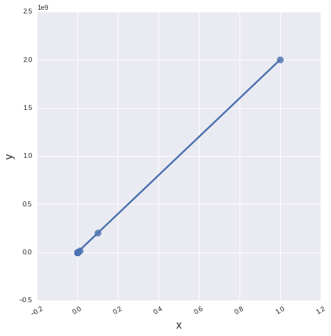
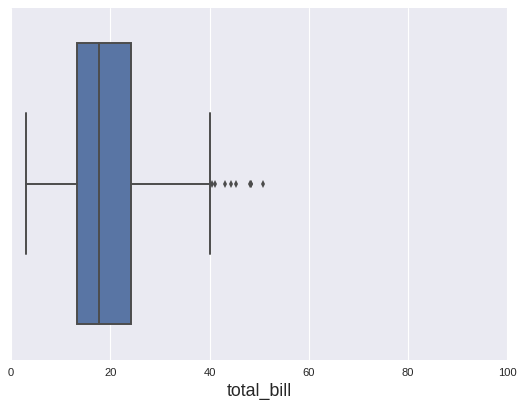
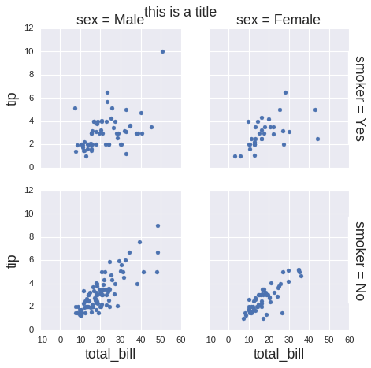

---

[TOC]

---

**Foreword**

Code snippets and excerpts from the tutorial. Python 3. From DataCamp.

---

# Seaborn vs Matplotlib

Seaborn a complement to Matplotlib and it specifically targets statistical data visualization.

With Seaborn, the plotting functions operate on DataFrames and arrays that contain a whole dataset: colors, the tick marks on the upper and right axes, the style, etc.


```python
%pylab inline
```

    Populating the interactive namespace from numpy and matplotlib


```python
# Import the necessary libraries
import matplotlib.pyplot as plt
import pandas as pd

# Initialize Figure and Axes object
fig, ax = plt.subplots()

# Load in data
tips = pd.read_csv("https://raw.githubusercontent.com/mwaskom/seaborn-data/master/tips.csv")

# Create violinplot
ax.violinplot(tips["total_bill"], vert=False)

# Show the plot
plt.show()
```


```python
# Import the necessary libraries
import matplotlib.pyplot as plt
import seaborn as sns

# Load the data
tips = sns.load_dataset("tips")

# Create violinplot
sns.violinplot(x = "total_bill", data=tips)

# Show the plot
plt.show()
```





# Load Data to Construct Seaborn Plots

## Loading a Built-in Seaborn Data Set

The Seaborn data are a GitHun [repo](https://github.com/mwaskom/seaborn-data).


```python
# Import necessary libraries
import seaborn as sns
import matplotlib.pyplot as plt

# Load iris data
iris = sns.load_dataset("iris")

# Construct iris plot
sns.swarmplot(x="species", y="petal_length", data=iris)

# Show plot
plt.show()
```


Seaborn works best with Pandas DataFrames and arrays that contain a whole data set.

# Show Seaborn Plots

`plt.show()`


```python
# Import necessarily libraries
import matplotlib.pyplot as plt
import seaborn as sns

# Load data
# built-in Seaborn dataset
titanic = sns.load_dataset("titanic")

# Set up a factorplot
g = sns.factorplot("class", "survived", "sex",
                   data=titanic,
                   kind="bar",
                   palette="muted",
                   legend=False)
                   
# Show plot
plt.show()
```


# Use Seaborn with Matplotlib Defaults


```python
# Import Matplotlib
import matplotlib.pyplot as plt

# Check the available styles
plt.style.available
```


    ['seaborn-dark-palette',
     'seaborn-ticks',
     'seaborn-darkgrid',
     'seaborn-muted',
     'seaborn-white',
     'seaborn-pastel',
     'grayscale',
     'seaborn-bright',
     '_classic_test',
     'seaborn-poster',
     'seaborn-whitegrid',
     'classic',
     'seaborn-dark',
     'seaborn-talk',
     'bmh',
     'seaborn-notebook',
     'ggplot',
     'seaborn-colorblind',
     'seaborn-deep',
     'seaborn',
     'fivethirtyeight',
     'dark_background',
     'seaborn-paper']


```python
# Use Matplotlib defaults
plt.style.use("classic")

# Set up a factorplot
g = sns.factorplot("class", "survived", "sex",
                   data=titanic,
                   kind="bar",
                   legend=False)
                   
# Show plot
plt.show()
```


```python
plt.style.use("ggplot")

# Set up a factorplot
g = sns.factorplot("class", "survived", "sex",
                   data=titanic,
                   kind="bar",
                   legend=False)
                   
# Show plot
plt.show()
```


# Use Seaborn’s Colors as a colormap in Matplotlib?


```python
# Import the necessary libraries
import seaborn as sns
import matplotlib.pyplot as plt
import numpy as np
from matplotlib.colors import ListedColormap

# Define a variable N
N = 500

# Construct the colormap
current_palette = sns.color_palette("muted", n_colors=5)
cmap = ListedColormap(sns.color_palette(current_palette).as_hex())


# Initialize the data
data1 = np.random.randn(N)
data2 = np.random.randn(N)
# Assume that there are 5 possible labels
colors = np.random.randint(0,5,N)


# Create a scatter plot
plt.scatter(data1, data2, c=colors, cmap=cmap)

# Add a color bar
plt.colorbar()

# Show the plot
plt.show()
```


# Scale Seaborn Plots for other Contexts

Larger or smaller plots.

- "paper",
- "notebook",
- "talk" and
- "poster"


```python
# Import necessary libraries
import matplotlib.pyplot as plt
import seaborn as sns

# Reset default params
sns.set()

# Set context to `"paper"`
sns.set_context("paper")

# Load iris data
iris = sns.load_dataset("iris")

# Construct iris plot
sns.swarmplot(x="species", y="petal_length", data=iris)

# Show plot
plt.show()
```


More parameters.

Use the higher-level `set()` function instead of `set_context()` to adjust other plot elements.


```python
# Import necessary libraries
import matplotlib.pyplot as plt
import seaborn as sns

# Set context to `"paper"`
sns.set_context("paper", 
                font_scale=3, 
                rc={"font.size":8,
                    "axes.labelsize":5})

# Load iris data
iris = sns.load_dataset("iris")

# Construct iris plot
sns.swarmplot(x="species", y="petal_length", data=iris)

# Show plot
plt.show()
```





```python
# Import necessary libraries
import matplotlib.pyplot as plt
import seaborn as sns

# Reset default params
sns.set(rc={"font.size":8,
            "axes.labelsize":5})

# Load iris data
iris = sns.load_dataset("iris")

# Construct iris plot
sns.swarmplot(x="species", y="petal_length", data=iris)

# Show plot
plt.show()
```





Axes-level functions and figure-level functions. 

- The ones that operate on the Axes level are, for example, `regplot()`, `boxplot()`, `kdeplot()`, …, 
- while the functions that operate on the Figure level are `lmplot()`, `factorplot()`, `jointplot()`, ...

The first group is identified by taking an explicit `ax` argument and returning an Axes object, while the second group of functions creates plots that potentially include Axes. 


```python
tips.head()
```


<div>
<style>
    .dataframe thead tr:only-child th {
        text-align: right;
    }

    .dataframe thead th {
        text-align: left;
    }

    .dataframe tbody tr th {
        vertical-align: top;
    }
</style>
<table border="1" class="dataframe">
  <thead>
    <tr style="text-align: right;">
      <th></th>
      <th>total_bill</th>
      <th>tip</th>
      <th>sex</th>
      <th>smoker</th>
      <th>day</th>
      <th>time</th>
      <th>size</th>
    </tr>
  </thead>
  <tbody>
    <tr>
      <th>0</th>
      <td>16.99</td>
      <td>1.01</td>
      <td>Female</td>
      <td>No</td>
      <td>Sun</td>
      <td>Dinner</td>
      <td>2</td>
    </tr>
    <tr>
      <th>1</th>
      <td>10.34</td>
      <td>1.66</td>
      <td>Male</td>
      <td>No</td>
      <td>Sun</td>
      <td>Dinner</td>
      <td>3</td>
    </tr>
    <tr>
      <th>2</th>
      <td>21.01</td>
      <td>3.50</td>
      <td>Male</td>
      <td>No</td>
      <td>Sun</td>
      <td>Dinner</td>
      <td>3</td>
    </tr>
    <tr>
      <th>3</th>
      <td>23.68</td>
      <td>3.31</td>
      <td>Male</td>
      <td>No</td>
      <td>Sun</td>
      <td>Dinner</td>
      <td>2</td>
    </tr>
    <tr>
      <th>4</th>
      <td>24.59</td>
      <td>3.61</td>
      <td>Female</td>
      <td>No</td>
      <td>Sun</td>
      <td>Dinner</td>
      <td>4</td>
    </tr>
  </tbody>
</table>
</div>


```python
# Set context to `"paper"`
sns.set_context("notebook", 
                font_scale=1,
                rc={"font.size":16,
                    "axes.labelsize":16})
```


```python
sns.boxplot(x="total_bill", data=tips)
```


    <matplotlib.axes._subplots.AxesSubplot at 0x7f6dc1c721d0>





```python
sns.lmplot(x="size", y="total_bill",
           data=tips,
           size=7,
           truncate=True,
           scatter_kws={"s": 100})
```


    <seaborn.axisgrid.FacetGrid at 0x7f6dc1b9a9b0>


`lmplot()` returns an object of the type `FacetGrid` with underlying figure and array of axes at the `FacetGrid.fig` and `FacetGrid.axes` arguments.

Make customizations to a regression plot constructed with `regplot()` on the `Axes` level (see below) and make customizations with `lmplot()` at the Figure level (see further down).

# Temporarily Set the Plot Style

`axes_style()` in a `with` statement to temporarily set the plot style.


```python
# Import necessary libraries
import matplotlib.pyplot as plt
import seaborn as sns

# Load data
iris = sns.load_dataset("iris")
tips = sns.load_dataset("tips")

# Set axes style to white for first subplot
with sns.axes_style("white"):
    plt.subplot(211)
    sns.swarmplot(x="species", y="petal_length", data=iris)

# Initialize the second subplot
plt.subplot(212)

# Plot violinplot
sns.violinplot(x = "total_bill", data=tips)

# Show the plot                   
plt.show()
```


# Set the Figure Size in Seaborn

Axes-level functions: `plt.subplots()` function to which we pass the `figsize` argument.


```python
# Import necessary libraries
import seaborn as sns
import matplotlib.pyplot as plt

# Initialize Figure and Axes object
fig, ax = plt.subplots(figsize=(10,4))

# Load in the data
iris = sns.load_dataset("iris")

# Create swarmplot
sns.swarmplot(x="species", y="petal_length", data=iris, ax=ax)

# Show plot
plt.show()
```


Figure-level functions: rely on two parameters to set the Figure size, namely, `size` and `aspect`.


```python
# Import the libraries
import matplotlib.pyplot as plt
import seaborn as sns 

# Load data
titanic = sns.load_dataset("titanic")

# Set up a factorplot
g = sns.factorplot("class", "survived", "sex", 
                   data=titanic, 
                   kind="bar", 
                   size=6, 
                   aspect=2, 
                   palette="muted", 
                   legend=False)

# Show plot
plt.show()
```


# Rotate Label Text in Seaborn


```python
# Import the necessary libraries
import matplotlib.pyplot as plt
import seaborn as sns 
import numpy as np
import pandas as pd

# Initialize the data
x = 10 ** np.arange(1, 10)
y = x * 2
data = pd.DataFrame(data={'x': x, 'y': y})

# Create an lmplot
grid = sns.lmplot('x', 'y',
                  data,
                  size=7,
                  truncate=True,
                  scatter_kws={"s": 100})

# Rotate the labels on x-axis
grid.set_xticklabels(rotation=30)

# Show the plot
plt.show()
```





# Set `xlim` or `ylim` in Seaborn

Assign boxplot to a variable `ax`, which will be a `matplotlib.axes._subplots.AxesSubplot` object.


```python
# Import necessary libraries
import seaborn as sns
import matplotlib.pyplot as plt

# Load the data
tips = sns.load_dataset("tips")

# Create the boxplot
ax = sns.boxplot(x="total_bill", data=tips)

# Set the `xlim`
ax.set(xlim=(0, 100))

# Show the plot
plt.show()
```





```python
# Import necessary libraries
import seaborn as sns
import matplotlib.pyplot as plt

# Load the data
tips = sns.load_dataset("tips")

# Create the boxplot
ax = sns.boxplot(x="total_bill", data=tips)

# Set the `xlim`
ax.set(xlim=(0, 60))

# Show the plot
plt.show()
```


Figure-level: access the `Axes` object with the help of the `axes` argument.


```python
# Import the necessary libraries
import matplotlib.pyplot as plt
import seaborn as sns 
import numpy as np
import pandas as pd

# Initialize the data
x = 10 ** np.arange(1, 10)
y = x * 2
data = pd.DataFrame(data={'x': x, 'y': y})

# Create lmplot
lm = sns.lmplot('x', 'y',
                data,
                size=7,
                truncate=True,
                scatter_kws={"s": 100})

# Get hold of the `Axes` objects
axes = lm.ax

# Tweak the `Axes` properties
axes.set_ylim(-1000000000,)

# Show the plot
plt.show()
```


Figure-level: `FacetGrid` exposes the underlying figure with the help of the `fig` argument.


```python
# Import the necessary libraries
import matplotlib.pyplot as plt
import seaborn as sns 
import numpy as np
import pandas as pd

# Initialize the data
x = 10 ** np.arange(1, 10)
y = x * 2
data = pd.DataFrame(data={'x': x, 'y': y})

# Create lmplot
lm = sns.lmplot('x', 'y',
                data,
                size=7,
                truncate=True,
                scatter_kws={"s": 100})

# Access the Figure
fig = lm.fig 

# Add a title to the Figure
fig.suptitle('this is the figure title', fontsize=12)

# Show the plot
plt.show()
```


# Set Log Scale


```python
# Import the necessary libraries
import matplotlib.pyplot as plt
import seaborn as sns 
import numpy as np
import pandas as pd

# Create the data
x = 10 ** np.arange(1, 10)
y = x * 2
data = pd.DataFrame(data={'x': x, 'y': y})

# Initialize figure and ax
fig, ax = plt.subplots()

# Set the scale of the x-and y-axes
ax.set(xscale="log", yscale="log")

# Create a regplot
sns.regplot("x", "y",
            data,
            ax=ax,
            scatter_kws={"s": 100})

# Show plot
plt.show()
```


Figure-level: set the `xscale` and `yscale` properties with the help of the `set()` method of the `FacetGrid` object.


```python
# Import the libraries
import matplotlib.pyplot as plt
import seaborn as sns 

# Load data
titanic = sns.load_dataset("titanic")

# Set up a factorplot
g = sns.factorplot("class", "survived", "sex",
                   data=titanic,
                   kind="bar",
                   size=6,
                   palette="muted",
                   legend=False)

# Set the `yscale`
g.set(yscale="log")

# Show plot
plt.show()
```


# Add A Title

Axes-level: `set_title()`.


```python
# Import the libraries
import matplotlib.pyplot as plt
import seaborn as sns 

tips = sns.load_dataset("tips")

# Create the boxplot
ax = sns.boxplot(x="total_bill", data=tips)

# Set title
ax.set_title("boxplot")

# Show the plot
plt.show()
```


Figure-level: `fig`.


```python
# Import the necessary libraries
import matplotlib.pyplot as plt
import seaborn as sns 
import numpy as np
import pandas as pd

# Load the data
tips = sns.load_dataset("tips")

# Create scatter plots
g = sns.FacetGrid(tips, col="sex", row="smoker", margin_titles=True)
g.map(sns.plt.scatter, "total_bill", "tip")

# Add a title to the figure
g.fig.suptitle("this is a title")

# Show the plot
plt.show()
```




