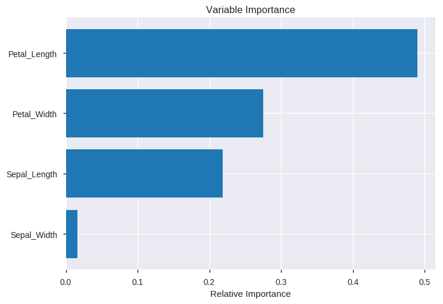

---

**Foreword**

Code snippets and excerpts from the tutorial. Python 3. From DataCamp.

---

# Import the Data

- `sep`, delimiter.
- `delimiter`, delimiter.
- `names`, column names to use.
- `index_col`, column to use as the row labels.

- `read_table()`, general delimited files.
- `read_excel()`, Excel files.
- `read_fwf()`, Fixed-Width Formatted data.
- `read_clipboard`, data copied to the clipboard.
- `read_sql()`, SQL query.

[Input-output documentation](http://pandas.pydata.org/pandas-docs/version/0.18.1/api.html#input-output).


```python
%pylab inline
import numpy as np
import pandas as pd
```

    Populating the interactive namespace from numpy and matplotlib


## `digits`


```python
# Load in the data with `read_csv()`
digits = pd.read_csv("http://archive.ics.uci.edu/ml/machine-learning-databases/optdigits/optdigits.tra",
                     header=None)

digits.head()
```


<div>
<style>
    .dataframe thead tr:only-child th {
        text-align: right;
    }

    .dataframe thead th {
        text-align: left;
    }

    .dataframe tbody tr th {
        vertical-align: top;
    }
</style>
<table border="1" class="dataframe">
  <thead>
    <tr style="text-align: right;">
      <th></th>
      <th>0</th>
      <th>1</th>
      <th>2</th>
      <th>3</th>
      <th>4</th>
      <th>5</th>
      <th>6</th>
      <th>7</th>
      <th>8</th>
      <th>9</th>
      <th>...</th>
      <th>55</th>
      <th>56</th>
      <th>57</th>
      <th>58</th>
      <th>59</th>
      <th>60</th>
      <th>61</th>
      <th>62</th>
      <th>63</th>
      <th>64</th>
    </tr>
  </thead>
  <tbody>
    <tr>
      <th>0</th>
      <td>0</td>
      <td>1</td>
      <td>6</td>
      <td>15</td>
      <td>12</td>
      <td>1</td>
      <td>0</td>
      <td>0</td>
      <td>0</td>
      <td>7</td>
      <td>...</td>
      <td>0</td>
      <td>0</td>
      <td>0</td>
      <td>6</td>
      <td>14</td>
      <td>7</td>
      <td>1</td>
      <td>0</td>
      <td>0</td>
      <td>0</td>
    </tr>
    <tr>
      <th>1</th>
      <td>0</td>
      <td>0</td>
      <td>10</td>
      <td>16</td>
      <td>6</td>
      <td>0</td>
      <td>0</td>
      <td>0</td>
      <td>0</td>
      <td>7</td>
      <td>...</td>
      <td>0</td>
      <td>0</td>
      <td>0</td>
      <td>10</td>
      <td>16</td>
      <td>15</td>
      <td>3</td>
      <td>0</td>
      <td>0</td>
      <td>0</td>
    </tr>
    <tr>
      <th>2</th>
      <td>0</td>
      <td>0</td>
      <td>8</td>
      <td>15</td>
      <td>16</td>
      <td>13</td>
      <td>0</td>
      <td>0</td>
      <td>0</td>
      <td>1</td>
      <td>...</td>
      <td>0</td>
      <td>0</td>
      <td>0</td>
      <td>9</td>
      <td>14</td>
      <td>0</td>
      <td>0</td>
      <td>0</td>
      <td>0</td>
      <td>7</td>
    </tr>
    <tr>
      <th>3</th>
      <td>0</td>
      <td>0</td>
      <td>0</td>
      <td>3</td>
      <td>11</td>
      <td>16</td>
      <td>0</td>
      <td>0</td>
      <td>0</td>
      <td>0</td>
      <td>...</td>
      <td>0</td>
      <td>0</td>
      <td>0</td>
      <td>0</td>
      <td>1</td>
      <td>15</td>
      <td>2</td>
      <td>0</td>
      <td>0</td>
      <td>4</td>
    </tr>
    <tr>
      <th>4</th>
      <td>0</td>
      <td>0</td>
      <td>5</td>
      <td>14</td>
      <td>4</td>
      <td>0</td>
      <td>0</td>
      <td>0</td>
      <td>0</td>
      <td>0</td>
      <td>...</td>
      <td>0</td>
      <td>0</td>
      <td>0</td>
      <td>4</td>
      <td>12</td>
      <td>14</td>
      <td>7</td>
      <td>0</td>
      <td>0</td>
      <td>6</td>
    </tr>
  </tbody>
</table>
<p>5 rows × 65 columns</p>
</div>


Find out about the [dataset](https://archive.ics.uci.edu/ml/machine-learning-databases/optdigits/optdigits.names).

## `iris`

Another classical dataset.


```python
iris = pd.read_csv("http://mlr.cs.umass.edu/ml/machine-learning-databases/iris/iris.data")

iris.columns = ['Sepal_Length', 'Sepal_Width', 'Petal_Length', 'Petal_Width', 'Class']

iris.head()
```


<div>
<style>
    .dataframe thead tr:only-child th {
        text-align: right;
    }

    .dataframe thead th {
        text-align: left;
    }

    .dataframe tbody tr th {
        vertical-align: top;
    }
</style>
<table border="1" class="dataframe">
  <thead>
    <tr style="text-align: right;">
      <th></th>
      <th>Sepal_Length</th>
      <th>Sepal_Width</th>
      <th>Petal_Length</th>
      <th>Petal_Width</th>
      <th>Class</th>
    </tr>
  </thead>
  <tbody>
    <tr>
      <th>0</th>
      <td>4.9</td>
      <td>3.0</td>
      <td>1.4</td>
      <td>0.2</td>
      <td>Iris-setosa</td>
    </tr>
    <tr>
      <th>1</th>
      <td>4.7</td>
      <td>3.2</td>
      <td>1.3</td>
      <td>0.2</td>
      <td>Iris-setosa</td>
    </tr>
    <tr>
      <th>2</th>
      <td>4.6</td>
      <td>3.1</td>
      <td>1.5</td>
      <td>0.2</td>
      <td>Iris-setosa</td>
    </tr>
    <tr>
      <th>3</th>
      <td>5.0</td>
      <td>3.6</td>
      <td>1.4</td>
      <td>0.2</td>
      <td>Iris-setosa</td>
    </tr>
    <tr>
      <th>4</th>
      <td>5.4</td>
      <td>3.9</td>
      <td>1.7</td>
      <td>0.4</td>
      <td>Iris-setosa</td>
    </tr>
  </tbody>
</table>
</div>


# Basic Description of the Data

## Describing The Data


```python
iris.dtypes
```


    Sepal_Length    float64
    Sepal_Width     float64
    Petal_Length    float64
    Petal_Width     float64
    Class            object
    dtype: object


```python
def get_var_category(series):
    unique_count = series.nunique(dropna=False)
    total_count = len(series)
    if pd.api.types.is_numeric_dtype(series):
        return 'Numerical'
    elif pd.api.types.is_datetime64_dtype(series):
        return 'Date'
    elif unique_count==total_count:
        return 'Text (Unique)'
    else:
        return 'Categorical'

def print_categories(df):
    for column_name in df.columns:
        print(column_name, ": ", get_var_category(df[column_name]))
```


```python
print_categories(iris)
```

    Sepal_Length :  Numerical
    Sepal_Width :  Numerical
    Petal_Length :  Numerical
    Petal_Width :  Numerical
    Class :  Categorical


```python
digits.describe()
```


<div>
<style>
    .dataframe thead tr:only-child th {
        text-align: right;
    }

    .dataframe thead th {
        text-align: left;
    }

    .dataframe tbody tr th {
        vertical-align: top;
    }
</style>
<table border="1" class="dataframe">
  <thead>
    <tr style="text-align: right;">
      <th></th>
      <th>0</th>
      <th>1</th>
      <th>2</th>
      <th>3</th>
      <th>4</th>
      <th>5</th>
      <th>6</th>
      <th>7</th>
      <th>8</th>
      <th>9</th>
      <th>...</th>
      <th>55</th>
      <th>56</th>
      <th>57</th>
      <th>58</th>
      <th>59</th>
      <th>60</th>
      <th>61</th>
      <th>62</th>
      <th>63</th>
      <th>64</th>
    </tr>
  </thead>
  <tbody>
    <tr>
      <th>count</th>
      <td>3823.0</td>
      <td>3823.000000</td>
      <td>3823.000000</td>
      <td>3823.000000</td>
      <td>3823.000000</td>
      <td>3823.000000</td>
      <td>3823.000000</td>
      <td>3823.000000</td>
      <td>3823.000000</td>
      <td>3823.000000</td>
      <td>...</td>
      <td>3823.000000</td>
      <td>3823.000000</td>
      <td>3823.000000</td>
      <td>3823.000000</td>
      <td>3823.000000</td>
      <td>3823.000000</td>
      <td>3823.000000</td>
      <td>3823.000000</td>
      <td>3823.000000</td>
      <td>3823.000000</td>
    </tr>
    <tr>
      <th>mean</th>
      <td>0.0</td>
      <td>0.301334</td>
      <td>5.481821</td>
      <td>11.805912</td>
      <td>11.451478</td>
      <td>5.505362</td>
      <td>1.387392</td>
      <td>0.142297</td>
      <td>0.002093</td>
      <td>1.960502</td>
      <td>...</td>
      <td>0.148313</td>
      <td>0.000262</td>
      <td>0.283024</td>
      <td>5.855872</td>
      <td>11.942977</td>
      <td>11.461156</td>
      <td>6.700497</td>
      <td>2.105676</td>
      <td>0.202197</td>
      <td>4.497253</td>
    </tr>
    <tr>
      <th>std</th>
      <td>0.0</td>
      <td>0.866986</td>
      <td>4.631601</td>
      <td>4.259811</td>
      <td>4.537556</td>
      <td>5.613060</td>
      <td>3.371444</td>
      <td>1.051598</td>
      <td>0.088572</td>
      <td>3.052353</td>
      <td>...</td>
      <td>0.767761</td>
      <td>0.016173</td>
      <td>0.928046</td>
      <td>4.980012</td>
      <td>4.334508</td>
      <td>4.991934</td>
      <td>5.775815</td>
      <td>4.028266</td>
      <td>1.150694</td>
      <td>2.869831</td>
    </tr>
    <tr>
      <th>min</th>
      <td>0.0</td>
      <td>0.000000</td>
      <td>0.000000</td>
      <td>0.000000</td>
      <td>0.000000</td>
      <td>0.000000</td>
      <td>0.000000</td>
      <td>0.000000</td>
      <td>0.000000</td>
      <td>0.000000</td>
      <td>...</td>
      <td>0.000000</td>
      <td>0.000000</td>
      <td>0.000000</td>
      <td>0.000000</td>
      <td>0.000000</td>
      <td>0.000000</td>
      <td>0.000000</td>
      <td>0.000000</td>
      <td>0.000000</td>
      <td>0.000000</td>
    </tr>
    <tr>
      <th>25%</th>
      <td>0.0</td>
      <td>0.000000</td>
      <td>1.000000</td>
      <td>10.000000</td>
      <td>9.000000</td>
      <td>0.000000</td>
      <td>0.000000</td>
      <td>0.000000</td>
      <td>0.000000</td>
      <td>0.000000</td>
      <td>...</td>
      <td>0.000000</td>
      <td>0.000000</td>
      <td>0.000000</td>
      <td>1.000000</td>
      <td>10.000000</td>
      <td>9.000000</td>
      <td>0.000000</td>
      <td>0.000000</td>
      <td>0.000000</td>
      <td>2.000000</td>
    </tr>
    <tr>
      <th>50%</th>
      <td>0.0</td>
      <td>0.000000</td>
      <td>5.000000</td>
      <td>13.000000</td>
      <td>13.000000</td>
      <td>4.000000</td>
      <td>0.000000</td>
      <td>0.000000</td>
      <td>0.000000</td>
      <td>0.000000</td>
      <td>...</td>
      <td>0.000000</td>
      <td>0.000000</td>
      <td>0.000000</td>
      <td>5.000000</td>
      <td>13.000000</td>
      <td>13.000000</td>
      <td>6.000000</td>
      <td>0.000000</td>
      <td>0.000000</td>
      <td>4.000000</td>
    </tr>
    <tr>
      <th>75%</th>
      <td>0.0</td>
      <td>0.000000</td>
      <td>9.000000</td>
      <td>15.000000</td>
      <td>15.000000</td>
      <td>10.000000</td>
      <td>0.000000</td>
      <td>0.000000</td>
      <td>0.000000</td>
      <td>3.000000</td>
      <td>...</td>
      <td>0.000000</td>
      <td>0.000000</td>
      <td>0.000000</td>
      <td>10.000000</td>
      <td>15.000000</td>
      <td>16.000000</td>
      <td>12.000000</td>
      <td>2.000000</td>
      <td>0.000000</td>
      <td>7.000000</td>
    </tr>
    <tr>
      <th>max</th>
      <td>0.0</td>
      <td>8.000000</td>
      <td>16.000000</td>
      <td>16.000000</td>
      <td>16.000000</td>
      <td>16.000000</td>
      <td>16.000000</td>
      <td>16.000000</td>
      <td>5.000000</td>
      <td>15.000000</td>
      <td>...</td>
      <td>12.000000</td>
      <td>1.000000</td>
      <td>10.000000</td>
      <td>16.000000</td>
      <td>16.000000</td>
      <td>16.000000</td>
      <td>16.000000</td>
      <td>16.000000</td>
      <td>16.000000</td>
      <td>9.000000</td>
    </tr>
  </tbody>
</table>
<p>8 rows × 65 columns</p>
</div>


```python
iris.describe()
```


<div>
<style>
    .dataframe thead tr:only-child th {
        text-align: right;
    }

    .dataframe thead th {
        text-align: left;
    }

    .dataframe tbody tr th {
        vertical-align: top;
    }
</style>
<table border="1" class="dataframe">
  <thead>
    <tr style="text-align: right;">
      <th></th>
      <th>Sepal_Length</th>
      <th>Sepal_Width</th>
      <th>Petal_Length</th>
      <th>Petal_Width</th>
    </tr>
  </thead>
  <tbody>
    <tr>
      <th>count</th>
      <td>149.000000</td>
      <td>149.000000</td>
      <td>149.000000</td>
      <td>149.000000</td>
    </tr>
    <tr>
      <th>mean</th>
      <td>5.848322</td>
      <td>3.051007</td>
      <td>3.774497</td>
      <td>1.205369</td>
    </tr>
    <tr>
      <th>std</th>
      <td>0.828594</td>
      <td>0.433499</td>
      <td>1.759651</td>
      <td>0.761292</td>
    </tr>
    <tr>
      <th>min</th>
      <td>4.300000</td>
      <td>2.000000</td>
      <td>1.000000</td>
      <td>0.100000</td>
    </tr>
    <tr>
      <th>25%</th>
      <td>5.100000</td>
      <td>2.800000</td>
      <td>1.600000</td>
      <td>0.300000</td>
    </tr>
    <tr>
      <th>50%</th>
      <td>5.800000</td>
      <td>3.000000</td>
      <td>4.400000</td>
      <td>1.300000</td>
    </tr>
    <tr>
      <th>75%</th>
      <td>6.400000</td>
      <td>3.300000</td>
      <td>5.100000</td>
      <td>1.800000</td>
    </tr>
    <tr>
      <th>max</th>
      <td>7.900000</td>
      <td>4.400000</td>
      <td>6.900000</td>
      <td>2.500000</td>
    </tr>
  </tbody>
</table>
</div>


```python
iris[["Sepal_Length", "Sepal_Width"]].describe()
```


<div>
<style>
    .dataframe thead tr:only-child th {
        text-align: right;
    }

    .dataframe thead th {
        text-align: left;
    }

    .dataframe tbody tr th {
        vertical-align: top;
    }
</style>
<table border="1" class="dataframe">
  <thead>
    <tr style="text-align: right;">
      <th></th>
      <th>Sepal_Length</th>
      <th>Sepal_Width</th>
    </tr>
  </thead>
  <tbody>
    <tr>
      <th>count</th>
      <td>149.000000</td>
      <td>149.000000</td>
    </tr>
    <tr>
      <th>mean</th>
      <td>5.848322</td>
      <td>3.051007</td>
    </tr>
    <tr>
      <th>std</th>
      <td>0.828594</td>
      <td>0.433499</td>
    </tr>
    <tr>
      <th>min</th>
      <td>4.300000</td>
      <td>2.000000</td>
    </tr>
    <tr>
      <th>25%</th>
      <td>5.100000</td>
      <td>2.800000</td>
    </tr>
    <tr>
      <th>50%</th>
      <td>5.800000</td>
      <td>3.000000</td>
    </tr>
    <tr>
      <th>75%</th>
      <td>6.400000</td>
      <td>3.300000</td>
    </tr>
    <tr>
      <th>max</th>
      <td>7.900000</td>
      <td>4.400000</td>
    </tr>
  </tbody>
</table>
</div>


```python
length = len(digits)
print(length)
```

    3823


```python
count = digits[2].count()
print(count)
```

    3823


```python
number_of_missing_values = length - count
pct_of_missing_values = float(number_of_missing_values / length)
pct_of_missing_values = "{0:.1f}%".format(pct_of_missing_values*100)
print(pct_of_missing_values)
```

    0.0%


```python
print("Minimum value: ", iris["Sepal_Length"].min())
print("Maximum value: ", iris["Sepal_Length"].max())
```

    Minimum value:  4.3
    Maximum value:  7.9


```python
print(iris["Sepal_Length"].mode())
```

    0    5.0
    dtype: float64


```python
print(iris["Sepal_Length"].mean())
```

    5.848322147651008


```python
print(iris["Sepal_Length"].median())
```

    5.8


```python
print(iris["Sepal_Length"].std())
```

    0.8285940572656172


```python
print(iris["Sepal_Length"].quantile([.25, .5, .75]))
```

    0.25    5.1
    0.50    5.8
    0.75    6.4
    Name: Sepal_Length, dtype: float64


```python
import seaborn as sns
sns.set(color_codes=True)

sns.set_palette(sns.color_palette("muted"))

sns.distplot(iris["Sepal_Length"].dropna())
```


    <matplotlib.axes._subplots.AxesSubplot at 0x7f87b39b0320>


```python
iris[["Sepal_Length", "Sepal_Width"]].corr()
```


<div>
<style>
    .dataframe thead tr:only-child th {
        text-align: right;
    }

    .dataframe thead th {
        text-align: left;
    }

    .dataframe tbody tr th {
        vertical-align: top;
    }
</style>
<table border="1" class="dataframe">
  <thead>
    <tr style="text-align: right;">
      <th></th>
      <th>Sepal_Length</th>
      <th>Sepal_Width</th>
    </tr>
  </thead>
  <tbody>
    <tr>
      <th>Sepal_Length</th>
      <td>1.000000</td>
      <td>-0.103784</td>
    </tr>
    <tr>
      <th>Sepal_Width</th>
      <td>-0.103784</td>
      <td>1.000000</td>
    </tr>
  </tbody>
</table>
</div>


```python
import pandas_profiling 

# Print a full report
pandas_profiling.ProfileReport(iris)
```


<meta charset="UTF-8">

<style>

        .variablerow {
            border: 1px solid #e1e1e8;
            border-top: hidden;
            padding-top: 2em;
            padding-bottom: 2em;
            padding-left: 1em;
            padding-right: 1em;
        }

        .headerrow {
            border: 1px solid #e1e1e8;
            background-color: #f5f5f5;
            padding: 2em;
        }
        .namecol {
            margin-top: -1em;
            overflow-x: auto;
        }

        .dl-horizontal dt {
            text-align: left;
            padding-right: 1em;
            white-space: normal;
        }

        .dl-horizontal dd {
            margin-left: 0;
        }

        .ignore {
            opacity: 0.4;
        }

        .container.pandas-profiling {
            max-width:975px;
        }

        .col-md-12 {
            padding-left: 2em;
        }

        .indent {
            margin-left: 1em;
        }

        /* Table example_values */
            table.example_values {
                border: 0;
            }

            .example_values th {
                border: 0;
                padding: 0 ;
                color: #555;
                font-weight: 600;
            }

            .example_values tr, .example_values td{
                border: 0;
                padding: 0;
                color: #555;
            }

        /* STATS */
            table.stats {
                border: 0;
            }

            .stats th {
                border: 0;
                padding: 0 2em 0 0;
                color: #555;
                font-weight: 600;
            }

            .stats tr {
                border: 0;
            }

            .stats tr:hover{
                text-decoration: underline;
            }

            .stats td{
                color: #555;
                padding: 1px;
                border: 0;
            }


        /* Sample table */
            table.sample {
                border: 0;
                margin-bottom: 2em;
                margin-left:1em;
            }
            .sample tr {
                border:0;
            }
            .sample td, .sample th{
                padding: 0.5em;
                white-space: nowrap;
                border: none;

            }

            .sample thead {
                border-top: 0;
                border-bottom: 2px solid #ddd;
            }

            .sample td {
                width:100%;
            }


        /* There is no good solution available to make the divs equal height and then center ... */
            .histogram {
                margin-top: 3em;
            }
        /* Freq table */

            table.freq {
                margin-bottom: 2em;
                border: 0;
            }
            table.freq th, table.freq tr, table.freq td {
                border: 0;
                padding: 0;
            }

            .freq thead {
                font-weight: 600;
                white-space: nowrap;
                overflow: hidden;
                text-overflow: ellipsis;

            }

            td.fillremaining{
                width:auto;
                max-width: none;
            }

            td.number, th.number {
                text-align:right ;
            }

        /* Freq mini */
            .freq.mini td{
                width: 50%;
                padding: 1px;
                font-size: 12px;

            }
            table.freq.mini {
                 width:100%;
            }
            .freq.mini th {
                overflow: hidden;
                text-overflow: ellipsis;
                white-space: nowrap;
                max-width: 5em;
                font-weight: 400;
                text-align:right;
                padding-right: 0.5em;
            }

            .missing {
                color: #a94442;
            }
            .alert, .alert > th, .alert > td {
                color: #a94442;
            }


        /* Bars in tables */
            .freq .bar{
                float: left;
                width: 0;
                height: 100%;
                line-height: 20px;
                color: #fff;
                text-align: center;
                background-color: #337ab7;
                border-radius: 3px;
                margin-right: 4px;
            }
            .other .bar {
                background-color: #999;
            }
            .missing .bar{
                background-color: #a94442;
            }
            .tooltip-inner {
                width: 100%;
                white-space: nowrap;
                text-align:left;
            }

            .extrapadding{
                padding: 2em;
            }

</style>

<div class="container pandas-profiling">
    <div class="row headerrow highlight">
        <h1>Overview</h1>
    </div>
    <div class="row variablerow">
    <div class="col-md-6 namecol">
        <p class="h4">Dataset info</p>
        <table class="stats" style="margin-left: 1em;">
            <tbody>
            <tr>
                <th>Number of variables</th>
                <td>5 </td>
            </tr>
            <tr>
                <th>Number of observations</th>
                <td>149 </td>
            </tr>
            <tr>
                <th>Total Missing (%)</th>
                <td>0.0% </td>
            </tr>
            <tr>
                <th>Total size in memory</th>
                <td>5.9 KiB </td>
            </tr>
            <tr>
                <th>Average record size in memory</th>
                <td>40.5 B </td>
            </tr>
            </tbody>
        </table>
    </div>
    <div class="col-md-6 namecol">
        <p class="h4">Variables types</p>
        <table class="stats" style="margin-left: 1em;">
            <tbody>
            <tr>
                <th>Numeric</th>
                <td>3 </td>
            </tr>
            <tr>
                <th>Categorical</th>
                <td>1 </td>
            </tr>
            <tr>
                <th>Date</th>
                <td>0 </td>
            </tr>
            <tr>
                <th>Text (Unique)</th>
                <td>0 </td>
            </tr>
            <tr>
                <th>Rejected</th>
                <td>1 </td>
            </tr>
            </tbody>
        </table>
    </div>
    <div class="col-md-12" style="padding-left: 1em;">
        <p class="h4">Warnings</p>
        <ul class="list-unstyled"><li><code>Petal_Width</code> is highly correlated with <code>Petal_Length</code> (ρ = 0.96231) <span class="label label-primary">Rejected</span></l><li>Dataset has 3 duplicate rows <span class="label label-warning">Warning</span></l> </ul>
    </div>
</div>
    <div class="row headerrow highlight">
        <h1>Variables</h1>
    </div>
    <div class="row variablerow">
    <div class="col-md-3 namecol">
        <p class="h4">Class<br/>
            <small>Categorical</small>
        </p>
    </div><div class="col-md-3">
    <table class="stats ">
        <tr class="">
            <th>Distinct count</th>
            <td>3</td>
        </tr>
        <tr>
            <th>Unique (%)</th>
            <td>2.0%</td>
        </tr>
        <tr class="ignore">
            <th>Missing (%)</th>
            <td>0.0%</td>
        </tr>
        <tr class="ignore">
            <th>Missing (n)</th>
            <td>0</td>
        </tr>
    </table>
</div>
<div class="col-md-6 collapse in" id="minifreqtable9040444629129600858">
    <table class="mini freq">
        <tr class="">
    <th>Iris-virginica</th>
    <td>
        <div class="bar" style="width:100%" data-toggle="tooltip" data-placement="right" data-html="true"
             data-delay=500 title="Percentage: 33.6%">
            50
        </div>
        
    </td>
</tr><tr class="">
    <th>Iris-versicolor</th>
    <td>
        <div class="bar" style="width:100%" data-toggle="tooltip" data-placement="right" data-html="true"
             data-delay=500 title="Percentage: 33.6%">
            50
        </div>
        
    </td>
</tr><tr class="">
    <th>Iris-setosa</th>
    <td>
        <div class="bar" style="width:98%" data-toggle="tooltip" data-placement="right" data-html="true"
             data-delay=500 title="Percentage: 32.9%">
            49
        </div>
        
    </td>
</tr>
    </table>
</div>
<div class="col-md-12 text-right">
    <a role="button" data-toggle="collapse" data-target="#freqtable9040444629129600858, #minifreqtable9040444629129600858"
       aria-expanded="true" aria-controls="collapseExample">
        Toggle details
    </a>
</div>
<div class="col-md-12 extrapadding collapse" id="freqtable9040444629129600858">
    
<table class="freq table table-hover">
    <thead>
    <tr>
        <td class="fillremaining">Value</td>
        <td class="number">Count</td>
        <td class="number">Frequency (%)</td>
        <td style="min-width:200px">&nbsp;</td>
    </tr>
    </thead>
    <tr class="">
        <td class="fillremaining">Iris-virginica</td>
        <td class="number">50</td>
        <td class="number">33.6%</td>
        <td>
            <div class="bar" style="width:100%">&nbsp;</div>
        </td>
</tr><tr class="">
        <td class="fillremaining">Iris-versicolor</td>
        <td class="number">50</td>
        <td class="number">33.6%</td>
        <td>
            <div class="bar" style="width:100%">&nbsp;</div>
        </td>
</tr><tr class="">
        <td class="fillremaining">Iris-setosa</td>
        <td class="number">49</td>
        <td class="number">32.9%</td>
        <td>
            <div class="bar" style="width:98%">&nbsp;</div>
        </td>
</tr>
</table>
</div>
</div><div class="row variablerow">
    <div class="col-md-3 namecol">
        <p class="h4">Petal_Length<br/>
            <small>Numeric</small>
        </p>
    </div><div class="col-md-6">
    <div class="row">
        <div class="col-sm-6">
            <table class="stats ">
                <tr>
                    <th>Distinct count</th>
                    <td>43</td>
                </tr>
                <tr>
                    <th>Unique (%)</th>
                    <td>28.9%</td>
                </tr>
                <tr class="ignore">
                    <th>Missing (%)</th>
                    <td>0.0%</td>
                </tr>
                <tr class="ignore">
                    <th>Missing (n)</th>
                    <td>0</td>
                </tr>
                <tr class="ignore">
                    <th>Infinite (%)</th>
                    <td>0.0%</td>
                </tr>
                <tr class="ignore">
                    <th>Infinite (n)</th>
                    <td>0</td>
                </tr>
            </table>

        </div>
        <div class="col-sm-6">
            <table class="stats ">

                <tr>
                    <th>Mean</th>
                    <td>3.7745</td>
                </tr>
                <tr>
                    <th>Minimum</th>
                    <td>1</td>
                </tr>
                <tr>
                    <th>Maximum</th>
                    <td>6.9</td>
                </tr>
                <tr class="ignore">
                    <th>Zeros (%)</th>
                    <td>0.0%</td>
                </tr>
            </table>
        </div>
    </div>
</div>
<div class="col-md-3 collapse in" id="minihistogram-5023342927925464872">
    

</div>
<div class="col-md-12 text-right">
    <a role="button" data-toggle="collapse" data-target="#descriptives-5023342927925464872,#minihistogram-5023342927925464872"
       aria-expanded="false" aria-controls="collapseExample">
        Toggle details
    </a>
</div>
<div class="row collapse col-md-12" id="descriptives-5023342927925464872">
    <ul class="nav nav-tabs" role="tablist">
        <li role="presentation" class="active"><a href="#quantiles-5023342927925464872"
                                                  aria-controls="quantiles-5023342927925464872" role="tab"
                                                  data-toggle="tab">Statistics</a></li>
        <li role="presentation"><a href="#histogram-5023342927925464872" aria-controls="histogram-5023342927925464872"
                                   role="tab" data-toggle="tab">Histogram</a></li>
        <li role="presentation"><a href="#common-5023342927925464872" aria-controls="common-5023342927925464872"
                                   role="tab" data-toggle="tab">Common Values</a></li>
        <li role="presentation"><a href="#extreme-5023342927925464872" aria-controls="extreme-5023342927925464872"
                                   role="tab" data-toggle="tab">Extreme Values</a></li>

    </ul>

    <div class="tab-content">
        <div role="tabpanel" class="tab-pane active row" id="quantiles-5023342927925464872">
            <div class="col-md-4 col-md-offset-1">
                <p class="h4">Quantile statistics</p>
                <table class="stats indent">
                    <tr>
                        <th>Minimum</th>
                        <td>1</td>
                    </tr>
                    <tr>
                        <th>5-th percentile</th>
                        <td>1.3</td>
                    </tr>
                    <tr>
                        <th>Q1</th>
                        <td>1.6</td>
                    </tr>
                    <tr>
                        <th>Median</th>
                        <td>4.4</td>
                    </tr>
                    <tr>
                        <th>Q3</th>
                        <td>5.1</td>
                    </tr>
                    <tr>
                        <th>95-th percentile</th>
                        <td>6.1</td>
                    </tr>
                    <tr>
                        <th>Maximum</th>
                        <td>6.9</td>
                    </tr>
                    <tr>
                        <th>Range</th>
                        <td>5.9</td>
                    </tr>
                    <tr>
                        <th>Interquartile range</th>
                        <td>3.5</td>
                    </tr>
                </table>
            </div>
            <div class="col-md-4 col-md-offset-2">
                <p class="h4">Descriptive statistics</p>
                <table class="stats indent">
                    <tr>
                        <th>Standard deviation</th>
                        <td>1.7597</td>
                    </tr>
                    <tr>
                        <th>Coef of variation</th>
                        <td>0.46619</td>
                    </tr>
                    <tr>
                        <th>Kurtosis</th>
                        <td>-1.385</td>
                    </tr>
                    <tr>
                        <th>Mean</th>
                        <td>3.7745</td>
                    </tr>
                    <tr>
                        <th>MAD</th>
                        <td>1.5526</td>
                    </tr>
                    <tr class="">
                        <th>Skewness</th>
                        <td>-0.28946</td>
                    </tr>
                    <tr>
                        <th>Sum</th>
                        <td>562.4</td>
                    </tr>
                    <tr>
                        <th>Variance</th>
                        <td>3.0964</td>
                    </tr>
                    <tr>
                        <th>Memory size</th>
                        <td>1.2 KiB</td>
                    </tr>
                </table>
            </div>
        </div>
        <div role="tabpanel" class="tab-pane col-md-8 col-md-offset-2" id="histogram-5023342927925464872">
            <img src="data:image/png;base64,iVBORw0KGgoAAAANSUhEUgAAAlgAAAGQCAYAAAByNR6YAAAABHNCSVQICAgIfAhkiAAAAAlwSFlzAAAPYQAAD2EBqD%2BnaQAAIABJREFUeJzt3X9U1vX9//EHcAkpcKloF25k4VbZDFZTlEa0ikwz545N9NK2I2Y1NRbJ0aZDWXY00ciZk07LOtnS7cQsm4qhnWJj5eFU9mO7KHVObSumgykO5UMpP75/%2BJXtEs134yWv6811v53D6fS63r6vx/WE99uH7/cFRLS1tbUJAAAAxkTaDgAAANDdULAAAAAMo2ABAAAYRsECAAAwjIIFAABgGAULAADAMAoWAACAYRQsAAAAwyhYAAAAhlGwAAAADKNgAQAAGEbBAgAAMIyCBQAAYBgFCwAAwDAKFgAAgGEULAAAAMMoWAAAAIZRsAAAAAyjYAEAABhGwQIAADCMggUAAGAYBQsAAMAwChYAAIBhFCwAAADDKFgAAACGUbAAAAAMo2ABAAAYRsECAAAwjIIFAABgGAULAADAMAoWAACAYRQsAAAAwyhYAAAAhlGwAAAADKNgAQAAGEbBAgAAMIyCBQAAYBgFCwAAwDAKFgAAgGEe2wHCRV3dMeP7jIyMUEJCrI4caVRra5vx/XcXzMkZ5uQMc3KGOTnDnJzpzJwuvjj%2BAqX6YlzBcrHIyAhFREQoMjLCdpSQxpycYU7OMCdnmJMzzMkZN86JggUAAGAYBQsAAMAwChYAAIBhFCwAAADDKFgAAACGUbAAAAAMo2ABAAAYRsECAAAwjIIFAABgGAULAADAMAoWAACAYRQsAAAAwyhYAAAAhnlsB0DnpC3YZjuCY%2BWzr7cdAQCALsEVLAAAAMMoWAAAAIZRsAAAAAwL2/dg7d69W0VFRaqurlZMTIxGjBihBQsWaP/%2B/Zo6daqio6ODtn/00Uc1ZswYS2kBAICbhOUVrBMnTmj69OkaMWKEqqqqVFZWpsOHD2vRokWSpKSkJAUCgaAPyhUAAHAqLAtWU1OT8vPzNWPGDEVHRyshIUG33nqr9u7dazsaAADoBsKyYPXu3VsTJ06Ux3PqDun%2B/fv18ssvt1%2BlamxsVG5urtLT03XDDTdo7dq1amtrsxkZAAC4SNi%2BB0uSampqNHr0aDU3N2vSpEnKy8vT7t27deWVVyonJ0crV67U22%2B/rQceeEDx8fHKzs52tN/a2lrV1dUFrXk8veTz%2BYzmj4pyVz/2eOzkPT0nt82rqzEnZ5iTM8zJGebkjBvnFNEW5pdm2tra9Le//U0/%2B9nPdPHFF2vFihUdtikuLtb777%2Bv3/zmN472uXr1apWUlASt5ebmKi8vz0jm/%2BamHzS685HbbEcAAKBLhPUVLEmKiIhQcnKy8vPzNXnyZC1YsEAJCQlB2yQlJWn79u2O9%2Bn3%2B5WVlRW05vH0Un19o5HMp7mpyUsy/vqdioqKlNfbUw0NTWppabWSwQ2YkzPMyRnm5AxzcqYzc%2BrbN/YCpfpiYVmwqqqqtGjRIpWXlysy8lRJOf3fyspKNTU16c4772zffv/%2B/Ro4cKDj/ft8vg63A%2Bvqjqm5ObwPHtuvv6Wl1XoGN2BOzjAnZ5iTM8zJGTfNyV2XQAxJSUnR8ePHVVxcrKamJh05ckSrV69WWlqa4uPjtXz5cr355ps6efKkduzYoZdeeklTpkyxHRsAALhEWF7Bio%2BP17PPPqslS5bouuuuU69evXTdddfpkUceUWJiogoKCrR48WIdPHhQ/fv3V0FBgUaNGmU7NgAAcImwLFiSNHjwYK1bt%2B6sj/n9fvn9/i5OBAAAuouwvEUIAABwIVGwAAAADKNgAQAAGEbBAgAAMIyCBQAAYBgFCwAAwDAKFgAAgGEULAAAAMMoWAAAAIZRsAAAAAyjYAEAABhGwQIAADCMggUAAGAYBQsAAMAwChYAAIBhFCwAAADDKFgAAACGUbAAAAAMo2ABAAAYRsECAAAwjIIFAABgGAULAADAMAoWAACAYRQsAAAAwyhYAAAAhlGwAAAADKNgAQAAGEbBAgAAMIyCBQAAYBgFCwAAwDAKFgAAgGEULAAAAMPCtmDt3r1bOTk5GjZsmDIyMjR79mzV1dVJkqqqqpSdna2hQ4dq7Nix2rx5s%2BW0AADATcKyYJ04cULTp0/XiBEjVFVVpbKyMh0%2BfFiLFi1SbW2t7rvvPk2ePFlVVVVasGCBCgsLFQgEbMcGAAAuEZYFq6mpSfn5%2BZoxY4aio6OVkJCgW2%2B9VXv37tWWLVuUnJys7OxsxcTEKCMjQ1lZWdqwYYPt2AAAwCU8tgPY0Lt3b02cOLH9//fv36%2BXX35ZY8aM0YcffqghQ4YEbT9kyBCVl5c73n9tbW377cbTPJ5e8vl8nQt%2Bhqgod/Vjj8dO3tNzctu8uhpzcoY5OcOcnGFOzrhxTmFZsE6rqanR6NGj1dzcrEmTJikvL0/33nuvEhMTg7br06eP6uvrHe%2B3tLRUJSUlQWu5ubnKy8szktut%2BvaNtfr8Xm9Pq8/vFszJGebkDHNyhjk546Y5hXXBSkpKUiAQ0N/%2B9jf97Gc/009%2B8hMj%2B/X7/crKygpa83h6qb6%2B0cj%2BT3NTk5dk/PU7FRUVKa%2B3pxoamtTS0molgxswJ2eYkzPMyRnm5Exn5mTrH/dhXbAkKSIiQsnJycrPz9fkyZN144036ujRo0Hb1NfXKyEhwfE%2BfT5fh9uBdXXH1Nwc3geP7dff0tJqPYMbMCdnmJMzzMkZ5uSMm%2BbkrksghlRVVWn06NFqbf3PJyky8tQovvnNb6q6ujpo%2B%2Brqal1zzTVdmhEAALhXWBaslJQUHT9%2BXMXFxWpqatKRI0e0evVqpaWlacqUKaqpqdGGDRv0%2Beefq7KyUpWVlZo0aZLt2AAAwCXCsmDFx8fr2WefVXV1ta677jqNHTtW8fHx%2BvnPf65%2B/frpqaee0vr16zVs2DAtXbpUxcXFuuqqq2zHBgAALhG278EaPHiw1q1bd9bHhg8frk2bNnVxIgAA0F2E5RUsAACACylsr2ABQHc15vEdtiM4Vj77etsRgAuCK1gAAACGUbAAAAAMo2ABAAAYRsECAAAwjIIFAABgGAULAADAMAoWAACAYRQsAAAAwyhYAAAAhlGwAAAADKNgAQAAGEbBAgAAMIyCBQAAYBgFCwAAwDAKFgAAgGEULAAAAMMoWAAAAIZRsAAAAAyjYAEAABhGwQIAADCMggUAAGAYBQsAAMAwChYAAIBhFCwAAADDKFgAAACGeWwHAIBQN%2BbxHbYjAHAZrmABAAAYRsECAAAwjIIFAABgWNi%2BB6umpkZLly7Vzp07FRUVpe985zsqKCjQrl27NHXqVEVHRwdt/%2Bijj2rMmDGW0gIAADcJ24I1c%2BZMpaSkqKKiQseOHVNubq6WL1%2Bu733ve0pKSlJFRYXtiAAAwKXC8hZhQ0ODUlJSNGfOHMXGxmrAgAG64447tHPnTtvRAABANxCWV7C8Xq%2BKioqC1g4ePCifzydJamxsVG5urnbu3Kno6GhNnz5d06ZNU0REhKP919bWqq6uLmjN4%2BnVvn9ToqLc1Y89Hjt5T8/JbfPqaswJNtg6L4QKjjtn3DinsCxYZwoEAlq/fr2efPJJxcXF6corr1ROTo5Wrlypt99%2BWw888IDi4%2BOVnZ3taH%2BlpaUqKSkJWsvNzVVeXt6FiO8affvGWn1%2Br7en1ed3C%2BaErmT7vBAqOO6ccdOcwr5gvfvuu5o1a5bmzJmjjIwMSdK6devaH8/MzNTkyZO1ceNGxwXL7/crKysraM3j6aX6%2BkZzweWuJi/J%2BOt3KioqUl5vTzU0NKmlpdVKBjdgTrDB1nkhVHDcOdOZOdkq8WFdsCoqKvTggw%2BqsLBQ48ePP%2Bd2SUlJ2r59u%2BP9%2Bny%2BDrcD6%2BqOqbk5vA8e26%2B/paXVegY3YE7oSnytncJx54yb5hS2Beu9997TvHnztGrVKmVmZravl5eXq76%2BXnfeeWf72v79%2BzVw4EAbMQEAgAu56x6TIc3NzVq4cKHmzp0bVK4kqUePHlq%2BfLnefPNNnTx5Ujt27NBLL72kKVOmWEoLAADcJiyvYH3wwQfat2%2BflixZoiVLlgQ9tm3bNhUUFGjx4sU6ePCg%2Bvfvr4KCAo0aNcpSWgAA4DZhWbDS0tK0Z8%2Becz7u9/vl9/u7MBEAAOhOwvIWIQAAwIVEwQIAADCMggUAAGAYBQsAAMAwChYAAIBhFCwAAADDKFgAAACGUbAAAAAMo2ABAAAYRsECAAAwjIIFAABgGAULAADAMNcVrKysLJWUlOjgwYO2owAAAJyV6wrWhAkT9Morr2jkyJG655579Oqrr6q5udl2LAAAgHauK1i5ubl65ZVX9Nvf/lZXXHGFli5dqhtvvFHFxcU6cOCA7XgAAADuK1inXX311Zo3b55%2B//vfq6CgQL/97W91%2B%2B236%2B6779af//xn2/EAAEAYc23BOnnypF555RXde%2B%2B9mjdvnhITE/XTn/5U3/jGNzRt2jRt2bLFdkQAABCmPLYDfFn79u3Tiy%2B%2BqN/97ndqbGzU6NGj9atf/UrDhg1r32b48OFatGiRxo0bZzEpAAAIV64rWGPHjtWgQYM0Y8YMjR8/Xn369OmwzY033qgjR45YSAcAAODCgvX8889rxIgR593uT3/6UxekAQAA6Mh178EaPHiwZs6cqddee6197bnnntO9996ro0ePWkwGAABwiusKVlFRkY4dO6bLL7%2B8fe2mm25Sa2urli1bZjEZAADAKa67Rfjmm29qy5Yt6tu3b/tacnKyHnvsMX33u9%2B1mAwAAOAU113B%2BuyzzxQTE9NhPTIyUk1NTRYSAQAABHNdwRo%2BfLiWLVumf//73%2B1r//znP/Xwww8H/agGAAAAW1x3i7CgoEDTp0/Xt7/9bcXFxam1tVWNjY0aOHCg1q1bZzseAACA%2BwrWwIEDtXXrVv3xj3/U3//%2Bd0VGRmrQoEHKzMxUVFSU7XgAAADuK1iSFB0drZEjR9qOAQAAcFauK1iffPKJVqxYob179%2Bqzzz7r8Pjrr79uIRUAAMB/uK5gFRQUqLa2VpmZmerVq5ftOAAAAB24rmBVV1fr9ddfV0JCgu0oAAAAZ%2BW6H9PQr18/I1euampqlJubq/T0dGVkZGj%2B/PlqaGiQJFVVVSk7O1tDhw7V2LFjtXnz5k4/HwAACB%2BuK1gzZsxQSUmJ2traOrWfmTNnyuv1qqKiQhs3btTevXu1fPly1dbW6r777tPkyZNVVVWlBQsWqLCwUIFAwNArAAAA3Z3rbhH%2B8Y9/1HvvvaeNGzfqkksuUWRkcEd84YUXzruPhoYGpaSkaM6cOYqNjVVsbKzuuOMOrVu3Tlu2bFFycrKys7MlSRkZGcrKytKGDRuUmpp6QV4TAADoXlxXsOLi4vSd73ynU/vwer0qKioKWjt48KB8Pp8%2B/PBDDRkyJOixIUOGqLy8vFPPCQAAwofrCtaZxciEQCCg9evX68knn9QzzzyjxMTEoMf79Omj%2Bvp6x/urra1VXV1d0JrH00s%2Bn89I3tOiotx1h9fjsZP39JzcNq%2Buxpxgg63zQqjguHPGjXNyXcGSpP3792vr1q36xz/%2B0V643n//fX3rW9/60vt69913NWvWLM2ZM0cZGRl65plnOp2vtLRUJSUlQWu5ubnKy8vr9L7drG/fWKvP7/X2tPr8bsGc0JVsnxdCBcedM26ak%2BsKVlVVle69914NGjRIH3/8sYqKivTJJ59o6tSpevzxx3XLLbc43ldFRYUefPBBFRYWavz48ZKkvn376ujRo0Hb1dfXf6kfC%2BH3%2B5WVlRW05vH0Un19o%2BN9OOGmJi/J%2BOt3KioqUl5vTzU0NKmlpdVKBjdgTrDB1nkhVHDcOdOZOdkq8a4rWCtXrtSDDz6onJwcffOb35R06vcTLlu2TE888YTjgvXee%2B9p3rx5WrVqlTIzM9vXU1NT9dJLLwVtW11drWuuucZxRp/P1%2BF2YF3dMTU3h/fBY/v1t7S0Ws/gBswJXYmvtVM47pxx05zcdQlE0l/%2B8hdNmTJFkhQREdG%2Bftttt2nfvn2O9tHc3KyFCxdq7ty5QeVKksaNG6eamhpt2LBBn3/%2BuSorK1VZWalJkyaZexEAAKBbc13Bio%2BPP%2BvvIKytrVV0dLSjfXzwwQfat2%2BflixZotTU1KCPzz77TE899ZTWr1%2BvYcOGaenSpSouLtZVV11l%2BqUAAIBuynW3CIcOHaqlS5dq4cKF7WsHDhzQQw89pG9/%2B9uO9pGWlqY9e/ac8/GkpCRt2rSp01kBAEB4cl3B%2BulPf6qcnBylp6erpaVFQ4cOVVNTk6644gotW7bMdjwAAAD3FawBAwaorKxMlZWVOnDggC666CINGjRI119/fdB7sgAAAGxxXcGSpB49emjkyJG2YwAAAJyV6wpWVlbWF16pev3117swDQAAQEeuK1i33357UMFqaWnRgQMHFAgElJOTYzEZAADAKa4rWHPnzj3r%2Bvbt2/XWW291cRoAAICOXPdzsM5l5MiR2rp1q%2B0YAAAA3adgffTRR2pra7MdAwAAwH23CCdPntxhrampSfv27dOoUaMsJAIAAAjmuoKVnJzc4bsIY2JilJ2drYkTJ1pKBQAA8B%2BuK1j8tHYAABDqXFewfve73znedvz48RcwCQCgs8Y8vsN2hC%2BlfPb1tiPAJVxXsBYsWKDW1tYOb2iPiIgIWouIiKBgAQAAK1xXsJ555hk9%2B%2ByzmjlzpgYPHqy2tjbt2bNHTz/9tH74wx8qPT3ddkQAABDmXFewli1bpjVr1igxMbF9LS0tTQMHDtTdd9%2BtsrIyi%2BkAAABc%2BHOwPv74Y/Xu3bvDutfrVU1NjYVEAAAAwVxXsJKSkrRs2TLV19e3rzU0NGjFihW69NJLLSYDAAA4xXW3CAsKCjRnzhyVlpYqNjZWkZGROn78uC666CI98cQTtuMBAAC4r2BlZmbqD3/4gyorK3Xo0CG1tbUpMTFRN9xwg%2BLj423HAwAAcF/BkqSePXvqlltu0aFDhzRw4EDbcQAAAIK47j1Yn332mebNm6dvfetbGjNmjKRT78G655571NDQYDkdAACACwtWcXGxdu3apccee0yRkf%2BJ39LSoscee8xiMgAAgFNcV7C2b9%2BuX/ziF7rtttvaf%2Bmz1%2BtVUVGRXn31VcvpAAAAXFiwGhsblZyc3GE9ISFB//d//9f1gQAAAM7guoJ16aWX6q233pKkoN89uG3bNn31q1%2B1FQsAAKCd676L8M4779T999%2BvCRMmqLW1VWvXrlV1dbW2b9%2BuBQsW2I4HAADgvoLl9/vl8Xi0fv16RUVF6Ze//KUGDRqkxx57TLfddpvteAAAAO4rWEeOHNGECRM0YcIE21EAAADOynXvwbrllluC3nsFAAAQalxXsNLT01VeXm47BgAAwDm57hbhV77yFT3yyCNas2aNLr30UvXo0SPo8RUrVlhKBgAAcIrrCtZf//pXfe1rX5Mk1dfXW04DAADQkWsKVn5%2BvlauXKl169a1rz3xxBPKzc39n/b3xhtvaN68eUpPT9fKlSvb19966y1NnTpV0dHRQds/%2Buij7b/7EAAA4Iu4pmBVVFR0WFuzZs3/VLCefvppvfjii7rsssvO%2BnhSUtJZnw8AAMAJ17zJ/WzfOfi/fjdhTEzMFxYsAACAznDNFazTv9j5fGtOTJ069Qsfb2xsVG5urnbu3Kno6GhNnz5d06ZNc/x8tbW1qqurC1rzeHrJ5/P9T3nPJSrKNf1YkuTx2Ml7ek5um1dXY07A%2BZk%2Bj3HcOePGObmmYHWVuLg4XXnllcrJydHKlSv19ttv64EHHlB8fLyys7Md7aO0tFQlJSVBa7m5ucrLy7sQkV2jb99Yq8/v9fa0%2BvxuwZyAc7tQ5zGOO2fcNCcK1hmuvvrqoDfSZ2ZmavLkydq4caPjguX3%2B5WVlRW05vH0Un19o9Gsbmrykoy/fqeioiLl9fZUQ0OTWlparWRwA%2BYEnN%2BFOI9z3J1fZ%2BZk6x/3rilYJ0%2Be1Jw5c867diF%2BDlZSUpK2b9/ueHufz9fhdmBd3TE1N4f3wWP79be0tFrP4AbMCTi3C3VscNw546Y5uaZgDRs2TLW1tedd66zy8nLV19frzjvvbF/bv3%2B/Bg4caPR5AABA9%2BWagvXft%2B0upB49emj58uW69NJLlZ6errffflsvvfSSli9f3iXPDwAA3M81Bcuk1NRUSVJzc7Mk6bXXXpMkBQIBjRw5UgUFBVq8eLEOHjyo/v37q6CgQKNGjbKWFwAAuEtYFqxAIPCFj/v9fvn9/i5KAwAAuht3fRsaAACAC1CwAAAADKNgAQAAGEbBAgAAMIyCBQAAYBgFCwAAwDAKFgAAgGEULAAAAMMoWAAAAIZRsAAAAAwLy1%2BVAzvGPL7DdoQvpXz29bYjAABciitYAAAAhlGwAAAADKNgAQAAGEbBAgAAMIyCBQAAYBgFCwAAwDAKFgAAgGEULAAAAMMoWAAAAIZRsAAAAAyjYAEAABhGwQIAADCMggUAAGAYBQsAAMAwChYAAIBhFCwAAADDPLYDAADgFmMe32E7wpdSPvt62xHCFlewAAAADKNgAQAAGEbBAgAAMCxsC9Ybb7yhjIwM5efnd3isqqpK2dnZGjp0qMaOHavNmzdbSAgAANwqLN/k/vTTT%2BvFF1/UZZdd1uGx2tpa3XfffVqwYIHGjRund999V7NmzdKgQYOUmppqIS0AAHCbsLyCFRMTc86CtWXLFiUnJys7O1sxMTHKyMhQVlaWNmzYYCEpAABwo7C8gjV16tRzPvbhhx9qyJAhQWtDhgxReXm54/3X1taqrq4uaM3j6SWfz/flgp5HVFRY9uMu4/GE13xPfz3xdQV0H93lPObG81NYFqwvcvToUSUmJgat9enTR/X19Y73UVpaqpKSkqC13Nxc5eXlGcmIrtG3b6ztCFZ4vT1tRwBgSHc7j7np/ETBugD8fr%2BysrKC1jyeXqqvbzT6PG5q8m5k%2BvMV6qKiIuX19lRDQ5NaWlptxwFgQHc5j3Xm/GSrZFKwztC3b18dPXo0aK2%2Bvl4JCQmO9%2BHz%2BTrcDqyrO6bmZv7ScpNw/Xy1tLSG7WsHupvudiy76fzEJZAzpKamqrq6Omiturpa11xzjaVEAADAbShYZxg3bpxqamq0YcMGff7556qsrFRlZaUmTZpkOxoAAHCJsLxFePrnWTU3N0uSXnvtNUlSIBBQv3799NRTT2nJkiV6%2BOGHlZSUpOLiYl111VXW8gIAAHcJy4IVCAS%2B8PHhw4dr06ZNXZQGAAB0N9wiBAAAMIyCBQAAYBgFCwAAwDAKFgAAgGEULAAAAMMoWAAAAIZRsAAAAAyjYAEAABhGwQIAADCMggUAAGBYWP6qHAB2jXl8h%2B0IAHBBcQULAADAMAoWAACAYRQsAAAAwyhYAAAAhlGwAAAADKNgAQAAGEbBAgAAMIyCBQAAYBgFCwAAwDAKFgAAgGEULAAAAMMoWAAAAIZRsAAAAAyjYAEAABhGwQIAADCMggUAAGAYBQsAAMAwChYAAIBhFCwAAADDKFgAAACGeWwHCEWDBw9Wjx49FBER0b42adIkFRYWWkwFAADcgoJ1Dtu2bdMll1xiOwYAAHAhbhECAAAYRsE6hxUrVuimm25SWlqaCgsL1djYaDsSAABwCW4RnsW1116rjIwMLV%2B%2BXJ988olmz56thx9%2BWI8%2B%2BqijP19bW6u6urqgNY%2Bnl3w%2Bn9GcUVH04wvJ4wmv%2BZ7%2BeuLrCug%2Bust5zI3np4i2trY22yFCXWVlpWbNmqUPPvhA0dHR591%2B9erVKikpCVrLzc1VXl6e8WxpC7YZ3ydO2fnIbbYjdFt83QI4U3c753IFy4FLLrlELS0tOnz4sL7yla%2Bcd3u/36%2BsrKygNY%2Bnl%2Brrzd5mdFOTdyPTn69QFxUVKa%2B3pxoamtTS0mo7DoAw80Xn3M6cn/r2je1stP8JBesMH330kTZv3qz58%2Be3r%2B3bt0/R0dGOb/H5fL4O29bVHVNzM39puUm4fr5aWlrD9rUDsMfJecdN5ycugZyhX79%2BKi0t1Zo1a3TixAkdOHBAq1atkt/vV1RUlO14AADABShYZ0hMTNSaNWtUUVGh9PR0TZ48WTfccIMefPBB29EAAIBLcIvwLIYPH64XXnjBdgwAAOBSXMECAAAwjIIFAABgGAULAADAMAoWAACAYRQsAAAAwyhYAAAAhlGwAAAADKNgAQAAGEbBAgAAMIyCBQAAYBgFCwAAwDB%2BFyHQTYx5fIftCACA/48rWAAAAIZRsAAAAAyjYAEAABhGwQIAADCMggUAAGAYBQsAAMAwChYAAIBhFCwAAADDKFgAAACGUbAAAAAMo2ABAAAYRsECAAAwjIIFAABgGAULAADAMAoWAACAYRQsAAAAwyhYAAAAhlGwAAAADKNgAQAAGEbBAgAAMIyCdRY1NTX60Y9%2BpPT0dN18880qLi5Wa2ur7VgAAMAlPLYDhKL7779fV199tV577TUdPnxYM2bMUP/%2B/XXXXXfZjgYAAFyAK1hnCAQC2r17t%2BbOnav4%2BHglJydr2rRpKi0ttR0NAAC4BFewzvDhhx8qKSlJvXv3bl%2B7%2BuqrdeDAAR0/flxxcXHn3Udtba3q6uqC1jyeXvL5fEazRkXRjy8kj4f5AkBX%2BaJz7um/79z09x4F6wxHjx6V1%2BsNWjtdturr6x0VrNLSUpWUlASt/fjHP9b9999vLqhOFbmcAXvl9/uNl7fupLa2VqWlpd1%2BTjsfua1Tfz5c5tRZzMkZ5uQMc3KmtrZWv/rVM66ak3uqYBdqa2vr1J/3%2B/3auHFj0Iff7zeU7j/q6upUUlLS4WoZgjEnZ5iTM8zJGebkDHNyxo1z4grWGRISEnT06NGgtaNHjyoiIkIJCQmO9uHz%2BVzTsAEAgHlcwTpDSkqKDh48qCNHjrSvBQIBXX755YqNjbWYDAAAuAUF6wxDhgxRamqqVqxYoePHj2vfvn1au3atpkyZYjsaAABwiahFixYtsh0i1Nxwww0qKyvT4sWLtXXrVmUq3wvWAAAGHElEQVRnZ%2Bvuu%2B9WRESE7WgdxMbGasSIEVxdOw/m5AxzcoY5OcOcnGFOzrhtThFtnX1HNwAAAIJwixAAAMAwChYAAIBhFCwAAADDKFgAAACGUbAAAAAMo2ABAAAYRsECAAAwjIIFAABgGAULAADAMAqWS73xxhvKyMhQfn6%2B7SghraamRrm5uUpPT1dGRobmz5%2BvhoYG27FCyu7du5WTk6Nhw4YpIyNDs2fPVl1dne1YIW3p0qUaPHiw7RghafDgwUpJSVFqamr7x%2BLFi23HCklPPvmkMjMzde2112ratGn69NNPbUcKKe%2B8807Q11FqaqpSUlJcc%2BxRsFzo6aef1pIlS3TZZZfZjhLyZs6cKa/Xq4qKCm3cuFF79%2B7V8uXLbccKGSdOnND06dM1YsQIVVVVqaysTIcPHxa/ovTcdu3apU2bNtmOEdK2bdumQCDQ/lFYWGg7Usj59a9/rc2bN%2Bv555/Xm2%2B%2Bqcsvv1zPPfec7VghZfjw4UFfR4FAQD/%2B8Y81ZswY29EcoWC5UExMjF588UUK1nk0NDQoJSVFc%2BbMUWxsrAYMGKA77rhDO3futB0tZDQ1NSk/P18zZsxQdHS0EhISdOutt2rv3r22o4Wk1tZWPfTQQ5o2bZrtKHC5Z599Vvn5%2Bfra176muLg4LVy4UAsXLrQdK6T94x//0Nq1a/WTn/zEdhRHKFguNHXqVMXHx9uOEfK8Xq%2BKiorUv3//9rWDBw/K5/NZTBVaevfurYkTJ8rj8UiS9u/fr5dfftk1/0Lsai%2B88IJiYmI0btw421FC2ooVK3TTTTcpLS1NhYWFamxstB0ppPzzn//Up59%2Bqn//%2B9%2B6/fbblZ6erry8PB05csR2tJC2atUqTZgwQV/96ldtR3GEgoWwEQgEtH79es2aNct2lJBTU1OjlJQU3X777UpNTVVeXp7tSCHnX//6l1avXq2HHnrIdpSQdu211yojI0OvvvqqSktL9cEHH%2Bjhhx%2B2HSukHDp0SNKpW6lr167Vpk2bdOjQIa5gfYFPP/1Ur776qu666y7bURyjYCEsvPvuu7r77rs1Z84cZWRk2I4TcpKSkhQIBLRt2zZ9/PHHrrkE35WKior0/e9/X5dffrntKCGttLRUEydOVHR0tL7%2B9a9r7ty5Kisr04kTJ2xHCxltbW2SpHvuuUeJiYkaMGCA7r//flVUVOjzzz%2B3nC40/frXv9aoUaN08cUX247iGAUL3V5FRYV%2B9KMfqaCgQFOnTrUdJ2RFREQoOTlZ%2Bfn5Kisr43bFf6mqqtL777%2Bv3Nxc21Fc55JLLlFLS4sOHz5sO0rIOP22Ba/X276WlJSktrY25nQO27dvV1ZWlu0YXwoFC93ae%2B%2B9p3nz5mnVqlUaP3687Tghp6qqSqNHj1Zra2v7WmTkqdNCjx49bMUKOZs3b9bhw4d18803Kz09Xd///vclSenp6dq6davldKHjo48%2B0rJly4LW9u3bp%2BjoaN77%2BF8GDBiguLg47dq1q32tpqZGPXr0YE5nsWvXLtXU1Oj666%2B3HeVL8dgOAFwozc3NWrhwoebOnavMzEzbcUJSSkqKjh8/ruLiYuXl5ampqUmrV69WWloa30jxX%2BbPn68HHnig/f8PHTokv9%2BvTZs2qXfv3haThZZ%2B/fqptLRUCQkJmjZtmmpqarRq1Sr5/X5FRUXZjhcyPB6PsrOz9ctf/lLDhw9XXFycnnjiCY0bN679G07wHx999JH69OmjuLg421G%2BlIi20zeD4RqpqamSThUISe0HZCAQsJYpFO3cuVM/%2BMEPFB0d3eGxbdu2KSkpyUKq0LNnzx4tWbJEf/7zn9WrVy9dd911mj9/vhITE21HC1mffvqpbrnlFu3Zs8d2lJDzzjvvaMWKFdqzZ4%2Bio6N1xx13KD8/XzExMbajhZQTJ06oqKhIW7du1cmTJzV69GgVFhYqNjbWdrSQ89RTT2nLli0qKyuzHeVLoWABAAAYxnuwAAAADKNgAQAAGEbBAgAAMIyCBQAAYBgFCwAAwDAKFgAAgGEULAAAAMMoWAAAAIZRsAAAAAyjYAEAABhGwQIAADCMggUAAGAYBQsAAMCw/wd1J5bMq53FBAAAAABJRU5ErkJggg%3D%3D"/>
        </div>
        <div role="tabpanel" class="tab-pane col-md-12" id="common-5023342927925464872">
            
<table class="freq table table-hover">
    <thead>
    <tr>
        <td class="fillremaining">Value</td>
        <td class="number">Count</td>
        <td class="number">Frequency (%)</td>
        <td style="min-width:200px">&nbsp;</td>
    </tr>
    </thead>
    <tr class="">
        <td class="fillremaining">1.5</td>
        <td class="number">14</td>
        <td class="number">9.4%</td>
        <td>
            <div class="bar" style="width:19%">&nbsp;</div>
        </td>
</tr><tr class="">
        <td class="fillremaining">1.4</td>
        <td class="number">11</td>
        <td class="number">7.4%</td>
        <td>
            <div class="bar" style="width:15%">&nbsp;</div>
        </td>
</tr><tr class="">
        <td class="fillremaining">5.1</td>
        <td class="number">8</td>
        <td class="number">5.4%</td>
        <td>
            <div class="bar" style="width:11%">&nbsp;</div>
        </td>
</tr><tr class="">
        <td class="fillremaining">4.5</td>
        <td class="number">8</td>
        <td class="number">5.4%</td>
        <td>
            <div class="bar" style="width:11%">&nbsp;</div>
        </td>
</tr><tr class="">
        <td class="fillremaining">1.3</td>
        <td class="number">7</td>
        <td class="number">4.7%</td>
        <td>
            <div class="bar" style="width:10%">&nbsp;</div>
        </td>
</tr><tr class="">
        <td class="fillremaining">1.6</td>
        <td class="number">7</td>
        <td class="number">4.7%</td>
        <td>
            <div class="bar" style="width:10%">&nbsp;</div>
        </td>
</tr><tr class="">
        <td class="fillremaining">5.6</td>
        <td class="number">6</td>
        <td class="number">4.0%</td>
        <td>
            <div class="bar" style="width:9%">&nbsp;</div>
        </td>
</tr><tr class="">
        <td class="fillremaining">4.0</td>
        <td class="number">5</td>
        <td class="number">3.4%</td>
        <td>
            <div class="bar" style="width:7%">&nbsp;</div>
        </td>
</tr><tr class="">
        <td class="fillremaining">4.9</td>
        <td class="number">5</td>
        <td class="number">3.4%</td>
        <td>
            <div class="bar" style="width:7%">&nbsp;</div>
        </td>
</tr><tr class="">
        <td class="fillremaining">4.7</td>
        <td class="number">5</td>
        <td class="number">3.4%</td>
        <td>
            <div class="bar" style="width:7%">&nbsp;</div>
        </td>
</tr><tr class="other">
        <td class="fillremaining">Other values (33)</td>
        <td class="number">73</td>
        <td class="number">49.0%</td>
        <td>
            <div class="bar" style="width:100%">&nbsp;</div>
        </td>
</tr>
</table>
        </div>
        <div role="tabpanel" class="tab-pane col-md-12"  id="extreme-5023342927925464872">
            <p class="h4">Minimum 5 values</p>
            
<table class="freq table table-hover">
    <thead>
    <tr>
        <td class="fillremaining">Value</td>
        <td class="number">Count</td>
        <td class="number">Frequency (%)</td>
        <td style="min-width:200px">&nbsp;</td>
    </tr>
    </thead>
    <tr class="">
        <td class="fillremaining">1.0</td>
        <td class="number">1</td>
        <td class="number">0.7%</td>
        <td>
            <div class="bar" style="width:10%">&nbsp;</div>
        </td>
</tr><tr class="">
        <td class="fillremaining">1.1</td>
        <td class="number">1</td>
        <td class="number">0.7%</td>
        <td>
            <div class="bar" style="width:10%">&nbsp;</div>
        </td>
</tr><tr class="">
        <td class="fillremaining">1.2</td>
        <td class="number">2</td>
        <td class="number">1.3%</td>
        <td>
            <div class="bar" style="width:19%">&nbsp;</div>
        </td>
</tr><tr class="">
        <td class="fillremaining">1.3</td>
        <td class="number">7</td>
        <td class="number">4.7%</td>
        <td>
            <div class="bar" style="width:64%">&nbsp;</div>
        </td>
</tr><tr class="">
        <td class="fillremaining">1.4</td>
        <td class="number">11</td>
        <td class="number">7.4%</td>
        <td>
            <div class="bar" style="width:100%">&nbsp;</div>
        </td>
</tr>
</table>
            <p class="h4">Maximum 5 values</p>
            
<table class="freq table table-hover">
    <thead>
    <tr>
        <td class="fillremaining">Value</td>
        <td class="number">Count</td>
        <td class="number">Frequency (%)</td>
        <td style="min-width:200px">&nbsp;</td>
    </tr>
    </thead>
    <tr class="">
        <td class="fillremaining">6.3</td>
        <td class="number">1</td>
        <td class="number">0.7%</td>
        <td>
            <div class="bar" style="width:50%">&nbsp;</div>
        </td>
</tr><tr class="">
        <td class="fillremaining">6.4</td>
        <td class="number">1</td>
        <td class="number">0.7%</td>
        <td>
            <div class="bar" style="width:50%">&nbsp;</div>
        </td>
</tr><tr class="">
        <td class="fillremaining">6.6</td>
        <td class="number">1</td>
        <td class="number">0.7%</td>
        <td>
            <div class="bar" style="width:50%">&nbsp;</div>
        </td>
</tr><tr class="">
        <td class="fillremaining">6.7</td>
        <td class="number">2</td>
        <td class="number">1.3%</td>
        <td>
            <div class="bar" style="width:100%">&nbsp;</div>
        </td>
</tr><tr class="">
        <td class="fillremaining">6.9</td>
        <td class="number">1</td>
        <td class="number">0.7%</td>
        <td>
            <div class="bar" style="width:50%">&nbsp;</div>
        </td>
</tr>
</table>
        </div>
    </div>
</div>
</div><div class="row variablerow ignore">
    <div class="col-md-3 namecol">
        <p class="h4"><s><code>Petal_Width</code></s><br/>
            <small>Highly correlated</small>
        </p>
    </div><div class="col-md-3">
    <p><em>This variable is highly correlated with <code>Petal_Length</code> and should be ignored for analysis</em></p>
</div>
<div class="col-md-6">
    <table class="stats ">
        <tr>
            <th>Correlation</th>
            <td>0.96231</td>
        </tr>
    </table>
</div>
</div><div class="row variablerow">
    <div class="col-md-3 namecol">
        <p class="h4">Sepal_Length<br/>
            <small>Numeric</small>
        </p>
    </div><div class="col-md-6">
    <div class="row">
        <div class="col-sm-6">
            <table class="stats ">
                <tr>
                    <th>Distinct count</th>
                    <td>35</td>
                </tr>
                <tr>
                    <th>Unique (%)</th>
                    <td>23.5%</td>
                </tr>
                <tr class="ignore">
                    <th>Missing (%)</th>
                    <td>0.0%</td>
                </tr>
                <tr class="ignore">
                    <th>Missing (n)</th>
                    <td>0</td>
                </tr>
                <tr class="ignore">
                    <th>Infinite (%)</th>
                    <td>0.0%</td>
                </tr>
                <tr class="ignore">
                    <th>Infinite (n)</th>
                    <td>0</td>
                </tr>
            </table>

        </div>
        <div class="col-sm-6">
            <table class="stats ">

                <tr>
                    <th>Mean</th>
                    <td>5.8483</td>
                </tr>
                <tr>
                    <th>Minimum</th>
                    <td>4.3</td>
                </tr>
                <tr>
                    <th>Maximum</th>
                    <td>7.9</td>
                </tr>
                <tr class="ignore">
                    <th>Zeros (%)</th>
                    <td>0.0%</td>
                </tr>
            </table>
        </div>
    </div>
</div>
<div class="col-md-3 collapse in" id="minihistogram-4813186857460456427">
    

</div>
<div class="col-md-12 text-right">
    <a role="button" data-toggle="collapse" data-target="#descriptives-4813186857460456427,#minihistogram-4813186857460456427"
       aria-expanded="false" aria-controls="collapseExample">
        Toggle details
    </a>
</div>
<div class="row collapse col-md-12" id="descriptives-4813186857460456427">
    <ul class="nav nav-tabs" role="tablist">
        <li role="presentation" class="active"><a href="#quantiles-4813186857460456427"
                                                  aria-controls="quantiles-4813186857460456427" role="tab"
                                                  data-toggle="tab">Statistics</a></li>
        <li role="presentation"><a href="#histogram-4813186857460456427" aria-controls="histogram-4813186857460456427"
                                   role="tab" data-toggle="tab">Histogram</a></li>
        <li role="presentation"><a href="#common-4813186857460456427" aria-controls="common-4813186857460456427"
                                   role="tab" data-toggle="tab">Common Values</a></li>
        <li role="presentation"><a href="#extreme-4813186857460456427" aria-controls="extreme-4813186857460456427"
                                   role="tab" data-toggle="tab">Extreme Values</a></li>

    </ul>

    <div class="tab-content">
        <div role="tabpanel" class="tab-pane active row" id="quantiles-4813186857460456427">
            <div class="col-md-4 col-md-offset-1">
                <p class="h4">Quantile statistics</p>
                <table class="stats indent">
                    <tr>
                        <th>Minimum</th>
                        <td>4.3</td>
                    </tr>
                    <tr>
                        <th>5-th percentile</th>
                        <td>4.6</td>
                    </tr>
                    <tr>
                        <th>Q1</th>
                        <td>5.1</td>
                    </tr>
                    <tr>
                        <th>Median</th>
                        <td>5.8</td>
                    </tr>
                    <tr>
                        <th>Q3</th>
                        <td>6.4</td>
                    </tr>
                    <tr>
                        <th>95-th percentile</th>
                        <td>7.26</td>
                    </tr>
                    <tr>
                        <th>Maximum</th>
                        <td>7.9</td>
                    </tr>
                    <tr>
                        <th>Range</th>
                        <td>3.6</td>
                    </tr>
                    <tr>
                        <th>Interquartile range</th>
                        <td>1.3</td>
                    </tr>
                </table>
            </div>
            <div class="col-md-4 col-md-offset-2">
                <p class="h4">Descriptive statistics</p>
                <table class="stats indent">
                    <tr>
                        <th>Standard deviation</th>
                        <td>0.82859</td>
                    </tr>
                    <tr>
                        <th>Coef of variation</th>
                        <td>0.14168</td>
                    </tr>
                    <tr>
                        <th>Kurtosis</th>
                        <td>-0.55356</td>
                    </tr>
                    <tr>
                        <th>Mean</th>
                        <td>5.8483</td>
                    </tr>
                    <tr>
                        <th>MAD</th>
                        <td>0.68748</td>
                    </tr>
                    <tr class="">
                        <th>Skewness</th>
                        <td>0.3031</td>
                    </tr>
                    <tr>
                        <th>Sum</th>
                        <td>871.4</td>
                    </tr>
                    <tr>
                        <th>Variance</th>
                        <td>0.68657</td>
                    </tr>
                    <tr>
                        <th>Memory size</th>
                        <td>1.2 KiB</td>
                    </tr>
                </table>
            </div>
        </div>
        <div role="tabpanel" class="tab-pane col-md-8 col-md-offset-2" id="histogram-4813186857460456427">
            <img src="data:image/png;base64,iVBORw0KGgoAAAANSUhEUgAAAlgAAAGQCAYAAAByNR6YAAAABHNCSVQICAgIfAhkiAAAAAlwSFlzAAAPYQAAD2EBqD%2BnaQAAIABJREFUeJzt3X1QlXX%2B//EXcARvAAVdsJDS1jRvWMtUJrxZI7c0111N9Gizo1a2aayaoWuhTjmaSuqYilnUZjc2E2lO3oW6SmvpOLVW7uLNui3SZqRBCosS3gDn94c/%2BXoEFfID17nO9XzMOE6fc3n1ep8P4ovrOhwCPB6PRwAAADAm0OoAAAAA/oaCBQAAYBgFCwAAwDAKFgAAgGEULAAAAMMoWAAAAIZRsAAAAAyjYAEAABhGwQIAADCMggUAAGAYBQsAAMAwChYAAIBhFCwAAADDKFgAAACGUbAAAAAMo2ABAAAYRsECAAAwjIIFAABgGAULAADAMAoWAACAYRQsAAAAwyhYAAAAhlGwAAAADKNgAQAAGEbBAgAAMIyCBQAAYBgFCwAAwDAKFgAAgGEULAAAAMMoWAAAAIZRsAAAAAyjYAEAABhGwQIAADCMggUAAGAYBQsAAMAwChYAAIBhFCwAAADDKFgAAACGUbAAAAAMc1kdwCkKC09bHaHOAgMDFBnZTKdOlaqy0mN1nAbhtJmdNq/kvJmdNq/EzE6YuS7z/uIXYQ2UyhtXsHBVgYEBCggIUGBggNVRGozTZnbavJLzZnbavBIzO4Ed5qVgAQAAGEbBAgAAMIyCBQAAYBgFCwAAwDAKFgAAgGEULAAAAMMoWAAAAIZRsAAAAAyjYAEAABhGwQIAADCMggUAAGAYBQsAAMAwChYAAIBhLqsDADBj0Et7rI5Qa1lP9bY6AgDUK65gAQAAGEbBAgAAMIyCBQAAYBgFCwAAwDAKFgAAgGEULAAAAMMoWAAAAIZRsAAAAAyjYAEAABhGwQIAADCMggUAAGAYP4sQAK7DTj/nUeJnPQK%2BgCtYAAAAhlGwAAAADKNgAQAAGEbBAgAAMIyCBQAAYJhjv4swPz9f8%2BfP1759%2BxQUFKR%2B/fopNTVVhw8f1pgxYxQcHOx1/IsvvqhBgwZZlBYAANiJYwvWhAkT1LVrV2VnZ%2Bv06dNKTk5WWlqafve73ykmJkbZ2dlWRwQAADblyFuEJSUl6tq1q1JSUtSsWTO1bt1aw4YN0759%2B6yOBgAA/IAjC1Z4eLgWLFigVq1aVa0dP35cUVFRkqTS0lIlJycrPj5effv21erVq%2BXxeKyKCwAAbMaxtwgvl5OTozVr1mjVqlUKDQ1Vhw4dNHbsWC1dulSff/65pkyZorCwMCUlJdXqfAUFBSosLPRac7maVhU4uwgKCvT63QmcOLMVXC7rnl8n7PHlz68T5r0SM/s/O8zr%2BIL1xRdfaOLEiUpJSVFCQoIk6Z133ql6vE%2BfPho1apTWr19f64KVmZmp9PR0r7Xk5GRNnjzZXPAGFB7exOoIDc6JMzekiIhmVkfw6z2u6fn153mvhpn9ny/P6%2BiClZ2drenTp2v27NkaOnToVY%2BLiYnRtm3ban1et9utxMRErzWXq6mKikp/dlYrBAUFKjy8iUpKylRRUWl1nAbhxJmtYOXfBSfs8eXPrxPmvRIz%2B//MdZnXqi/oHFuwvvzyS82YMUPLli1Tnz59qtazsrJUVFSkhx9%2BuGrt6NGjio2NrfW5o6Kiqt0OLCw8rfJye37QV1RU2jb7z%2BXEmRuSLzy3/rzHNc3lz/NeDTP7P1%2Be13dvXtaj8vJyzZo1S9OmTfMqV5LUqFEjpaWlaffu3bpw4YL27NmjDz74QKNHj7YoLQAAsBtHXsHav3%2B/cnNzNW/ePM2bN8/rsa1btyo1NVVz587V8ePH1apVK6Wmpur%2B%2B%2B%2B3KC0AALAbRxasHj166MiRI1d93O12y%2B12N2AiAADgTxx5ixAAAKA%2BUbAAAAAMo2ABAAAYRsECAAAwjIIFAABgGAULAADAMAoWAACAYRQsAAAAwyhYAAAAhlGwAAAADKNgAQAAGEbBAgAAMIyCBQAAYBgFCwAAwDAKFgAAgGEULAAAAMNcVgeAcwx6aY/VEeok66neVkcAANgUV7AAAAAMo2ABAAAYRsECAAAwjIIFAABgGAULAADAMAoWAACAYRQsAAAAwyhYAAAAhlGwAAAADKNgAQAAGEbBAgAAMIyCBQAAYBgFCwAAwDAKFgAAgGEULAAAAMMoWAAAAIZRsAAAAAyjYAEAABhGwQIAADCMggUAAGAYBQsAAMAwChYAAIBhFCwAAADDKFgAAACGUbAAAAAMo2ABAAAYRsECAAAwjIIFAABgGAULAADAMMcWrPz8fCUnJys%2BPl4JCQl65plnVFJSIknau3evkpKS1L17dw0ePFgbN260OC0AALATxxasCRMmKDw8XNnZ2Vq/fr2%2B/vprpaWlqaCgQE8%2B%2BaRGjRqlvXv3aubMmZo9e7ZycnKsjgwAAGzCkQWrpKREXbt2VUpKipo1a6bWrVtr2LBh2rdvnzZt2qS2bdsqKSlJISEhSkhIUGJiotauXWt1bAAAYBMuqwNYITw8XAsWLPBaO378uKKionTw4EF17tzZ67HOnTsrKyur1ucvKChQYWGh15rL1VRRUVE/P7QFgoICvX53GpfLmXM3BCufWyd8XF/%2B/Dph3isxs/%2Bzw7yOLFhXysnJ0Zo1a7Rq1Sq9/vrrio6O9nq8RYsWKioqqvX5MjMzlZ6e7rWWnJysyZMnG8nb0MLDm1gdwRIREc2sjuC3fOG59eeP65qeX3%2Be92qY2f/58ryOL1hffPGFJk6cqJSUFCUkJOj111%2B/4XO63W4lJiZ6rblcTVVUVHrD525IQUGBCg9vopKSMlVUVFodp8HZbb/sxMrn1gkf15c/v06Y90rM7P8z12Veq76gc3TBys7O1vTp0zV79mwNHTpUkhQREaHi4mKv44qKihQZGVnr80ZFRVW7HVhYeFrl5fb8oK%2BoqLRt9hvhxJkbii88t/78cV3TXP4879Uws//z5Xl99%2BZlPfvyyy81Y8YMLVu2rKpcSVJcXJwOHDjgdeyBAwfUrVu3ho4IAABsypEFq7y8XLNmzdK0adPUp08fr8eGDBmi/Px8rV27VufOndOuXbu0a9cujRw50qK0AADAbhxZsPbv36/c3FzNmzdPcXFxXr/Onj2rV199VWvWrNHdd9%2Bt%2BfPna9GiRbrjjjusjg0AAGzCka/B6tGjh44cOXLVx2NiYrRhw4YGTAQAAPyJI69gAQAA1CcKFgAAgGEULAAAAMMoWAAAAIZRsAAAAAyjYAEAABhGwQIAADCMggUAAGAYBQsAAMAwChYAAIBhFCwAAADDKFgAAACGUbAAAAAMo2ABAAAYRsECAAAwjIIFAABgmMvqAAAAswa9tMfqCLWW9VRvqyMA9YIrWAAAAIZRsAAAAAyjYAEAABhGwQIAADCMggUAAGAYBQsAAMAwChYAAIBhFCwAAADDKFgAAACG2a5gJSYmKj09XcePH7c6CgAAQI1sV7CGDx%2Bujz76SAMGDND48eO1fft2lZeXWx0LAACgiu0KVnJysj766CO9//77uv322zV//nz9%2Bte/1qJFi5SXl2d1PAAAAPsVrEu6dOmiGTNm6OOPP1Zqaqref/99Pfjgg3rsscf0z3/%2B0%2Bp4AADAwWxbsC5cuKCPPvpIjz/%2BuGbMmKHo6Gg9%2B%2Byz6tSpk8aNG6dNmzZZHREAADiUy%2BoAdZWbm6t169bpww8/VGlpqR544AG99dZbuvvuu6uO6dmzp55//nkNGTLEwqQAAMCpbFewBg8erHbt2umJJ57Q0KFD1aJFi2rH/PrXv9apU6csSAcAAGDDgvX222%2BrV69e1z3uH//4RwOkAQAAqM52r8Hq2LGjJkyYoB07dlStvfnmm3r88cdVXFxsYTIAAICLbFewFixYoNOnT6t9%2B/ZVa/3791dlZaUWLlxoYTIAAICLbHeLcPfu3dq0aZMiIiKq1tq2bavFixfrt7/9rYXJAAAALrLdFayzZ88qJCSk2npgYKDKysosSAQAAODNdlewevbsqYULFyolJUXNmzeXJP3www9KS0vzeqsGAL5r0Et7rI4AAPXKdgUrNTVVjz76qO655x6FhoaqsrJSpaWlio2N1TvvvGN1PAAAAPsVrNjYWG3ZskWffPKJvv32WwUGBqpdu3bq06ePgoKCrI4HAABgv4IlScHBwRowYIDVMQAAAGpku4J17NgxLVmyRF9//bXOnj1b7fGdO3dakAoAAOD/2K5gpaamqqCgQH369FHTpk2tjgMAAFCN7QrWgQMHtHPnTkVGRlodBQAAoEa2ex%2Bsli1bGrly9emnnyohIUFTp071Wv/ss8/UsWNHxcXFef3Kysq64f8nAABwBttdwXriiSeUnp6ulJQUBQQE/KxzvPbaa1q3bp1uvfXWGh%2BPiYlRdnb2jcQEAAAOZruC9cknn%2BjLL7/U%2BvXr1aZNGwUGel%2BEe%2B%2B99657jpCQEK1bt04vvPCCzp07V19RAQCAQ9muYIWGhqpfv343dI4xY8Zc8/HS0lIlJydr3759Cg4O1qOPPqpx48b97CtmAADAWWxXsBYsWFCv5w8NDVWHDh00duxYLV26VJ9//rmmTJmisLAwJSUl1eocBQUFKiws9FpzuZoqKiqqPiLXm6CgQK/fncblcubcQEOqj79nTvzc5bSZ7TCv7QqWJB09elRbtmzR999/X1W4vvrqK9111103fO4uXbp4/cidPn36aNSoUVq/fn2tC1ZmZqbS09O91pKTkzV58uQbzmeF8PAmVkewREREM6sjAH6vPv%2BeOfFzl9Nm9uV5bVew9u7dq8cff1zt2rXTN998owULFujYsWMaM2aMXnrpJd13333G/58xMTHatm1brY93u91KTEz0WnO5mqqoqNR0tHoVFBSo8PAmKikpU0VFpdVxGpzd9guwo/r4e%2BbEz11Om7ku81r1xbLtCtbSpUs1ffp0jR07Vr/61a8kXfz5hAsXLtTKlStvuGBlZWWpqKhIDz/8cNXa0aNHFRsbW%2BtzREVFVbsdWFh4WuXl9vygr6iotG32G%2BHEmYGGVp9/z5z4uctpM/vyvL578/Iq/v3vf2v06NGS5PWi84EDByo3N/eGz9%2BoUSOlpaVp9%2B7dunDhgvbs2aMPPvig6v8JAABwPba7ghUWFqazZ88qODjYa72goKDa2tXExcVJksrLyyVJO3bskCTl5ORowIABSk1N1dy5c3X8%2BHG1atVKqampuv/%2B%2Bw1OAQAA/JntClb37t01f/58zZo1q2otLy9Pzz33nO65555anSMnJ%2Beaj7vdbrnd7hvKCQAAnMt2BevZZ5/V2LFjFR8fr4qKCnXv3l1lZWW6/fbbtXDhQqvjAQAA2K9gtW7dWps3b9auXbuUl5enxo0bq127durduzdvBAoAAHyC7QqWdPGF6AMGDLA6BgAAQI1sV7ASExOveaVq586dDZgGAACgOtsVrAcffNCrYFVUVCgvL085OTkaO3ashckAAAAusl3BmjZtWo3r27Zt02effdbAaQAAAKqz3RuNXs2AAQO0ZcsWq2MAAAD4T8E6dOiQPB6P1TEAAADsd4tw1KhR1dbKysqUm5vLu60DAACfYLuC1bZt22rfRRgSEqKkpCSNGDHColQAAAD/x3YFi3drBwAAvs52BevDDz%2Bs9bFDhw6txyQAAAA1s13BmjlzpiorK6u9oD0gIMBrLSAggIIFAAAsYbuC9frrr%2BuNN97QhAkT1LFjR3k8Hh05ckSvvfaa/vCHPyg%2BPt7qiAAAwOFsV7AWLlyojIwMRUdHV6316NFDsbGxeuyxx7R582YL0wEAANjwfbC%2B%2BeYbNW/evNp6eHi48vPzLUgEAADgzXZXsGJiYrRw4UJNmTJFERERkqSSkhItX75ct9xyi8Xp4E8GvbTH6ggAAJuyXcFKTU1VSkqKMjMz1axZMwUGBurMmTNq3LixVq5caXU8AAAA%2BxWsPn366G9/%2B5t27dqlEydOyOPxKDo6Wn379lVYWJjV8QAAAOxXsCSpSZMmuu%2B%2B%2B3TixAnFxsZaHQcAAMCL7V7kfvbsWc2YMUN33XWXBg0aJOnia7DGjx%2BvkpISi9MBAADYsGAtWrRIhw8f1uLFixUY%2BH/xKyoqtHjxYguTAQAAXGS7grVt2zYtX75cAwcOrPqhz%2BHh4VqwYIG2b99ucToAAAAbFqzS0lK1bdu22npkZKR%2B%2Bumnhg8EAABwBdsVrFtuuUWfffaZJHn97MGtW7fq5ptvtioWAABAFdt9F%2BHDDz%2BsSZMmafjw4aqsrNTq1at14MABbdu2TTNnzrQ6HgAAgP0Kltvtlsvl0po1axQUFKRXXnlF7dq10%2BLFizVw4ECr4wEAANivYJ06dUrDhw/X8OHDrY4CAABQI9u9Buu%2B%2B%2B7zeu0VAACAr7FdwYqPj1dWVpbVMQAAAK7KdrcIb7rpJr3wwgvKyMjQLbfcokaNGnk9vmTJEouSAQAAXGS7gvWf//xHt912mySpqKjI4jQAAADV2aZgTZ06VUuXLtU777xTtbZy5UolJydbmAoAAKA627wGKzs7u9paRkaGBUkAAACuzTYFq6bvHOS7CQEAgC%2ByTcG69IOdr7cGAABgNdsULAAAALugYAEAABhmm%2B8ivHDhglJSUq67xvtgAQAAq9mmYN19990qKCi47hoAAIDVbFOwLn//KwAAAF/Ga7AAAAAMo2ABAAAYRsECAAAwjIIFAABgGAULAADAMMcWrE8//VQJCQmaOnVqtcf27t2rpKQkde/eXYMHD9bGjRstSAgAAOzKNm/TYNJrr72mdevW6dZbb632WEFBgZ588knNnDlTQ4YM0RdffKGJEyeqXbt2iouLsyAtAACwG0dewQoJCblqwdq0aZPatm2rpKQkhYSEKCEhQYmJiVq7dq0FSQEAgB058grWmDFjrvrYwYMH1blzZ6%2B1zp07Kysrq9bnLygoUGFhodeay9VUUVFRdQtqsaCgQK/fAcA0l8v85xcnfu5y2sx2mNeRBetaiouLFR0d7bXWokULFRUV1focmZmZSk9P91pLTk7W5MmTjWRsaOHhTayOAMBPRUQ0q7dzO/Fzl9Nm9uV5KVj1wO12KzEx0WvN5WqqoqJSixL9PEFBgQoPb6KSkjJVVFRaHQeAH6qPz4tO/NzltJnrMm99lvhroWBdISIiQsXFxV5rRUVFioyMrPU5oqKiqt0OLCw8rfJye37QV1RU2jY7AN9Wn59bnPi5y2kz%2B/K8vnvz0iJxcXE6cOCA19qBAwfUrVs3ixIBAAC7oWBdYciQIcrPz9fatWt17tw57dq1S7t27dLIkSOtjgYAAGzCkbcIL72fVXl5uSRpx44dkqScnBy1bNlSr776qubNm6c5c%2BYoJiZGixYt0h133GFZXgAAYC%2BOLFg5OTnXfLxnz57asGFDA6UBAAD%2BhluEAAAAhlGwAAAADKNgAQAAGEbBAgAAMMyRL3L3J4Ne2mN1BAAAcAWuYAEAABhGwQIAADCMggUAAGAYBQsAAMAwChYAAIBhFCwAAADDKFgAAACGUbAAAAAMo2ABAAAYRsECAAAwjIIFAABgGAULAADAMAoWAACAYRQsAAAAwyhYAAAAhlGwAAAADKNgAQAAGEbBAgAAMIyCBQAAYBgFCwAAwDAKFgAAgGEULAAAAMMoWAAAAIZRsAAAAAyjYAEAABhGwQIAADCMggUAAGAYBQsAAMAwChYAAIBhFCwAAADDKFgAAACGUbAAAAAMo2ABAAAY5rI6AADAuQa9tMfqCHWS9VRvqyPUiZ2eX7s9t9fDFSwAAADDKFgAAACGUbAAAAAMo2ABAAAYRsECAAAwjIIFAABgGG/TUIOOHTuqUaNGCggIqFobOXKkZs%2BebWEqAABgFxSsq9i6davatGljdQwAAGBD3CIEAAAwjIJ1FUuWLFH//v3Vo0cPzZ49W6WlpVZHAgAANsEtwhrceeedSkhIUFpamo4dO6annnpKc%2BbM0YsvvlirP19QUKDCwkKvNZerqaKiouojLgCggbhcvnldIigo0Ot3O6rLc2uHeQM8Ho/H6hC%2BbteuXZo4caL279%2Bv4ODg6x6/YsUKpaene60lJydr8uTJxrP1mLnV%2BDkBAGho%2B14YaHUEo7iCVQtt2rRRRUWFTp48qZtuuum6x7vdbiUmJnqtuVxNVVTEbUYAAGpSl38jg4ICFR7eRCUlZaqoqLzmsRERzW402s9CwbrCoUOHtHHjRj3zzDNVa7m5uQoODq71Lb6oqKhqxxYWnlZ5%2BbU/CAAAcKqf829kRUWlz/7b6rs3Ly3SsmVLZWZmKiMjQ%2BfPn1deXp6WLVsmt9utoKAgq%2BMBAAAboGBdITo6WhkZGcrOzlZ8fLxGjRqlvn37avr06VZHAwAANsEtwhr07NlT7733ntUxAACATXEFCwAAwDAKFgAAgGEULAAAAMMoWAAAAIZRsAAAAAyjYAEAABhGwQIAADCMggUAAGAYBQsAAMAwChYAAIBhFCwAAADDKFgAAACGUbAAAAAMo2ABAAAYRsECAAAwjIIFAABgGAULAADAMAoWAACAYRQsAAAAwyhYAAAAhlGwAAAADKNgAQAAGEbBAgAAMIyCBQAAYBgFCwAAwDAKFgAAgGEULAAAAMMoWAAAAIZRsAAAAAyjYAEAABhGwQIAADCMggUAAGAYBQsAAMAwChYAAIBhFCwAAADDKFgAAACGUbAAAAAMo2ABAAAYRsECAAAwjIIFAABgGAULAADAMAoWAACAYRQsAAAAwyhYAAAAhlGwAAAADKNgAQAAGEbBqkF%2Bfr7%2B%2BMc/Kj4%2BXvfee68WLVqkyspKq2MBAACbcFkdwBdNmjRJXbp00Y4dO3Ty5Ek98cQTatWqlR555BGrowEAABvgCtYVcnJy9K9//UvTpk1TWFiY2rZtq3HjxikzM9PqaAAAwCa4gnWFgwcPKiYmRs2bN69a69Kli/Ly8nTmzBmFhoZe9xwFBQUqLCz0WnO5mioqKsp4XgAA/IHLVftrPkFBgV6/%2ByIK1hWKi4sVHh7utXapbBUVFdWqYGVmZio9Pd1r7U9/%2BpMmTZpkLuj/t%2B%2BFgcbPeUlBQYEyMzPldrsdUw6dNrPT5pWcN7PT5pWY2QkzFxQU6K23XvfpeX23%2BlnI4/Hc0J93u91av3691y%2B3220oXcMpLCxUenp6tatx/sxpMzttXsl5MzttXomZncAO83IF6wqRkZEqLi72WisuLlZAQIAiIyNrdY6oqCifbdQAAKD%2BcQXrCl27dtXx48d16tSpqrWcnBy1b99ezZo1szAZAACwCwrWFTp37qy4uDgtWbJEZ86cUW5urlavXq3Ro0dbHQ0AANhE0PPPP/%2B81SF8Td%2B%2BfbV582bNnTtXW7ZsUVJSkh577DEFBARYHa3BNWvWTL169XLU1Tunzey0eSXnzey0eSVmdgJfnzfAc6Ov6AYAAIAXbhECAAAYRsECAAAwjIIFAABgGAULAADAMAoWAACAYRQsAAAAwyhYAAAAhlGwAAAADKNgAQAAGOayOgB8x/z58/XWW2/pyJEj1R5bsWKFXn75Zblc3h8yH3/8sVq1atVQEY3o2LGjGjVq5PWjj0aOHKnZs2dXO/btt9/Wu%2B%2B%2Bq8LCQnXs2FEzZ85U165dGzLuDavtvP60x5K0atUqvfvuuzpz5ozuvPNOzZs3T23atKl2nD/s8SW1mdkf9vnvf/%2B7Hn30Ua81j8ejCxcu1Pj5yx/2uC4z%2B8MeS9KhQ4e0cOFCHTp0SCEhIbrnnnuUmpqqyMjIasf65B57AI/Hc%2BjQIU%2BvXr08HTp0qPHx5cuXe2bMmNHAqepHhw4dPMeOHbvucTt37vT06NHDs3//fk9ZWZnn1Vdf9fTu3dtTWlraACnNqe28/rTHa9as8QwcONCTm5vrOX36tGfu3LmeuXPnVjvOX/bY46n9zP60z5dbtWqVZ8qUKdXW/WmPr3S1mf1hjy9cuODp3bu3Z8mSJZ5z5855Tp065XnkkUc8kyZNqnasr%2B4xtwihyspKPffccxo3bpzVUXxKZmamHnroIXXr1k2NGzfW%2BPHjJV38KhC%2B7Y033tDUqVN12223KTQ0VLNmzdKsWbOqHedPe1zbmf3R999/r9WrV%2BvPf/5ztcf8aY8vd62Z/UFhYaEKCwv1%2B9//XsHBwYqIiNBvfvMbHT58uNqxvrrHFCzovffeU0hIiIYMGXLN444cOaJRo0ape/fuGjx4sHbv3t1ACc1bsmSJ%2Bvfvrx49emj27NkqLS2tdszBgwfVuXPnqv8ODAxUp06dlJOT05BRjajNvJJ/7PEPP/yg7777Tv/73//04IMPKj4%2BXpMnT9apU6eqHesve1yXmSX/2OfLLVu2TMOHD9fNN99c7TF/2eMrXWtmyf57HB0drU6dOikzM1OlpaU6efKktm/frv79%2B1c71lf3mILlcD/%2B%2BKNWrFih55577prHtW7dWrGxsUpLS9OePXs0YsQITZgwQUePHm2gpObceeedSkhI0Pbt25WZman9%2B/drzpw51Y4rLi5W8%2BbNvdaaN2%2BuoqKihopqRG3n9Zc9PnHihCRp69atWr16tTZs2KATJ07UeDXHX/a4LjP7yz5f8t1332n79u165JFHanzcX/b4cteb2R/2ODAwUCtWrNDOnTvVvXt3JSQkqLy8XCkpKdWO9dU9pmA53IIFC/TQQw%2Bpffv21zxuxIgRWr58uW699VY1adJE48aNU6dOnbRx48YGSmpOZmamRowYoeDgYP3yl7/UtGnTtHnzZp0/f77asR6Px4KEZtV2Xn/Z40t7Nn78eEVHR6t169aaNGmSsrOzde7cuaseb2d1mdlf9vmSd999V/fff79%2B8YtfXPUYf9jjy11vZn/Y4/Pnz2vChAkaOHCg9u3bp08%2B%2BURhYWGaNm1ajcf74h5TsBxs7969%2Buqrr5ScnPyz/nxMTIwKCgoMp2p4bdq0UUVFhU6ePOm1HhERoeLiYq%2B14uLiGr%2BDxU6uNm9N7LjHl75LKjw8vGotJiZGHo/Hb/e4LjPXxI77fMm2bduUmJh41cf9ZY8vd72Za2L3ibHJAAACwUlEQVS3Pd67d6%2B%2B%2B%2B47Pf300woLC1N0dLQmT56sv/71r9X201f3mILlYBs3btTJkyd17733Kj4%2BXg899JAkKT4%2BXlu2bPE69uWXX9bevXu91nJzcxUbG9tgeU249G2/l8vNzVVwcLCioqK81rt27aqDBw9W/XdFRYUOHTqkbt26NUhWE%2Boyr7/scevWrRUaGur1Ytj8/Hw1atTIL/dYqtvM/rLPknT48GHl5%2Berd%2B/eVz3GX/b4ktrM7A97XFFRocrKSq8rUzXdZZB8d48pWA72zDPPaNu2bdqwYYM2bNigjIwMSdKGDRuUmJhYdWlWuvjVwJw5c3T06FGdO3dOb7zxhr799lsNGzbMyhHqrGXLlsrMzFRGRobOnz%2BvvLw8LVu2TG63W0FBQV4zjx49Wh9%2B%2BKH279%2BvsrIyrVq1SsHBwTW%2ByNJX1WVef9ljl8ulpKQkvfLKK/rvf/%2BrkydPauXKlRoyZIhcLpff7bFUt5n9ZZ%2Bli19AtGjRQqGhoV7r/rjHl9RmZn/Y47vuuktNmzbVihUrVFZWpqKiIq1atUo9e/ZUixYtbLHHvNGogzVv3tzrhYHl5eWSLn41LEl5eXn66aefJKnqhYXjxo1TcXGx2rdvrzfffLPqWLuIjo5WRkaGlixZUvWXcNiwYZo6daok75n79eunp59%2BWk899ZROnjypuLg4ZWRkqHHjxlaOUCd1mddf9li6OMv58%2Bc1YsQIXbhwQQ888EDVC779bY8vqe3M/rTPP/74Y42vQ/LXPZZqN7M/7HFERIT%2B8pe/KC0tTf369VNwcLB69eql559/XpI99jjA44uvDAMAALAxbhECAAAYRsECAAAwjIIFAABgGAULAADAMAoWAACAYRQsAAAAwyhYAAAAhlGwAAAADKNgAQAAGEbBAgAAMIyCBQAAYBgFCwAAwDAKFgAAgGH/D4AJf7Iq1Ue0AAAAAElFTkSuQmCC"/>
        </div>
        <div role="tabpanel" class="tab-pane col-md-12" id="common-4813186857460456427">
            
<table class="freq table table-hover">
    <thead>
    <tr>
        <td class="fillremaining">Value</td>
        <td class="number">Count</td>
        <td class="number">Frequency (%)</td>
        <td style="min-width:200px">&nbsp;</td>
    </tr>
    </thead>
    <tr class="">
        <td class="fillremaining">5.0</td>
        <td class="number">10</td>
        <td class="number">6.7%</td>
        <td>
            <div class="bar" style="width:14%">&nbsp;</div>
        </td>
</tr><tr class="">
        <td class="fillremaining">6.3</td>
        <td class="number">9</td>
        <td class="number">6.0%</td>
        <td>
            <div class="bar" style="width:13%">&nbsp;</div>
        </td>
</tr><tr class="">
        <td class="fillremaining">5.1</td>
        <td class="number">8</td>
        <td class="number">5.4%</td>
        <td>
            <div class="bar" style="width:11%">&nbsp;</div>
        </td>
</tr><tr class="">
        <td class="fillremaining">6.7</td>
        <td class="number">8</td>
        <td class="number">5.4%</td>
        <td>
            <div class="bar" style="width:11%">&nbsp;</div>
        </td>
</tr><tr class="">
        <td class="fillremaining">5.7</td>
        <td class="number">8</td>
        <td class="number">5.4%</td>
        <td>
            <div class="bar" style="width:11%">&nbsp;</div>
        </td>
</tr><tr class="">
        <td class="fillremaining">5.5</td>
        <td class="number">7</td>
        <td class="number">4.7%</td>
        <td>
            <div class="bar" style="width:10%">&nbsp;</div>
        </td>
</tr><tr class="">
        <td class="fillremaining">5.8</td>
        <td class="number">7</td>
        <td class="number">4.7%</td>
        <td>
            <div class="bar" style="width:10%">&nbsp;</div>
        </td>
</tr><tr class="">
        <td class="fillremaining">6.4</td>
        <td class="number">7</td>
        <td class="number">4.7%</td>
        <td>
            <div class="bar" style="width:10%">&nbsp;</div>
        </td>
</tr><tr class="">
        <td class="fillremaining">6.0</td>
        <td class="number">6</td>
        <td class="number">4.0%</td>
        <td>
            <div class="bar" style="width:9%">&nbsp;</div>
        </td>
</tr><tr class="">
        <td class="fillremaining">4.9</td>
        <td class="number">6</td>
        <td class="number">4.0%</td>
        <td>
            <div class="bar" style="width:9%">&nbsp;</div>
        </td>
</tr><tr class="other">
        <td class="fillremaining">Other values (25)</td>
        <td class="number">73</td>
        <td class="number">49.0%</td>
        <td>
            <div class="bar" style="width:100%">&nbsp;</div>
        </td>
</tr>
</table>
        </div>
        <div role="tabpanel" class="tab-pane col-md-12"  id="extreme-4813186857460456427">
            <p class="h4">Minimum 5 values</p>
            
<table class="freq table table-hover">
    <thead>
    <tr>
        <td class="fillremaining">Value</td>
        <td class="number">Count</td>
        <td class="number">Frequency (%)</td>
        <td style="min-width:200px">&nbsp;</td>
    </tr>
    </thead>
    <tr class="">
        <td class="fillremaining">4.3</td>
        <td class="number">1</td>
        <td class="number">0.7%</td>
        <td>
            <div class="bar" style="width:25%">&nbsp;</div>
        </td>
</tr><tr class="">
        <td class="fillremaining">4.4</td>
        <td class="number">3</td>
        <td class="number">2.0%</td>
        <td>
            <div class="bar" style="width:75%">&nbsp;</div>
        </td>
</tr><tr class="">
        <td class="fillremaining">4.5</td>
        <td class="number">1</td>
        <td class="number">0.7%</td>
        <td>
            <div class="bar" style="width:25%">&nbsp;</div>
        </td>
</tr><tr class="">
        <td class="fillremaining">4.6</td>
        <td class="number">4</td>
        <td class="number">2.7%</td>
        <td>
            <div class="bar" style="width:100%">&nbsp;</div>
        </td>
</tr><tr class="">
        <td class="fillremaining">4.7</td>
        <td class="number">2</td>
        <td class="number">1.3%</td>
        <td>
            <div class="bar" style="width:50%">&nbsp;</div>
        </td>
</tr>
</table>
            <p class="h4">Maximum 5 values</p>
            
<table class="freq table table-hover">
    <thead>
    <tr>
        <td class="fillremaining">Value</td>
        <td class="number">Count</td>
        <td class="number">Frequency (%)</td>
        <td style="min-width:200px">&nbsp;</td>
    </tr>
    </thead>
    <tr class="">
        <td class="fillremaining">7.3</td>
        <td class="number">1</td>
        <td class="number">0.7%</td>
        <td>
            <div class="bar" style="width:25%">&nbsp;</div>
        </td>
</tr><tr class="">
        <td class="fillremaining">7.4</td>
        <td class="number">1</td>
        <td class="number">0.7%</td>
        <td>
            <div class="bar" style="width:25%">&nbsp;</div>
        </td>
</tr><tr class="">
        <td class="fillremaining">7.6</td>
        <td class="number">1</td>
        <td class="number">0.7%</td>
        <td>
            <div class="bar" style="width:25%">&nbsp;</div>
        </td>
</tr><tr class="">
        <td class="fillremaining">7.7</td>
        <td class="number">4</td>
        <td class="number">2.7%</td>
        <td>
            <div class="bar" style="width:100%">&nbsp;</div>
        </td>
</tr><tr class="">
        <td class="fillremaining">7.9</td>
        <td class="number">1</td>
        <td class="number">0.7%</td>
        <td>
            <div class="bar" style="width:25%">&nbsp;</div>
        </td>
</tr>
</table>
        </div>
    </div>
</div>
</div><div class="row variablerow">
    <div class="col-md-3 namecol">
        <p class="h4">Sepal_Width<br/>
            <small>Numeric</small>
        </p>
    </div><div class="col-md-6">
    <div class="row">
        <div class="col-sm-6">
            <table class="stats ">
                <tr>
                    <th>Distinct count</th>
                    <td>23</td>
                </tr>
                <tr>
                    <th>Unique (%)</th>
                    <td>15.4%</td>
                </tr>
                <tr class="ignore">
                    <th>Missing (%)</th>
                    <td>0.0%</td>
                </tr>
                <tr class="ignore">
                    <th>Missing (n)</th>
                    <td>0</td>
                </tr>
                <tr class="ignore">
                    <th>Infinite (%)</th>
                    <td>0.0%</td>
                </tr>
                <tr class="ignore">
                    <th>Infinite (n)</th>
                    <td>0</td>
                </tr>
            </table>

        </div>
        <div class="col-sm-6">
            <table class="stats ">

                <tr>
                    <th>Mean</th>
                    <td>3.051</td>
                </tr>
                <tr>
                    <th>Minimum</th>
                    <td>2</td>
                </tr>
                <tr>
                    <th>Maximum</th>
                    <td>4.4</td>
                </tr>
                <tr class="ignore">
                    <th>Zeros (%)</th>
                    <td>0.0%</td>
                </tr>
            </table>
        </div>
    </div>
</div>
<div class="col-md-3 collapse in" id="minihistogram1710409123092936034">
    

</div>
<div class="col-md-12 text-right">
    <a role="button" data-toggle="collapse" data-target="#descriptives1710409123092936034,#minihistogram1710409123092936034"
       aria-expanded="false" aria-controls="collapseExample">
        Toggle details
    </a>
</div>
<div class="row collapse col-md-12" id="descriptives1710409123092936034">
    <ul class="nav nav-tabs" role="tablist">
        <li role="presentation" class="active"><a href="#quantiles1710409123092936034"
                                                  aria-controls="quantiles1710409123092936034" role="tab"
                                                  data-toggle="tab">Statistics</a></li>
        <li role="presentation"><a href="#histogram1710409123092936034" aria-controls="histogram1710409123092936034"
                                   role="tab" data-toggle="tab">Histogram</a></li>
        <li role="presentation"><a href="#common1710409123092936034" aria-controls="common1710409123092936034"
                                   role="tab" data-toggle="tab">Common Values</a></li>
        <li role="presentation"><a href="#extreme1710409123092936034" aria-controls="extreme1710409123092936034"
                                   role="tab" data-toggle="tab">Extreme Values</a></li>

    </ul>

    <div class="tab-content">
        <div role="tabpanel" class="tab-pane active row" id="quantiles1710409123092936034">
            <div class="col-md-4 col-md-offset-1">
                <p class="h4">Quantile statistics</p>
                <table class="stats indent">
                    <tr>
                        <th>Minimum</th>
                        <td>2</td>
                    </tr>
                    <tr>
                        <th>5-th percentile</th>
                        <td>2.34</td>
                    </tr>
                    <tr>
                        <th>Q1</th>
                        <td>2.8</td>
                    </tr>
                    <tr>
                        <th>Median</th>
                        <td>3</td>
                    </tr>
                    <tr>
                        <th>Q3</th>
                        <td>3.3</td>
                    </tr>
                    <tr>
                        <th>95-th percentile</th>
                        <td>3.8</td>
                    </tr>
                    <tr>
                        <th>Maximum</th>
                        <td>4.4</td>
                    </tr>
                    <tr>
                        <th>Range</th>
                        <td>2.4</td>
                    </tr>
                    <tr>
                        <th>Interquartile range</th>
                        <td>0.5</td>
                    </tr>
                </table>
            </div>
            <div class="col-md-4 col-md-offset-2">
                <p class="h4">Descriptive statistics</p>
                <table class="stats indent">
                    <tr>
                        <th>Standard deviation</th>
                        <td>0.4335</td>
                    </tr>
                    <tr>
                        <th>Coef of variation</th>
                        <td>0.14208</td>
                    </tr>
                    <tr>
                        <th>Kurtosis</th>
                        <td>0.31865</td>
                    </tr>
                    <tr>
                        <th>Mean</th>
                        <td>3.051</td>
                    </tr>
                    <tr>
                        <th>MAD</th>
                        <td>0.33199</td>
                    </tr>
                    <tr class="">
                        <th>Skewness</th>
                        <td>0.3501</td>
                    </tr>
                    <tr>
                        <th>Sum</th>
                        <td>454.6</td>
                    </tr>
                    <tr>
                        <th>Variance</th>
                        <td>0.18792</td>
                    </tr>
                    <tr>
                        <th>Memory size</th>
                        <td>1.2 KiB</td>
                    </tr>
                </table>
            </div>
        </div>
        <div role="tabpanel" class="tab-pane col-md-8 col-md-offset-2" id="histogram1710409123092936034">
            <img src="data:image/png;base64,iVBORw0KGgoAAAANSUhEUgAAAlgAAAGQCAYAAAByNR6YAAAABHNCSVQICAgIfAhkiAAAAAlwSFlzAAAPYQAAD2EBqD%2BnaQAAHipJREFUeJzt3XFs1/Wd%2BPFX269lgC2jY1%2B5dGT8YWRimRdhQDrdTnLKjzO7UwMU/AM4vJu4bhUOnQbH5kWUQ36eejS3zNu5u5MsNp4aGQuaW3ohk2vOQzEpbBgC3nJpmrSDNlVk07bf3x/7ye4rdbbru99vv3wfj4QQPv348eXLDx%2BffL4EK3K5XC4AAEimstgDAABcbAQWAEBiAgsAIDGBBQCQmMACAEhMYAEAJCawAAASE1gAAIkJLACAxAQWAEBiAgsAIDGBBQCQmMACAEhMYAEAJCawAAASE1gAAIkJLACAxAQWAEBiAgsAIDGBBQCQmMACAEhMYAEAJCawAAASE1gAAIkJLACAxAQWAEBiAgsAIDGBBQCQmMACAEhMYAEAJCawAAASE1gAAIkJLACAxAQWAEBiAgsAIDGBBQCQmMACAEhMYAEAJCawAAASyxR7gHLR2/t28mtWVlZEXd30OHPmbAwP55Jfn9%2By68Kx68Kx68Kw58IZadef/nRNcWYpyt%2BVJCorK6KioiIqKyuKPcpFz64Lx64Lx64Lw54LZzLtWmABACQmsAAAEhNYAACJCSwAgMQEFgBAYgILACAxgQUAkJjAAgBITGABACQmsAAAEhNYAACJCSwAgMQEFgBAYpliDwCUnxWPHyr2CGNyYPMXiz0CUGK8wQIASExgAQAkJrAAABITWAAAiQksAIDEBBYAQGICCwAgMYEFAJCYwAIASExgAQAkJrAAABITWAAAiQksAIDEBBYAQGICCwAgMYEFAJCYwAIASExgAQAkJrAAABLLFHuAYjl%2B/Hjs3Lkzjh49GlOmTInFixfH/fffH6dOnYp169ZFdXV13vmPPPJIrFixokjTAgClpCzfYL333nuxcePGWLx4cXR0dMT%2B/fvj9OnT8cADD0RERH19fXR2duZ9E1cAwGiVZWCdO3cutmzZEnfccUdUV1dHXV1d3HDDDXHixIlijwYAXATK8iPCGTNmxKpVq87/%2BNSpU/HCCy%2Bcf0t19uzZaG5ujsOHD0d1dXVs3LgxNmzYEBUVFaO6fk9PT/T29uYdy2SmRTabTfcPERFVVZV53zNx7Lq8ZTIX579393Vh2HPhTKZdl2VgfaCrqyuWL18eg4ODsXr16mhpaYnjx4/HFVdcEevXr4/HHnssXn311bjrrruipqYmVq5cOarrtrW1RWtra96x5ubmaGlpmYh/jKitnToh1%2BVCdl2eZs6cXuwRJpT7ujDsuXAmw64rcrlcrthDFFMul4tf/OIX8e1vfzs%2B/elPx6OPPnrBObt3744jR47ED3/4w1Fds5BvsGprp8bAwLkYGhpOem3y2XVaN/zfnxZ7hDH5t7uvK/YIE8J9XRj2XDgj7bpYv0Aq6zdYEREVFRUxd%2B7c2LJlS6xZsybuv//%2BqKuryzunvr4%2BXn755VFfM5vNXhBTvb1vx%2BDgxPzEGhoanrBrk8%2Buy9PF/u/cfV0Y9lw4k2HXxf%2BQsgg6Ojpi%2BfLlMTz82%2BVXVv5mFQcPHrzgTdWpU6dizpw5BZ0RAChdZRlYDQ0N8c4778Tu3bvj3LlzcebMmdizZ08sWrQoampqYteuXfHKK6/E%2B%2B%2B/H4cOHYrnnnsu1q5dW%2ByxAYASUZYfEdbU1MRTTz0VO3bsiKVLl8a0adNi6dKl8dBDD8Vll10W27ZtiwcffDC6u7tj1qxZsW3btrjxxhuLPTYAUCLKMrAiIubNmxdPP/30iF9ramqKpqamAk8EAFwsyvIjQgCAiSSwAAASE1gAAIkJLACAxAQWAEBiAgsAIDGBBQCQmMACAEhMYAEAJCawAAASE1gAAIkJLACAxAQWAEBiAgsAIDGBBQCQmMACAEhMYAEAJCawAAASE1gAAIkJLACAxAQWAEBiAgsAIDGBBQCQmMACAEhMYAEAJJYp9gAAk92Kxw8Ve4QxObD5i8UeAcqeN1gAAIkJLACAxAQWAEBiZRtYx48fj/Xr18fChQujsbExNm/eHL29vRER0dHREStXroxrrrkmbrrppti3b1%2BRpwUASklZBtZ7770XGzdujMWLF0dHR0fs378/Tp8%2BHQ888ED09PTE1772tVizZk10dHTE/fffH9u3b4/Ozs5ijw0AlIiyDKxz587Fli1b4o477ojq6uqoq6uLG264IU6cOBE/%2BtGPYu7cubFy5cqYMmVKNDY2xrJly%2BLZZ58t9tgAQIkoyz%2BmYcaMGbFq1arzPz516lS88MILsWLFijh27FjMnz8/7/z58%2BfHgQMHRn39np6e8x83fiCTmRbZbHZ8g39IVVVl3vdMHLumlGQyo7tP3deFYc%2BFM5l2XZaB9YGurq5Yvnx5DA4OxurVq6OlpSX%2B8i//Mi677LK88z75yU9GX1/fqK/b1tYWra2teceam5ujpaUlydwfVls7dUKuy4XsmlIwc%2Bb0MZ3vvi4Mey6cybDrsg6s%2Bvr66OzsjF/84hfx7W9/O775zW8muW5TU1MsW7Ys71gmMy36%2Bs4muf4Hqqoqo7Z2agwMnIuhoeGk1yafXVNKRvuscV8Xhj0Xzki7HusvOFIp68CKiKioqIi5c%2BfGli1bYs2aNfHlL385%2Bvv7887p6%2BuLurq6UV8zm81e8HFgb%2B/bMTg4MT%2BxhoaGJ%2Bza5LNrSsFY71H3dWHYc%2BFMhl0X/0PKIujo6Ijly5fH8PBvl19Z%2BZtVfP7zn4%2BjR4/mnX/06NG4%2BuqrCzojAFC6yjKwGhoa4p133ondu3fHuXPn4syZM7Fnz55YtGhRrF27Nrq6uuLZZ5%2BNX//613Hw4ME4ePBgrF69uthjAwAloiwDq6amJp566qk4evRoLF26NG666aaoqamJv/3bv41PfepT8b3vfS/27t0bCxcujIcffjh2794dn/vc54o9NgBQIsr292DNmzcvnn766RG/9oUvfCFefPHFAk8EAFwsyvINFgDARBJYAACJCSwAgMQEFgBAYgILACAxgQUAkJjAAgBITGABACQmsAAAEhNYAACJCSwAgMQEFgBAYgILACAxgQUAkJjAAgBITGABACQmsAAAEhNYAACJCSwAgMQEFgBAYgILACAxgQUAkJjAAgBITGABACQmsAAAEhNYAACJCSwAgMQEFgBAYgILACCxTLEHKJaurq54%2BOGH4/Dhw1FVVRVf%2BtKXYtu2bfHzn/881q1bF9XV1XnnP/LII7FixYoiTQsAlJKyDaxNmzZFQ0NDtLe3x9tvvx3Nzc2xa9eu%2BNM//dOor6%2BP9vb2Yo8IAJSosvyIcGBgIBoaGmLr1q0xffr0mD17dtxyyy1x%2BPDhYo8GAFwEyvINVm1tbezcuTPvWHd3d2Sz2YiIOHv2bDQ3N8fhw4ejuro6Nm7cGBs2bIiKiopRXb%2Bnpyd6e3vzjmUy085fP5Wqqsq875k4dk0pyWRGd5%2B6rwvDngtnMu26LAPrwzo7O2Pv3r3x3e9%2BNy699NK44oorYv369fHYY4/Fq6%2B%2BGnfddVfU1NTEypUrR3W9tra2aG1tzTvW3NwcLS0tEzF%2B1NZOnZDrciG7phTMnDl9TOe7rwvDngtnMuy6IpfL5Yo9RDG99tprceedd8bXv/71WLdu3Yjn7N69O44cORI//OEPR3XNQr7Bqq2dGgMD52JoaDjptcln12nd8H9/WuwRLmr/dvd1ozrPfV0Y9lw4I%2B16rL/gSKWs32C1t7fHPffcE9u3b4%2Bbb775I8%2Brr6%2BPl19%2BedTXzWazF8RUb%2B/bMTg4MT%2BxhoaGJ%2Bza5LNrSsFY71H3dWHYc%2BFMhl2XbWC9/vrrce%2B998YTTzwR11577fnjBw4ciL6%2BvrjtttvOHzt16lTMmTOnGGMCACWo%2BL8LrAgGBwfjW9/6Vtx99915cRURcckll8SuXbvilVdeiffffz8OHToUzz33XKxdu7ZI0wIApaYs32C98cYbcfLkydixY0fs2LEj72svvfRSbNu2LR588MHo7u6OWbNmxbZt2%2BLGG28s0rQAQKkpy8BatGhRvPnmmx/59aampmhqairgRADAxaQsPyIEAJhIAgsAILGy/IgQLkYrHj9U7BEA%2BP%2B8wQIASExgAQAkJrAAABITWAAAiQksAIDEBBYAQGICCwAgMYEFAJCYwAIASExgAQAkJrAAABITWAAAiQksAIDEBBYAQGICCwAgsUyxB4DJasXjh4o9AgAlyhssAIDEBBYAQGICCwAgMYEFAJCYwAIASExgAQAkJrAAABITWAAAiQksAIDEBBYAQGJlG1hdXV3R3NwcS5YsicbGxrjvvvtiYGAgIiI6Ojpi5cqVcc0118RNN90U%2B/btK/K0AEApKdvA2rRpU9TW1kZ7e3s8//zzceLEidi1a1f09PTE1772tVizZk10dHTE/fffH9u3b4/Ozs5ijwwAlIiyDKyBgYFoaGiIrVu3xvTp02P27Nlxyy23xOHDh%2BNHP/pRzJ07N1auXBlTpkyJxsbGWLZsWTz77LPFHhsAKBFlGVi1tbWxc%2BfOmDVr1vlj3d3dkc1m49ixYzF//vy88%2BfPnx9Hjx4t9JgAQInKFHuAyaCzszP27t0b3/3ud%2BP73/9%2BXHbZZXlf/%2BQnPxl9fX2jvl5PT0/09vbmHctkpkU2m00y7weqqirzvgeIiMhkRvdM8AwpDHsunMm067IPrNdeey3uvPPO2Lp1azQ2Nsb3v//9cV%2Bzra0tWltb8441NzdHS0vLuK89ktraqRNyXaA0zZw5fUzne4YUhj0XzmTYdVkHVnt7e9xzzz2xffv2uPnmmyMiYubMmdHf3593Xl9fX9TV1Y36uk1NTbFs2bK8Y5nMtOjrOzv%2Bof%2BXqqrKqK2dGgMD52JoaDjptYHSNdpnjWdIYdhz4Yy067H%2BgiOVsg2s119/Pe6999544okn4tprrz1/fMGCBfHcc8/lnXv06NG4%2BuqrR33tbDZ7wceBvb1vx%2BDgxPzEGhoanrBrA6VnrM8Dz5DCsOfCmQy7Lv6HlEUwODgY3/rWt%2BLuu%2B/Oi6uIiK985SvR1dUVzz77bPz617%2BOgwcPxsGDB2P16tVFmhYAKDVlGVhvvPFGnDx5Mnbs2BELFizI%2B/arX/0qvve978XevXtj4cKF8fDDD8fu3bvjc5/7XLHHBgBKRFl%2BRLho0aJ48803P/Lr9fX18eKLLxZwIgDgYlKWb7AAACaSwAIASExgAQAkJrAAABITWAAAiQksAIDEBBYAQGICCwAgMYEFAJCYwAIASExgAQAkJrAAABITWAAAiQksAIDEBBYAQGICCwAgMYEFAJCYwAIASExgAQAkJrAAABITWAAAiQksAIDEBBYAQGICCwAgMYEFAJCYwAIASExgAQAkJrAAABITWAAAiZVtYP30pz%2BNxsbG2LJlS97x//zP/4x58%2BbFggUL8r4dOHCgSJMCAKUmU%2BwBiuEf/uEf4l//9V/js5/97Ihfr6%2Bvj/b29gJPBQBcLMryDdaUKVN%2BZ2ABAIxHWQbWunXroqam5iO/fvbs2Whubo4lS5bEddddFz/4wQ8il8sVcEIAoJSV5UeEv8ull14aV1xxRaxfvz4ee%2ByxePXVV%2BOuu%2B6KmpqaWLly5aiu0dPTE729vXnHMplpkc1mk85aVVWZ9z1AREQmM7pngmdIYdhz4UymXQusD7nqqqvi6aefPv/ja6%2B9NtasWRPPP//8qAOrra0tWltb8441NzdHS0tL0lk/UFs7dUKuC5SmmTOnj%2Bl8z5DCsOfCmQy7FlijUF9fHy%2B//PKoz29qaoply5blHctkpkVf39mkc1VVVUZt7dQYGDgXQ0PDSa8NlK7RPms8QwrDngtnpF2P9RccqQisDzlw4ED09fXFbbfddv7YqVOnYs6cOaO%2BRjabveDjwN7et2NwcGJ%2BYg0NDU/YtYHSM9bngWdIYdhz4UyGXRf/Q8pJ5pJLLoldu3bFK6%2B8Eu%2B//34cOnQonnvuuVi7dm2xRwMASkRZvsFasGBBREQMDg5GRMRPfvKTiIjo7OyMP/7jP45t27bFgw8%2BGN3d3TFr1qzYtm1b3HjjjUWbFwAoLWUZWJ2dnb/z601NTdHU1FSgaQCAi42PCAEAEhNYAACJCSwAgMQEFgBAYgILACAxgQUAkJjAAgBITGABACQmsAAAEhNYAACJCSwAgMQEFgBAYgILACAxgQUAkJjAAgBITGABACQmsAAAEhNYAACJCSwAgMQEFgBAYgILACAxgQUAkJjAAgBITGABACQmsAAAEhNYAACJZYo9AADla8Xjh4o9wpgc2PzFYo9AifAGCwAgMYEFAJCYwAIASExgAQAkJrAAABITWAAAifljGiZAT09P9Pb25h3LZKZFNptN%2BvepqqrM%2Bx4gIiKTGd0zwTNk7Ea72//NngtnMu1aYE2Atra2aG1tzTvW3NwcLS0tE/L3q62dOiHXBUrTzJnTx3S%2BZ8jojXW3/5s9F85k2LXAmgBNTU2xbNmyvGOZzLTo6zub9O9TVVUZtbVTY2DgXAwNDSe9NlC6Rvus8QwZu9/nOW7PhTPSrscTxeMhsCZANpu94OPA3t63Y3BwYn5iDQ0NT9i1gdIz1ueBZ8jojWdP9lw4k2HXxf%2BQEgDgIiOwAAASE1gAAIkJLACAxAQWAEBiAgsAIDGBBQCQmMACAEhMYAEAJCawAAASE1gAAIkJLACAxAQWAEBimWIPAEBaKx4/VOwRoOx5gwUAkJjAAgBITGABACQmsAAAEhNYAACJCSwAgMQEFgBAYv4cLArGn80DQLnwBgsAIDGBBQCQmMACAEhMYAEAJCawAAASE1gAAIkJLACAxAQWAEBiAgsAIDGBBQCQmP9VzgjmzZsXl1xySVRUVJw/tnr16ti%2BfXsRpwIASoXA%2BggvvfRSfOYznyn2GABACfIRIQBAYgLrIzz66KPxR3/0R7Fo0aLYvn17nD17ttgjAQAlwkeEI/jDP/zDaGxsjF27dsX//M//xObNm%2BOv//qv45FHHhnVX9/T0xO9vb15xzKZaZHNZpPOWVVVmfc9ABMrkxn789azunAm064rcrlcrthDTHYHDx6MO%2B%2B8M954442orq7%2B2PP37NkTra2teceam5ujpaVlokYsCYvuf6nYIwCMy%2BGH/k%2BxR6BEeIM1Cp/5zGdiaGgoTp8%2BHX/wB3/wsec3NTXFsmXL8o5lMtOiry/tx4xVVZVRWzs1BgbOxdDQcNJrA3Ch3%2Bc57lldOCPteubM6UWZRWB9yM9%2B9rPYt29f3HfffeePnTx5Mqqrq0f9EV82m73g3N7et2NwcGJ%2BYg0NDU/YtQH4rfE8az2rC2cy7Lr4H1JOMp/61Keira0tnnzyyXjvvffirbfeiieeeCKampqiqqqq2OMBACVAYH3IZZddFk8%2B%2BWS0t7fHkiVLYs2aNXHdddfFPffcU%2BzRAIAS4SPCEXzhC1%2BIZ555pthjAAAlyhssAIDEBBYAQGI%2BIixx/mwpAJh8vMECAEhMYAEAJCawAAASE1gAAIkJLACAxAQWAEBiAgsAIDGBBQCQmMACAEhMYAEAJCawAAASE1gAAIkJLACAxAQWAEBiAgsAILFMsQcAgFKx4vFDxR7honVg8xeLPUJS3mABACQmsAAAEhNYAACJCSwAgMQEFgBAYgILACAxgQUAkJjAAgBITGABACQmsAAAEhNYAACJCawRdHV1xVe/%2BtVYsmRJXH/99bF79%2B4YHh4u9lgAQInwP3sewTe%2B8Y246qqr4ic/%2BUmcPn067rjjjpg1a1b8%2BZ//ebFHAwBKgDdYH9LZ2RnHjx%2BPu%2B%2B%2BO2pqamLu3LmxYcOGaGtrK/ZoAECJ8AbrQ44dOxb19fUxY8aM88euuuqqeOutt%2BKdd96JSy%2B99GOv0dPTE729vXnHMplpkc1mk85aVaWPAbg4ZDLj/2/aB/9dnAz/fRRYH9Lf3x%2B1tbV5xz6Irb6%2BvlEFVltbW7S2tuYd%2B/rXvx7f%2BMY30g0avwm59bNPRFNTU/J4I19PT0%2B0tbXZdQHYdeHYdWHYc%2BH09PTEP//z9yfFroufeJNQLpcb11/f1NQUzz//fN63pqamRNP9Vm9vb7S2tl7wtoz07Lpw7Lpw7Low7LlwJtOuvcH6kLq6uujv78871t/fHxUVFVFXVzeqa2Sz2aKXMwBQPN5gfUhDQ0N0d3fHmTNnzh/r7OyMyy%2B/PKZPn17EyQCAUiGwPmT%2B/PmxYMGCePTRR%2BOdd96JkydPxg9%2B8INYu3ZtsUcDAEpE1QMPPPBAsYeYbK677rrYv39/PPjgg/HjH/84Vq5cGbfffntUVFQUe7QLTJ8%2BPRYvXuztWgHYdeHYdeHYdWHYc%2BFMll1X5Mb7O7oBAMjjI0IAgMQEFgBAYgILACAxgQUAkJjAAgBITGABACQmsAAAEhNYAACJCSwAgMQE1iTX1dUVzc3NsWTJkmhsbIz77rsvBgYGRjz3X/7lX2L58uVxzTXXxNq1a%2BPo0aMFnra0jXbXe/bsiSuvvDIWLFiQ9%2B2Xv/xlEaYuTcePH4/169fHwoULo7GxMTZv3hy9vb0jnuu%2BHp/R7tp9nc7DDz8c8%2BbN%2B8ivu6fT%2BV27LvY9LbAmuU2bNkVtbW20t7fH888/HydOnIhdu3ZdcF57e3vs2bMnHnnkkfiP//iPuP7662PTpk3x7rvvFmHq0jTaXUdE/Nmf/Vl0dnbmfZs1a1aBJy5N7733XmzcuDEWL14cHR0dsX///jh9%2BnSM9L9FdV%2BPz1h2HeG%2BTuHnP/95vPjiix/5dfd0Oh%2B364ji3tMCaxIbGBiIhoaG2Lp1a0yfPj1mz54dt9xySxw%2BfPiCc9va2uLWW2%2BNq6%2B%2BOj7xiU/EX/zFX0RExL//%2B78XeuySNJZdMz7nzp2LLVu2xB133BHV1dVRV1cXN9xwQ5w4ceKCc93X4zOWXTN%2Bw8PD8Z3vfCc2bNjwkee4p9MYza6LTWBNYrW1tbFz58682u7u7o5sNnvBuceOHYv58%2Bef/3FlZWVceeWV0dnZWZBZS91Ydh0R8eabb8aaNWvimmuuiZtuuileeeWVQo1a8mbMmBGrVq2KTCYTERGnTp2KF154IVasWHHBue7r8RnLriPc1%2BP1zDPPxJQpU%2BIrX/nKR57jnk5jNLuOKO49LbBKSGdnZ%2BzduzfuvPPOC77W398fM2bMyDs2Y8aM6OvrK9R4F5XftevZs2fHnDlzYteuXXHo0KFYtWpVbNq0KU6dOlWESUtXV1dXNDQ0xJ/8yZ/EggULoqWl5YJz3NdpjGbX7uvx%2BeUvfxl79uyJ73znO7/zPPf0%2BI1218W%2BpwVWiXjttdfi9ttvj61bt0ZjY%2BOI5%2BRyuQJPdXH6uF2vWrUq/u7v/i4%2B%2B9nPxtSpU2PDhg1x5ZVXxr59%2B4owbemqr6%2BPzs7OeOmll%2BK///u/45vf/OaI57mvx280u3Zfj8/OnTvj1ltvjcsvv/xjz3VPj89od13se1pglYD29vb46le/Gtu2bYt169aNeM7MmTOjv78/71h/f3/U1dUVYsSLxmh2PZL6%2Bvro6emZwMkuThUVFTF37tzYsmVL7N%2B/P86cOZP3dfd1Oh%2B365G4r0eno6Mjjhw5Es3NzR97rnt6fMay65EU8p4WWJPc66%2B/Hvfee2888cQTcfPNN3/keQ0NDXHs2LHzPx4aGoqf/exncfXVVxdizIvCaHf993//99HR0ZF37OTJkzFnzpyJHvGi0NHREcuXL4/h4eHzxyorf/MouuSSS/LOdV%2BPz1h27b7%2B/e3bty9Onz4d119/fSxZsiRuvfXWiIhYsmRJ/PjHP8471z09PmPZddHv6RyT1vvvv59bsWJF7plnnhnx68uXL8/913/9Vy6Xy%2BUOHjyYW7hwYe7IkSO5d999N7dnz57cl7/85dy5c%2BcKOXLJGsuuH3roodzy5ctzJ0%2BezP3qV7/K/eM//mPu85//fK67u7uQI5esgYGBXGNjY%2B5v/uZvcu%2B%2B%2B27u9OnTudtvvz1322235XI593VKY9m1%2B/r319/fn%2Bvu7j7/7ciRI7krrrgi193dnXv33Xfd0wmNZdfFvqczhck4fh9vvPFGnDx5Mnbs2BE7duzI%2B9pLL70Ub7311vk/O%2BVLX/pS/NVf/VVs3rw5Tp8%2BHQsWLIgnn3wyPvGJTxRj9JIzll1v3bo1IiI2bNgQ/f39cfnll8c//dM/xezZsws%2BdymqqamJp556Knbs2BFLly6NadOmxdKlS%2BOhhx6KiHBfJzSWXbuvf38zZszI%2B43rg4ODERHnd%2BeeTmcsuy72PV2Ry/nddgAAKfk9WAAAiQksAIDEBBYAQGICCwAgMYEFAJCYwAIASExgAQAkJrAAABITWAAAiQksAIDEBBYAQGICCwAgMYEFAJDY/wOR5GSVACt0AwAAAABJRU5ErkJggg%3D%3D"/>
        </div>
        <div role="tabpanel" class="tab-pane col-md-12" id="common1710409123092936034">
            
<table class="freq table table-hover">
    <thead>
    <tr>
        <td class="fillremaining">Value</td>
        <td class="number">Count</td>
        <td class="number">Frequency (%)</td>
        <td style="min-width:200px">&nbsp;</td>
    </tr>
    </thead>
    <tr class="">
        <td class="fillremaining">3.0</td>
        <td class="number">26</td>
        <td class="number">17.4%</td>
        <td>
            <div class="bar" style="width:79%">&nbsp;</div>
        </td>
</tr><tr class="">
        <td class="fillremaining">2.8</td>
        <td class="number">14</td>
        <td class="number">9.4%</td>
        <td>
            <div class="bar" style="width:43%">&nbsp;</div>
        </td>
</tr><tr class="">
        <td class="fillremaining">3.2</td>
        <td class="number">13</td>
        <td class="number">8.7%</td>
        <td>
            <div class="bar" style="width:40%">&nbsp;</div>
        </td>
</tr><tr class="">
        <td class="fillremaining">3.4</td>
        <td class="number">12</td>
        <td class="number">8.1%</td>
        <td>
            <div class="bar" style="width:37%">&nbsp;</div>
        </td>
</tr><tr class="">
        <td class="fillremaining">3.1</td>
        <td class="number">12</td>
        <td class="number">8.1%</td>
        <td>
            <div class="bar" style="width:37%">&nbsp;</div>
        </td>
</tr><tr class="">
        <td class="fillremaining">2.9</td>
        <td class="number">10</td>
        <td class="number">6.7%</td>
        <td>
            <div class="bar" style="width:31%">&nbsp;</div>
        </td>
</tr><tr class="">
        <td class="fillremaining">2.7</td>
        <td class="number">9</td>
        <td class="number">6.0%</td>
        <td>
            <div class="bar" style="width:27%">&nbsp;</div>
        </td>
</tr><tr class="">
        <td class="fillremaining">2.5</td>
        <td class="number">8</td>
        <td class="number">5.4%</td>
        <td>
            <div class="bar" style="width:25%">&nbsp;</div>
        </td>
</tr><tr class="">
        <td class="fillremaining">3.8</td>
        <td class="number">6</td>
        <td class="number">4.0%</td>
        <td>
            <div class="bar" style="width:19%">&nbsp;</div>
        </td>
</tr><tr class="">
        <td class="fillremaining">3.3</td>
        <td class="number">6</td>
        <td class="number">4.0%</td>
        <td>
            <div class="bar" style="width:19%">&nbsp;</div>
        </td>
</tr><tr class="other">
        <td class="fillremaining">Other values (13)</td>
        <td class="number">33</td>
        <td class="number">22.1%</td>
        <td>
            <div class="bar" style="width:100%">&nbsp;</div>
        </td>
</tr>
</table>
        </div>
        <div role="tabpanel" class="tab-pane col-md-12"  id="extreme1710409123092936034">
            <p class="h4">Minimum 5 values</p>
            
<table class="freq table table-hover">
    <thead>
    <tr>
        <td class="fillremaining">Value</td>
        <td class="number">Count</td>
        <td class="number">Frequency (%)</td>
        <td style="min-width:200px">&nbsp;</td>
    </tr>
    </thead>
    <tr class="">
        <td class="fillremaining">2.0</td>
        <td class="number">1</td>
        <td class="number">0.7%</td>
        <td>
            <div class="bar" style="width:13%">&nbsp;</div>
        </td>
</tr><tr class="">
        <td class="fillremaining">2.2</td>
        <td class="number">3</td>
        <td class="number">2.0%</td>
        <td>
            <div class="bar" style="width:38%">&nbsp;</div>
        </td>
</tr><tr class="">
        <td class="fillremaining">2.3</td>
        <td class="number">4</td>
        <td class="number">2.7%</td>
        <td>
            <div class="bar" style="width:50%">&nbsp;</div>
        </td>
</tr><tr class="">
        <td class="fillremaining">2.4</td>
        <td class="number">3</td>
        <td class="number">2.0%</td>
        <td>
            <div class="bar" style="width:38%">&nbsp;</div>
        </td>
</tr><tr class="">
        <td class="fillremaining">2.5</td>
        <td class="number">8</td>
        <td class="number">5.4%</td>
        <td>
            <div class="bar" style="width:100%">&nbsp;</div>
        </td>
</tr>
</table>
            <p class="h4">Maximum 5 values</p>
            
<table class="freq table table-hover">
    <thead>
    <tr>
        <td class="fillremaining">Value</td>
        <td class="number">Count</td>
        <td class="number">Frequency (%)</td>
        <td style="min-width:200px">&nbsp;</td>
    </tr>
    </thead>
    <tr class="">
        <td class="fillremaining">3.9</td>
        <td class="number">2</td>
        <td class="number">1.3%</td>
        <td>
            <div class="bar" style="width:100%">&nbsp;</div>
        </td>
</tr><tr class="">
        <td class="fillremaining">4.0</td>
        <td class="number">1</td>
        <td class="number">0.7%</td>
        <td>
            <div class="bar" style="width:50%">&nbsp;</div>
        </td>
</tr><tr class="">
        <td class="fillremaining">4.1</td>
        <td class="number">1</td>
        <td class="number">0.7%</td>
        <td>
            <div class="bar" style="width:50%">&nbsp;</div>
        </td>
</tr><tr class="">
        <td class="fillremaining">4.2</td>
        <td class="number">1</td>
        <td class="number">0.7%</td>
        <td>
            <div class="bar" style="width:50%">&nbsp;</div>
        </td>
</tr><tr class="">
        <td class="fillremaining">4.4</td>
        <td class="number">1</td>
        <td class="number">0.7%</td>
        <td>
            <div class="bar" style="width:50%">&nbsp;</div>
        </td>
</tr>
</table>
        </div>
    </div>
</div>
</div>
    <div class="row headerrow highlight">
        <h1>Sample</h1>
    </div>
    <div class="row variablerow">
    <div class="col-md-12" style="overflow:scroll; width: 100%%; overflow-y: hidden;">
        <table border="1" class="dataframe sample">
  <thead>
    <tr style="text-align: right;">
      <th></th>
      <th>Sepal_Length</th>
      <th>Sepal_Width</th>
      <th>Petal_Length</th>
      <th>Petal_Width</th>
      <th>Class</th>
    </tr>
  </thead>
  <tbody>
    <tr>
      <th>0</th>
      <td>4.9</td>
      <td>3.0</td>
      <td>1.4</td>
      <td>0.2</td>
      <td>Iris-setosa</td>
    </tr>
    <tr>
      <th>1</th>
      <td>4.7</td>
      <td>3.2</td>
      <td>1.3</td>
      <td>0.2</td>
      <td>Iris-setosa</td>
    </tr>
    <tr>
      <th>2</th>
      <td>4.6</td>
      <td>3.1</td>
      <td>1.5</td>
      <td>0.2</td>
      <td>Iris-setosa</td>
    </tr>
    <tr>
      <th>3</th>
      <td>5.0</td>
      <td>3.6</td>
      <td>1.4</td>
      <td>0.2</td>
      <td>Iris-setosa</td>
    </tr>
    <tr>
      <th>4</th>
      <td>5.4</td>
      <td>3.9</td>
      <td>1.7</td>
      <td>0.4</td>
      <td>Iris-setosa</td>
    </tr>
  </tbody>
</table>
    </div>
</div>
</div>


```python
# Print a full report
pandas_profiling.ProfileReport(digits)
```

**>>> Full (lengthy) report here!!! <<<**


## First and Last DataFrame Rows


```python
# Inspect the first 5 rows of `digits`
first = digits.head(5)

# Inspect the last 3 rows
last = digits.tail(3)
```


```python
print(first)
```

       0   1   2   3   4   5   6   7   8   9  ...  55  56  57  58  59  60  61  62  \
    0   0   1   6  15  12   1   0   0   0   7 ...   0   0   0   6  14   7   1   0   
    1   0   0  10  16   6   0   0   0   0   7 ...   0   0   0  10  16  15   3   0   
    2   0   0   8  15  16  13   0   0   0   1 ...   0   0   0   9  14   0   0   0   
    3   0   0   0   3  11  16   0   0   0   0 ...   0   0   0   0   1  15   2   0   
    4   0   0   5  14   4   0   0   0   0   0 ...   0   0   0   4  12  14   7   0   
    
       63  64  
    0   0   0  
    1   0   0  
    2   0   7  
    3   0   4  
    4   0   6  
    
    [5 rows x 65 columns]


```python
print(last)
```

          0   1   2   3   4   5   6   7   8   9  ...  55  56  57  58  59  60  61  \
    3820   0   0   3  15   0   0   0   0   0   0 ...   0   0   0   4  14  16   9   
    3821   0   0   6  16   2   0   0   0   0   0 ...   0   0   0   5  16  16  16   
    3822   0   0   2  15  16  13   1   0   0   0 ...   0   0   0   4  14   1   0   
    
          62  63  64  
    3820   0   0   6  
    3821   5   0   6  
    3822   0   0   7  
    
    [3 rows x 65 columns]


## Sample the Data


```python
# Take a sample of 5
digits.sample(5)
```


<div>
<style>
    .dataframe thead tr:only-child th {
        text-align: right;
    }

    .dataframe thead th {
        text-align: left;
    }

    .dataframe tbody tr th {
        vertical-align: top;
    }
</style>
<table border="1" class="dataframe">
  <thead>
    <tr style="text-align: right;">
      <th></th>
      <th>0</th>
      <th>1</th>
      <th>2</th>
      <th>3</th>
      <th>4</th>
      <th>5</th>
      <th>6</th>
      <th>7</th>
      <th>8</th>
      <th>9</th>
      <th>...</th>
      <th>55</th>
      <th>56</th>
      <th>57</th>
      <th>58</th>
      <th>59</th>
      <th>60</th>
      <th>61</th>
      <th>62</th>
      <th>63</th>
      <th>64</th>
    </tr>
  </thead>
  <tbody>
    <tr>
      <th>1249</th>
      <td>0</td>
      <td>0</td>
      <td>14</td>
      <td>14</td>
      <td>13</td>
      <td>15</td>
      <td>5</td>
      <td>0</td>
      <td>0</td>
      <td>0</td>
      <td>...</td>
      <td>0</td>
      <td>0</td>
      <td>0</td>
      <td>12</td>
      <td>16</td>
      <td>10</td>
      <td>2</td>
      <td>0</td>
      <td>0</td>
      <td>5</td>
    </tr>
    <tr>
      <th>3702</th>
      <td>0</td>
      <td>0</td>
      <td>0</td>
      <td>9</td>
      <td>16</td>
      <td>12</td>
      <td>2</td>
      <td>0</td>
      <td>0</td>
      <td>0</td>
      <td>...</td>
      <td>0</td>
      <td>0</td>
      <td>0</td>
      <td>0</td>
      <td>9</td>
      <td>14</td>
      <td>2</td>
      <td>0</td>
      <td>0</td>
      <td>0</td>
    </tr>
    <tr>
      <th>1605</th>
      <td>0</td>
      <td>0</td>
      <td>7</td>
      <td>16</td>
      <td>13</td>
      <td>2</td>
      <td>0</td>
      <td>0</td>
      <td>0</td>
      <td>2</td>
      <td>...</td>
      <td>0</td>
      <td>0</td>
      <td>0</td>
      <td>5</td>
      <td>14</td>
      <td>11</td>
      <td>1</td>
      <td>0</td>
      <td>0</td>
      <td>0</td>
    </tr>
    <tr>
      <th>1890</th>
      <td>0</td>
      <td>0</td>
      <td>3</td>
      <td>15</td>
      <td>15</td>
      <td>5</td>
      <td>0</td>
      <td>0</td>
      <td>0</td>
      <td>0</td>
      <td>...</td>
      <td>2</td>
      <td>0</td>
      <td>0</td>
      <td>3</td>
      <td>15</td>
      <td>16</td>
      <td>16</td>
      <td>13</td>
      <td>1</td>
      <td>9</td>
    </tr>
    <tr>
      <th>1295</th>
      <td>0</td>
      <td>0</td>
      <td>7</td>
      <td>15</td>
      <td>13</td>
      <td>3</td>
      <td>0</td>
      <td>0</td>
      <td>0</td>
      <td>0</td>
      <td>...</td>
      <td>0</td>
      <td>0</td>
      <td>0</td>
      <td>9</td>
      <td>13</td>
      <td>12</td>
      <td>3</td>
      <td>0</td>
      <td>0</td>
      <td>0</td>
    </tr>
  </tbody>
</table>
<p>5 rows × 65 columns</p>
</div>


```python
# import `sample` from `random`
from random import sample

# Create a random index
randomIndex = np.array(sample(range(len(digits)), 5))

print(randomIndex)
```

    [ 846  569  315 2932 2328]


```python
# Get 5 random rows
digitsSample = digits.ix[randomIndex]

# Print the sample
print(digitsSample)
```

          0   1   2   3   4   5   6   7   8   9  ...  55  56  57  58  59  60  61  \
    846    0   5  14  15   9   1   0   0   0   7 ...   0   0   4  12  16  12  10   
    569    0   1   7  12  12   0   0   0   0   3 ...   0   0   0  10  16  13   7   
    315    0   1   6  13  13   4   0   0   0   9 ...   0   0   0   4  14  16   9   
    2932   0   0   4  12  10   1   0   0   0   0 ...   0   0   0   4  12  11   3   
    2328   0   0   4  15  16  16  16  15   0   0 ...   0   0   0   5  15   3   0   
    
          62  63  64  
    846    4   0   2  
    569    0   0   3  
    315    2   0   2  
    2932   0   0   0  
    2328   0   0   7  
    
    [5 rows x 65 columns]


# Queries


```python
iris.head(2)
```


<div>
<style>
    .dataframe thead tr:only-child th {
        text-align: right;
    }

    .dataframe thead th {
        text-align: left;
    }

    .dataframe tbody tr th {
        vertical-align: top;
    }
</style>
<table border="1" class="dataframe">
  <thead>
    <tr style="text-align: right;">
      <th></th>
      <th>Sepal_Length</th>
      <th>Sepal_Width</th>
      <th>Petal_Length</th>
      <th>Petal_Width</th>
      <th>Class</th>
    </tr>
  </thead>
  <tbody>
    <tr>
      <th>0</th>
      <td>4.9</td>
      <td>3.0</td>
      <td>1.4</td>
      <td>0.2</td>
      <td>Iris-setosa</td>
    </tr>
    <tr>
      <th>1</th>
      <td>4.7</td>
      <td>3.2</td>
      <td>1.3</td>
      <td>0.2</td>
      <td>Iris-setosa</td>
    </tr>
  </tbody>
</table>
</div>


```python
# Petal length greater than sepal length?
iris.query('Petal_Length > Sepal_Length')
```


<div>
<style>
    .dataframe thead tr:only-child th {
        text-align: right;
    }

    .dataframe thead th {
        text-align: left;
    }

    .dataframe tbody tr th {
        vertical-align: top;
    }
</style>
<table border="1" class="dataframe">
  <thead>
    <tr style="text-align: right;">
      <th></th>
      <th>Sepal_Length</th>
      <th>Sepal_Width</th>
      <th>Petal_Length</th>
      <th>Petal_Width</th>
      <th>Class</th>
    </tr>
  </thead>
  <tbody>
  </tbody>
</table>
</div>


```python
# reverse
iris.query('Sepal_Length > Petal_Length')
```


<div>
<style>
    .dataframe thead tr:only-child th {
        text-align: right;
    }

    .dataframe thead th {
        text-align: left;
    }

    .dataframe tbody tr th {
        vertical-align: top;
    }
</style>
<table border="1" class="dataframe">
  <thead>
    <tr style="text-align: right;">
      <th></th>
      <th>Sepal_Length</th>
      <th>Sepal_Width</th>
      <th>Petal_Length</th>
      <th>Petal_Width</th>
      <th>Class</th>
    </tr>
  </thead>
  <tbody>
    <tr>
      <th>0</th>
      <td>4.9</td>
      <td>3.0</td>
      <td>1.4</td>
      <td>0.2</td>
      <td>Iris-setosa</td>
    </tr>
    <tr>
      <th>1</th>
      <td>4.7</td>
      <td>3.2</td>
      <td>1.3</td>
      <td>0.2</td>
      <td>Iris-setosa</td>
    </tr>
    <tr>
      <th>2</th>
      <td>4.6</td>
      <td>3.1</td>
      <td>1.5</td>
      <td>0.2</td>
      <td>Iris-setosa</td>
    </tr>
    <tr>
      <th>3</th>
      <td>5.0</td>
      <td>3.6</td>
      <td>1.4</td>
      <td>0.2</td>
      <td>Iris-setosa</td>
    </tr>
    <tr>
      <th>4</th>
      <td>5.4</td>
      <td>3.9</td>
      <td>1.7</td>
      <td>0.4</td>
      <td>Iris-setosa</td>
    </tr>
    <tr>
      <th>5</th>
      <td>4.6</td>
      <td>3.4</td>
      <td>1.4</td>
      <td>0.3</td>
      <td>Iris-setosa</td>
    </tr>
    <tr>
      <th>6</th>
      <td>5.0</td>
      <td>3.4</td>
      <td>1.5</td>
      <td>0.2</td>
      <td>Iris-setosa</td>
    </tr>
    <tr>
      <th>7</th>
      <td>4.4</td>
      <td>2.9</td>
      <td>1.4</td>
      <td>0.2</td>
      <td>Iris-setosa</td>
    </tr>
    <tr>
      <th>8</th>
      <td>4.9</td>
      <td>3.1</td>
      <td>1.5</td>
      <td>0.1</td>
      <td>Iris-setosa</td>
    </tr>
    <tr>
      <th>9</th>
      <td>5.4</td>
      <td>3.7</td>
      <td>1.5</td>
      <td>0.2</td>
      <td>Iris-setosa</td>
    </tr>
    <tr>
      <th>10</th>
      <td>4.8</td>
      <td>3.4</td>
      <td>1.6</td>
      <td>0.2</td>
      <td>Iris-setosa</td>
    </tr>
    <tr>
      <th>11</th>
      <td>4.8</td>
      <td>3.0</td>
      <td>1.4</td>
      <td>0.1</td>
      <td>Iris-setosa</td>
    </tr>
    <tr>
      <th>12</th>
      <td>4.3</td>
      <td>3.0</td>
      <td>1.1</td>
      <td>0.1</td>
      <td>Iris-setosa</td>
    </tr>
    <tr>
      <th>13</th>
      <td>5.8</td>
      <td>4.0</td>
      <td>1.2</td>
      <td>0.2</td>
      <td>Iris-setosa</td>
    </tr>
    <tr>
      <th>14</th>
      <td>5.7</td>
      <td>4.4</td>
      <td>1.5</td>
      <td>0.4</td>
      <td>Iris-setosa</td>
    </tr>
    <tr>
      <th>15</th>
      <td>5.4</td>
      <td>3.9</td>
      <td>1.3</td>
      <td>0.4</td>
      <td>Iris-setosa</td>
    </tr>
    <tr>
      <th>16</th>
      <td>5.1</td>
      <td>3.5</td>
      <td>1.4</td>
      <td>0.3</td>
      <td>Iris-setosa</td>
    </tr>
    <tr>
      <th>17</th>
      <td>5.7</td>
      <td>3.8</td>
      <td>1.7</td>
      <td>0.3</td>
      <td>Iris-setosa</td>
    </tr>
    <tr>
      <th>18</th>
      <td>5.1</td>
      <td>3.8</td>
      <td>1.5</td>
      <td>0.3</td>
      <td>Iris-setosa</td>
    </tr>
    <tr>
      <th>19</th>
      <td>5.4</td>
      <td>3.4</td>
      <td>1.7</td>
      <td>0.2</td>
      <td>Iris-setosa</td>
    </tr>
    <tr>
      <th>20</th>
      <td>5.1</td>
      <td>3.7</td>
      <td>1.5</td>
      <td>0.4</td>
      <td>Iris-setosa</td>
    </tr>
    <tr>
      <th>21</th>
      <td>4.6</td>
      <td>3.6</td>
      <td>1.0</td>
      <td>0.2</td>
      <td>Iris-setosa</td>
    </tr>
    <tr>
      <th>22</th>
      <td>5.1</td>
      <td>3.3</td>
      <td>1.7</td>
      <td>0.5</td>
      <td>Iris-setosa</td>
    </tr>
    <tr>
      <th>23</th>
      <td>4.8</td>
      <td>3.4</td>
      <td>1.9</td>
      <td>0.2</td>
      <td>Iris-setosa</td>
    </tr>
    <tr>
      <th>24</th>
      <td>5.0</td>
      <td>3.0</td>
      <td>1.6</td>
      <td>0.2</td>
      <td>Iris-setosa</td>
    </tr>
    <tr>
      <th>25</th>
      <td>5.0</td>
      <td>3.4</td>
      <td>1.6</td>
      <td>0.4</td>
      <td>Iris-setosa</td>
    </tr>
    <tr>
      <th>26</th>
      <td>5.2</td>
      <td>3.5</td>
      <td>1.5</td>
      <td>0.2</td>
      <td>Iris-setosa</td>
    </tr>
    <tr>
      <th>27</th>
      <td>5.2</td>
      <td>3.4</td>
      <td>1.4</td>
      <td>0.2</td>
      <td>Iris-setosa</td>
    </tr>
    <tr>
      <th>28</th>
      <td>4.7</td>
      <td>3.2</td>
      <td>1.6</td>
      <td>0.2</td>
      <td>Iris-setosa</td>
    </tr>
    <tr>
      <th>29</th>
      <td>4.8</td>
      <td>3.1</td>
      <td>1.6</td>
      <td>0.2</td>
      <td>Iris-setosa</td>
    </tr>
    <tr>
      <th>...</th>
      <td>...</td>
      <td>...</td>
      <td>...</td>
      <td>...</td>
      <td>...</td>
    </tr>
    <tr>
      <th>119</th>
      <td>6.9</td>
      <td>3.2</td>
      <td>5.7</td>
      <td>2.3</td>
      <td>Iris-virginica</td>
    </tr>
    <tr>
      <th>120</th>
      <td>5.6</td>
      <td>2.8</td>
      <td>4.9</td>
      <td>2.0</td>
      <td>Iris-virginica</td>
    </tr>
    <tr>
      <th>121</th>
      <td>7.7</td>
      <td>2.8</td>
      <td>6.7</td>
      <td>2.0</td>
      <td>Iris-virginica</td>
    </tr>
    <tr>
      <th>122</th>
      <td>6.3</td>
      <td>2.7</td>
      <td>4.9</td>
      <td>1.8</td>
      <td>Iris-virginica</td>
    </tr>
    <tr>
      <th>123</th>
      <td>6.7</td>
      <td>3.3</td>
      <td>5.7</td>
      <td>2.1</td>
      <td>Iris-virginica</td>
    </tr>
    <tr>
      <th>124</th>
      <td>7.2</td>
      <td>3.2</td>
      <td>6.0</td>
      <td>1.8</td>
      <td>Iris-virginica</td>
    </tr>
    <tr>
      <th>125</th>
      <td>6.2</td>
      <td>2.8</td>
      <td>4.8</td>
      <td>1.8</td>
      <td>Iris-virginica</td>
    </tr>
    <tr>
      <th>126</th>
      <td>6.1</td>
      <td>3.0</td>
      <td>4.9</td>
      <td>1.8</td>
      <td>Iris-virginica</td>
    </tr>
    <tr>
      <th>127</th>
      <td>6.4</td>
      <td>2.8</td>
      <td>5.6</td>
      <td>2.1</td>
      <td>Iris-virginica</td>
    </tr>
    <tr>
      <th>128</th>
      <td>7.2</td>
      <td>3.0</td>
      <td>5.8</td>
      <td>1.6</td>
      <td>Iris-virginica</td>
    </tr>
    <tr>
      <th>129</th>
      <td>7.4</td>
      <td>2.8</td>
      <td>6.1</td>
      <td>1.9</td>
      <td>Iris-virginica</td>
    </tr>
    <tr>
      <th>130</th>
      <td>7.9</td>
      <td>3.8</td>
      <td>6.4</td>
      <td>2.0</td>
      <td>Iris-virginica</td>
    </tr>
    <tr>
      <th>131</th>
      <td>6.4</td>
      <td>2.8</td>
      <td>5.6</td>
      <td>2.2</td>
      <td>Iris-virginica</td>
    </tr>
    <tr>
      <th>132</th>
      <td>6.3</td>
      <td>2.8</td>
      <td>5.1</td>
      <td>1.5</td>
      <td>Iris-virginica</td>
    </tr>
    <tr>
      <th>133</th>
      <td>6.1</td>
      <td>2.6</td>
      <td>5.6</td>
      <td>1.4</td>
      <td>Iris-virginica</td>
    </tr>
    <tr>
      <th>134</th>
      <td>7.7</td>
      <td>3.0</td>
      <td>6.1</td>
      <td>2.3</td>
      <td>Iris-virginica</td>
    </tr>
    <tr>
      <th>135</th>
      <td>6.3</td>
      <td>3.4</td>
      <td>5.6</td>
      <td>2.4</td>
      <td>Iris-virginica</td>
    </tr>
    <tr>
      <th>136</th>
      <td>6.4</td>
      <td>3.1</td>
      <td>5.5</td>
      <td>1.8</td>
      <td>Iris-virginica</td>
    </tr>
    <tr>
      <th>137</th>
      <td>6.0</td>
      <td>3.0</td>
      <td>4.8</td>
      <td>1.8</td>
      <td>Iris-virginica</td>
    </tr>
    <tr>
      <th>138</th>
      <td>6.9</td>
      <td>3.1</td>
      <td>5.4</td>
      <td>2.1</td>
      <td>Iris-virginica</td>
    </tr>
    <tr>
      <th>139</th>
      <td>6.7</td>
      <td>3.1</td>
      <td>5.6</td>
      <td>2.4</td>
      <td>Iris-virginica</td>
    </tr>
    <tr>
      <th>140</th>
      <td>6.9</td>
      <td>3.1</td>
      <td>5.1</td>
      <td>2.3</td>
      <td>Iris-virginica</td>
    </tr>
    <tr>
      <th>141</th>
      <td>5.8</td>
      <td>2.7</td>
      <td>5.1</td>
      <td>1.9</td>
      <td>Iris-virginica</td>
    </tr>
    <tr>
      <th>142</th>
      <td>6.8</td>
      <td>3.2</td>
      <td>5.9</td>
      <td>2.3</td>
      <td>Iris-virginica</td>
    </tr>
    <tr>
      <th>143</th>
      <td>6.7</td>
      <td>3.3</td>
      <td>5.7</td>
      <td>2.5</td>
      <td>Iris-virginica</td>
    </tr>
    <tr>
      <th>144</th>
      <td>6.7</td>
      <td>3.0</td>
      <td>5.2</td>
      <td>2.3</td>
      <td>Iris-virginica</td>
    </tr>
    <tr>
      <th>145</th>
      <td>6.3</td>
      <td>2.5</td>
      <td>5.0</td>
      <td>1.9</td>
      <td>Iris-virginica</td>
    </tr>
    <tr>
      <th>146</th>
      <td>6.5</td>
      <td>3.0</td>
      <td>5.2</td>
      <td>2.0</td>
      <td>Iris-virginica</td>
    </tr>
    <tr>
      <th>147</th>
      <td>6.2</td>
      <td>3.4</td>
      <td>5.4</td>
      <td>2.3</td>
      <td>Iris-virginica</td>
    </tr>
    <tr>
      <th>148</th>
      <td>5.9</td>
      <td>3.0</td>
      <td>5.1</td>
      <td>1.8</td>
      <td>Iris-virginica</td>
    </tr>
  </tbody>
</table>
<p>149 rows × 5 columns</p>
</div>


```python
# alternatively
iris[iris.Sepal_Length > iris.Petal_Length]
```


<div>
<style>
    .dataframe thead tr:only-child th {
        text-align: right;
    }

    .dataframe thead th {
        text-align: left;
    }

    .dataframe tbody tr th {
        vertical-align: top;
    }
</style>
<table border="1" class="dataframe">
  <thead>
    <tr style="text-align: right;">
      <th></th>
      <th>Sepal_Length</th>
      <th>Sepal_Width</th>
      <th>Petal_Length</th>
      <th>Petal_Width</th>
      <th>Class</th>
    </tr>
  </thead>
  <tbody>
    <tr>
      <th>0</th>
      <td>4.9</td>
      <td>3.0</td>
      <td>1.4</td>
      <td>0.2</td>
      <td>Iris-setosa</td>
    </tr>
    <tr>
      <th>1</th>
      <td>4.7</td>
      <td>3.2</td>
      <td>1.3</td>
      <td>0.2</td>
      <td>Iris-setosa</td>
    </tr>
    <tr>
      <th>2</th>
      <td>4.6</td>
      <td>3.1</td>
      <td>1.5</td>
      <td>0.2</td>
      <td>Iris-setosa</td>
    </tr>
    <tr>
      <th>3</th>
      <td>5.0</td>
      <td>3.6</td>
      <td>1.4</td>
      <td>0.2</td>
      <td>Iris-setosa</td>
    </tr>
    <tr>
      <th>4</th>
      <td>5.4</td>
      <td>3.9</td>
      <td>1.7</td>
      <td>0.4</td>
      <td>Iris-setosa</td>
    </tr>
    <tr>
      <th>5</th>
      <td>4.6</td>
      <td>3.4</td>
      <td>1.4</td>
      <td>0.3</td>
      <td>Iris-setosa</td>
    </tr>
    <tr>
      <th>6</th>
      <td>5.0</td>
      <td>3.4</td>
      <td>1.5</td>
      <td>0.2</td>
      <td>Iris-setosa</td>
    </tr>
    <tr>
      <th>7</th>
      <td>4.4</td>
      <td>2.9</td>
      <td>1.4</td>
      <td>0.2</td>
      <td>Iris-setosa</td>
    </tr>
    <tr>
      <th>8</th>
      <td>4.9</td>
      <td>3.1</td>
      <td>1.5</td>
      <td>0.1</td>
      <td>Iris-setosa</td>
    </tr>
    <tr>
      <th>9</th>
      <td>5.4</td>
      <td>3.7</td>
      <td>1.5</td>
      <td>0.2</td>
      <td>Iris-setosa</td>
    </tr>
    <tr>
      <th>10</th>
      <td>4.8</td>
      <td>3.4</td>
      <td>1.6</td>
      <td>0.2</td>
      <td>Iris-setosa</td>
    </tr>
    <tr>
      <th>11</th>
      <td>4.8</td>
      <td>3.0</td>
      <td>1.4</td>
      <td>0.1</td>
      <td>Iris-setosa</td>
    </tr>
    <tr>
      <th>12</th>
      <td>4.3</td>
      <td>3.0</td>
      <td>1.1</td>
      <td>0.1</td>
      <td>Iris-setosa</td>
    </tr>
    <tr>
      <th>13</th>
      <td>5.8</td>
      <td>4.0</td>
      <td>1.2</td>
      <td>0.2</td>
      <td>Iris-setosa</td>
    </tr>
    <tr>
      <th>14</th>
      <td>5.7</td>
      <td>4.4</td>
      <td>1.5</td>
      <td>0.4</td>
      <td>Iris-setosa</td>
    </tr>
    <tr>
      <th>15</th>
      <td>5.4</td>
      <td>3.9</td>
      <td>1.3</td>
      <td>0.4</td>
      <td>Iris-setosa</td>
    </tr>
    <tr>
      <th>16</th>
      <td>5.1</td>
      <td>3.5</td>
      <td>1.4</td>
      <td>0.3</td>
      <td>Iris-setosa</td>
    </tr>
    <tr>
      <th>17</th>
      <td>5.7</td>
      <td>3.8</td>
      <td>1.7</td>
      <td>0.3</td>
      <td>Iris-setosa</td>
    </tr>
    <tr>
      <th>18</th>
      <td>5.1</td>
      <td>3.8</td>
      <td>1.5</td>
      <td>0.3</td>
      <td>Iris-setosa</td>
    </tr>
    <tr>
      <th>19</th>
      <td>5.4</td>
      <td>3.4</td>
      <td>1.7</td>
      <td>0.2</td>
      <td>Iris-setosa</td>
    </tr>
    <tr>
      <th>20</th>
      <td>5.1</td>
      <td>3.7</td>
      <td>1.5</td>
      <td>0.4</td>
      <td>Iris-setosa</td>
    </tr>
    <tr>
      <th>21</th>
      <td>4.6</td>
      <td>3.6</td>
      <td>1.0</td>
      <td>0.2</td>
      <td>Iris-setosa</td>
    </tr>
    <tr>
      <th>22</th>
      <td>5.1</td>
      <td>3.3</td>
      <td>1.7</td>
      <td>0.5</td>
      <td>Iris-setosa</td>
    </tr>
    <tr>
      <th>23</th>
      <td>4.8</td>
      <td>3.4</td>
      <td>1.9</td>
      <td>0.2</td>
      <td>Iris-setosa</td>
    </tr>
    <tr>
      <th>24</th>
      <td>5.0</td>
      <td>3.0</td>
      <td>1.6</td>
      <td>0.2</td>
      <td>Iris-setosa</td>
    </tr>
    <tr>
      <th>25</th>
      <td>5.0</td>
      <td>3.4</td>
      <td>1.6</td>
      <td>0.4</td>
      <td>Iris-setosa</td>
    </tr>
    <tr>
      <th>26</th>
      <td>5.2</td>
      <td>3.5</td>
      <td>1.5</td>
      <td>0.2</td>
      <td>Iris-setosa</td>
    </tr>
    <tr>
      <th>27</th>
      <td>5.2</td>
      <td>3.4</td>
      <td>1.4</td>
      <td>0.2</td>
      <td>Iris-setosa</td>
    </tr>
    <tr>
      <th>28</th>
      <td>4.7</td>
      <td>3.2</td>
      <td>1.6</td>
      <td>0.2</td>
      <td>Iris-setosa</td>
    </tr>
    <tr>
      <th>29</th>
      <td>4.8</td>
      <td>3.1</td>
      <td>1.6</td>
      <td>0.2</td>
      <td>Iris-setosa</td>
    </tr>
    <tr>
      <th>...</th>
      <td>...</td>
      <td>...</td>
      <td>...</td>
      <td>...</td>
      <td>...</td>
    </tr>
    <tr>
      <th>119</th>
      <td>6.9</td>
      <td>3.2</td>
      <td>5.7</td>
      <td>2.3</td>
      <td>Iris-virginica</td>
    </tr>
    <tr>
      <th>120</th>
      <td>5.6</td>
      <td>2.8</td>
      <td>4.9</td>
      <td>2.0</td>
      <td>Iris-virginica</td>
    </tr>
    <tr>
      <th>121</th>
      <td>7.7</td>
      <td>2.8</td>
      <td>6.7</td>
      <td>2.0</td>
      <td>Iris-virginica</td>
    </tr>
    <tr>
      <th>122</th>
      <td>6.3</td>
      <td>2.7</td>
      <td>4.9</td>
      <td>1.8</td>
      <td>Iris-virginica</td>
    </tr>
    <tr>
      <th>123</th>
      <td>6.7</td>
      <td>3.3</td>
      <td>5.7</td>
      <td>2.1</td>
      <td>Iris-virginica</td>
    </tr>
    <tr>
      <th>124</th>
      <td>7.2</td>
      <td>3.2</td>
      <td>6.0</td>
      <td>1.8</td>
      <td>Iris-virginica</td>
    </tr>
    <tr>
      <th>125</th>
      <td>6.2</td>
      <td>2.8</td>
      <td>4.8</td>
      <td>1.8</td>
      <td>Iris-virginica</td>
    </tr>
    <tr>
      <th>126</th>
      <td>6.1</td>
      <td>3.0</td>
      <td>4.9</td>
      <td>1.8</td>
      <td>Iris-virginica</td>
    </tr>
    <tr>
      <th>127</th>
      <td>6.4</td>
      <td>2.8</td>
      <td>5.6</td>
      <td>2.1</td>
      <td>Iris-virginica</td>
    </tr>
    <tr>
      <th>128</th>
      <td>7.2</td>
      <td>3.0</td>
      <td>5.8</td>
      <td>1.6</td>
      <td>Iris-virginica</td>
    </tr>
    <tr>
      <th>129</th>
      <td>7.4</td>
      <td>2.8</td>
      <td>6.1</td>
      <td>1.9</td>
      <td>Iris-virginica</td>
    </tr>
    <tr>
      <th>130</th>
      <td>7.9</td>
      <td>3.8</td>
      <td>6.4</td>
      <td>2.0</td>
      <td>Iris-virginica</td>
    </tr>
    <tr>
      <th>131</th>
      <td>6.4</td>
      <td>2.8</td>
      <td>5.6</td>
      <td>2.2</td>
      <td>Iris-virginica</td>
    </tr>
    <tr>
      <th>132</th>
      <td>6.3</td>
      <td>2.8</td>
      <td>5.1</td>
      <td>1.5</td>
      <td>Iris-virginica</td>
    </tr>
    <tr>
      <th>133</th>
      <td>6.1</td>
      <td>2.6</td>
      <td>5.6</td>
      <td>1.4</td>
      <td>Iris-virginica</td>
    </tr>
    <tr>
      <th>134</th>
      <td>7.7</td>
      <td>3.0</td>
      <td>6.1</td>
      <td>2.3</td>
      <td>Iris-virginica</td>
    </tr>
    <tr>
      <th>135</th>
      <td>6.3</td>
      <td>3.4</td>
      <td>5.6</td>
      <td>2.4</td>
      <td>Iris-virginica</td>
    </tr>
    <tr>
      <th>136</th>
      <td>6.4</td>
      <td>3.1</td>
      <td>5.5</td>
      <td>1.8</td>
      <td>Iris-virginica</td>
    </tr>
    <tr>
      <th>137</th>
      <td>6.0</td>
      <td>3.0</td>
      <td>4.8</td>
      <td>1.8</td>
      <td>Iris-virginica</td>
    </tr>
    <tr>
      <th>138</th>
      <td>6.9</td>
      <td>3.1</td>
      <td>5.4</td>
      <td>2.1</td>
      <td>Iris-virginica</td>
    </tr>
    <tr>
      <th>139</th>
      <td>6.7</td>
      <td>3.1</td>
      <td>5.6</td>
      <td>2.4</td>
      <td>Iris-virginica</td>
    </tr>
    <tr>
      <th>140</th>
      <td>6.9</td>
      <td>3.1</td>
      <td>5.1</td>
      <td>2.3</td>
      <td>Iris-virginica</td>
    </tr>
    <tr>
      <th>141</th>
      <td>5.8</td>
      <td>2.7</td>
      <td>5.1</td>
      <td>1.9</td>
      <td>Iris-virginica</td>
    </tr>
    <tr>
      <th>142</th>
      <td>6.8</td>
      <td>3.2</td>
      <td>5.9</td>
      <td>2.3</td>
      <td>Iris-virginica</td>
    </tr>
    <tr>
      <th>143</th>
      <td>6.7</td>
      <td>3.3</td>
      <td>5.7</td>
      <td>2.5</td>
      <td>Iris-virginica</td>
    </tr>
    <tr>
      <th>144</th>
      <td>6.7</td>
      <td>3.0</td>
      <td>5.2</td>
      <td>2.3</td>
      <td>Iris-virginica</td>
    </tr>
    <tr>
      <th>145</th>
      <td>6.3</td>
      <td>2.5</td>
      <td>5.0</td>
      <td>1.9</td>
      <td>Iris-virginica</td>
    </tr>
    <tr>
      <th>146</th>
      <td>6.5</td>
      <td>3.0</td>
      <td>5.2</td>
      <td>2.0</td>
      <td>Iris-virginica</td>
    </tr>
    <tr>
      <th>147</th>
      <td>6.2</td>
      <td>3.4</td>
      <td>5.4</td>
      <td>2.3</td>
      <td>Iris-virginica</td>
    </tr>
    <tr>
      <th>148</th>
      <td>5.9</td>
      <td>3.0</td>
      <td>5.1</td>
      <td>1.8</td>
      <td>Iris-virginica</td>
    </tr>
  </tbody>
</table>
<p>149 rows × 5 columns</p>
</div>


# The Challenges of Data

## Missing Values


```python
# Identifiy missing values
pd.isnull(digits)
```


<div>
<style>
    .dataframe thead tr:only-child th {
        text-align: right;
    }

    .dataframe thead th {
        text-align: left;
    }

    .dataframe tbody tr th {
        vertical-align: top;
    }
</style>
<table border="1" class="dataframe">
  <thead>
    <tr style="text-align: right;">
      <th></th>
      <th>0</th>
      <th>1</th>
      <th>2</th>
      <th>3</th>
      <th>4</th>
      <th>5</th>
      <th>6</th>
      <th>7</th>
      <th>8</th>
      <th>9</th>
      <th>...</th>
      <th>55</th>
      <th>56</th>
      <th>57</th>
      <th>58</th>
      <th>59</th>
      <th>60</th>
      <th>61</th>
      <th>62</th>
      <th>63</th>
      <th>64</th>
    </tr>
  </thead>
  <tbody>
    <tr>
      <th>0</th>
      <td>False</td>
      <td>False</td>
      <td>False</td>
      <td>False</td>
      <td>False</td>
      <td>False</td>
      <td>False</td>
      <td>False</td>
      <td>False</td>
      <td>False</td>
      <td>...</td>
      <td>False</td>
      <td>False</td>
      <td>False</td>
      <td>False</td>
      <td>False</td>
      <td>False</td>
      <td>False</td>
      <td>False</td>
      <td>False</td>
      <td>False</td>
    </tr>
    <tr>
      <th>1</th>
      <td>False</td>
      <td>False</td>
      <td>False</td>
      <td>False</td>
      <td>False</td>
      <td>False</td>
      <td>False</td>
      <td>False</td>
      <td>False</td>
      <td>False</td>
      <td>...</td>
      <td>False</td>
      <td>False</td>
      <td>False</td>
      <td>False</td>
      <td>False</td>
      <td>False</td>
      <td>False</td>
      <td>False</td>
      <td>False</td>
      <td>False</td>
    </tr>
    <tr>
      <th>2</th>
      <td>False</td>
      <td>False</td>
      <td>False</td>
      <td>False</td>
      <td>False</td>
      <td>False</td>
      <td>False</td>
      <td>False</td>
      <td>False</td>
      <td>False</td>
      <td>...</td>
      <td>False</td>
      <td>False</td>
      <td>False</td>
      <td>False</td>
      <td>False</td>
      <td>False</td>
      <td>False</td>
      <td>False</td>
      <td>False</td>
      <td>False</td>
    </tr>
    <tr>
      <th>3</th>
      <td>False</td>
      <td>False</td>
      <td>False</td>
      <td>False</td>
      <td>False</td>
      <td>False</td>
      <td>False</td>
      <td>False</td>
      <td>False</td>
      <td>False</td>
      <td>...</td>
      <td>False</td>
      <td>False</td>
      <td>False</td>
      <td>False</td>
      <td>False</td>
      <td>False</td>
      <td>False</td>
      <td>False</td>
      <td>False</td>
      <td>False</td>
    </tr>
    <tr>
      <th>4</th>
      <td>False</td>
      <td>False</td>
      <td>False</td>
      <td>False</td>
      <td>False</td>
      <td>False</td>
      <td>False</td>
      <td>False</td>
      <td>False</td>
      <td>False</td>
      <td>...</td>
      <td>False</td>
      <td>False</td>
      <td>False</td>
      <td>False</td>
      <td>False</td>
      <td>False</td>
      <td>False</td>
      <td>False</td>
      <td>False</td>
      <td>False</td>
    </tr>
    <tr>
      <th>5</th>
      <td>False</td>
      <td>False</td>
      <td>False</td>
      <td>False</td>
      <td>False</td>
      <td>False</td>
      <td>False</td>
      <td>False</td>
      <td>False</td>
      <td>False</td>
      <td>...</td>
      <td>False</td>
      <td>False</td>
      <td>False</td>
      <td>False</td>
      <td>False</td>
      <td>False</td>
      <td>False</td>
      <td>False</td>
      <td>False</td>
      <td>False</td>
    </tr>
    <tr>
      <th>6</th>
      <td>False</td>
      <td>False</td>
      <td>False</td>
      <td>False</td>
      <td>False</td>
      <td>False</td>
      <td>False</td>
      <td>False</td>
      <td>False</td>
      <td>False</td>
      <td>...</td>
      <td>False</td>
      <td>False</td>
      <td>False</td>
      <td>False</td>
      <td>False</td>
      <td>False</td>
      <td>False</td>
      <td>False</td>
      <td>False</td>
      <td>False</td>
    </tr>
    <tr>
      <th>7</th>
      <td>False</td>
      <td>False</td>
      <td>False</td>
      <td>False</td>
      <td>False</td>
      <td>False</td>
      <td>False</td>
      <td>False</td>
      <td>False</td>
      <td>False</td>
      <td>...</td>
      <td>False</td>
      <td>False</td>
      <td>False</td>
      <td>False</td>
      <td>False</td>
      <td>False</td>
      <td>False</td>
      <td>False</td>
      <td>False</td>
      <td>False</td>
    </tr>
    <tr>
      <th>8</th>
      <td>False</td>
      <td>False</td>
      <td>False</td>
      <td>False</td>
      <td>False</td>
      <td>False</td>
      <td>False</td>
      <td>False</td>
      <td>False</td>
      <td>False</td>
      <td>...</td>
      <td>False</td>
      <td>False</td>
      <td>False</td>
      <td>False</td>
      <td>False</td>
      <td>False</td>
      <td>False</td>
      <td>False</td>
      <td>False</td>
      <td>False</td>
    </tr>
    <tr>
      <th>9</th>
      <td>False</td>
      <td>False</td>
      <td>False</td>
      <td>False</td>
      <td>False</td>
      <td>False</td>
      <td>False</td>
      <td>False</td>
      <td>False</td>
      <td>False</td>
      <td>...</td>
      <td>False</td>
      <td>False</td>
      <td>False</td>
      <td>False</td>
      <td>False</td>
      <td>False</td>
      <td>False</td>
      <td>False</td>
      <td>False</td>
      <td>False</td>
    </tr>
    <tr>
      <th>10</th>
      <td>False</td>
      <td>False</td>
      <td>False</td>
      <td>False</td>
      <td>False</td>
      <td>False</td>
      <td>False</td>
      <td>False</td>
      <td>False</td>
      <td>False</td>
      <td>...</td>
      <td>False</td>
      <td>False</td>
      <td>False</td>
      <td>False</td>
      <td>False</td>
      <td>False</td>
      <td>False</td>
      <td>False</td>
      <td>False</td>
      <td>False</td>
    </tr>
    <tr>
      <th>11</th>
      <td>False</td>
      <td>False</td>
      <td>False</td>
      <td>False</td>
      <td>False</td>
      <td>False</td>
      <td>False</td>
      <td>False</td>
      <td>False</td>
      <td>False</td>
      <td>...</td>
      <td>False</td>
      <td>False</td>
      <td>False</td>
      <td>False</td>
      <td>False</td>
      <td>False</td>
      <td>False</td>
      <td>False</td>
      <td>False</td>
      <td>False</td>
    </tr>
    <tr>
      <th>12</th>
      <td>False</td>
      <td>False</td>
      <td>False</td>
      <td>False</td>
      <td>False</td>
      <td>False</td>
      <td>False</td>
      <td>False</td>
      <td>False</td>
      <td>False</td>
      <td>...</td>
      <td>False</td>
      <td>False</td>
      <td>False</td>
      <td>False</td>
      <td>False</td>
      <td>False</td>
      <td>False</td>
      <td>False</td>
      <td>False</td>
      <td>False</td>
    </tr>
    <tr>
      <th>13</th>
      <td>False</td>
      <td>False</td>
      <td>False</td>
      <td>False</td>
      <td>False</td>
      <td>False</td>
      <td>False</td>
      <td>False</td>
      <td>False</td>
      <td>False</td>
      <td>...</td>
      <td>False</td>
      <td>False</td>
      <td>False</td>
      <td>False</td>
      <td>False</td>
      <td>False</td>
      <td>False</td>
      <td>False</td>
      <td>False</td>
      <td>False</td>
    </tr>
    <tr>
      <th>14</th>
      <td>False</td>
      <td>False</td>
      <td>False</td>
      <td>False</td>
      <td>False</td>
      <td>False</td>
      <td>False</td>
      <td>False</td>
      <td>False</td>
      <td>False</td>
      <td>...</td>
      <td>False</td>
      <td>False</td>
      <td>False</td>
      <td>False</td>
      <td>False</td>
      <td>False</td>
      <td>False</td>
      <td>False</td>
      <td>False</td>
      <td>False</td>
    </tr>
    <tr>
      <th>15</th>
      <td>False</td>
      <td>False</td>
      <td>False</td>
      <td>False</td>
      <td>False</td>
      <td>False</td>
      <td>False</td>
      <td>False</td>
      <td>False</td>
      <td>False</td>
      <td>...</td>
      <td>False</td>
      <td>False</td>
      <td>False</td>
      <td>False</td>
      <td>False</td>
      <td>False</td>
      <td>False</td>
      <td>False</td>
      <td>False</td>
      <td>False</td>
    </tr>
    <tr>
      <th>16</th>
      <td>False</td>
      <td>False</td>
      <td>False</td>
      <td>False</td>
      <td>False</td>
      <td>False</td>
      <td>False</td>
      <td>False</td>
      <td>False</td>
      <td>False</td>
      <td>...</td>
      <td>False</td>
      <td>False</td>
      <td>False</td>
      <td>False</td>
      <td>False</td>
      <td>False</td>
      <td>False</td>
      <td>False</td>
      <td>False</td>
      <td>False</td>
    </tr>
    <tr>
      <th>17</th>
      <td>False</td>
      <td>False</td>
      <td>False</td>
      <td>False</td>
      <td>False</td>
      <td>False</td>
      <td>False</td>
      <td>False</td>
      <td>False</td>
      <td>False</td>
      <td>...</td>
      <td>False</td>
      <td>False</td>
      <td>False</td>
      <td>False</td>
      <td>False</td>
      <td>False</td>
      <td>False</td>
      <td>False</td>
      <td>False</td>
      <td>False</td>
    </tr>
    <tr>
      <th>18</th>
      <td>False</td>
      <td>False</td>
      <td>False</td>
      <td>False</td>
      <td>False</td>
      <td>False</td>
      <td>False</td>
      <td>False</td>
      <td>False</td>
      <td>False</td>
      <td>...</td>
      <td>False</td>
      <td>False</td>
      <td>False</td>
      <td>False</td>
      <td>False</td>
      <td>False</td>
      <td>False</td>
      <td>False</td>
      <td>False</td>
      <td>False</td>
    </tr>
    <tr>
      <th>19</th>
      <td>False</td>
      <td>False</td>
      <td>False</td>
      <td>False</td>
      <td>False</td>
      <td>False</td>
      <td>False</td>
      <td>False</td>
      <td>False</td>
      <td>False</td>
      <td>...</td>
      <td>False</td>
      <td>False</td>
      <td>False</td>
      <td>False</td>
      <td>False</td>
      <td>False</td>
      <td>False</td>
      <td>False</td>
      <td>False</td>
      <td>False</td>
    </tr>
    <tr>
      <th>20</th>
      <td>False</td>
      <td>False</td>
      <td>False</td>
      <td>False</td>
      <td>False</td>
      <td>False</td>
      <td>False</td>
      <td>False</td>
      <td>False</td>
      <td>False</td>
      <td>...</td>
      <td>False</td>
      <td>False</td>
      <td>False</td>
      <td>False</td>
      <td>False</td>
      <td>False</td>
      <td>False</td>
      <td>False</td>
      <td>False</td>
      <td>False</td>
    </tr>
    <tr>
      <th>21</th>
      <td>False</td>
      <td>False</td>
      <td>False</td>
      <td>False</td>
      <td>False</td>
      <td>False</td>
      <td>False</td>
      <td>False</td>
      <td>False</td>
      <td>False</td>
      <td>...</td>
      <td>False</td>
      <td>False</td>
      <td>False</td>
      <td>False</td>
      <td>False</td>
      <td>False</td>
      <td>False</td>
      <td>False</td>
      <td>False</td>
      <td>False</td>
    </tr>
    <tr>
      <th>22</th>
      <td>False</td>
      <td>False</td>
      <td>False</td>
      <td>False</td>
      <td>False</td>
      <td>False</td>
      <td>False</td>
      <td>False</td>
      <td>False</td>
      <td>False</td>
      <td>...</td>
      <td>False</td>
      <td>False</td>
      <td>False</td>
      <td>False</td>
      <td>False</td>
      <td>False</td>
      <td>False</td>
      <td>False</td>
      <td>False</td>
      <td>False</td>
    </tr>
    <tr>
      <th>23</th>
      <td>False</td>
      <td>False</td>
      <td>False</td>
      <td>False</td>
      <td>False</td>
      <td>False</td>
      <td>False</td>
      <td>False</td>
      <td>False</td>
      <td>False</td>
      <td>...</td>
      <td>False</td>
      <td>False</td>
      <td>False</td>
      <td>False</td>
      <td>False</td>
      <td>False</td>
      <td>False</td>
      <td>False</td>
      <td>False</td>
      <td>False</td>
    </tr>
    <tr>
      <th>24</th>
      <td>False</td>
      <td>False</td>
      <td>False</td>
      <td>False</td>
      <td>False</td>
      <td>False</td>
      <td>False</td>
      <td>False</td>
      <td>False</td>
      <td>False</td>
      <td>...</td>
      <td>False</td>
      <td>False</td>
      <td>False</td>
      <td>False</td>
      <td>False</td>
      <td>False</td>
      <td>False</td>
      <td>False</td>
      <td>False</td>
      <td>False</td>
    </tr>
    <tr>
      <th>25</th>
      <td>False</td>
      <td>False</td>
      <td>False</td>
      <td>False</td>
      <td>False</td>
      <td>False</td>
      <td>False</td>
      <td>False</td>
      <td>False</td>
      <td>False</td>
      <td>...</td>
      <td>False</td>
      <td>False</td>
      <td>False</td>
      <td>False</td>
      <td>False</td>
      <td>False</td>
      <td>False</td>
      <td>False</td>
      <td>False</td>
      <td>False</td>
    </tr>
    <tr>
      <th>26</th>
      <td>False</td>
      <td>False</td>
      <td>False</td>
      <td>False</td>
      <td>False</td>
      <td>False</td>
      <td>False</td>
      <td>False</td>
      <td>False</td>
      <td>False</td>
      <td>...</td>
      <td>False</td>
      <td>False</td>
      <td>False</td>
      <td>False</td>
      <td>False</td>
      <td>False</td>
      <td>False</td>
      <td>False</td>
      <td>False</td>
      <td>False</td>
    </tr>
    <tr>
      <th>27</th>
      <td>False</td>
      <td>False</td>
      <td>False</td>
      <td>False</td>
      <td>False</td>
      <td>False</td>
      <td>False</td>
      <td>False</td>
      <td>False</td>
      <td>False</td>
      <td>...</td>
      <td>False</td>
      <td>False</td>
      <td>False</td>
      <td>False</td>
      <td>False</td>
      <td>False</td>
      <td>False</td>
      <td>False</td>
      <td>False</td>
      <td>False</td>
    </tr>
    <tr>
      <th>28</th>
      <td>False</td>
      <td>False</td>
      <td>False</td>
      <td>False</td>
      <td>False</td>
      <td>False</td>
      <td>False</td>
      <td>False</td>
      <td>False</td>
      <td>False</td>
      <td>...</td>
      <td>False</td>
      <td>False</td>
      <td>False</td>
      <td>False</td>
      <td>False</td>
      <td>False</td>
      <td>False</td>
      <td>False</td>
      <td>False</td>
      <td>False</td>
    </tr>
    <tr>
      <th>29</th>
      <td>False</td>
      <td>False</td>
      <td>False</td>
      <td>False</td>
      <td>False</td>
      <td>False</td>
      <td>False</td>
      <td>False</td>
      <td>False</td>
      <td>False</td>
      <td>...</td>
      <td>False</td>
      <td>False</td>
      <td>False</td>
      <td>False</td>
      <td>False</td>
      <td>False</td>
      <td>False</td>
      <td>False</td>
      <td>False</td>
      <td>False</td>
    </tr>
    <tr>
      <th>...</th>
      <td>...</td>
      <td>...</td>
      <td>...</td>
      <td>...</td>
      <td>...</td>
      <td>...</td>
      <td>...</td>
      <td>...</td>
      <td>...</td>
      <td>...</td>
      <td>...</td>
      <td>...</td>
      <td>...</td>
      <td>...</td>
      <td>...</td>
      <td>...</td>
      <td>...</td>
      <td>...</td>
      <td>...</td>
      <td>...</td>
      <td>...</td>
    </tr>
    <tr>
      <th>3793</th>
      <td>False</td>
      <td>False</td>
      <td>False</td>
      <td>False</td>
      <td>False</td>
      <td>False</td>
      <td>False</td>
      <td>False</td>
      <td>False</td>
      <td>False</td>
      <td>...</td>
      <td>False</td>
      <td>False</td>
      <td>False</td>
      <td>False</td>
      <td>False</td>
      <td>False</td>
      <td>False</td>
      <td>False</td>
      <td>False</td>
      <td>False</td>
    </tr>
    <tr>
      <th>3794</th>
      <td>False</td>
      <td>False</td>
      <td>False</td>
      <td>False</td>
      <td>False</td>
      <td>False</td>
      <td>False</td>
      <td>False</td>
      <td>False</td>
      <td>False</td>
      <td>...</td>
      <td>False</td>
      <td>False</td>
      <td>False</td>
      <td>False</td>
      <td>False</td>
      <td>False</td>
      <td>False</td>
      <td>False</td>
      <td>False</td>
      <td>False</td>
    </tr>
    <tr>
      <th>3795</th>
      <td>False</td>
      <td>False</td>
      <td>False</td>
      <td>False</td>
      <td>False</td>
      <td>False</td>
      <td>False</td>
      <td>False</td>
      <td>False</td>
      <td>False</td>
      <td>...</td>
      <td>False</td>
      <td>False</td>
      <td>False</td>
      <td>False</td>
      <td>False</td>
      <td>False</td>
      <td>False</td>
      <td>False</td>
      <td>False</td>
      <td>False</td>
    </tr>
    <tr>
      <th>3796</th>
      <td>False</td>
      <td>False</td>
      <td>False</td>
      <td>False</td>
      <td>False</td>
      <td>False</td>
      <td>False</td>
      <td>False</td>
      <td>False</td>
      <td>False</td>
      <td>...</td>
      <td>False</td>
      <td>False</td>
      <td>False</td>
      <td>False</td>
      <td>False</td>
      <td>False</td>
      <td>False</td>
      <td>False</td>
      <td>False</td>
      <td>False</td>
    </tr>
    <tr>
      <th>3797</th>
      <td>False</td>
      <td>False</td>
      <td>False</td>
      <td>False</td>
      <td>False</td>
      <td>False</td>
      <td>False</td>
      <td>False</td>
      <td>False</td>
      <td>False</td>
      <td>...</td>
      <td>False</td>
      <td>False</td>
      <td>False</td>
      <td>False</td>
      <td>False</td>
      <td>False</td>
      <td>False</td>
      <td>False</td>
      <td>False</td>
      <td>False</td>
    </tr>
    <tr>
      <th>3798</th>
      <td>False</td>
      <td>False</td>
      <td>False</td>
      <td>False</td>
      <td>False</td>
      <td>False</td>
      <td>False</td>
      <td>False</td>
      <td>False</td>
      <td>False</td>
      <td>...</td>
      <td>False</td>
      <td>False</td>
      <td>False</td>
      <td>False</td>
      <td>False</td>
      <td>False</td>
      <td>False</td>
      <td>False</td>
      <td>False</td>
      <td>False</td>
    </tr>
    <tr>
      <th>3799</th>
      <td>False</td>
      <td>False</td>
      <td>False</td>
      <td>False</td>
      <td>False</td>
      <td>False</td>
      <td>False</td>
      <td>False</td>
      <td>False</td>
      <td>False</td>
      <td>...</td>
      <td>False</td>
      <td>False</td>
      <td>False</td>
      <td>False</td>
      <td>False</td>
      <td>False</td>
      <td>False</td>
      <td>False</td>
      <td>False</td>
      <td>False</td>
    </tr>
    <tr>
      <th>3800</th>
      <td>False</td>
      <td>False</td>
      <td>False</td>
      <td>False</td>
      <td>False</td>
      <td>False</td>
      <td>False</td>
      <td>False</td>
      <td>False</td>
      <td>False</td>
      <td>...</td>
      <td>False</td>
      <td>False</td>
      <td>False</td>
      <td>False</td>
      <td>False</td>
      <td>False</td>
      <td>False</td>
      <td>False</td>
      <td>False</td>
      <td>False</td>
    </tr>
    <tr>
      <th>3801</th>
      <td>False</td>
      <td>False</td>
      <td>False</td>
      <td>False</td>
      <td>False</td>
      <td>False</td>
      <td>False</td>
      <td>False</td>
      <td>False</td>
      <td>False</td>
      <td>...</td>
      <td>False</td>
      <td>False</td>
      <td>False</td>
      <td>False</td>
      <td>False</td>
      <td>False</td>
      <td>False</td>
      <td>False</td>
      <td>False</td>
      <td>False</td>
    </tr>
    <tr>
      <th>3802</th>
      <td>False</td>
      <td>False</td>
      <td>False</td>
      <td>False</td>
      <td>False</td>
      <td>False</td>
      <td>False</td>
      <td>False</td>
      <td>False</td>
      <td>False</td>
      <td>...</td>
      <td>False</td>
      <td>False</td>
      <td>False</td>
      <td>False</td>
      <td>False</td>
      <td>False</td>
      <td>False</td>
      <td>False</td>
      <td>False</td>
      <td>False</td>
    </tr>
    <tr>
      <th>3803</th>
      <td>False</td>
      <td>False</td>
      <td>False</td>
      <td>False</td>
      <td>False</td>
      <td>False</td>
      <td>False</td>
      <td>False</td>
      <td>False</td>
      <td>False</td>
      <td>...</td>
      <td>False</td>
      <td>False</td>
      <td>False</td>
      <td>False</td>
      <td>False</td>
      <td>False</td>
      <td>False</td>
      <td>False</td>
      <td>False</td>
      <td>False</td>
    </tr>
    <tr>
      <th>3804</th>
      <td>False</td>
      <td>False</td>
      <td>False</td>
      <td>False</td>
      <td>False</td>
      <td>False</td>
      <td>False</td>
      <td>False</td>
      <td>False</td>
      <td>False</td>
      <td>...</td>
      <td>False</td>
      <td>False</td>
      <td>False</td>
      <td>False</td>
      <td>False</td>
      <td>False</td>
      <td>False</td>
      <td>False</td>
      <td>False</td>
      <td>False</td>
    </tr>
    <tr>
      <th>3805</th>
      <td>False</td>
      <td>False</td>
      <td>False</td>
      <td>False</td>
      <td>False</td>
      <td>False</td>
      <td>False</td>
      <td>False</td>
      <td>False</td>
      <td>False</td>
      <td>...</td>
      <td>False</td>
      <td>False</td>
      <td>False</td>
      <td>False</td>
      <td>False</td>
      <td>False</td>
      <td>False</td>
      <td>False</td>
      <td>False</td>
      <td>False</td>
    </tr>
    <tr>
      <th>3806</th>
      <td>False</td>
      <td>False</td>
      <td>False</td>
      <td>False</td>
      <td>False</td>
      <td>False</td>
      <td>False</td>
      <td>False</td>
      <td>False</td>
      <td>False</td>
      <td>...</td>
      <td>False</td>
      <td>False</td>
      <td>False</td>
      <td>False</td>
      <td>False</td>
      <td>False</td>
      <td>False</td>
      <td>False</td>
      <td>False</td>
      <td>False</td>
    </tr>
    <tr>
      <th>3807</th>
      <td>False</td>
      <td>False</td>
      <td>False</td>
      <td>False</td>
      <td>False</td>
      <td>False</td>
      <td>False</td>
      <td>False</td>
      <td>False</td>
      <td>False</td>
      <td>...</td>
      <td>False</td>
      <td>False</td>
      <td>False</td>
      <td>False</td>
      <td>False</td>
      <td>False</td>
      <td>False</td>
      <td>False</td>
      <td>False</td>
      <td>False</td>
    </tr>
    <tr>
      <th>3808</th>
      <td>False</td>
      <td>False</td>
      <td>False</td>
      <td>False</td>
      <td>False</td>
      <td>False</td>
      <td>False</td>
      <td>False</td>
      <td>False</td>
      <td>False</td>
      <td>...</td>
      <td>False</td>
      <td>False</td>
      <td>False</td>
      <td>False</td>
      <td>False</td>
      <td>False</td>
      <td>False</td>
      <td>False</td>
      <td>False</td>
      <td>False</td>
    </tr>
    <tr>
      <th>3809</th>
      <td>False</td>
      <td>False</td>
      <td>False</td>
      <td>False</td>
      <td>False</td>
      <td>False</td>
      <td>False</td>
      <td>False</td>
      <td>False</td>
      <td>False</td>
      <td>...</td>
      <td>False</td>
      <td>False</td>
      <td>False</td>
      <td>False</td>
      <td>False</td>
      <td>False</td>
      <td>False</td>
      <td>False</td>
      <td>False</td>
      <td>False</td>
    </tr>
    <tr>
      <th>3810</th>
      <td>False</td>
      <td>False</td>
      <td>False</td>
      <td>False</td>
      <td>False</td>
      <td>False</td>
      <td>False</td>
      <td>False</td>
      <td>False</td>
      <td>False</td>
      <td>...</td>
      <td>False</td>
      <td>False</td>
      <td>False</td>
      <td>False</td>
      <td>False</td>
      <td>False</td>
      <td>False</td>
      <td>False</td>
      <td>False</td>
      <td>False</td>
    </tr>
    <tr>
      <th>3811</th>
      <td>False</td>
      <td>False</td>
      <td>False</td>
      <td>False</td>
      <td>False</td>
      <td>False</td>
      <td>False</td>
      <td>False</td>
      <td>False</td>
      <td>False</td>
      <td>...</td>
      <td>False</td>
      <td>False</td>
      <td>False</td>
      <td>False</td>
      <td>False</td>
      <td>False</td>
      <td>False</td>
      <td>False</td>
      <td>False</td>
      <td>False</td>
    </tr>
    <tr>
      <th>3812</th>
      <td>False</td>
      <td>False</td>
      <td>False</td>
      <td>False</td>
      <td>False</td>
      <td>False</td>
      <td>False</td>
      <td>False</td>
      <td>False</td>
      <td>False</td>
      <td>...</td>
      <td>False</td>
      <td>False</td>
      <td>False</td>
      <td>False</td>
      <td>False</td>
      <td>False</td>
      <td>False</td>
      <td>False</td>
      <td>False</td>
      <td>False</td>
    </tr>
    <tr>
      <th>3813</th>
      <td>False</td>
      <td>False</td>
      <td>False</td>
      <td>False</td>
      <td>False</td>
      <td>False</td>
      <td>False</td>
      <td>False</td>
      <td>False</td>
      <td>False</td>
      <td>...</td>
      <td>False</td>
      <td>False</td>
      <td>False</td>
      <td>False</td>
      <td>False</td>
      <td>False</td>
      <td>False</td>
      <td>False</td>
      <td>False</td>
      <td>False</td>
    </tr>
    <tr>
      <th>3814</th>
      <td>False</td>
      <td>False</td>
      <td>False</td>
      <td>False</td>
      <td>False</td>
      <td>False</td>
      <td>False</td>
      <td>False</td>
      <td>False</td>
      <td>False</td>
      <td>...</td>
      <td>False</td>
      <td>False</td>
      <td>False</td>
      <td>False</td>
      <td>False</td>
      <td>False</td>
      <td>False</td>
      <td>False</td>
      <td>False</td>
      <td>False</td>
    </tr>
    <tr>
      <th>3815</th>
      <td>False</td>
      <td>False</td>
      <td>False</td>
      <td>False</td>
      <td>False</td>
      <td>False</td>
      <td>False</td>
      <td>False</td>
      <td>False</td>
      <td>False</td>
      <td>...</td>
      <td>False</td>
      <td>False</td>
      <td>False</td>
      <td>False</td>
      <td>False</td>
      <td>False</td>
      <td>False</td>
      <td>False</td>
      <td>False</td>
      <td>False</td>
    </tr>
    <tr>
      <th>3816</th>
      <td>False</td>
      <td>False</td>
      <td>False</td>
      <td>False</td>
      <td>False</td>
      <td>False</td>
      <td>False</td>
      <td>False</td>
      <td>False</td>
      <td>False</td>
      <td>...</td>
      <td>False</td>
      <td>False</td>
      <td>False</td>
      <td>False</td>
      <td>False</td>
      <td>False</td>
      <td>False</td>
      <td>False</td>
      <td>False</td>
      <td>False</td>
    </tr>
    <tr>
      <th>3817</th>
      <td>False</td>
      <td>False</td>
      <td>False</td>
      <td>False</td>
      <td>False</td>
      <td>False</td>
      <td>False</td>
      <td>False</td>
      <td>False</td>
      <td>False</td>
      <td>...</td>
      <td>False</td>
      <td>False</td>
      <td>False</td>
      <td>False</td>
      <td>False</td>
      <td>False</td>
      <td>False</td>
      <td>False</td>
      <td>False</td>
      <td>False</td>
    </tr>
    <tr>
      <th>3818</th>
      <td>False</td>
      <td>False</td>
      <td>False</td>
      <td>False</td>
      <td>False</td>
      <td>False</td>
      <td>False</td>
      <td>False</td>
      <td>False</td>
      <td>False</td>
      <td>...</td>
      <td>False</td>
      <td>False</td>
      <td>False</td>
      <td>False</td>
      <td>False</td>
      <td>False</td>
      <td>False</td>
      <td>False</td>
      <td>False</td>
      <td>False</td>
    </tr>
    <tr>
      <th>3819</th>
      <td>False</td>
      <td>False</td>
      <td>False</td>
      <td>False</td>
      <td>False</td>
      <td>False</td>
      <td>False</td>
      <td>False</td>
      <td>False</td>
      <td>False</td>
      <td>...</td>
      <td>False</td>
      <td>False</td>
      <td>False</td>
      <td>False</td>
      <td>False</td>
      <td>False</td>
      <td>False</td>
      <td>False</td>
      <td>False</td>
      <td>False</td>
    </tr>
    <tr>
      <th>3820</th>
      <td>False</td>
      <td>False</td>
      <td>False</td>
      <td>False</td>
      <td>False</td>
      <td>False</td>
      <td>False</td>
      <td>False</td>
      <td>False</td>
      <td>False</td>
      <td>...</td>
      <td>False</td>
      <td>False</td>
      <td>False</td>
      <td>False</td>
      <td>False</td>
      <td>False</td>
      <td>False</td>
      <td>False</td>
      <td>False</td>
      <td>False</td>
    </tr>
    <tr>
      <th>3821</th>
      <td>False</td>
      <td>False</td>
      <td>False</td>
      <td>False</td>
      <td>False</td>
      <td>False</td>
      <td>False</td>
      <td>False</td>
      <td>False</td>
      <td>False</td>
      <td>...</td>
      <td>False</td>
      <td>False</td>
      <td>False</td>
      <td>False</td>
      <td>False</td>
      <td>False</td>
      <td>False</td>
      <td>False</td>
      <td>False</td>
      <td>False</td>
    </tr>
    <tr>
      <th>3822</th>
      <td>False</td>
      <td>False</td>
      <td>False</td>
      <td>False</td>
      <td>False</td>
      <td>False</td>
      <td>False</td>
      <td>False</td>
      <td>False</td>
      <td>False</td>
      <td>...</td>
      <td>False</td>
      <td>False</td>
      <td>False</td>
      <td>False</td>
      <td>False</td>
      <td>False</td>
      <td>False</td>
      <td>False</td>
      <td>False</td>
      <td>False</td>
    </tr>
  </tbody>
</table>
<p>3823 rows × 65 columns</p>
</div>


## Delete

```python
# Drop rows with missing values
df.dropna(axis=0)

# Drop columns with missing values 
df.dropna(axis=1)
```

## Impute

Imputation: mean, median, another variable, estimate with regression ANOVA, logit, k-NN.

```python
# Import NumPy
import numpy as np

# Calculate the mean of the DataFrame variable Salary
mean = np.mean(df.Salary)

# Replace missing values with the mean
df = df.Salary.fillna(mean)

df = df.Salary.fillna(mean, method=ffill)
```

- `ffill` and `bfill` for forward and backward fill.

```python
from scipy import interpolate

# Fill the DataFrame
df.interpolate()

df.interpolate(method=cubic)
```

- `cubic`, `polynomial`.
- `limit` and `limit_direction`.

## Outliers

Delete (data entry, processing errors), transform (assign weights, natural log to reduce variation) or impute them (replace extreme values with median, mean or mode values).

# The Data’s Features

## Feature Engineering

Increase the predictive power of learning algorithms by creating features from raw data that will help the learning process.

### Encode categorical variables into numerical ones


```python
# Factorize the values 
labels,levels = pd.factorize(iris.Class)

# Save the encoded variables in `iris.Class`
iris.Class = labels

# Print out the first rows
iris.Class.head()
```


    0    0
    1    0
    2    0
    3    0
    4    0
    Name: Class, dtype: int64


### Bin continuous variables in groups

```python
# Define the bins
mybins = range(0, df.age.max(), 10)

# Cut the data from the DataFrame with the help of the bins
df['age_bucket'] = pd.cut(df.age, bins=mybins)

# Count the number of values per bucket
df['age_bucket'].value_counts()
```

### Scale features

Center the data around 0.

```python
from sklearn.preprocessing import StandardScaler

scaler = StandardScaler().fit(X)

rescaledX = scaler.transform(X)
```

## Feature Selection

Select the key subset of original data features in an attempt to reduce the dimensionality of the training problem.

PCA combines similar (correlated) attributes and creates new ones that are considered superior to the original attributes of the dataset. 

Feature selection doesn’t combine attributes: it evaluates the quality and predictive power and selects the best set.

To find important features, calculate how much better or worse a model does when we leave one variable out of the equation.


```python
# Import `RandomForestClassifier`
from sklearn.ensemble import RandomForestClassifier

# Isolate Data, class labels and column values
X = iris.iloc[:,0:4]
Y = iris.iloc[:,-1]
names = iris.columns.values

# Build the model
rfc = RandomForestClassifier()

# Fit the model
rfc.fit(X, Y)

# Print the results
print("Features sorted by their score:")
print(sorted(zip(map(lambda x: round(x, 4), rfc.feature_importances_), names), reverse=True))
```

    Features sorted by their score:
    [(0.4899, 'Petal_Length'), (0.2752, 'Petal_Width'), (0.2185, 'Sepal_Length'), (0.016400000000000001, 'Sepal_Width')]


The best feature set is one that includes the petal length and petal width data.


```python
# Isolate feature importances 
importance = rfc.feature_importances_

# Sort the feature importances 
sorted_importances = np.argsort(importance)

# Insert padding
padding = np.arange(len(names)-1) + 0.5

# Plot the data
plt.barh(padding, importance[sorted_importances], align='center')

# Customize the plot
plt.yticks(padding, names[sorted_importances])
plt.xlabel("Relative Importance")
plt.title("Variable Importance")

# Show the plot
plt.show()
```





# Patterns In the Data

Visualization of the data; static with Matplotlib or Seaborn, interactive with Bokeh or Plotly.

## Correlation Identification with PCA from scikit-learn

### Matplotlib

Dimensionality Reduction techniques, such as Principal Component Analysis (PCA). From 'many' to two 'principal components'.


```python
# Import `PCA` from `sklearn.decomposition`
from sklearn.decomposition import PCA

# Build the model
pca = PCA(n_components=2)

# Reduce the data, output is ndarray
reduced_data = pca.fit_transform(digits)

# Inspect shape of the `reduced_data`
reduced_data.shape

# print out the reduced data
print(reduced_data)
```

    [[ 12.65674168  -4.63610357]
     [ 16.82906354 -12.96575346]
     [-19.08072301  10.58293767]
     ..., 
     [ 23.90693984   6.06265415]
     [ 29.1798759   -3.06847144]
     [-25.23132536  11.60863909]]


```python
reduced_data = pd.DataFrame(reduced_data)
```


```python
import matplotlib.pyplot as plt

plt.scatter(reduced_data[0], reduced_data[1])

plt.show()
```


### Bokeh

To be implemented in a webpage for example.

```python
from bokeh.charts import Scatter, output_file, show

# Construct the scatter plot
p = Scatter(iris, x='Petal_Length', y='Petal_Width', color="Class", title="Petal Length vs Petal Width",
            xlabel="Sepal Length", ylabel="Sepal Width")

# Output the file 
output_file('scatter.html')

# Show the scatter plot
show(p)
```

The GIF output:


---

## Correlation Identification with Pandas

The Pearson correlation assumes that the variables are normally distributed, that there is a straight line relationship between each of the variables and that the data is normally distributed about the regression line. 

The Spearman correlation, on the other hand, assumes that we have two ordinal variables or two variables that are related in some way, but not linearly. The Spearman coefficient is the sum of deviation squared by `n` times `n` minus 1.

The Kendall Tau correlation is a coefficient that represents the degree of concordance between two columns of ranked data. We can use the Spearman correlation to measure the degree of association between two variables. The Kendal Tau coefficient is calculated by the number of concordant pairs minus the number of discordant pairs divided by the total number of pairs.

Spearman’s coefficient will usually be larger than the Kendall’s Tau coefficient, but this is not always the case: we’ll get a smaller Spearman’s coefficient when the deviations are huge among the observations of the data. The Spearman correlation is very sensitive to this and this might come in handy in some cases!

The two last correlation measures require ranking the data.


```python
# Pearson correlation
iris.corr()
```


<div>
<style>
    .dataframe thead tr:only-child th {
        text-align: right;
    }

    .dataframe thead th {
        text-align: left;
    }

    .dataframe tbody tr th {
        vertical-align: top;
    }
</style>
<table border="1" class="dataframe">
  <thead>
    <tr style="text-align: right;">
      <th></th>
      <th>Sepal_Length</th>
      <th>Sepal_Width</th>
      <th>Petal_Length</th>
      <th>Petal_Width</th>
      <th>Class</th>
    </tr>
  </thead>
  <tbody>
    <tr>
      <th>Sepal_Length</th>
      <td>1.000000</td>
      <td>-0.103784</td>
      <td>0.871283</td>
      <td>0.816971</td>
      <td>0.781219</td>
    </tr>
    <tr>
      <th>Sepal_Width</th>
      <td>-0.103784</td>
      <td>1.000000</td>
      <td>-0.415218</td>
      <td>-0.350733</td>
      <td>-0.414532</td>
    </tr>
    <tr>
      <th>Petal_Length</th>
      <td>0.871283</td>
      <td>-0.415218</td>
      <td>1.000000</td>
      <td>0.962314</td>
      <td>0.948519</td>
    </tr>
    <tr>
      <th>Petal_Width</th>
      <td>0.816971</td>
      <td>-0.350733</td>
      <td>0.962314</td>
      <td>1.000000</td>
      <td>0.956014</td>
    </tr>
    <tr>
      <th>Class</th>
      <td>0.781219</td>
      <td>-0.414532</td>
      <td>0.948519</td>
      <td>0.956014</td>
      <td>1.000000</td>
    </tr>
  </tbody>
</table>
</div>


```python
iris2 = iris.rank()
# Kendall Tau correlation
iris2.corr('kendall')
```


<div>
<style>
    .dataframe thead tr:only-child th {
        text-align: right;
    }

    .dataframe thead th {
        text-align: left;
    }

    .dataframe tbody tr th {
        vertical-align: top;
    }
</style>
<table border="1" class="dataframe">
  <thead>
    <tr style="text-align: right;">
      <th></th>
      <th>Sepal_Length</th>
      <th>Sepal_Width</th>
      <th>Petal_Length</th>
      <th>Petal_Width</th>
      <th>Class</th>
    </tr>
  </thead>
  <tbody>
    <tr>
      <th>Sepal_Length</th>
      <td>1.000000</td>
      <td>-0.067636</td>
      <td>0.718290</td>
      <td>0.654197</td>
      <td>0.669163</td>
    </tr>
    <tr>
      <th>Sepal_Width</th>
      <td>-0.067636</td>
      <td>1.000000</td>
      <td>-0.175665</td>
      <td>-0.140207</td>
      <td>-0.327228</td>
    </tr>
    <tr>
      <th>Petal_Length</th>
      <td>0.718290</td>
      <td>-0.175665</td>
      <td>1.000000</td>
      <td>0.803041</td>
      <td>0.822578</td>
    </tr>
    <tr>
      <th>Petal_Width</th>
      <td>0.654197</td>
      <td>-0.140207</td>
      <td>0.803041</td>
      <td>1.000000</td>
      <td>0.837934</td>
    </tr>
    <tr>
      <th>Class</th>
      <td>0.669163</td>
      <td>-0.327228</td>
      <td>0.822578</td>
      <td>0.837934</td>
      <td>1.000000</td>
    </tr>
  </tbody>
</table>
</div>


```python
# Spearman Rank correlation
iris2.corr('spearman')
```


<div>
<style>
    .dataframe thead tr:only-child th {
        text-align: right;
    }

    .dataframe thead th {
        text-align: left;
    }

    .dataframe tbody tr th {
        vertical-align: top;
    }
</style>
<table border="1" class="dataframe">
  <thead>
    <tr style="text-align: right;">
      <th></th>
      <th>Sepal_Length</th>
      <th>Sepal_Width</th>
      <th>Petal_Length</th>
      <th>Petal_Width</th>
      <th>Class</th>
    </tr>
  </thead>
  <tbody>
    <tr>
      <th>Sepal_Length</th>
      <td>1.000000</td>
      <td>-0.152136</td>
      <td>0.881759</td>
      <td>0.833586</td>
      <td>0.796546</td>
    </tr>
    <tr>
      <th>Sepal_Width</th>
      <td>-0.152136</td>
      <td>1.000000</td>
      <td>-0.294020</td>
      <td>-0.267686</td>
      <td>-0.426319</td>
    </tr>
    <tr>
      <th>Petal_Length</th>
      <td>0.881759</td>
      <td>-0.294020</td>
      <td>1.000000</td>
      <td>0.936188</td>
      <td>0.935220</td>
    </tr>
    <tr>
      <th>Petal_Width</th>
      <td>0.833586</td>
      <td>-0.267686</td>
      <td>0.936188</td>
      <td>1.000000</td>
      <td>0.937409</td>
    </tr>
    <tr>
      <th>Class</th>
      <td>0.796546</td>
      <td>-0.426319</td>
      <td>0.935220</td>
      <td>0.937409</td>
      <td>1.000000</td>
    </tr>
  </tbody>
</table>
</div>


