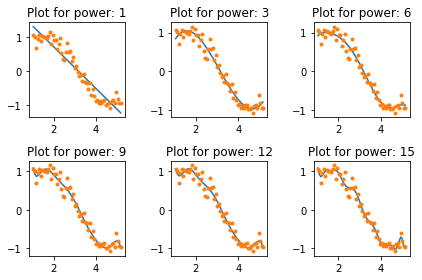
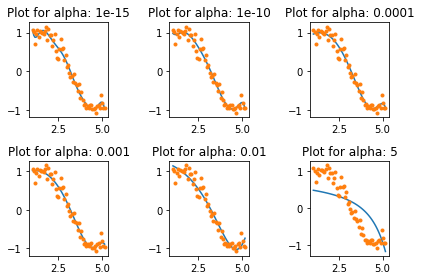
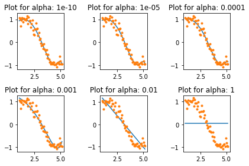

# A feature selection case

We use the [Pima Indians Diabetes dataset from Kaggle](https://www.kaggle.com/uciml/pima-indians-diabetes-database).  
The dataset corresponds to classification tasks on which you need to predict if a person has diabetes based on 8 features.


```python
# Loading the primary modules
import pandas as pd
import numpy as np
```


```python
# Loading the data
dataframe = pd.read_csv("data/diabetes.csv")

# Alternative way
#url = "https://raw.githubusercontent.com/jbrownlee/Datasets/master/pima-indians-diabetes.data.csv"
#names = ['preg', 'plas', 'pres', 'skin', 'test', 'mass', 'pedi', 'age', 'class']
#dataframe = pd.read_csv(url, names=names)
```


```python
dataframe.head(3)
```


<div>
<style>
    .dataframe thead tr:only-child th {
        text-align: right;
    }

    .dataframe thead th {
        text-align: left;
    }

    .dataframe tbody tr th {
        vertical-align: top;
    }
</style>
<table border="1" class="dataframe">
  <thead>
    <tr style="text-align: right;">
      <th></th>
      <th>Pregnancies</th>
      <th>Glucose</th>
      <th>BloodPressure</th>
      <th>SkinThickness</th>
      <th>Insulin</th>
      <th>BMI</th>
      <th>DiabetesPedigreeFunction</th>
      <th>Age</th>
      <th>Outcome</th>
    </tr>
  </thead>
  <tbody>
    <tr>
      <th>0</th>
      <td>6</td>
      <td>148</td>
      <td>72</td>
      <td>35</td>
      <td>0</td>
      <td>33.6</td>
      <td>0.627</td>
      <td>50</td>
      <td>1</td>
    </tr>
    <tr>
      <th>1</th>
      <td>1</td>
      <td>85</td>
      <td>66</td>
      <td>29</td>
      <td>0</td>
      <td>26.6</td>
      <td>0.351</td>
      <td>31</td>
      <td>0</td>
    </tr>
    <tr>
      <th>2</th>
      <td>8</td>
      <td>183</td>
      <td>64</td>
      <td>0</td>
      <td>0</td>
      <td>23.3</td>
      <td>0.672</td>
      <td>32</td>
      <td>1</td>
    </tr>
  </tbody>
</table>
</div>


```python
# Renaming the features, fields or columns AND the response, dependent variable
names = ['preg', 'plas', 'pres', 'skin', 'test', 'mass', 'pedi', 'age', 'class']
dataframe.columns = names
dataframe.head(3)
```


<div>
<style scoped>
    .dataframe tbody tr th:only-of-type {
        vertical-align: middle;
    }

    .dataframe tbody tr th {
        vertical-align: top;
    }

    .dataframe thead th {
        text-align: right;
    }
</style>
<table border="1" class="dataframe">
  <thead>
    <tr style="text-align: right;">
      <th></th>
      <th>preg</th>
      <th>plas</th>
      <th>pres</th>
      <th>skin</th>
      <th>test</th>
      <th>mass</th>
      <th>pedi</th>
      <th>age</th>
      <th>class</th>
    </tr>
  </thead>
  <tbody>
    <tr>
      <th>0</th>
      <td>6</td>
      <td>148</td>
      <td>72</td>
      <td>35</td>
      <td>0</td>
      <td>33.6</td>
      <td>0.627</td>
      <td>50</td>
      <td>1</td>
    </tr>
    <tr>
      <th>1</th>
      <td>1</td>
      <td>85</td>
      <td>66</td>
      <td>29</td>
      <td>0</td>
      <td>26.6</td>
      <td>0.351</td>
      <td>31</td>
      <td>0</td>
    </tr>
    <tr>
      <th>2</th>
      <td>8</td>
      <td>183</td>
      <td>64</td>
      <td>0</td>
      <td>0</td>
      <td>23.3</td>
      <td>0.672</td>
      <td>32</td>
      <td>1</td>
    </tr>
  </tbody>
</table>
</div>


```python
# Keeping the values only
# Converting the DataFrame object to a Numpy ndarray
# to achieve faster computation
array = dataframe.values

# Segregating the data into separate variables
# Features and the labels are separated

# Features, col 0 to 7
X = array[:,0:8]
# Response, col 8
Y = array[:,8]
```

## Filter feature selection techniques

Let's implement a chi-squared statistical test for non-negative features to select 4 of the best features from the dataset; from the scikit-learn module.  

Other "Correlation" techniques: Pearsons' correlation, LDA, and ANOVA.

**A word on the chi-squared test**

The chi-squared test is used to determine whether there is a significant difference between the expected frequencies or proportions or distribution and the observed frequencies or proportions or distribution in one or more categories.  
It is used to compared the variance of categories or samples vs. population.  
It test if each category is mutually exclusive or statistically independent from the other categories.  
If the categories are independent, there are not "correlated".  
The null hypothesis: mutually exclusive or statistically independent. When we reject the null hypothesis, we conclude to statistical dependence or homogeneity.


```python
# Importing the necessary modules
# SelectKBest class can be used with a suite of different statistical tests
# to select a specific number of features
from sklearn.feature_selection import SelectKBest
from sklearn.feature_selection import chi2
```


```python
# Feature extraction
test = SelectKBest(score_func=chi2, k=4)
fit = test.fit(X, Y)
```


```python
# Summarizing scores
np.set_printoptions(precision=3)

print(fit.scores_)
```

    [  111.52   1411.887    17.605    53.108  2175.565   127.669     5.393
       181.304]


```python
# Alternative view
pd.DataFrame({'names': names[0:8], 'scores': fit.scores_})
```


<div>
<style>
    .dataframe thead tr:only-child th {
        text-align: right;
    }

    .dataframe thead th {
        text-align: left;
    }

    .dataframe tbody tr th {
        vertical-align: top;
    }
</style>
<table border="1" class="dataframe">
  <thead>
    <tr style="text-align: right;">
      <th></th>
      <th>names</th>
      <th>scores</th>
    </tr>
  </thead>
  <tbody>
    <tr>
      <th>0</th>
      <td>preg</td>
      <td>111.519691</td>
    </tr>
    <tr>
      <th>1</th>
      <td>plas</td>
      <td>1411.887041</td>
    </tr>
    <tr>
      <th>2</th>
      <td>pres</td>
      <td>17.605373</td>
    </tr>
    <tr>
      <th>3</th>
      <td>skin</td>
      <td>53.108040</td>
    </tr>
    <tr>
      <th>4</th>
      <td>test</td>
      <td>2175.565273</td>
    </tr>
    <tr>
      <th>5</th>
      <td>mass</td>
      <td>127.669343</td>
    </tr>
    <tr>
      <th>6</th>
      <td>pedi</td>
      <td>5.392682</td>
    </tr>
    <tr>
      <th>7</th>
      <td>age</td>
      <td>181.303689</td>
    </tr>
  </tbody>
</table>
</div>


You can see the scores for each attribute and the 4 attributes chosen (those with the highest scores): `plas, test, mass, age`.  
This scores will help you further in determining the best features for training your model.


```python
features = fit.transform(X)

# Summarizing selected features (plas, test, mass, age)
features[0:5,:]
```


    array([[ 148. ,    0. ,   33.6,   50. ],
           [  85. ,    0. ,   26.6,   31. ],
           [ 183. ,    0. ,   23.3,   32. ],
           [  89. ,   94. ,   28.1,   21. ],
           [ 137. ,  168. ,   43.1,   33. ]])


```python
# Alternative view
pd.DataFrame(features[0:5,:], columns=['plas','test','mass','age'])
```


<div>
<style>
    .dataframe thead tr:only-child th {
        text-align: right;
    }

    .dataframe thead th {
        text-align: left;
    }

    .dataframe tbody tr th {
        vertical-align: top;
    }
</style>
<table border="1" class="dataframe">
  <thead>
    <tr style="text-align: right;">
      <th></th>
      <th>plas</th>
      <th>test</th>
      <th>mass</th>
      <th>age</th>
    </tr>
  </thead>
  <tbody>
    <tr>
      <th>0</th>
      <td>148.0</td>
      <td>0.0</td>
      <td>33.6</td>
      <td>50.0</td>
    </tr>
    <tr>
      <th>1</th>
      <td>85.0</td>
      <td>0.0</td>
      <td>26.6</td>
      <td>31.0</td>
    </tr>
    <tr>
      <th>2</th>
      <td>183.0</td>
      <td>0.0</td>
      <td>23.3</td>
      <td>32.0</td>
    </tr>
    <tr>
      <th>3</th>
      <td>89.0</td>
      <td>94.0</td>
      <td>28.1</td>
      <td>21.0</td>
    </tr>
    <tr>
      <th>4</th>
      <td>137.0</td>
      <td>168.0</td>
      <td>43.1</td>
      <td>33.0</td>
    </tr>
  </tbody>
</table>
</div>


```python
# Original dataset
dataframe.head(5)
```


<div>
<style>
    .dataframe thead tr:only-child th {
        text-align: right;
    }

    .dataframe thead th {
        text-align: left;
    }

    .dataframe tbody tr th {
        vertical-align: top;
    }
</style>
<table border="1" class="dataframe">
  <thead>
    <tr style="text-align: right;">
      <th></th>
      <th>preg</th>
      <th>plas</th>
      <th>pres</th>
      <th>skin</th>
      <th>test</th>
      <th>mass</th>
      <th>pedi</th>
      <th>age</th>
      <th>class</th>
    </tr>
  </thead>
  <tbody>
    <tr>
      <th>0</th>
      <td>6</td>
      <td>148</td>
      <td>72</td>
      <td>35</td>
      <td>0</td>
      <td>33.6</td>
      <td>0.627</td>
      <td>50</td>
      <td>1</td>
    </tr>
    <tr>
      <th>1</th>
      <td>1</td>
      <td>85</td>
      <td>66</td>
      <td>29</td>
      <td>0</td>
      <td>26.6</td>
      <td>0.351</td>
      <td>31</td>
      <td>0</td>
    </tr>
    <tr>
      <th>2</th>
      <td>8</td>
      <td>183</td>
      <td>64</td>
      <td>0</td>
      <td>0</td>
      <td>23.3</td>
      <td>0.672</td>
      <td>32</td>
      <td>1</td>
    </tr>
    <tr>
      <th>3</th>
      <td>1</td>
      <td>89</td>
      <td>66</td>
      <td>23</td>
      <td>94</td>
      <td>28.1</td>
      <td>0.167</td>
      <td>21</td>
      <td>0</td>
    </tr>
    <tr>
      <th>4</th>
      <td>0</td>
      <td>137</td>
      <td>40</td>
      <td>35</td>
      <td>168</td>
      <td>43.1</td>
      <td>2.288</td>
      <td>33</td>
      <td>1</td>
    </tr>
  </tbody>
</table>
</div>


### In R

The caret package provides tools to automatically report on the relevance and importance of attributes in your data and even select the most important features.  
Data can contain attributes that are highly correlated with each other.  
Many methods perform better if highly correlated attributes are removed.  
The caret package provides `findCorrelation` which will analyze a correlation matrix of your data’s attributes report on attributes that can be removed.  
Using the Pima Indians Diabetes dataset, let's remove attributes with an absolute correlation of 0.75 or higher.

```r
# Ensuring the results are repeatable
set.seed(7)

# Loading the packages
library(mlbench)
library(caret)

# Loading the data
data(PimaIndiansDiabetes)

# Calculating the correlation matrix
correlationMatrix <- cor(PimaIndiansDiabetes[,1:8])

# Summarizing the correlation matrix
print(correlationMatrix)

# Finding attributes that are highly corrected (ideally >0.75)
highlyCorrelated <- findCorrelation(correlationMatrix, cutoff=0.5)

# Printing the indexes of highly correlated attributes
print(highlyCorrelated)r
```

The importance of features can be estimated from data by building a model.  
Some methods like decision trees have a built-in mechanism to report on variable importance.  
For other algorithms, the importance can be estimated using a ROC curve analysis conducted for each attribute.  
Let's constructs a Learning Vector Quantization (LVQ) model.  

```r
# Ensuring the results are repeatable
set.seed(7)

# Loading the packages
library(mlbench)
library(caret)

# Loading the data
data(PimaIndiansDiabetes)

# Calculating the correlation matrix
correlationMatrix <- cor(PimaIndiansDiabetes[,1:8])

# Summarizing the correlation matrix
print(correlationMatrix)

# Finding attributes that are highly corrected (ideally > 0.75)
highlyCorrelated <- findCorrelation(correlationMatrix, cutoff=0.5)

# Printing indexes of highly correlated attributes
print(highlyCorrelated)
```

## Wrapper feature selection techniques

Let's implement a [Recursive Feature Elimination](http://scikit-learn.org/stable/modules/generated/sklearn.feature_selection.RFE.html#sklearn.feature_selection.RFE) from the scikit-learn module.

Other techniques: Forward Selection, Backward Elimination, and Combination of forward selection and backward elimination.

The Recursive Feature Elimination (or RFE) works by recursively removing attributes and building a model on those attributes that remain.  
It uses the model accuracy to identify which attributes (and a combination of attributes) contribute the most to predicting the target attribute.  
You use RFE with the Logistic Regression classifier to select the top 3 features.  
The choice of algorithms does not matter too much as long as it is consistent.


```python
# Importing your necessary modules
from sklearn.feature_selection import RFE
from sklearn.linear_model import LogisticRegression
```


```python
# Feature extraction
model = LogisticRegression()
rfe = RFE(model, 3)
fit = rfe.fit(X, Y)

# Summarizing the selection of the attributes
print("Num Features: %s" % (fit.n_features_))
print("Selected Features: %s" % (fit.support_))
print("Feature Ranking: %s" % (fit.ranking_))
```

    Num Features: 3
    Selected Features: [ True False False False False  True  True False]
    Feature Ranking: [1 2 3 5 6 1 1 4]


    /home/ugo/miniconda3/lib/python3.6/site-packages/sklearn/linear_model/logistic.py:432: FutureWarning: Default solver will be changed to 'lbfgs' in 0.22. Specify a solver to silence this warning.
      FutureWarning)
    /home/ugo/miniconda3/lib/python3.6/site-packages/sklearn/linear_model/logistic.py:432: FutureWarning: Default solver will be changed to 'lbfgs' in 0.22. Specify a solver to silence this warning.
      FutureWarning)
    /home/ugo/miniconda3/lib/python3.6/site-packages/sklearn/linear_model/logistic.py:432: FutureWarning: Default solver will be changed to 'lbfgs' in 0.22. Specify a solver to silence this warning.
      FutureWarning)
    /home/ugo/miniconda3/lib/python3.6/site-packages/sklearn/linear_model/logistic.py:432: FutureWarning: Default solver will be changed to 'lbfgs' in 0.22. Specify a solver to silence this warning.
      FutureWarning)
    /home/ugo/miniconda3/lib/python3.6/site-packages/sklearn/linear_model/logistic.py:432: FutureWarning: Default solver will be changed to 'lbfgs' in 0.22. Specify a solver to silence this warning.
      FutureWarning)
    /home/ugo/miniconda3/lib/python3.6/site-packages/sklearn/linear_model/logistic.py:432: FutureWarning: Default solver will be changed to 'lbfgs' in 0.22. Specify a solver to silence this warning.
      FutureWarning)


```python
# Alternative view
pd.DataFrame({'names': names[0:8], 'selected': fit.support_, 'ranking': fit.ranking_})
```


<div>
<style scoped>
    .dataframe tbody tr th:only-of-type {
        vertical-align: middle;
    }

    .dataframe tbody tr th {
        vertical-align: top;
    }

    .dataframe thead th {
        text-align: right;
    }
</style>
<table border="1" class="dataframe">
  <thead>
    <tr style="text-align: right;">
      <th></th>
      <th>names</th>
      <th>ranking</th>
      <th>selected</th>
    </tr>
  </thead>
  <tbody>
    <tr>
      <th>0</th>
      <td>preg</td>
      <td>1</td>
      <td>True</td>
    </tr>
    <tr>
      <th>1</th>
      <td>plas</td>
      <td>2</td>
      <td>False</td>
    </tr>
    <tr>
      <th>2</th>
      <td>pres</td>
      <td>3</td>
      <td>False</td>
    </tr>
    <tr>
      <th>3</th>
      <td>skin</td>
      <td>5</td>
      <td>False</td>
    </tr>
    <tr>
      <th>4</th>
      <td>test</td>
      <td>6</td>
      <td>False</td>
    </tr>
    <tr>
      <th>5</th>
      <td>mass</td>
      <td>1</td>
      <td>True</td>
    </tr>
    <tr>
      <th>6</th>
      <td>pedi</td>
      <td>1</td>
      <td>True</td>
    </tr>
    <tr>
      <th>7</th>
      <td>age</td>
      <td>4</td>
      <td>False</td>
    </tr>
  </tbody>
</table>
</div>


You can see that RFE chose the top 3 features as `preg, mass, pedi`.  
These are marked True in the support array and marked with a choice “1” in the ranking array.

You can also use RFE with the Bagged decision trees like Random Forest and Extra Trees to estimate the importance of features.


```python
# Feature extraction
model = ExtraTreesClassifier()
fit = model.fit(X, Y)

# Summarizing the selection of the attributes
print(fit.feature_importances_)
```

    [0.10490793 0.20041541 0.0958495  0.08070628 0.0849718  0.15844774
     0.12226854 0.15243279]


    /home/ugo/miniconda3/lib/python3.6/site-packages/sklearn/ensemble/forest.py:248: FutureWarning: The default value of n_estimators will change from 10 in version 0.20 to 100 in 0.22.
      "10 in version 0.20 to 100 in 0.22.", FutureWarning)


```python
print("Num Features: %s" % (fit.n_features_))
print("Features Importance: %s" % fit.feature_importances_)
```

    Num Features: 8
    Features Importance: [0.10490793 0.20041541 0.0958495  0.08070628 0.0849718  0.15844774
     0.12226854 0.15243279]


```python
# Alternative view
pd.DataFrame({'names': names[0:8], 'importance': fit.feature_importances_}).\
    sort_values(by='importance', ascending=False)
```


<div>
<style scoped>
    .dataframe tbody tr th:only-of-type {
        vertical-align: middle;
    }

    .dataframe tbody tr th {
        vertical-align: top;
    }

    .dataframe thead th {
        text-align: right;
    }
</style>
<table border="1" class="dataframe">
  <thead>
    <tr style="text-align: right;">
      <th></th>
      <th>importance</th>
      <th>names</th>
    </tr>
  </thead>
  <tbody>
    <tr>
      <th>1</th>
      <td>0.200415</td>
      <td>plas</td>
    </tr>
    <tr>
      <th>5</th>
      <td>0.158448</td>
      <td>mass</td>
    </tr>
    <tr>
      <th>7</th>
      <td>0.152433</td>
      <td>age</td>
    </tr>
    <tr>
      <th>6</th>
      <td>0.122269</td>
      <td>pedi</td>
    </tr>
    <tr>
      <th>0</th>
      <td>0.104908</td>
      <td>preg</td>
    </tr>
    <tr>
      <th>2</th>
      <td>0.095849</td>
      <td>pres</td>
    </tr>
    <tr>
      <th>4</th>
      <td>0.084972</td>
      <td>test</td>
    </tr>
    <tr>
      <th>3</th>
      <td>0.080706</td>
      <td>skin</td>
    </tr>
  </tbody>
</table>
</div>


### Another dataset, another example

Let's tackle another example using the built-in iris dataset, reusing the Logistic Regression and the Extra Tree Ensemble.


```python
# Importing your necessary modules
from sklearn.feature_selection import RFE
from sklearn.linear_model import LogisticRegression
```


```python
# Loading the iris datasets
from sklearn import datasets
dataset = datasets.load_iris()
names = ['sepal length','sepal width','petal length','petal width']
dataset_df = pd.DataFrame(dataset.data, columns=names)
dataset_df.head(3)
```


<div>
<style scoped>
    .dataframe tbody tr th:only-of-type {
        vertical-align: middle;
    }

    .dataframe tbody tr th {
        vertical-align: top;
    }

    .dataframe thead th {
        text-align: right;
    }
</style>
<table border="1" class="dataframe">
  <thead>
    <tr style="text-align: right;">
      <th></th>
      <th>sepal length</th>
      <th>sepal width</th>
      <th>petal length</th>
      <th>petal width</th>
    </tr>
  </thead>
  <tbody>
    <tr>
      <th>0</th>
      <td>5.1</td>
      <td>3.5</td>
      <td>1.4</td>
      <td>0.2</td>
    </tr>
    <tr>
      <th>1</th>
      <td>4.9</td>
      <td>3.0</td>
      <td>1.4</td>
      <td>0.2</td>
    </tr>
    <tr>
      <th>2</th>
      <td>4.7</td>
      <td>3.2</td>
      <td>1.3</td>
      <td>0.2</td>
    </tr>
  </tbody>
</table>
</div>


```python
# Creating a base classifier used to evaluate a subset of attributes
model = LogisticRegression()

# Creating the RFE model and select 3 attributes
rfe = RFE(model, 3)
fit = rfe.fit(dataset.data, dataset.target)
```

    /home/ugo/miniconda3/lib/python3.6/site-packages/sklearn/linear_model/logistic.py:432: FutureWarning: Default solver will be changed to 'lbfgs' in 0.22. Specify a solver to silence this warning.
      FutureWarning)
    /home/ugo/miniconda3/lib/python3.6/site-packages/sklearn/linear_model/logistic.py:459: FutureWarning: Default multi_class will be changed to 'auto' in 0.22. Specify the multi_class option to silence this warning.
      "this warning.", FutureWarning)
    /home/ugo/miniconda3/lib/python3.6/site-packages/sklearn/linear_model/logistic.py:432: FutureWarning: Default solver will be changed to 'lbfgs' in 0.22. Specify a solver to silence this warning.
      FutureWarning)
    /home/ugo/miniconda3/lib/python3.6/site-packages/sklearn/linear_model/logistic.py:459: FutureWarning: Default multi_class will be changed to 'auto' in 0.22. Specify the multi_class option to silence this warning.
      "this warning.", FutureWarning)


```python
print("Num Features: %s" % (fit.n_features_))
print("Selected Features: %s" % (fit.support_))
print("Feature Ranking: %s" % (fit.ranking_))
```

    Num Features: 3
    Selected Features: [False  True  True  True]
    Feature Ranking: [2 1 1 1]


```python
# Alternative view
pd.DataFrame({'names': names, 'selected': fit.support_, 'ranking': fit.ranking_})
```


<div>
<style scoped>
    .dataframe tbody tr th:only-of-type {
        vertical-align: middle;
    }

    .dataframe tbody tr th {
        vertical-align: top;
    }

    .dataframe thead th {
        text-align: right;
    }
</style>
<table border="1" class="dataframe">
  <thead>
    <tr style="text-align: right;">
      <th></th>
      <th>names</th>
      <th>ranking</th>
      <th>selected</th>
    </tr>
  </thead>
  <tbody>
    <tr>
      <th>0</th>
      <td>sepal length</td>
      <td>2</td>
      <td>False</td>
    </tr>
    <tr>
      <th>1</th>
      <td>sepal width</td>
      <td>1</td>
      <td>True</td>
    </tr>
    <tr>
      <th>2</th>
      <td>petal length</td>
      <td>1</td>
      <td>True</td>
    </tr>
    <tr>
      <th>3</th>
      <td>petal width</td>
      <td>1</td>
      <td>True</td>
    </tr>
  </tbody>
</table>
</div>


Keep top-ranking features (rank 1) and leave out the other features (rank 2).


```python
# Importing your necessary modules
from sklearn import metrics
from sklearn.ensemble import ExtraTreesClassifier
```


```python
# Creating a base classifier
rfe = ExtraTreesClassifier()

# Creating the RFE model and select 3 attributes
rfe.fit(dataset.data, dataset.target)
fit = rfe.fit(dataset.data, dataset.target)
```

    [0.08470961 0.02095061 0.37336503 0.52097475]


    /home/ugo/miniconda3/lib/python3.6/site-packages/sklearn/ensemble/forest.py:248: FutureWarning: The default value of n_estimators will change from 10 in version 0.20 to 100 in 0.22.
      "10 in version 0.20 to 100 in 0.22.", FutureWarning)


```python
print("Num Features: %s" % (fit.n_features_))
print("Features Importance: %s" % rfe.feature_importances_)
```

    Num Features: 4
    Features Importance: [0.08470961 0.02095061 0.37336503 0.52097475]


```python
# Alternative view
pd.DataFrame({'names': names, 'importance': rfe.feature_importances_}).\
    sort_values(by='importance', ascending=False)
```


<div>
<style scoped>
    .dataframe tbody tr th:only-of-type {
        vertical-align: middle;
    }

    .dataframe tbody tr th {
        vertical-align: top;
    }

    .dataframe thead th {
        text-align: right;
    }
</style>
<table border="1" class="dataframe">
  <thead>
    <tr style="text-align: right;">
      <th></th>
      <th>importance</th>
      <th>names</th>
    </tr>
  </thead>
  <tbody>
    <tr>
      <th>3</th>
      <td>0.520975</td>
      <td>petal width</td>
    </tr>
    <tr>
      <th>2</th>
      <td>0.373365</td>
      <td>petal length</td>
    </tr>
    <tr>
      <th>0</th>
      <td>0.084710</td>
      <td>sepal length</td>
    </tr>
    <tr>
      <th>1</th>
      <td>0.020951</td>
      <td>sepal width</td>
    </tr>
  </tbody>
</table>
</div>


The last results confirm the previous results.

### In R

Recursive Feature Elimination or RFE.

```r
# Ensuring the results are repeatable
set.seed(7)

# Loading the packages
library(mlbench)
library(caret)

# Loading the data
data(PimaIndiansDiabetes)

# Defining the control using a random forest selection function
control <- rfeControl(functions=rfFuncs, method="cv", number=10)

# Running the RFE algorithm
results <- rfe(PimaIndiansDiabetes[,1:8], PimaIndiansDiabetes[,9], sizes=c(1:8), rfeControl=control)

# Summarize the results
print(results)

# Listing the chosen features
predictors(results)

# Plotting the results
plot(results, type=c("g", "o"))
```

## Embedded feature selection techniques

Let's use the [Ridge regression](http://scikit-learn.org/stable/modules/generated/sklearn.linear_model.Ridge.html) from the scikit-learn module; a regularization technique as well.

Other techniques: LASSO and Elastic Net.

Find out more about [regularization techniques](https://www.analyticsvidhya.com/blog/2016/01/complete-tutorial-ridge-lasso-regression-python/#thre).


```python
# Importing your necessary module
from sklearn.linear_model import Ridge
```


```python
# Using Ridge regression to determine the R-squared
ridge = Ridge(alpha=1.0)
ridge.fit(X,Y)
```


    Ridge(alpha=1.0, copy_X=True, fit_intercept=True, max_iter=None,
       normalize=False, random_state=None, solver='auto', tol=0.001)


In order to better understand the results of Ridge regression, you will implement a little helper function that will help you to print the results in a better so that you can interpret them easily.


```python
# Implementing a function for pretty-printing the coefficients
def pretty_print_coefs(coefs, names = None, sort = False):
    if names == None:
        names = ["X%s" % x for x in range(len(coefs))]
    lst = zip(coefs, names)
    if sort:
        lst = sorted(lst,  key = lambda x:-np.abs(x[0]))
    return " + ".join("%s * %s" % (round(coef, 3), name)
                                   for coef, name in lst)
```


```python
# Applying the function
print("Ridge model:", pretty_print_coefs(ridge.coef_))
print('')
# Applying the function with the names
print("Ridge model:", pretty_print_coefs(ridge.coef_, names))
```

    Ridge model: 0.021 * X0 + 0.006 * X1 + -0.002 * X2 + 0.0 * X3 + -0.0 * X4 + 0.013 * X5 + 0.145 * X6 + 0.003 * X7
    
    Ridge model: 0.021 * preg + 0.006 * plas + -0.002 * pres + 0.0 * skin + -0.0 * test + 0.013 * mass + 0.145 * pedi + 0.003 * age


```python
# Applying the function with the names and sorting the results
print("Ridge model:", pretty_print_coefs(ridge.coef_, names, True))
```

    Ridge model: 0.145 * pedi + 0.021 * preg + 0.013 * mass + 0.006 * plas + 0.003 * age + -0.002 * pres + -0.0 * test + 0.0 * skin


You can spot all the coefficient terms appended with the feature variables.  
You can pick the most essential features.  
The sorted top 3 features are `pedi, preg, mass`.  

**A word on the Ridge regression**

- It is also known as L2-Regularization.
- For correlated features, it means that they tend to get similar coefficients.
- Feature having negative coefficients don't contribute that much. But in a more complex scenario where you are dealing with lots of features, then this score will definitely help you in the ultimate feature selection decision-making process.

## Takeway

The three techniques help to understand the features of a particular dataset in a comprehensive manner.  
Feature selection is essentially a part of **data preprocessing** which is considered to be the most time-consuming part of any machine learning pipeline.  
These techniques will help you to approach it in a more systematic way and machine learning friendly way.  
You will be able to interpret the features more accurately.

# Why Penalize the Magnitude of Coefficients?

Given a sine curve (between 60° and 300°) and some random noise using the following code:


```python
# Importing modules
import numpy as np
import pandas as pd
import random
import matplotlib.pyplot as plt
%matplotlib inline
from matplotlib.pylab import rcParams
rcParams['figure.figsize'] = 12, 10
```


```python
# Defining input array with angles
# from 60deg to 300deg converted to radians
x = np.array([i*np.pi/180 for i in range(60,300,4)])

# Setting seed for reproducability
np.random.seed(10)
y = np.sin(x) + np.random.normal(0,0.15,len(x))

data = pd.DataFrame(np.column_stack([x,y]),columns=['x','y'])

plt.plot(data['x'],data['y'],'.');
```


Let's try to estimate the sine function using polynomial regression with powers of x form 1 to 15.  
Let's add a column for each power up to 15.


```python
# Power of 1 is already there
for i in range(2,16):  
    colname = 'x_%d'%i # new var will be x_power
    data[colname] = data['x']**i
data.head()
```


<div>
<style scoped>
    .dataframe tbody tr th:only-of-type {
        vertical-align: middle;
    }

    .dataframe tbody tr th {
        vertical-align: top;
    }

    .dataframe thead th {
        text-align: right;
    }
</style>
<table border="1" class="dataframe">
  <thead>
    <tr style="text-align: right;">
      <th></th>
      <th>x</th>
      <th>y</th>
      <th>x_2</th>
      <th>x_3</th>
      <th>x_4</th>
      <th>x_5</th>
      <th>x_6</th>
      <th>x_7</th>
      <th>x_8</th>
      <th>x_9</th>
      <th>x_10</th>
      <th>x_11</th>
      <th>x_12</th>
      <th>x_13</th>
      <th>x_14</th>
      <th>x_15</th>
    </tr>
  </thead>
  <tbody>
    <tr>
      <th>0</th>
      <td>1.047198</td>
      <td>1.065763</td>
      <td>1.096623</td>
      <td>1.148381</td>
      <td>1.202581</td>
      <td>1.259340</td>
      <td>1.318778</td>
      <td>1.381021</td>
      <td>1.446202</td>
      <td>1.514459</td>
      <td>1.585938</td>
      <td>1.660790</td>
      <td>1.739176</td>
      <td>1.821260</td>
      <td>1.907219</td>
      <td>1.997235</td>
    </tr>
    <tr>
      <th>1</th>
      <td>1.117011</td>
      <td>1.006086</td>
      <td>1.247713</td>
      <td>1.393709</td>
      <td>1.556788</td>
      <td>1.738948</td>
      <td>1.942424</td>
      <td>2.169709</td>
      <td>2.423588</td>
      <td>2.707173</td>
      <td>3.023942</td>
      <td>3.377775</td>
      <td>3.773011</td>
      <td>4.214494</td>
      <td>4.707635</td>
      <td>5.258479</td>
    </tr>
    <tr>
      <th>2</th>
      <td>1.186824</td>
      <td>0.695374</td>
      <td>1.408551</td>
      <td>1.671702</td>
      <td>1.984016</td>
      <td>2.354677</td>
      <td>2.794587</td>
      <td>3.316683</td>
      <td>3.936319</td>
      <td>4.671717</td>
      <td>5.544505</td>
      <td>6.580351</td>
      <td>7.809718</td>
      <td>9.268760</td>
      <td>11.000386</td>
      <td>13.055521</td>
    </tr>
    <tr>
      <th>3</th>
      <td>1.256637</td>
      <td>0.949799</td>
      <td>1.579137</td>
      <td>1.984402</td>
      <td>2.493673</td>
      <td>3.133642</td>
      <td>3.937850</td>
      <td>4.948448</td>
      <td>6.218404</td>
      <td>7.814277</td>
      <td>9.819710</td>
      <td>12.339811</td>
      <td>15.506664</td>
      <td>19.486248</td>
      <td>24.487142</td>
      <td>30.771450</td>
    </tr>
    <tr>
      <th>4</th>
      <td>1.326450</td>
      <td>1.063496</td>
      <td>1.759470</td>
      <td>2.333850</td>
      <td>3.095735</td>
      <td>4.106339</td>
      <td>5.446854</td>
      <td>7.224981</td>
      <td>9.583578</td>
      <td>12.712139</td>
      <td>16.862020</td>
      <td>22.366630</td>
      <td>29.668222</td>
      <td>39.353420</td>
      <td>52.200353</td>
      <td>69.241170</td>
    </tr>
  </tbody>
</table>
</div>


Now that we have all the 15 powers, let's make 15 different linear regression models with each model containing variables with powers of x from 1 to the particular model number.  
For example, the feature set of model 8 will be {x, x_2, x_3, ... , x_8}.


```python
# Importing the Linear Regression model from scikit-learn
from sklearn.linear_model import LinearRegression
```


```python
def linear_regression(data, power, models_to_plot):
    #initialize predictors:
    predictors=['x']
    if power>=2:
        predictors.extend(['x_%d'%i for i in range(2,power+1)])
    
    # Fitting the model
    linreg = LinearRegression(normalize=True)
    linreg.fit(data[predictors],data['y'])
    y_pred = linreg.predict(data[predictors])
    
    # Checking if a plot is to be made for the entered power
    if power in models_to_plot:
        plt.subplot(models_to_plot[power])
        plt.tight_layout()
        plt.plot(data['x'],y_pred)
        plt.plot(data['x'],data['y'],'.')
        plt.title('Plot for power: %d'%power)
    
    # Returning the result in pre-defined format
    rss = sum((y_pred-data['y'])**2)
    ret = [rss]
    ret.extend([linreg.intercept_])
    ret.extend(linreg.coef_)
    return ret
```

Now, we can make all 15 models and compare the results.


```python
# Initializing a DataFrame to store the results
col = ['rss','intercept'] + ['coef_x_%d'%i for i in range(1,16)]
ind = ['model_pow_%d'%i for i in range(1,16)]
coef_matrix_simple = pd.DataFrame(index=ind, columns=col)
```


```python
# Defining the powers for which a plot is required
models_to_plot = {1:231,3:232,6:233,9:234,12:235,15:236}
```


```python
# Iterating through all powers and assimilate results
for i in range(1,16):
    coef_matrix_simple.iloc[i-1,0:i+2] = linear_regression(data, power=i, models_to_plot=models_to_plot)
```





As the model complexity increases, the models tend to fit even smaller deviations in the training data set.  

This leads to overfitting.


```python
# Displaying the analysis
pd.options.display.float_format = '{:,.2g}'.format
coef_matrix_simple
```


<div>
<style scoped>
    .dataframe tbody tr th:only-of-type {
        vertical-align: middle;
    }

    .dataframe tbody tr th {
        vertical-align: top;
    }

    .dataframe thead th {
        text-align: right;
    }
</style>
<table border="1" class="dataframe">
  <thead>
    <tr style="text-align: right;">
      <th></th>
      <th>rss</th>
      <th>intercept</th>
      <th>coef_x_1</th>
      <th>coef_x_2</th>
      <th>coef_x_3</th>
      <th>coef_x_4</th>
      <th>coef_x_5</th>
      <th>coef_x_6</th>
      <th>coef_x_7</th>
      <th>coef_x_8</th>
      <th>coef_x_9</th>
      <th>coef_x_10</th>
      <th>coef_x_11</th>
      <th>coef_x_12</th>
      <th>coef_x_13</th>
      <th>coef_x_14</th>
      <th>coef_x_15</th>
    </tr>
  </thead>
  <tbody>
    <tr>
      <th>model_pow_1</th>
      <td>3.3</td>
      <td>2</td>
      <td>-0.62</td>
      <td>NaN</td>
      <td>NaN</td>
      <td>NaN</td>
      <td>NaN</td>
      <td>NaN</td>
      <td>NaN</td>
      <td>NaN</td>
      <td>NaN</td>
      <td>NaN</td>
      <td>NaN</td>
      <td>NaN</td>
      <td>NaN</td>
      <td>NaN</td>
      <td>NaN</td>
    </tr>
    <tr>
      <th>model_pow_2</th>
      <td>3.3</td>
      <td>1.9</td>
      <td>-0.58</td>
      <td>-0.006</td>
      <td>NaN</td>
      <td>NaN</td>
      <td>NaN</td>
      <td>NaN</td>
      <td>NaN</td>
      <td>NaN</td>
      <td>NaN</td>
      <td>NaN</td>
      <td>NaN</td>
      <td>NaN</td>
      <td>NaN</td>
      <td>NaN</td>
      <td>NaN</td>
    </tr>
    <tr>
      <th>model_pow_3</th>
      <td>1.1</td>
      <td>-1.1</td>
      <td>3</td>
      <td>-1.3</td>
      <td>0.14</td>
      <td>NaN</td>
      <td>NaN</td>
      <td>NaN</td>
      <td>NaN</td>
      <td>NaN</td>
      <td>NaN</td>
      <td>NaN</td>
      <td>NaN</td>
      <td>NaN</td>
      <td>NaN</td>
      <td>NaN</td>
      <td>NaN</td>
    </tr>
    <tr>
      <th>model_pow_4</th>
      <td>1.1</td>
      <td>-0.27</td>
      <td>1.7</td>
      <td>-0.53</td>
      <td>-0.036</td>
      <td>0.014</td>
      <td>NaN</td>
      <td>NaN</td>
      <td>NaN</td>
      <td>NaN</td>
      <td>NaN</td>
      <td>NaN</td>
      <td>NaN</td>
      <td>NaN</td>
      <td>NaN</td>
      <td>NaN</td>
      <td>NaN</td>
    </tr>
    <tr>
      <th>model_pow_5</th>
      <td>1</td>
      <td>3</td>
      <td>-5.1</td>
      <td>4.7</td>
      <td>-1.9</td>
      <td>0.33</td>
      <td>-0.021</td>
      <td>NaN</td>
      <td>NaN</td>
      <td>NaN</td>
      <td>NaN</td>
      <td>NaN</td>
      <td>NaN</td>
      <td>NaN</td>
      <td>NaN</td>
      <td>NaN</td>
      <td>NaN</td>
    </tr>
    <tr>
      <th>model_pow_6</th>
      <td>0.99</td>
      <td>-2.8</td>
      <td>9.5</td>
      <td>-9.7</td>
      <td>5.2</td>
      <td>-1.6</td>
      <td>0.23</td>
      <td>-0.014</td>
      <td>NaN</td>
      <td>NaN</td>
      <td>NaN</td>
      <td>NaN</td>
      <td>NaN</td>
      <td>NaN</td>
      <td>NaN</td>
      <td>NaN</td>
      <td>NaN</td>
    </tr>
    <tr>
      <th>model_pow_7</th>
      <td>0.93</td>
      <td>19</td>
      <td>-56</td>
      <td>69</td>
      <td>-45</td>
      <td>17</td>
      <td>-3.5</td>
      <td>0.4</td>
      <td>-0.019</td>
      <td>NaN</td>
      <td>NaN</td>
      <td>NaN</td>
      <td>NaN</td>
      <td>NaN</td>
      <td>NaN</td>
      <td>NaN</td>
      <td>NaN</td>
    </tr>
    <tr>
      <th>model_pow_8</th>
      <td>0.92</td>
      <td>43</td>
      <td>-1.4e+02</td>
      <td>1.8e+02</td>
      <td>-1.3e+02</td>
      <td>58</td>
      <td>-15</td>
      <td>2.4</td>
      <td>-0.21</td>
      <td>0.0077</td>
      <td>NaN</td>
      <td>NaN</td>
      <td>NaN</td>
      <td>NaN</td>
      <td>NaN</td>
      <td>NaN</td>
      <td>NaN</td>
    </tr>
    <tr>
      <th>model_pow_9</th>
      <td>0.87</td>
      <td>1.7e+02</td>
      <td>-6.1e+02</td>
      <td>9.6e+02</td>
      <td>-8.5e+02</td>
      <td>4.6e+02</td>
      <td>-1.6e+02</td>
      <td>37</td>
      <td>-5.2</td>
      <td>0.42</td>
      <td>-0.015</td>
      <td>NaN</td>
      <td>NaN</td>
      <td>NaN</td>
      <td>NaN</td>
      <td>NaN</td>
      <td>NaN</td>
    </tr>
    <tr>
      <th>model_pow_10</th>
      <td>0.87</td>
      <td>1.4e+02</td>
      <td>-4.9e+02</td>
      <td>7.3e+02</td>
      <td>-6e+02</td>
      <td>2.9e+02</td>
      <td>-87</td>
      <td>15</td>
      <td>-0.81</td>
      <td>-0.14</td>
      <td>0.026</td>
      <td>-0.0013</td>
      <td>NaN</td>
      <td>NaN</td>
      <td>NaN</td>
      <td>NaN</td>
      <td>NaN</td>
    </tr>
    <tr>
      <th>model_pow_11</th>
      <td>0.87</td>
      <td>-75</td>
      <td>5.1e+02</td>
      <td>-1.3e+03</td>
      <td>1.9e+03</td>
      <td>-1.6e+03</td>
      <td>9.1e+02</td>
      <td>-3.5e+02</td>
      <td>91</td>
      <td>-16</td>
      <td>1.8</td>
      <td>-0.12</td>
      <td>0.0034</td>
      <td>NaN</td>
      <td>NaN</td>
      <td>NaN</td>
      <td>NaN</td>
    </tr>
    <tr>
      <th>model_pow_12</th>
      <td>0.87</td>
      <td>-3.4e+02</td>
      <td>1.9e+03</td>
      <td>-4.4e+03</td>
      <td>6e+03</td>
      <td>-5.2e+03</td>
      <td>3.1e+03</td>
      <td>-1.3e+03</td>
      <td>3.8e+02</td>
      <td>-80</td>
      <td>12</td>
      <td>-1.1</td>
      <td>0.062</td>
      <td>-0.0016</td>
      <td>NaN</td>
      <td>NaN</td>
      <td>NaN</td>
    </tr>
    <tr>
      <th>model_pow_13</th>
      <td>0.86</td>
      <td>3.2e+03</td>
      <td>-1.8e+04</td>
      <td>4.5e+04</td>
      <td>-6.7e+04</td>
      <td>6.6e+04</td>
      <td>-4.6e+04</td>
      <td>2.3e+04</td>
      <td>-8.5e+03</td>
      <td>2.3e+03</td>
      <td>-4.5e+02</td>
      <td>62</td>
      <td>-5.7</td>
      <td>0.31</td>
      <td>-0.0078</td>
      <td>NaN</td>
      <td>NaN</td>
    </tr>
    <tr>
      <th>model_pow_14</th>
      <td>0.79</td>
      <td>2.4e+04</td>
      <td>-1.4e+05</td>
      <td>3.8e+05</td>
      <td>-6.1e+05</td>
      <td>6.6e+05</td>
      <td>-5e+05</td>
      <td>2.8e+05</td>
      <td>-1.2e+05</td>
      <td>3.7e+04</td>
      <td>-8.5e+03</td>
      <td>1.5e+03</td>
      <td>-1.8e+02</td>
      <td>15</td>
      <td>-0.73</td>
      <td>0.017</td>
      <td>NaN</td>
    </tr>
    <tr>
      <th>model_pow_15</th>
      <td>0.7</td>
      <td>-3.6e+04</td>
      <td>2.4e+05</td>
      <td>-7.5e+05</td>
      <td>1.4e+06</td>
      <td>-1.7e+06</td>
      <td>1.5e+06</td>
      <td>-1e+06</td>
      <td>5e+05</td>
      <td>-1.9e+05</td>
      <td>5.4e+04</td>
      <td>-1.2e+04</td>
      <td>1.9e+03</td>
      <td>-2.2e+02</td>
      <td>17</td>
      <td>-0.81</td>
      <td>0.018</td>
    </tr>
  </tbody>
</table>
</div>


It is clearly evident that the size of coefficients increase exponentially with increase in model complexity.  
It means that we're putting a lot of emphasis on that feature, i.e. the particular feature is a good predictor for the outcome.  
When it becomes too large, the algorithm starts modelling intricate relations to estimate the output and ends up overfitting to the particular training data.

## Ridge regression

A ridge regression performs L2 regularization', i.e. it adds a factor of sum of squares of coefficients in the optimization objective.

**Objective = RSS + alpha * (sum of square of coefficients)**

The alpha parameter balances the amount of emphasis given to minimizing RSS vs minimizing sum of square of coefficients.

- alpha = 0, a simple linear regression;
- alpha = infinite, infinite weight on square of coefficients, anything less than zero will make the objective infinite; all coefficients zero;
- 0 < alpha < infinite, somewhere between 0 and 1 for simple linear regression.

One thing is for sure that any non-zero value would give values less than that of simple linear regression.


```python
# Importing the Ridge Regression model from scikit-learn
from sklearn.linear_model import Ridge
```


```python
def ridge_regression(data, predictors, alpha, models_to_plot={}):
    # Fitting the model
    ridgereg = Ridge(alpha=alpha,normalize=True)
    ridgereg.fit(data[predictors],data['y'])
    y_pred = ridgereg.predict(data[predictors])
    
    # Checking if a plot is to be made for the entered alpha
    if alpha in models_to_plot:
        plt.subplot(models_to_plot[alpha])
        plt.tight_layout()
        plt.plot(data['x'],y_pred)
        plt.plot(data['x'],data['y'],'.')
        plt.title('Plot for alpha: %.3g'%alpha)
    
    # Returning the result in pre-defined format
    rss = sum((y_pred-data['y'])**2)
    ret = [rss]
    ret.extend([ridgereg.intercept_])
    ret.extend(ridgereg.coef_)
    return ret
```

Let's analyze the result of Ridge regression for 10 different values of alpha ranging from 1e-15 to 20.  
Each of these 10 models will contain all the 15 variables and only the value of alpha would differ.  
This is different from the simple linear regression case where each model had a subset of features.


```python
# Initializing predictors to be set of 15 powers of x
predictors=['x']
predictors.extend(['x_%d'%i for i in range(2,16)])

# Setting the different values of alpha to be tested
alpha_ridge = [1e-15, 1e-10, 1e-8, 1e-4, 1e-3,1e-2, 1, 5, 10, 20]

# Initializing the dataframe for storing coefficients.
col = ['rss','intercept'] + ['coef_x_%d'%i for i in range(1,16)]
ind = ['alpha_%.2g'%alpha_ridge[i] for i in range(0,10)]
coef_matrix_ridge = pd.DataFrame(index=ind, columns=col)

models_to_plot = {1e-15:231, 1e-10:232, 1e-4:233, 1e-3:234, 1e-2:235, 5:236}
for i in range(10):
    coef_matrix_ridge.iloc[i,] = ridge_regression(data, predictors, alpha_ridge[i], models_to_plot)
```

    /home/ugo/miniconda3/lib/python3.6/site-packages/sklearn/linear_model/ridge.py:125: LinAlgWarning: scipy.linalg.solve
    Ill-conditioned matrix detected. Result is not guaranteed to be accurate.
    Reciprocal condition number4.572933e-17
      overwrite_a=True).T





As the value of alpha increases, the model complexity reduces.  
Though higher values of alpha reduce overfitting, significantly high values can cause underfitting as well (alpha = 5, for example).  
Thus alpha should be chosen wisely.  
A widely accept technique is cross-validation, i.e. the value of alpha is iterated over a range of values and the one giving higher cross-validation score is chosen.


```python
# Displaying the analysis
pd.options.display.float_format = '{:,.2g}'.format
coef_matrix_ridge
```


<div>
<style scoped>
    .dataframe tbody tr th:only-of-type {
        vertical-align: middle;
    }

    .dataframe tbody tr th {
        vertical-align: top;
    }

    .dataframe thead th {
        text-align: right;
    }
</style>
<table border="1" class="dataframe">
  <thead>
    <tr style="text-align: right;">
      <th></th>
      <th>rss</th>
      <th>intercept</th>
      <th>coef_x_1</th>
      <th>coef_x_2</th>
      <th>coef_x_3</th>
      <th>coef_x_4</th>
      <th>coef_x_5</th>
      <th>coef_x_6</th>
      <th>coef_x_7</th>
      <th>coef_x_8</th>
      <th>coef_x_9</th>
      <th>coef_x_10</th>
      <th>coef_x_11</th>
      <th>coef_x_12</th>
      <th>coef_x_13</th>
      <th>coef_x_14</th>
      <th>coef_x_15</th>
    </tr>
  </thead>
  <tbody>
    <tr>
      <th>alpha_1e-15</th>
      <td>0.87</td>
      <td>94</td>
      <td>-3e+02</td>
      <td>3.7e+02</td>
      <td>-2.3e+02</td>
      <td>61</td>
      <td>2.6</td>
      <td>-5.1</td>
      <td>0.62</td>
      <td>0.17</td>
      <td>-0.03</td>
      <td>-0.0052</td>
      <td>0.001</td>
      <td>0.00017</td>
      <td>-4.6e-05</td>
      <td>3.1e-06</td>
      <td>-3.8e-08</td>
    </tr>
    <tr>
      <th>alpha_1e-10</th>
      <td>0.92</td>
      <td>11</td>
      <td>-29</td>
      <td>31</td>
      <td>-15</td>
      <td>2.9</td>
      <td>0.17</td>
      <td>-0.091</td>
      <td>-0.011</td>
      <td>0.002</td>
      <td>0.00064</td>
      <td>2.4e-05</td>
      <td>-2e-05</td>
      <td>-4.2e-06</td>
      <td>2.2e-07</td>
      <td>2.3e-07</td>
      <td>-2.3e-08</td>
    </tr>
    <tr>
      <th>alpha_1e-08</th>
      <td>0.95</td>
      <td>1.3</td>
      <td>-1.5</td>
      <td>1.7</td>
      <td>-0.68</td>
      <td>0.039</td>
      <td>0.016</td>
      <td>0.00016</td>
      <td>-0.00036</td>
      <td>-5.4e-05</td>
      <td>-2.9e-07</td>
      <td>1.1e-06</td>
      <td>1.9e-07</td>
      <td>2e-08</td>
      <td>3.9e-09</td>
      <td>8.2e-10</td>
      <td>-4.6e-10</td>
    </tr>
    <tr>
      <th>alpha_0.0001</th>
      <td>0.96</td>
      <td>0.56</td>
      <td>0.55</td>
      <td>-0.13</td>
      <td>-0.026</td>
      <td>-0.0028</td>
      <td>-0.00011</td>
      <td>4.1e-05</td>
      <td>1.5e-05</td>
      <td>3.7e-06</td>
      <td>7.4e-07</td>
      <td>1.3e-07</td>
      <td>1.9e-08</td>
      <td>1.9e-09</td>
      <td>-1.3e-10</td>
      <td>-1.5e-10</td>
      <td>-6.2e-11</td>
    </tr>
    <tr>
      <th>alpha_0.001</th>
      <td>1</td>
      <td>0.82</td>
      <td>0.31</td>
      <td>-0.087</td>
      <td>-0.02</td>
      <td>-0.0028</td>
      <td>-0.00022</td>
      <td>1.8e-05</td>
      <td>1.2e-05</td>
      <td>3.4e-06</td>
      <td>7.3e-07</td>
      <td>1.3e-07</td>
      <td>1.9e-08</td>
      <td>1.7e-09</td>
      <td>-1.5e-10</td>
      <td>-1.4e-10</td>
      <td>-5.2e-11</td>
    </tr>
    <tr>
      <th>alpha_0.01</th>
      <td>1.4</td>
      <td>1.3</td>
      <td>-0.088</td>
      <td>-0.052</td>
      <td>-0.01</td>
      <td>-0.0014</td>
      <td>-0.00013</td>
      <td>7.2e-07</td>
      <td>4.1e-06</td>
      <td>1.3e-06</td>
      <td>3e-07</td>
      <td>5.6e-08</td>
      <td>9e-09</td>
      <td>1.1e-09</td>
      <td>4.3e-11</td>
      <td>-3.1e-11</td>
      <td>-1.5e-11</td>
    </tr>
    <tr>
      <th>alpha_1</th>
      <td>5.6</td>
      <td>0.97</td>
      <td>-0.14</td>
      <td>-0.019</td>
      <td>-0.003</td>
      <td>-0.00047</td>
      <td>-7e-05</td>
      <td>-9.9e-06</td>
      <td>-1.3e-06</td>
      <td>-1.4e-07</td>
      <td>-9.3e-09</td>
      <td>1.3e-09</td>
      <td>7.8e-10</td>
      <td>2.4e-10</td>
      <td>6.2e-11</td>
      <td>1.4e-11</td>
      <td>3.2e-12</td>
    </tr>
    <tr>
      <th>alpha_5</th>
      <td>14</td>
      <td>0.55</td>
      <td>-0.059</td>
      <td>-0.0085</td>
      <td>-0.0014</td>
      <td>-0.00024</td>
      <td>-4.1e-05</td>
      <td>-6.9e-06</td>
      <td>-1.1e-06</td>
      <td>-1.9e-07</td>
      <td>-3.1e-08</td>
      <td>-5.1e-09</td>
      <td>-8.2e-10</td>
      <td>-1.3e-10</td>
      <td>-2e-11</td>
      <td>-3e-12</td>
      <td>-4.2e-13</td>
    </tr>
    <tr>
      <th>alpha_10</th>
      <td>18</td>
      <td>0.4</td>
      <td>-0.037</td>
      <td>-0.0055</td>
      <td>-0.00095</td>
      <td>-0.00017</td>
      <td>-3e-05</td>
      <td>-5.2e-06</td>
      <td>-9.2e-07</td>
      <td>-1.6e-07</td>
      <td>-2.9e-08</td>
      <td>-5.1e-09</td>
      <td>-9.1e-10</td>
      <td>-1.6e-10</td>
      <td>-2.9e-11</td>
      <td>-5.1e-12</td>
      <td>-9.1e-13</td>
    </tr>
    <tr>
      <th>alpha_20</th>
      <td>23</td>
      <td>0.28</td>
      <td>-0.022</td>
      <td>-0.0034</td>
      <td>-0.0006</td>
      <td>-0.00011</td>
      <td>-2e-05</td>
      <td>-3.6e-06</td>
      <td>-6.6e-07</td>
      <td>-1.2e-07</td>
      <td>-2.2e-08</td>
      <td>-4e-09</td>
      <td>-7.5e-10</td>
      <td>-1.4e-10</td>
      <td>-2.5e-11</td>
      <td>-4.7e-12</td>
      <td>-8.7e-13</td>
    </tr>
  </tbody>
</table>
</div>


The RSS increases with increases in alpha, this model complexity reduces.  
An alpha as small as 1e-15 gives us significant reduction in magnitude of coefficients.  
High alpha values can lead to significant underfitting.  
Note the rapid increase in RSS for values of alpha greater than 1.  
Though the coefficients are very very small, they are NOT zero.  
Let’s reconfirm the same by determining the number of zeros in each row of the coefficients dataset.


```python
coef_matrix_ridge.apply(lambda x: sum(x.values==0),axis=1)
```


    alpha_1e-15     0
    alpha_1e-10     0
    alpha_1e-08     0
    alpha_0.0001    0
    alpha_0.001     0
    alpha_0.01      0
    alpha_1         0
    alpha_5         0
    alpha_10        0
    alpha_20        0
    dtype: int64


## Lasso regression

LASSO stands for *Least Absolute Shrinkage and Selection Operator*.  
Lasso regression performs L1 regularization, i.e. it adds a factor of sum of absolute value of coefficients in the optimization objective.  

**Objective = RSS + alpha * (sum of absolute value of coefficients)**

The alpha works similar to that of ridge and provides a trade-off between balancing RSS and magnitude of coefficients.

- alpha = 0, a simple linear regression;
- alpha = infinite, infinite weight on square of coefficients, anything less than zero will make the objective infinite; all coefficients zero.
- 0 < alpha < infinite, somewhere between 0 and 1 for simple linear regression.

It appears to be very similar to the Ridge regression.


```python
# Importing the Ridge Regression model from scikit-learn
from sklearn.linear_model import Lasso
```


```python
def lasso_regression(data, predictors, alpha, models_to_plot={}):
    #Fit the model
    lassoreg = Lasso(alpha=alpha,normalize=True, max_iter=1e5)
    lassoreg.fit(data[predictors],data['y'])
    y_pred = lassoreg.predict(data[predictors])
    
    #Check if a plot is to be made for the entered alpha
    if alpha in models_to_plot:
        plt.subplot(models_to_plot[alpha])
        plt.tight_layout()
        plt.plot(data['x'],y_pred)
        plt.plot(data['x'],data['y'],'.')
        plt.title('Plot for alpha: %.3g'%alpha)
    
    #Return the result in pre-defined format
    rss = sum((y_pred-data['y'])**2)
    ret = [rss]
    ret.extend([lassoreg.intercept_])
    ret.extend(lassoreg.coef_)
    return ret
```

The additional parameters defined in Lasso function `max_iter` is the maximum number of iterations for which we want the model to run if it doesn't converge before.  
This exists for Ridge regression as well but setting this to a higher than default value was required in this case.


```python
# Initializing predictors to all 15 powers of x
predictors=['x']
predictors.extend(['x_%d'%i for i in range(2,16)])

# Defining the alpha values to test
alpha_lasso = [1e-15, 1e-10, 1e-8, 1e-5,1e-4, 1e-3,1e-2, 1, 5, 10]

# Initializing the dataframe to store coefficients
col = ['rss','intercept'] + ['coef_x_%d'%i for i in range(1,16)]
ind = ['alpha_%.2g'%alpha_lasso[i] for i in range(0,10)]
coef_matrix_lasso = pd.DataFrame(index=ind, columns=col)

# Defining the models to plot
models_to_plot = {1e-10:231, 1e-5:232,1e-4:233, 1e-3:234, 1e-2:235, 1:236}

# Iterating over the 10 alpha values:
for i in range(10):
    coef_matrix_lasso.iloc[i,] = lasso_regression(data, predictors, alpha_lasso[i], models_to_plot);
```

    /home/ugo/miniconda3/lib/python3.6/site-packages/sklearn/linear_model/coordinate_descent.py:491: ConvergenceWarning: Objective did not converge. You might want to increase the number of iterations. Fitting data with very small alpha may cause precision problems.
      ConvergenceWarning)
    /home/ugo/miniconda3/lib/python3.6/site-packages/sklearn/linear_model/coordinate_descent.py:491: ConvergenceWarning: Objective did not converge. You might want to increase the number of iterations. Fitting data with very small alpha may cause precision problems.
      ConvergenceWarning)
    /home/ugo/miniconda3/lib/python3.6/site-packages/sklearn/linear_model/coordinate_descent.py:491: ConvergenceWarning: Objective did not converge. You might want to increase the number of iterations. Fitting data with very small alpha may cause precision problems.
      ConvergenceWarning)





This again tells us that the model complexity decreases with increases in the values of alpha.  
But notice the straight line at alpha=1.


```python
# Displaying the analysis
pd.options.display.float_format = '{:,.2g}'.format
coef_matrix_lasso
```


<div>
<style scoped>
    .dataframe tbody tr th:only-of-type {
        vertical-align: middle;
    }

    .dataframe tbody tr th {
        vertical-align: top;
    }

    .dataframe thead th {
        text-align: right;
    }
</style>
<table border="1" class="dataframe">
  <thead>
    <tr style="text-align: right;">
      <th></th>
      <th>rss</th>
      <th>intercept</th>
      <th>coef_x_1</th>
      <th>coef_x_2</th>
      <th>coef_x_3</th>
      <th>coef_x_4</th>
      <th>coef_x_5</th>
      <th>coef_x_6</th>
      <th>coef_x_7</th>
      <th>coef_x_8</th>
      <th>coef_x_9</th>
      <th>coef_x_10</th>
      <th>coef_x_11</th>
      <th>coef_x_12</th>
      <th>coef_x_13</th>
      <th>coef_x_14</th>
      <th>coef_x_15</th>
    </tr>
  </thead>
  <tbody>
    <tr>
      <th>alpha_1e-15</th>
      <td>0.96</td>
      <td>0.22</td>
      <td>1.1</td>
      <td>-0.37</td>
      <td>0.00089</td>
      <td>0.0016</td>
      <td>-0.00012</td>
      <td>-6.4e-05</td>
      <td>-6.3e-06</td>
      <td>1.4e-06</td>
      <td>7.8e-07</td>
      <td>2.1e-07</td>
      <td>4e-08</td>
      <td>5.4e-09</td>
      <td>1.8e-10</td>
      <td>-2e-10</td>
      <td>-9.2e-11</td>
    </tr>
    <tr>
      <th>alpha_1e-10</th>
      <td>0.96</td>
      <td>0.22</td>
      <td>1.1</td>
      <td>-0.37</td>
      <td>0.00088</td>
      <td>0.0016</td>
      <td>-0.00012</td>
      <td>-6.4e-05</td>
      <td>-6.3e-06</td>
      <td>1.4e-06</td>
      <td>7.8e-07</td>
      <td>2.1e-07</td>
      <td>4e-08</td>
      <td>5.4e-09</td>
      <td>1.8e-10</td>
      <td>-2e-10</td>
      <td>-9.2e-11</td>
    </tr>
    <tr>
      <th>alpha_1e-08</th>
      <td>0.96</td>
      <td>0.22</td>
      <td>1.1</td>
      <td>-0.37</td>
      <td>0.00077</td>
      <td>0.0016</td>
      <td>-0.00011</td>
      <td>-6.4e-05</td>
      <td>-6.3e-06</td>
      <td>1.4e-06</td>
      <td>7.8e-07</td>
      <td>2.1e-07</td>
      <td>4e-08</td>
      <td>5.3e-09</td>
      <td>2e-10</td>
      <td>-1.9e-10</td>
      <td>-9.3e-11</td>
    </tr>
    <tr>
      <th>alpha_1e-05</th>
      <td>0.96</td>
      <td>0.5</td>
      <td>0.6</td>
      <td>-0.13</td>
      <td>-0.038</td>
      <td>-0</td>
      <td>0</td>
      <td>0</td>
      <td>0</td>
      <td>7.7e-06</td>
      <td>1e-06</td>
      <td>7.7e-08</td>
      <td>0</td>
      <td>0</td>
      <td>0</td>
      <td>-0</td>
      <td>-7e-11</td>
    </tr>
    <tr>
      <th>alpha_0.0001</th>
      <td>1</td>
      <td>0.9</td>
      <td>0.17</td>
      <td>-0</td>
      <td>-0.048</td>
      <td>-0</td>
      <td>-0</td>
      <td>0</td>
      <td>0</td>
      <td>9.5e-06</td>
      <td>5.1e-07</td>
      <td>0</td>
      <td>0</td>
      <td>0</td>
      <td>-0</td>
      <td>-0</td>
      <td>-4.4e-11</td>
    </tr>
    <tr>
      <th>alpha_0.001</th>
      <td>1.7</td>
      <td>1.3</td>
      <td>-0</td>
      <td>-0.13</td>
      <td>-0</td>
      <td>-0</td>
      <td>-0</td>
      <td>0</td>
      <td>0</td>
      <td>0</td>
      <td>0</td>
      <td>0</td>
      <td>1.5e-08</td>
      <td>7.5e-10</td>
      <td>0</td>
      <td>0</td>
      <td>0</td>
    </tr>
    <tr>
      <th>alpha_0.01</th>
      <td>3.6</td>
      <td>1.8</td>
      <td>-0.55</td>
      <td>-0.00056</td>
      <td>-0</td>
      <td>-0</td>
      <td>-0</td>
      <td>-0</td>
      <td>-0</td>
      <td>-0</td>
      <td>-0</td>
      <td>0</td>
      <td>0</td>
      <td>0</td>
      <td>0</td>
      <td>0</td>
      <td>0</td>
    </tr>
    <tr>
      <th>alpha_1</th>
      <td>37</td>
      <td>0.038</td>
      <td>-0</td>
      <td>-0</td>
      <td>-0</td>
      <td>-0</td>
      <td>-0</td>
      <td>-0</td>
      <td>-0</td>
      <td>-0</td>
      <td>-0</td>
      <td>-0</td>
      <td>-0</td>
      <td>-0</td>
      <td>-0</td>
      <td>-0</td>
      <td>-0</td>
    </tr>
    <tr>
      <th>alpha_5</th>
      <td>37</td>
      <td>0.038</td>
      <td>-0</td>
      <td>-0</td>
      <td>-0</td>
      <td>-0</td>
      <td>-0</td>
      <td>-0</td>
      <td>-0</td>
      <td>-0</td>
      <td>-0</td>
      <td>-0</td>
      <td>-0</td>
      <td>-0</td>
      <td>-0</td>
      <td>-0</td>
      <td>-0</td>
    </tr>
    <tr>
      <th>alpha_10</th>
      <td>37</td>
      <td>0.038</td>
      <td>-0</td>
      <td>-0</td>
      <td>-0</td>
      <td>-0</td>
      <td>-0</td>
      <td>-0</td>
      <td>-0</td>
      <td>-0</td>
      <td>-0</td>
      <td>-0</td>
      <td>-0</td>
      <td>-0</td>
      <td>-0</td>
      <td>-0</td>
      <td>-0</td>
    </tr>
  </tbody>
</table>
</div>


Apart from the expected inference of higher RSS for higher alphas, we can see the following:

- For the same values of alpha, the coefficients of lasso regression are much smaller as compared to that of ridge regression (compare row 1 of the 2 tables);
- For the same alpha, lasso has higher RSS (poorer fit) as compared to ridge regression;
- Many of the coefficients are zero even for very small values of alpha.

The real difference from ridge is coming out in the last inference.  
Let's check the number of coefficients which are zero in each model using the following code.


```python
coef_matrix_lasso.apply(lambda x: sum(x.values==0),axis=1)
```


    alpha_1e-15      0
    alpha_1e-10      0
    alpha_1e-08      0
    alpha_1e-05      8
    alpha_0.0001    10
    alpha_0.001     12
    alpha_0.01      13
    alpha_1         15
    alpha_5         15
    alpha_10        15
    dtype: int64


For the same values of alpha, the coefficients of lasso regression are much smaller as compared to that of ridge regression (compare row 1 of the 2 tables).  
For the same alpha, lasso has higher RSS (poorer fit) as compared to ridge regression.  
Many of the coefficients are zero even for very small values of alpha.  
The real difference from ridge is coming out in the last inference.  
We can observe that even for a small value of alpha, a significant number of coefficients are zero.  
This also explains the horizontal line fit for alpha=1 in the lasso plots, it's just a baseline model!  
This phenomenon of most of the coefficients being zero is called 'sparsity'. Although lasso performs feature selection, this level of sparsity is achieved in special cases only which we'll discuss towards the end.

## Key Difference

- Ridge: it includes all (or none) of the features in the model. Thus, the major advantage of ridge regression is coefficient shrinkage and reducing model complexity.
- Lasso: along with shrinking coefficients, lasso performs feature selection as well. (Remember the 'selection' in the lasso full-form?) As we observed earlier, some of the coefficients become exactly zero, which is equivalent to the particular feature being excluded from the model.

Traditionally, techniques like stepwise regression were used to perform feature selection and make parsimonious models.  
But with advancements in Machine Learning, ridge and lasso regression provide very good alternatives as they give much better output, require fewer tuning parameters and can be automated to a large extent.

## Typical Use Cases

- Ridge: it is majorly used to prevent overfitting. Since it includes all the features, it is not very useful in case of an exorbitantly high number of features, say in millions, as it will pose computational challenges.
- Lasso: since it provides sparse solutions, it is generally the model of choice (or some variant of this concept) for modelling cases where the number of features is in millions or more. In such a case, getting a sparse solution is of great computational advantage as the features with zero coefficients can simply be ignored.

It's not hard to see why the stepwise selection techniques become practically very cumbersome to implement in high dimensionality cases.  
Thus, lasso provides a significant advantage.

## Presence of Highly Correlated Features

- Ridge: it generally works well even in presence of highly correlated features as it will include all of them in the model but the coefficients will be distributed among them depending on the correlation.
- Lasso: it arbitrarily selects any one feature among the highly correlated ones and reduced the coefficients of the rest to zero. Also, the chosen variable changes randomly with changes in model parameters. This generally doesn't work that well as compared to ridge regression.

This disadvantage of lasso can be observed in the example we discussed above.  
Since we used a polynomial regression, the variables were highly correlated. (Not sure why? Check the output of `data.corr()`).  
Thus, we saw that even small values of alpha were giving significant sparsity (i.e. high numbers of coefficients as zero).

Along with Ridge and Lasso, Elastic Net is another useful technique which combines both L1 and L2 regularization. It can be used to balance out the pros and cons of ridge and lasso regression. I encourage you to explore it further.

## ElasticNet Regression

ElasticNet is hybrid of Lasso and Ridge Regression techniques.  
It is trained with L1 and L2 prior as regularizers.  
Elastic-net is useful when there are multiple features which are correlated.  
Lasso is likely to pick one of these at random, while elastic-net is likely to pick both.

**Objective = RSS + alpha1 * (sum of square of coefficients) + alpha2 * (sum of absolute value of coefficients)**

Elastic-Net to inherit some of Ridge's stability under rotation.  
It encourages group effect in case of highly correlated variables.  
There are no limitations on the number of selected variables.  
It can suffer from double shrinkage.

# Data reduction techniques

Principal Component Analysis (or PCA) uses linear algebra to transform the dataset into a compressed form.  
Generally, this is called a data reduction technique.  
A property of PCA is that you can choose the number of dimensions or principal component in the transformed result.


```python
# Importing your necessary module
from sklearn.decomposition import PCA
```


```python
# Feature extraction
pca = PCA(n_components = 3)
fit = pca.fit(X)
```


```python
# Summarizing components
print("Explained Variance: %s" % (fit.explained_variance_ratio_))
```

    Explained Variance: [0.88854663 0.06159078 0.02579012]


```python
print(fit.components_)
```

    [[-2.02176587e-03  9.78115765e-02  1.60930503e-02  6.07566861e-02
       9.93110844e-01  1.40108085e-02  5.37167919e-04 -3.56474430e-03]
     [-2.26488861e-02 -9.72210040e-01 -1.41909330e-01  5.78614699e-02
       9.46266913e-02 -4.69729766e-02 -8.16804621e-04 -1.40168181e-01]
     [-2.24649003e-02  1.43428710e-01 -9.22467192e-01 -3.07013055e-01
       2.09773019e-02 -1.32444542e-01 -6.39983017e-04 -1.25454310e-01]]


The transformed dataset (3 principal components) bare little resemblance to the source data.
