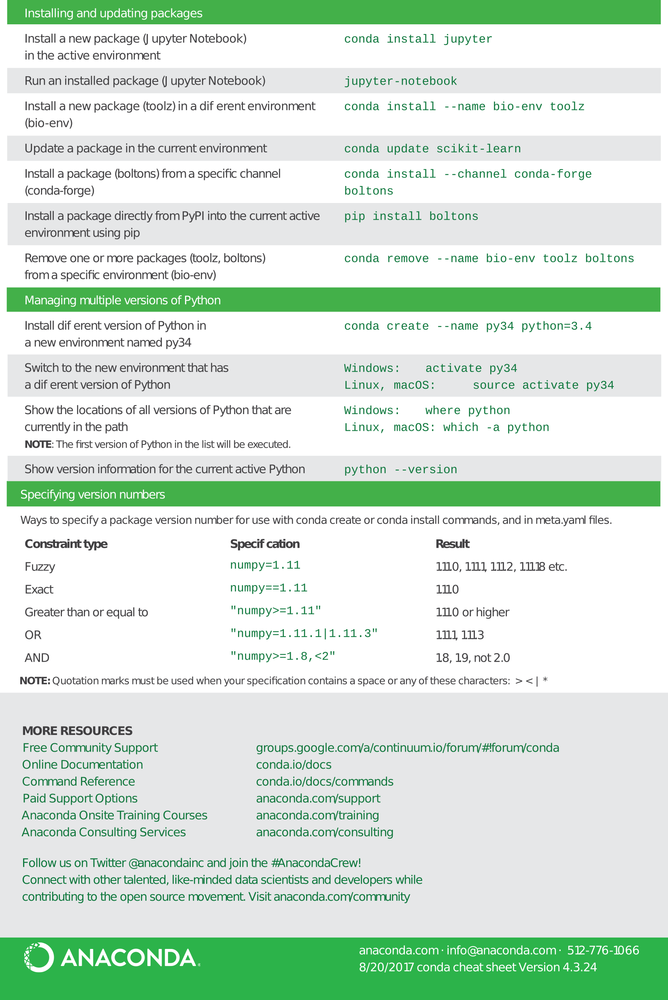
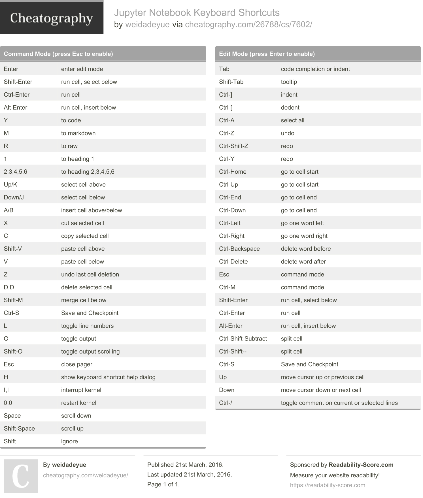

# Anaconda

- [Anaconda Cheat Sheet](pdf/Anaconda_CheatSheet.pdf). PDF only.
- [Conda Cheat Sheet](pdf/conda-cheatsheet.pdf). PDF.

<center>



</center>

# Jupyter Notebook

- [Jupyter Notebook](pdf/Jupyter_Notebook_Cheat_Sheet.pdf). PDF.

<center>

</center>

---

- [Jupyter Notebook](pdf/weidadeyue_jupyter-notebook.pdf). PDF

<center>

</center>

# Objects

Find, list, search, reset.

```python
a = 10
b = 20.1
c = "test"
d = [1, 2, 3]
```

```python
who
```

    a	 b	 c	 d	 

```python
whos
```

    Variable   Type     Data/Info
    -----------------------------
    a          int      10
    b          float    20.1
    c          str      test
    d          list     n=3

```python
reset
```

    Once deleted, variables cannot be recovered. Proceed (y/[n])? y

```python
who
```

    Interactive namespace is empty.

```python
a = 10
b = 20
c = "test"
d = [1, 2, 3]
```

```python
who
```

    a	 b	 c	 d	 

-----

# Logging

Start, state, on, off.

```python
logstate

```

    Logging has not been activated.

```python
logstart

```

    Activating auto-logging. Current session state plus future input saved.
    Filename       : ipython_log.py
    Mode           : rotate
    Output logging : False
    Raw input log  : False
    Timestamping   : False
    State          : active

```python
logstate

```

    Filename       : ipython_log.py
    Mode           : rotate
    Output logging : False
    Raw input log  : False
    Timestamping   : False
    State          : active

```python
logoff

```

    Switching logging OFF

```python
logstate

```

    Filename       : ipython_log.py
    Mode           : rotate
    Output logging : False
    Raw input log  : False
    Timestamping   : False
    State          : temporarily suspended

```python
logon

```

    Switching logging ON

```python
logstate

```

    Filename       : ipython_log.py
    Mode           : rotate
    Output logging : False
    Raw input log  : False
    Timestamping   : False
    State          : active

-----

# Magic & Help

List, help.

```python
lsmagic

```

    Available line magics:
    %alias  %alias_magic  %autocall  %automagic  %autosave  %bookmark  %cat  %cd  %clear  %colors  %config  %connect_info  %cp  %debug  %dhist  %dirs  %doctest_mode  %ed  %edit  %env  %gui  %hist  %history  %killbgscripts  %ldir  %less  %lf  %lk  %ll  %load  %load_ext  %loadpy  %logoff  %logon  %logstart  %logstate  %logstop  %ls  %lsmagic  %lx  %macro  %magic  %man  %matplotlib  %mkdir  %more  %mv  %notebook  %page  %pastebin  %pdb  %pdef  %pdoc  %pfile  %pinfo  %pinfo2  %popd  %pprint  %precision  %profile  %prun  %psearch  %psource  %pushd  %pwd  %pycat  %pylab  %qtconsole  %quickref  %recall  %rehashx  %reload_ext  %rep  %rerun  %reset  %reset_selective  %rm  %rmdir  %run  %save  %sc  %set_env  %store  %sx  %system  %tb  %time  %timeit  %unalias  %unload_ext  %who  %who_ls  %whos  %xdel  %xmode
    
    Available cell magics:
    %%!  %%HTML  %%SVG  %%bash  %%capture  %%debug  %%file  %%html  %%javascript  %%js  %%latex  %%perl  %%prun  %%pypy  %%python  %%python2  %%python3  %%ruby  %%script  %%sh  %%svg  %%sx  %%system  %%time  %%timeit  %%writefile
    
    Automagic is ON, % prefix IS NOT needed for line magics.

Open a window about magic commands.

```python
magic
```

Open a window about the command (minimum, maximum help).

```python
%alias?
```

```python
%alias??
```

-----

# Function

docstrings, info, source.

```python
def print_number(nb):
    
    """
    The docstring. print_number prints Hi!
    """
    print("Hi!" * nb)
```

```python
print_number(1)
print_number(5)
```

    Hi!
    Hi!Hi!Hi!Hi!Hi!

```python
pdef print_number
```

     print_number(nb)
     
Open a window about the docstrings.

```python
pdoc print_number

```

Open a window about the function.

```python
pinfo print_number

```

-----

# Navigation

Bookmark, history.

```python
bookmark -l
```

    Current bookmarks:
    name     -> path
    untitled -> /home/user

Add a bookmark.

```python
bookmark aaa path
```

```python
bookmark -l
```

    Current bookmarks:
    aaa      -> path
    name     -> path
    untitled -> /home/user

Delete a bookmark.

```python
bookmark -d aaa
```

```python
bookmark -l
```

    Current bookmarks:
    name     -> path
    untitled -> /home/user

Print the directory navigation history.


```python
dhist
```

    Directory history (kept in _dh)
    0: /home/user

-----

# External

Bash, script.

The following is an example of one bash command.

```python
!pwd
```

    /home/user

```python
abc = !pwd
```

```python
abc
```

    ['/home/user']

```python
alias
```

    Total number of aliases: 12

    [('cat', 'cat'),
     ('cp', 'cp'),
     ('ldir', 'ls -F -o --color %l | grep /$'),
     ('lf', 'ls -F -o --color %l | grep ^-'),
     ('lk', 'ls -F -o --color %l | grep ^l'),
     ('ll', 'ls -F -o --color'),
     ('ls', 'ls -F --color'),
     ('lx', 'ls -F -o --color %l | grep ^-..x'),
     ('mkdir', 'mkdir'),
     ('mv', 'mv'),
     ('rm', 'rm'),
     ('rmdir', 'rmdir')]

Invoke an external script into IPython.


```python
run print_text.py
```

    Hi!

Invoke an external script into IPython and open a window about the script's profile.

```python
run -p print_text.py
```

    Hi!
     
Load the external script into IPython (`load print_text.py` turns into `# %load print_text.py`).

```python
# %load print_text.py
def print_text():
    
    """
    The docstring. print_text prints Hi!
    """
    print("Hi!")
    
print_text()

```
