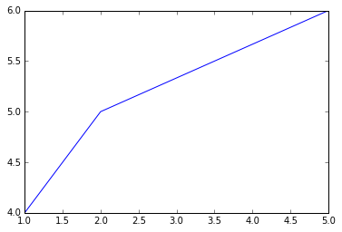
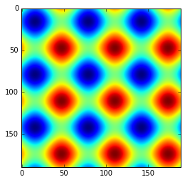

# Python for Education

Inter University Accelerator Centre, 2010.

IPython 2 & 3. Creative Commons.

**Table of Content**

[TOC]

## 2, Programming in Python

### 2.5, Python Lists


```python
a = 'hello world'

# extract, subset
print(a[3:5])
print(a[6:])
print(a[:5])
```

    lo
    world
    hello
    


```python
a = [1, 2]

print(a)
print(a * 2) # double print
print(a + [1, 1]) # concatenate
```

    [1, 2]
    [1, 2, 1, 2]
    [1, 2, 1, 1]
    


```python
b = [1,2,a]
print(b) # embed

b[2] = 3
print(b) # change a mutable from the above list

# Output:
```

    [1, 2, [1, 2]]
    [1, 2, 3]
    

### 2.7, Input from the Keyboard

- `input` for numeric data.
- `raw_input` for string data.


```python
x = input('Enter an integer (x): ')
y = input('Enter another one (y): ')

print('The sum is = ', x + y) # print as numeric, input
```

    Enter an integer (x): 1
    Enter another one (y): 2
    ('The sum is = ', 3)
    


```python
t = raw_input('Enter an integer: ')
u = raw_input('Enter another one: ')

print('The sum is = ', t + u) # print as string, raw input
```

    Enter an integer: 2
    Enter another one: 3
    ('The sum is = ', '23')
    


```python
v = input('Enter an integer: ')
w = input('Enter another one: ')

print('The sum is = ', str(v) + str(w)) # print as string, input changes into a string
```

    Enter an integer: 1
    Enter another one: 1
    ('The sum is = ', '11')
    


```python
y1 = raw_input('Enter an integer: ')
y2 = raw_input('Enter another one: ')

print( 'The sum is = ', int(y1) + int(y2)) # print as numeric, raw input changed into integer
```

    Enter an integer: 2
    Enter another one: 2
    ('The sum is = ', 4)
    


```python
y3 = raw_input('Enter an integer: ')
y4 = raw_input('Enter another one: ')

print( 'The sum is = ', float(y3) + float(y4)) # print as numeric, raw input changed into float
```

    Enter an integer: 1
    Enter another one: 2
    ('The sum is = ', 3.0)
    

### 2.11, Line joining


```python
year = input('year: ')
month = input('month: ')
if 1900 < year < 2100 and 1 <= month <= 12 :
    print('I am so long and will not fit in a single line')
```

    year: 2016
    month: 10
    I am so long and will not fit in a single line
    


```python
# simplify the code, shorten the line
year = input('year: ')
month = input('month: ')
if 1900 < year < 2100\
 and 1 <= month <= 12 :
    print('I am so long and will\
 not fit in a single line')
```

    year: 2016
    month: 10
    I am so long and will not fit in a single line
    


```python
# object, variable type
print(type(4.5))
```

    <type 'float'>
    

### 2.14, More on Strings and Lists


```python
s = 'hello world'

# string length
print(len(s))
print(s.upper())
```

    11
    HELLO WORLD
    


```python
# help with
help(str)
```

    Help on class str in module __builtin__:
    
    class str(basestring)
     |  str(object='') -> string
     |  
     |  Return a nice string representation of the object.
     |  If the argument is a string, the return value is the same object.
     |  
     |  Method resolution order:
     |      str
     |      basestring
     |      object
     |  
     |  Methods defined here:
     |  
     |  __add__(...)
     |      x.__add__(y) <==> x+y
     |  
     |  __contains__(...)
     |      x.__contains__(y) <==> y in x
     |  
     |  __eq__(...)
     |      x.__eq__(y) <==> x==y
     |  
     |  __format__(...)
     |      S.__format__(format_spec) -> string
     |      
     |      Return a formatted version of S as described by format_spec.
     |  
     |  __ge__(...)
     |      x.__ge__(y) <==> x>=y
     |  
     |  __getattribute__(...)
     |      x.__getattribute__('name') <==> x.name
     |  
     |  __getitem__(...)
     |      x.__getitem__(y) <==> x[y]
     |  
     |  __getnewargs__(...)
     |  
     |  __getslice__(...)
     |      x.__getslice__(i, j) <==> x[i:j]
     |      
     |      Use of negative indices is not supported.
     |  
     |  __gt__(...)
     |      x.__gt__(y) <==> x>y
     |  
     |  __hash__(...)
     |      x.__hash__() <==> hash(x)
     |  
     |  __le__(...)
     |      x.__le__(y) <==> x<=y
     |  
     |  __len__(...)
     |      x.__len__() <==> len(x)
     |  
     |  __lt__(...)
     |      x.__lt__(y) <==> x<y
     |  
     |  __mod__(...)
     |      x.__mod__(y) <==> x%y
     |  
     |  __mul__(...)
     |      x.__mul__(n) <==> x*n
     |  
     |  __ne__(...)
     |      x.__ne__(y) <==> x!=y
     |  
     |  __repr__(...)
     |      x.__repr__() <==> repr(x)
     |  
     |  __rmod__(...)
     |      x.__rmod__(y) <==> y%x
     |  
     |  __rmul__(...)
     |      x.__rmul__(n) <==> n*x
     |  
     |  __sizeof__(...)
     |      S.__sizeof__() -> size of S in memory, in bytes
     |  
     |  __str__(...)
     |      x.__str__() <==> str(x)
     |  
     |  capitalize(...)
     |      S.capitalize() -> string
     |      
     |      Return a copy of the string S with only its first character
     |      capitalized.
     |  
     |  center(...)
     |      S.center(width[, fillchar]) -> string
     |      
     |      Return S centered in a string of length width. Padding is
     |      done using the specified fill character (default is a space)
     |  
     |  count(...)
     |      S.count(sub[, start[, end]]) -> int
     |      
     |      Return the number of non-overlapping occurrences of substring sub in
     |      string S[start:end].  Optional arguments start and end are interpreted
     |      as in slice notation.
     |  
     |  decode(...)
     |      S.decode([encoding[,errors]]) -> object
     |      
     |      Decodes S using the codec registered for encoding. encoding defaults
     |      to the default encoding. errors may be given to set a different error
     |      handling scheme. Default is 'strict' meaning that encoding errors raise
     |      a UnicodeDecodeError. Other possible values are 'ignore' and 'replace'
     |      as well as any other name registered with codecs.register_error that is
     |      able to handle UnicodeDecodeErrors.
     |  
     |  encode(...)
     |      S.encode([encoding[,errors]]) -> object
     |      
     |      Encodes S using the codec registered for encoding. encoding defaults
     |      to the default encoding. errors may be given to set a different error
     |      handling scheme. Default is 'strict' meaning that encoding errors raise
     |      a UnicodeEncodeError. Other possible values are 'ignore', 'replace' and
     |      'xmlcharrefreplace' as well as any other name registered with
     |      codecs.register_error that is able to handle UnicodeEncodeErrors.
     |  
     |  endswith(...)
     |      S.endswith(suffix[, start[, end]]) -> bool
     |      
     |      Return True if S ends with the specified suffix, False otherwise.
     |      With optional start, test S beginning at that position.
     |      With optional end, stop comparing S at that position.
     |      suffix can also be a tuple of strings to try.
     |  
     |  expandtabs(...)
     |      S.expandtabs([tabsize]) -> string
     |      
     |      Return a copy of S where all tab characters are expanded using spaces.
     |      If tabsize is not given, a tab size of 8 characters is assumed.
     |  
     |  find(...)
     |      S.find(sub [,start [,end]]) -> int
     |      
     |      Return the lowest index in S where substring sub is found,
     |      such that sub is contained within S[start:end].  Optional
     |      arguments start and end are interpreted as in slice notation.
     |      
     |      Return -1 on failure.
     |  
     |  format(...)
     |      S.format(*args, **kwargs) -> string
     |      
     |      Return a formatted version of S, using substitutions from args and kwargs.
     |      The substitutions are identified by braces ('{' and '}').
     |  
     |  index(...)
     |      S.index(sub [,start [,end]]) -> int
     |      
     |      Like S.find() but raise ValueError when the substring is not found.
     |  
     |  isalnum(...)
     |      S.isalnum() -> bool
     |      
     |      Return True if all characters in S are alphanumeric
     |      and there is at least one character in S, False otherwise.
     |  
     |  isalpha(...)
     |      S.isalpha() -> bool
     |      
     |      Return True if all characters in S are alphabetic
     |      and there is at least one character in S, False otherwise.
     |  
     |  isdigit(...)
     |      S.isdigit() -> bool
     |      
     |      Return True if all characters in S are digits
     |      and there is at least one character in S, False otherwise.
     |  
     |  islower(...)
     |      S.islower() -> bool
     |      
     |      Return True if all cased characters in S are lowercase and there is
     |      at least one cased character in S, False otherwise.
     |  
     |  isspace(...)
     |      S.isspace() -> bool
     |      
     |      Return True if all characters in S are whitespace
     |      and there is at least one character in S, False otherwise.
     |  
     |  istitle(...)
     |      S.istitle() -> bool
     |      
     |      Return True if S is a titlecased string and there is at least one
     |      character in S, i.e. uppercase characters may only follow uncased
     |      characters and lowercase characters only cased ones. Return False
     |      otherwise.
     |  
     |  isupper(...)
     |      S.isupper() -> bool
     |      
     |      Return True if all cased characters in S are uppercase and there is
     |      at least one cased character in S, False otherwise.
     |  
     |  join(...)
     |      S.join(iterable) -> string
     |      
     |      Return a string which is the concatenation of the strings in the
     |      iterable.  The separator between elements is S.
     |  
     |  ljust(...)
     |      S.ljust(width[, fillchar]) -> string
     |      
     |      Return S left-justified in a string of length width. Padding is
     |      done using the specified fill character (default is a space).
     |  
     |  lower(...)
     |      S.lower() -> string
     |      
     |      Return a copy of the string S converted to lowercase.
     |  
     |  lstrip(...)
     |      S.lstrip([chars]) -> string or unicode
     |      
     |      Return a copy of the string S with leading whitespace removed.
     |      If chars is given and not None, remove characters in chars instead.
     |      If chars is unicode, S will be converted to unicode before stripping
     |  
     |  partition(...)
     |      S.partition(sep) -> (head, sep, tail)
     |      
     |      Search for the separator sep in S, and return the part before it,
     |      the separator itself, and the part after it.  If the separator is not
     |      found, return S and two empty strings.
     |  
     |  replace(...)
     |      S.replace(old, new[, count]) -> string
     |      
     |      Return a copy of string S with all occurrences of substring
     |      old replaced by new.  If the optional argument count is
     |      given, only the first count occurrences are replaced.
     |  
     |  rfind(...)
     |      S.rfind(sub [,start [,end]]) -> int
     |      
     |      Return the highest index in S where substring sub is found,
     |      such that sub is contained within S[start:end].  Optional
     |      arguments start and end are interpreted as in slice notation.
     |      
     |      Return -1 on failure.
     |  
     |  rindex(...)
     |      S.rindex(sub [,start [,end]]) -> int
     |      
     |      Like S.rfind() but raise ValueError when the substring is not found.
     |  
     |  rjust(...)
     |      S.rjust(width[, fillchar]) -> string
     |      
     |      Return S right-justified in a string of length width. Padding is
     |      done using the specified fill character (default is a space)
     |  
     |  rpartition(...)
     |      S.rpartition(sep) -> (head, sep, tail)
     |      
     |      Search for the separator sep in S, starting at the end of S, and return
     |      the part before it, the separator itself, and the part after it.  If the
     |      separator is not found, return two empty strings and S.
     |  
     |  rsplit(...)
     |      S.rsplit([sep [,maxsplit]]) -> list of strings
     |      
     |      Return a list of the words in the string S, using sep as the
     |      delimiter string, starting at the end of the string and working
     |      to the front.  If maxsplit is given, at most maxsplit splits are
     |      done. If sep is not specified or is None, any whitespace string
     |      is a separator.
     |  
     |  rstrip(...)
     |      S.rstrip([chars]) -> string or unicode
     |      
     |      Return a copy of the string S with trailing whitespace removed.
     |      If chars is given and not None, remove characters in chars instead.
     |      If chars is unicode, S will be converted to unicode before stripping
     |  
     |  split(...)
     |      S.split([sep [,maxsplit]]) -> list of strings
     |      
     |      Return a list of the words in the string S, using sep as the
     |      delimiter string.  If maxsplit is given, at most maxsplit
     |      splits are done. If sep is not specified or is None, any
     |      whitespace string is a separator and empty strings are removed
     |      from the result.
     |  
     |  splitlines(...)
     |      S.splitlines(keepends=False) -> list of strings
     |      
     |      Return a list of the lines in S, breaking at line boundaries.
     |      Line breaks are not included in the resulting list unless keepends
     |      is given and true.
     |  
     |  startswith(...)
     |      S.startswith(prefix[, start[, end]]) -> bool
     |      
     |      Return True if S starts with the specified prefix, False otherwise.
     |      With optional start, test S beginning at that position.
     |      With optional end, stop comparing S at that position.
     |      prefix can also be a tuple of strings to try.
     |  
     |  strip(...)
     |      S.strip([chars]) -> string or unicode
     |      
     |      Return a copy of the string S with leading and trailing
     |      whitespace removed.
     |      If chars is given and not None, remove characters in chars instead.
     |      If chars is unicode, S will be converted to unicode before stripping
     |  
     |  swapcase(...)
     |      S.swapcase() -> string
     |      
     |      Return a copy of the string S with uppercase characters
     |      converted to lowercase and vice versa.
     |  
     |  title(...)
     |      S.title() -> string
     |      
     |      Return a titlecased version of S, i.e. words start with uppercase
     |      characters, all remaining cased characters have lowercase.
     |  
     |  translate(...)
     |      S.translate(table [,deletechars]) -> string
     |      
     |      Return a copy of the string S, where all characters occurring
     |      in the optional argument deletechars are removed, and the
     |      remaining characters have been mapped through the given
     |      translation table, which must be a string of length 256 or None.
     |      If the table argument is None, no translation is applied and
     |      the operation simply removes the characters in deletechars.
     |  
     |  upper(...)
     |      S.upper() -> string
     |      
     |      Return a copy of the string S converted to uppercase.
     |  
     |  zfill(...)
     |      S.zfill(width) -> string
     |      
     |      Pad a numeric string S with zeros on the left, to fill a field
     |      of the specified width.  The string S is never truncated.
     |  
     |  ----------------------------------------------------------------------
     |  Data and other attributes defined here:
     |  
     |  __new__ = <built-in method __new__ of type object>
     |      T.__new__(S, ...) -> a new object with type S, a subtype of T
    
    


```python
s = 'I am a long string'

# split a string on space
print(s.split())
```

    ['I', 'am', 'a', 'long', 'string']
    


```python
a = 'abc.abc.abc'

# split a string on dot
aa = a.split('.')
print(aa)
```

    ['abc', 'abc', 'abc']
    


```python
# join the elements, join character
mm = '+'.join(aa)
print(mm)
```

    abc+abc+abc
    


```python
a = []

# append to a list
a.append(3)
print(a)

a.append(4)
print(a)
```

    [3]
    [3, 4]
    


```python
# insert 2.5 as first element (at index = 0)
a.insert(0, 2.5)

# print several items
print(a, a[0])
print(len(a))
```

    ([2.5, 3, 4], 2.5)
    3
    


```python
# copy module
a = [1, 2, 3, 4]

print(a)

b = a
print(a == b) # True
```

    [1, 2, 3, 4]
    True
    


```python
# insert at index = 0
b[0] = 5
```


```python
# b is a live duplicate, not an independent copy
print(a is b)
print(a, b)
```

    True
    ([5, 2, 3, 4], [5, 2, 3, 4])
    


```python
import copy

c = copy.copy(a)
```


```python
# c is an ind. copy
print(a is c)
print(a, c)
```

    False
    ([5, 2, 3, 4], [5, 2, 3, 4])
    


```python
# replace at index = 1
c[1] = 100
print(a, c)
```

    ([5, 2, 3, 4], [5, 100, 3, 4])
    

### Recap


```python
dicty = {'a': 'apple', 'b': 'berry', 'c': 'cherry'}

for keyy in dicty:
    print('keys are: '), keyy
    print('-' * 5)
    print('values are: '), dicty[keyy]
    print('-' * 10)    
```

    keys are:  a
    -----
    values are:  apple
    ----------
    keys are:  c
    -----
    values are:  cherry
    ----------
    keys are:  b
    -----
    values are:  berry
    ----------
    


```python
print(type(0))
print(type(255))
print(type(-1))
print(type(-255))
print(type(-30000))
print(type(30000))
print(type(-3500000))
print(type(3500000))
print(type(-1.5))
print(type(1.345456734576345))
print(type('4'))
```

    <type 'int'>
    <type 'int'>
    <type 'int'>
    <type 'int'>
    <type 'int'>
    <type 'int'>
    <type 'int'>
    <type 'int'>
    <type 'float'>
    <type 'float'>
    <type 'str'>
    


```python
a1 = input('Enter: ')

a2 = a1
a3 = bytes(a1) # 0 - 255
a4 = int(a1) # -32768 - 32768
a5 = long(a1) # -2147483648 -
a6 = float(a1)
a9 = str(a1)
```

    Enter: 1
    


```python
listnum = [0,1,2,3,4,5,6,7,8,9,10]

for i in listnum:
    if i%2 == 0: # even
        print(i),
```

    0 2 4 6 8 10
    


```python
for i in range(0,10):
    if i%2 == 0: # even
        print(i),
```

    0 2 4 6 8
    


```python
for i in range(0,100,3):
    if i%2 == 0: # even
        print(i),
```

    0 6 12 18 24 30 36 42 48 54 60 66 72 78 84 90 96
    


```python
listnum = ['a','b']
listtext = []

for i in listnum:
    if i == 'b': # even
        listtext.append(i)

print listtext
```

    ['b']
    


```python
lst = [3,5,7]

lst.append(9)
print lst

lst.append(lst[0])
print(lst)
```

    [3, 5, 7, 9]
    [3, 5, 7, 9, 3]
    


```python
lst = ['a','b','c']

lst.append('d')
print(lst)

lst.append(lst[0])
print(lst)
```

    ['a', 'b', 'c', 'd']
    ['a', 'b', 'c', 'd', 'a']
    


```python
elements = ('foo', 'bar', 'baz')

for elem in elements:
    print(elem)
```

    foo
    bar
    baz
    


```python
for count, elem in enumerate(elements):
    print(count, elem)
```

    (0, 'foo')
    (1, 'bar')
    (2, 'baz')
    


```python
listnum = [0,1,2,3,4,5,6,7,8,9,10]

listnum.pop() # last
print(listnum)
```

    [0, 1, 2, 3, 4, 5, 6, 7, 8, 9]
    


```python
listnum.pop(0) # position 0
print(listnum)
```

    [1, 2, 3, 4, 5, 6, 7, 8, 9]
    


```python
listnum.pop(2) # position 2
print(listnum)
```

    [1, 2, 4, 5, 6, 7, 8, 9]
    


```python
listnum.remove(8) # specific element
print(listnum)
```

    [1, 2, 4, 5, 6, 7, 9]
    


```python
del(listnum[0])
print(listnum)
```

    [2, 4, 5, 6, 7, 9]
    


```python
word = 'original'
word2 = word.upper()
word3 = word.capitalize()
first = word[0]
allbutfirst = word[1:len(word)]

print(word)
print(word2)
print(word3)
print(first)
print(allbutfirst)
```

    original
    ORIGINAL
    Original
    o
    riginal
    


```python
list1 = [1,2,3]
list2 = [4,5,6,7]

list3 = [list1,list2]

results = []

def joiny(listy):
    for lst in listy:
        for num in lst:
            results.append(num)
    return results

print(joiny(list3))
```

    [1, 2, 3, 4, 5, 6, 7]
    

### 2.15, Python Modules and Packages


```python
print(sin(0.5))
```

    0.479425538604
    


```python
# rename, more efficient
import math as m
print(m.sin(0.5))
```

    0.479425538604
    


```python
# package.module.function()
import random

a = random.randint(1,5)
print(a)

random.randint(1,10)
```

    3
    8

```python
import random as rd

aa = rd.randint(1,5)
print(aa)
```

    5

### 2.16, Files Input/Ouput


```python
# create the file
f = open('D:/Admin_Hugues/Documents/Notebooks/Python for Education/notes1.txt', 'w')
f.write('This is a test file') # write in
f.close()
```


```python
# read it
f = open('D:/Admin_Hugues/Documents/Notebooks/Python for Education/notes1.txt', 'r')
print(f.read())
f.close()
```

    This is a test file
 
```python
# read it again
f = open('D:/Admin_Hugues/Documents/Notebooks/Python for Education/notes1.txt', 'r')
print(f.read(7)) # get first seven characters on the console
print(f.read()) # get the remaining ones
f.close()
```

    This is
     a test file

```python
# create it
f = open('D:/Admin_Hugues/Documents/Notebooks/Python for Education/notes2.txt', 'w')
for k in range(1,10): # 1, 2, 3 stop before 4
    s = '%3d\n' %(k) # no format 3d, new line
    f.write(s) # write in
f.close()
```


```python
# read it
f = open('D:/Admin_Hugues/Documents/Notebooks/Python for Education/notes2.txt', 'r') # open
print(f.read())
f.close()
```

      1
      2
      3
      4
      5
      6
      7
      8
      9
    
```python
# read it horizontally
f = open('D:/Admin_Hugues/Documents/Notebooks/Python for Education/notes2.txt', 'r') # open
print(f.read(),)
f.close()
```

    ('  1\n  2\n  3\n  4\n  5\n  6\n  7\n  8\n  9\n',)
    
```python
f = open('D:/Admin_Hugues/Documents/Notebooks/Python for Education/notes2.txt', 'r')
while 1: # infinite loop
    s = f.readline()
    if s == '': # Empty string means end of file
        break # terminate the loop
    m = int(s) # Convert to integer
    print(m * 5),
f.close()
```

    5 10 15 20 25 30 35 40 45
    
```python
# create it
f = open('D:/Admin_Hugues/Documents/Notebooks/Python for Education/notes3.txt', 'w')
f.write('')
f.close()
```

```python
# give an error if there is a blank line in the file
# test it (without the if, there would be an error)
f = open('D:/Admin_Hugues/Documents/Notebooks/Python for Education/notes3.txt', 'r')
while 1: # infinite loop
    s = f.readline()
    if s == '': # empty string means end of file
        break # terminate the loop
    m = int(s) # convert to integer
    print(m * 5)
f.close()
```

```python
# alternatively
f = open('D:/Admin_Hugues/Documents/Notebooks/Python for Education/notes3.txt', 'r')
while 1: # infinite loop
    s = f.readline()
    if len(s) < 1: # string with no value
        break # terminate the loop
    m = int(s) # convert to integer
    print(m * 5)
f.close()
```

Strings can easily be written to and read from a le. Numbers take a bit more eort, since the `read()` method only returns Strings, which will have to be converted in to a number explicitly. However, when you want to save and restore data types like lists, dictionaries, or class instances, things get a lot more complicated. Rather than have the users constantly writing and debugging code to save complicated data types, Python provides a standard module called `pickle`.

The `pickle` module implements a fundamental, but powerful algorithm for serializing and de-serializing a Python object structure. “Pickling” is the process whereby a Python object hierarchy is converted into a byte stream, and “unpickling” is the inverse operation, whereby a byte stream is converted back into an object hierarchy. Pickling (and unpickling) is alternatively known as “serialization”, “marshalling,” [1] or “flattening”, however, to avoid confusion, the terms used here are “pickling” and “unpickling”.

```python
import pickle

f = open('D:/Admin_Hugues/Documents/Notebooks/Python for Education/notes4.txt', 'w')
pickle.dump(12.3, f) # write a float type
f.close()
```


```python
f = open('D:/Admin_Hugues/Documents/Notebooks/Python for Education/notes4.txt', 'r')
x = pickle.load(f)
print(x, type(x)) # check the type of data read
f.close()
```

    (12.3, <type 'float'>)
    

### 2.17, Formatted Printing


```python
a = 2.0 / 3 # 2/3 will print zero because of integer
print(a)

print('a = %5.3f') %(a) # up to 3 decimal places
```

    0.666666666667
    a = 0.667
    

|Conversion   |Conversion   |Example   |Result   |
|:-:|:-:|:-:|:-:|
|d, i |signed Integer |'%6d'%(12) |' 12' |
|f |foating point decimal |'%6.4f'%(2.0/3) |0.667 |
|e |floating point exponential |'%6.2e'%(2.0/3) |6.67e-01 |
|x |hexadecimal |'%x'%(16) |10 |
|o |octal |'%o'%(8) |10 |
|s |string |'%s'%('abcd') |abcd |
|0d |modied |'d' '%05d'%(12) |00012 |


```python
a = 'justify as you like'
print('%30s') %(a) # right justified
```

               justify as you like
    


```python
print('%-30s') %(a) # minus sign for left justification
```

    justify as you like           
    


```python
for k in range(1,11): # A good looking table
    print('5 x %2d = %2d') %(k, 5*k) # add 2 spaces before
```

    5 x  1 =  5
    5 x  2 = 10
    5 x  3 = 15
    5 x  4 = 20
    5 x  5 = 25
    5 x  6 = 30
    5 x  7 = 35
    5 x  8 = 40
    5 x  9 = 45
    5 x 10 = 50
    

### 2.18, Exception Handling


```python
x = input('Enter a number ')

try:
    print(10.0 / x)
except:
    print('Division by zero not allowed')
```

    Enter a number 0
    Division by zero not allowed
    

### 2.20, Writing GUI Programs

Tkinter

- [An introduction to tkinter](http://www.pythonware.com/library/an-introduction-to-tkinter.htm)
- [Tkinter](http://infohost.nmt.edu/tcc/help/pubs/tkinter/)
- [Tkinter](http://wiki.python.org/moin/TkInter)

The GUI programs are event-driven like a macro. Create Widgets like a Button, Label, Canvas,  etc. The first step is to create a main graphics window by calling the function `Tk()`.


```python
# Example tkmain.py

# open an empty box with min, max, close buttons
import Tkinter as tk

root = tk.Tk()
root.mainloop()

# it opens a windows!
```


```python
# Example tklabel.py

root = tk.Tk()
w = tk.Label(root, text = "Hello, world")

w.pack()
root.mainloop()

# it opens a windows with the text in it
```


```python
# Example tkbutton.py

def hello():
    print('hello world')

w = tk.Tk() # Creates the main Graphics window
b = tk.Button(w, text = 'Click Me', command = hello)

b.pack()
w.mainloop()

# it opens a windows with a button; after clicking, it print the function
```

    hello world
    


```python
# Example tkcanvas.py

def draw(event):
    c.create_rectangle(event.x, \
        event.y, event.x+5, event.y+5)

w = tk.Tk()
c = tk.Canvas(w, width = 300, height = 200)

c.pack()
c.bind("<Button-1>", draw)
w.mainloop()

# it open a windows; you can left-click and add dots in it
```


```python
# Example tkcanvas2.py

recs = [] # list keeping track of the rectangles

def remove(event):
    global recs
    if len(recs) > 0:
        c.delete(recs[0]) # delete from Canvas
        recs.pop(0) # delete first item from list

def draw(event):
    global recs
    r = c.create_rectangle(event.x, \
        event.y, event.x + 5, event.y + 5)
    recs.append(r)

w = tk.Tk()
c = tk.Canvas(w, width = 300, height = 200)

c.pack()
c.bind("<Button-1>", draw)
c.bind("<Button-3>", remove)
w.mainloop()

# it open a windows; you can left-click and add dots in it; right-click and remove them
```

### 2.21, Object-Oriented Programming in Python


```python
# example point.py

class Point:
    '''
    This is documentation comment.
    help(Point) will display this.
    '''

    def __init__(self, x = 0, y = 0):
        self.xpos = x
        self.ypos = y

    def __str__(self): # overload print()
        return 'Point at (%f,%f)' %(self.xpos, self.ypos)

    def __add__(self, other): # overloads
        xpos = self.xpos + other.xpos
        ypos = self.ypos + other.ypos
        return Point(xpos, ypos)

    def __sub__(self, other): # overloads
        import math
        dx = self.xpos - other.xpos
        dy = self.ypos - other.ypos
        return math.sqrt(dx ** 2 + dy ** 2)

    def dist(self):
        import math
        return math.sqrt(self.xpos ** 2 + self.ypos ** 2)
```


```python
# example point1.py

# import Point
# if point.py is in the same directory and script point1.py is independent from point.py

origin = Point() # instance
print(origin)

p1 = Point(4, 4) # instance
p2 = Point(8, 7)

print(p1)
```

    Point at (0.000000,0.000000)
    Point at (4.000000,4.000000)
    


```python
print(p2) # __str__
```

    Point at (8.000000,7.000000)
    


```python
print(p1 + p2) # __add__, __str__, (4 + 4, 7 + 4)
```

    Point at (12.000000,11.000000)
    


```python
print(p1 - p2) # __sub__, __str__, ((4 - 8) ** 2, (3 - 7) ** 2)
```

    5.0
    


```python
print(p1.dist()) # # __dist__, __str__, sqrt((4) ** 2 + (4) ** 2)
```

    5.65685424949
    


```python
# example cpoint.py

class colPoint(Point): # colPoint inherits Point
    '''
    This is documentation comment.
    help(colPoint) will display this.
    '''
    
    color = 'black'
    
    def __init__(self, x = 0, y = 0, col = 'black'):
        Point.__init__(self, x, y)
        self.color = col

    def __str__(self):
        return '%s colored Point at (%f,%f)' % \
            (self.color, self.xpos, self.ypos)
```


```python
# example point2.py

# import cpoint
# see above for the explanation

p1 = Point(5, 5)
rp1 = colPoint(2, 2, 'red')
```


```python
print(p1)
```

    Point at (5.000000,5.000000)
    


```python
print(rp1)
```

    red colored Point at (2.000000,2.000000)
    


```python
print(rp1 + p1)
```

    Point at (7.000000,7.000000)
    


```python
print(rp1.dist())
```

    2.82842712475
    

## 3, Arrays and Matrices

Let's switch to Python 3 for the remaining of the document.

### 3.1, The NumPy Module

Install (check) the Scipy Stack before.

- numpy
- scipy
- matplotlib
- pandas
- sympy
- nose (testing)

With `pip`.

**Note**

The code below in Python 3 on Jupyter Notebook 3  installed on a Windows PC.

However, running the Scipy Stack in Python 2.7 is problematic.

Switch kernel from here: from Python 2 to 3.

No need to `import numpy, matplotlib` since it's included in the `%pylab` command.


```python
%pylab inline
# the Scipy Stack is executed in the notebook, no need to import numpy

x = array([1, 2, 3]) # make array from list

print(x, type(x))
```

    Populating the interactive namespace from numpy and matplotlib
    [1 2 3] <class 'numpy.ndarray'>
    


```python
a = [[1,2], [3,4]] # make a list of lists

x = array(a) # and convert to an array
print(a)
```

    [[1, 2], [3, 4]]
    


```python
arange(2.0, 3.0, .1)
```


    array([ 2. ,  2.1,  2.2,  2.3,  2.4,  2.5,  2.6,  2.7,  2.8,  2.9])


```python
array([ 2. , 2.1, 2.2, 2.3, 2.4, 2.5, 2.6, 2.7, 2.8, 2.9])
```


    array([ 2. ,  2.1,  2.2,  2.3,  2.4,  2.5,  2.6,  2.7,  2.8,  2.9])


```python
linspace(1, 2, 11)
```


    array([ 1. ,  1.1,  1.2,  1.3,  1.4,  1.5,  1.6,  1.7,  1.8,  1.9,  2. ])


```python
array([ 1. , 1.1, 1.2, 1.3, 1.4, 1.5, 1.6, 1.7, 1.8, 1.9, 2. ])
```


    array([ 1. ,  1.1,  1.2,  1.3,  1.4,  1.5,  1.6,  1.7,  1.8,  1.9,  2. ])


```python
zeros([3,2], 'float')
```


    array([[ 0.,  0.],
           [ 0.,  0.],
           [ 0.,  0.]])


```python
zeros([3,2], 'int')
```


    array([[0, 0],
           [0, 0],
           [0, 0]])


```python
ones([2,2], 'i')
```


    array([[1, 1],
           [1, 1]], dtype=int32)


```python
random.random([3,3])
```


    array([[ 0.51158139,  0.83490474,  0.82306296],
           [ 0.65830757,  0.98560397,  0.78565885],
           [ 0.09887894,  0.11073038,  0.31037259]])


```python
a = arange(20)
print(a)
```

    [ 0  1  2  3  4  5  6  7  8  9 10 11 12 13 14 15 16 17 18 19]
    


```python
b = reshape(a, [4,5])
print(b)
```

    [[ 0  1  2  3  4]
     [ 5  6  7  8  9]
     [10 11 12 13 14]
     [15 16 17 18 19]]
    


```python
a = arange(1.0, 2.0, 0.1)
print(a)
```

    [ 1.   1.1  1.2  1.3  1.4  1.5  1.6  1.7  1.8  1.9]
    


```python
b = linspace(1, 2, 11)
print(b)
```

    [ 1.   1.1  1.2  1.3  1.4  1.5  1.6  1.7  1.8  1.9  2. ]
    


```python
c = ones(5, 'float')
print(c)
```

    [ 1.  1.  1.  1.  1.]
    


```python
d = zeros(5, 'int')
print(d)
```

    [0 0 0 0 0]
    


```python
e = random.rand(5)
print(e)
```

    [ 0.5677619   0.46086299  0.00274387  0.29916017  0.40593335]
    


```python
a = zeros(5)
print(a)

b = a
b[0] = 10
print(a, b) # b and a remain in synch

c = a.copy()
c[4] = 10
print(a, c) # c is really a new variable, independent
```

    [ 0.  0.  0.  0.  0.]
    [ 10.   0.   0.   0.   0.] [ 10.   0.   0.   0.   0.]
    [ 10.   0.   0.   0.   0.] [ 10.   0.   0.   0.  10.]
    


```python
# simple arithmetics
a = array([[2,3], [4,5]])
b = array([[1,2], [3,0]])

print(a + b)
print(a * b)
```

    [[3 5]
     [7 5]]
    [[ 2  6]
     [12  0]]
    


```python
# cross product
a = array([1,2,3])
b = array([4,5,6])

print(a * b)

c = cross(a,b)
print(c)
```

    [ 4 10 18]
    [-3  6 -3]
    


```python
# dot product
c = dot(a, b)
print(c)
```

    32
    


```python
a = arange(10)
print(a)
```

    [0 1 2 3 4 5 6 7 8 9]
    


```python
# save to file, restore or retrieve
a.tofile('myfile.dat') # a file is created in the directory
b = fromfile('myfile.dat',dtype = 'int')
print(b)
```

    [0 1 2 3 4 5 6 7 8 9]
    


```python
# matrix inversion

a = array([[4,1,-2], [2,-3,3], [-6,-2,1] ], dtype='float')
print(a)

ainv = linalg.inv(a)
print(ainv)

print(dot(a, ainv))
```

    [[ 4.  1. -2.]
     [ 2. -3.  3.]
     [-6. -2.  1.]]
    [[ 0.08333333  0.08333333 -0.08333333]
     [-0.55555556 -0.22222222 -0.44444444]
     [-0.61111111  0.05555556 -0.38888889]]
    [[  1.00000000e+00  -1.38777878e-17   0.00000000e+00]
     [  0.00000000e+00   1.00000000e+00   0.00000000e+00]
     [  0.00000000e+00   2.08166817e-17   1.00000000e+00]]
    

### 3.2, Vectorized Functions


```python
# avoid loop, generate number with a function
a = array([1, 10, 100, 1000])
print(log10(a))
```

    [ 0.  1.  2.  3.]
    


```python
def spf(x):
    return 3 * x

vspf = vectorize(spf)
a = array([1, 2, 3, 4])

print(a)
print(vspf(a))
```

    [1 2 3 4]
    [ 3  6  9 12]
    

## 4, Data visualization

### 4.1, The Matplotlib Module

Basic or common plots.


```python
%pylab inline
# matplolib is part of pylab as is numpy

# basic plot
data = [1, 2, 5]

plot(data)

show()
```

    Populating the interactive namespace from numpy and matplotlib
    


```python
# basic plot
x = [1, 2, 5]
y = [4, 5, 6]

plot(x,y)

show()
```





```python
# basic plot

x = [1, 2, 5]
y = [4, 5, 6]

plot(x, y, 'ro')
xlabel('x-axis')
ylabel('y-axis')
axis([0, 6, 1, 7])

show()
```


```python
# basic plots

# data are unchanged

t = arange(0.0, 5.0, 0.2)

plot(t, t**2, 'x') # t2
plot(t, t**3, 'ro') # t3

show()
```


```python
# subplot

# data are unchanged

subplot(2, 1, 1) # the first subplot
plot([1, 2, 3, 4])
subplot(2, 1, 2) # the second subplot
plot([4, 2, 3, 1])

show()
```


```python
rand(10)
```


    array([ 0.88744591,  0.324907  ,  0.90704288,  0.81398935,  0.96866761,
            0.75620965,  0.31821423,  0.64119535,  0.56738357,  0.98143592])


```python
# subplot

mark = ['x','o','^','+','>']

NR = 2 # number of rows
NC = 3 # number of columns
pn = 1 # plot number, starting number

for row in range(NR):
    for col in range(NC):
        subplot(NR, NC, pn)
        a = rand(10) * pn
        plot(a, marker = mark[(pn+1)%5]) # plot the random numbers vs tick = (n+1)5%
        xlabel('plot %d X' %pn)
        ylabel('plot %d Y' %pn)
        
        pn = pn + 1 # move to the 2nd plot

show()
```


```python
# polar plot

th = linspace(0, 2*pi, 100)
r = 5 * ones(100) # radius = 5
polar(th, r)

show()
```


```python
# pie chart

labels = 'Frogs', 'Hogs', 'Dogs', 'Logs'
fracs = [25, 25, 30, 20]
pie(fracs, labels = labels)

show()
```


A few examples of mathematical plots. 

Spiral of Archimedes

$r = aθ$


```python
a = 2
th = linspace(0, 10*pi, 200)
r = a*th
polar(th,r)
axis([0, 2*pi, 0, 70])

show()
```


Fermat's Spiral

$r^2 = a^2θ$


```python
a = 2
th = linspace(0, 10*pi, 200)
r = sqrt(a**2 * th)
polar(th, r)
polar(th, -r)

show()
```


And more...


```python
# example 1

x = arange(0, 3, 1)
y = arange(0, 3, 1)
gx, gy = meshgrid(x, y)
print(gx)
print(gy)

print('-' * 25)

x = arange(-3*pi, 3*pi, 0.1)
y = arange(-3*pi, 3*pi, 0.1)
xx, yy = meshgrid(x, y)
z = sin(xx) + sin(yy)

imshow(z)
show()
```

    [[0 1 2]
     [0 1 2]
     [0 1 2]]
    [[0 0 0]
     [1 1 1]
     [2 2 2]]
    -------------------------
    





```python
# example 2

from mpl_toolkits.mplot3d import Axes3D

ax = Axes3D(figure())
x = arange(-3*pi, 3*pi, 0.1)
y = arange(-3*pi, 3*pi, 0.1)
xx, yy = meshgrid(x, y)
z = sin(xx) + sin(yy)
ax.plot_surface(xx, yy, z, cmap=cm.jet, cstride=1)

show()
```


```python
# example 3

from mpl_toolkits.mplot3d import Axes3D

ax = Axes3D(figure())
phi = linspace(0, 2*pi, 400)
x = cos(phi)
y = sin(phi)
z = 0
ax.plot(x, y, z, label = 'x')# circle
z = sin(4*phi) # modulated in z plane
ax.plot(x, y, z, label = 'x')
ax.set_xlabel('X')
ax.set_ylabel('Y')
ax.set_zlabel('Z')

show()
```


```python
# example 4

from mpl_toolkits.mplot3d import Axes3D

ax = Axes3D(figure())
phi = linspace(0, 2 * pi, 100)
theta = linspace(0, pi, 100)
x = 10 * outer(cos(phi), sin(theta))
y = 10 * outer(sin(phi), sin(theta))
z = 10 * outer(ones(size(phi)), cos(theta))
ax.plot_wireframe(x,y,z, rstride=2, cstride=2)

show()
```


Additional mathematical plots (with functions):

- sine, function and friends
- circles
- astroids
- ellipses
- polar rose
- power series
- Fourier series
- fractals
- meshgrids
- 2D plots
- 3D plots
- surface plots
- line plots
- wire-frame plots
- advanced 3D with Mayavi (render 3D shapes)

## 5, Type setting using $\LaTeX$

Once a graphic or an image is generated by IPython, save it and reuse it in $\LaTeX$ with the `usepackage{graphicx}`. Insert images and floating bodies.

## 6, Numerical methods

- derivatives and differential calculus
- integral calculus and numerical integration
- optimization and linear programming
- ordinary differential equations
    - Euler method
    - Runge-Kutta method
    - functions depending on the integrals
    - and more
- Polynomials
    - Taylor's series
    - and other series

### 6.5, Finding roots of an equation

- A root is where a $x$ intersects the $y$-axis.
- An equation has any number of roots, or no roots at all.
- $f(x) = x^2$ has a single root whereas $f(x) = sin(x)$ has an infinite number of roots.
- Visual inspection will reveal the roots (by plotting the function).
- Other ways: the incremental search method, the method of bisection, and the Newton-Raphson method.

**Incremental Search Method**

The basic idea behind the incremental search method is simple: if $f(x1)$ and $f(x2)$ have opposite signs, then there is at least one root in the interval $(x1; x2)$. If the interval is small enough, it is likely to contain a single root. Thus, the zeroes of $f(x)$ can be detected by evaluating the function at intervals of $\Delta x$ and looking for change in sign.

There are several potential problems with the incremental search method: it is possible to miss two closely spaced roots if the search increment $\Delta x$ is larger than the spacing of the roots. Certain singularities of $f(x)$ can be mistaken for roots. For example, $f(x) = tan(x)$ changes sign at odd multiples of $\pi/2$, but these locations are not true zeroes.

For example, below, function `root()` that searches the roots of a function $f(x)$ from $x = a$ to $x = b$, incrementing it by $dx$.


```python
% pylab inline

import math

def func(x):
    return x**3 - 10.0 * x * x + 5

def root(f, a, b, dx):
    x = a
    while True:
        f1 = f(x)
        f2 = f(x + dx)
        if f1 * f2 < 0:
            return x, x + dx
        x = x + dx
        if x >= b:
            return (None,None)

x, y = root(func, 0.0, 1.0, .1)
print(x, y)

x, y = root(math.cos, 0.0, 4, .1)
print(x, y)
```

    Populating the interactive namespace from numpy and matplotlib
    0.7 0.7999999999999999
    1.5000000000000002 1.6000000000000003
    

The visual inspection will confirm. Let's take the first function, $f(x) = x^3 - 10x^2 + 5$, and the inspected range, $[0.0, 1.0]$, to plot a graph.


```python
vector = arange(-10, 20, 0.05) # from numpy

plot(vector, func(vector))
xlabel('x-axis')
ylabel('y-axis')
title('Find the roots')
axis([0., 2., -1., 6.])
# vert line
# axvline(x = 4.,color = 'k',ls = 'dashed')
# horiz line
axhline(y = 0, color = 'k',ls = 'dashed')

show()
```


But, there is more than one root to the polynomial function, that is, $f(x) = x^3 - 10x^2 + 5$. Such function should have 3 roots. Indeed, another plot reveals two roots around $x=0$ and another one close to $x=10$.


```python
vector = arange(-10, 20, 0.05) # from numpy

plot(vector, func(vector))
xlabel('x-axis')
ylabel('y-axis')
title('Find the roots')
axis([-2., 12., -2., 6.])
# vert line
# axvline(x = 4.,color = 'k',ls = 'dashed')
# horiz line
axhline(y = 0, color = 'k',ls = 'dashed')

show()
```


**Method of Bisection**

The method of bisection finds the root by successively halving the interval until it becomes sufficiently small.

Bisection is not the fastest method available for computing roots, but it is the most reliable. Once a root has been bracketed, bisection will always find it. The method of bisection works in the following manner:

- If there is a root between $x1$ and $x2$, then $f(x1)*f(x2) < 0$.
- Next, we compute $f(x3)$, where $x3 = (x1 + x2) = 2$.
    - If $f(x2) * f(x3) < 0$, then the root must be in $(x2; x3)$; we replace the original bound $x1$ by $x3$.
    - Otherwise, the root lies between $x1$ and $x3$; in this case, $x3$ replaces $x2$.
- This process is repeated until the interval is reduced to a (previously) specified value, say $\epsilon$.
- The number of bisections required to reach the prescribed limit, $\epsilon$, is given by equation:

$$ n = \frac{ln(|\Delta x|)/\epsilon}{ln2} $$

Let's continue with the example from above ($f(x) = x^3 - 10x^2 + 5$).


```python
def bisect(f, x1, x2, epsilon = 1.0e-9):
    f1 = f(x1)
    f2 = f(x2)
    if f1 * f2 > 0.0:
        print('x1 and x2 are on the same side of x-axis')
        return   
    n = math.ceil(math.log(abs(x2 - x1)/epsilon)/math.log(2.0))
    n = int(n)
    for i in range(n):
        x3 = 0.5 * (x1 + x2)
        f3 = f(x3)
        if f3 == 0.0: return x3
        if f2 * f3 < 0.0:
            x1 = x3
            f1 = f3
        else:
            x2 = x3
            f2 = f3
    return (x1 + x2)/2.0

print(bisect(func, 0.70, 0.8, 1.0e-4)) # more precise than the incremental search method
print(bisect(func, 0.70, 0.8, 1.0e-9)) # even more decimals!
```

    0.734619140625
    0.7346035074442625
    

**Newton-Raphson Method**

This other method is an algorithm that requires the derivative of the function to evaluate the roots. Therefore, it is usable only in problems where the derivative can be readily computed. It does not require the value at two points to start with. We start with an initial guess which is reasonably close to the true root. Then the function is approximated by its tangent line and the x-intercept of the tangent line is calculated. This value is taken as the next guess and the process is repeated. The Newton-Raphson formula is shown below.

$$x_{i+1} = x_i - \frac{f(x_i)}{f^{\prime}(x_i)} $$

Let's run an example on the quadratic equation $2x^2 − 3x −5 = 0$ and its two tangents. It can be seen that the zeros are at $x = -1$ and $x = 2.5$. By the way, the derivative of the equation is: $4x - 3$

Function $nr()$ is called twice, and we get the roots nearer to the corresponding starting values.


```python
# the function
def f(x):
    return 2.0 * x**2 - 3*x - 5

# the derivative
def df(x):
    return 4.0 * x - 3

# the alogorithm
def nr(x, tol = 1.0e-9):
    for i in range(30):
        dx = -f(x)/df(x)
        #print(x)
        x = x + dx
        if abs(dx) < tol:
            return x

print('The roots:')
print(nr(4))
print(nr(0))
```

    The roots:
    2.5
    -1.0
    


```python
# the function
def f(x):
    return 2.0 * x**2 - 3*x - 5

# the derivative
def df(x):
    return 4.0 * x - 3

# the alogorithm
def nr(x, tol = 1.0e-9):
    for i in range(30):
        dx = -f(x)/df(x)
        print(x)
        x = x + dx
        if abs(dx) < tol:
            return x

print('The iterations (nr(4):')
print(nr(4))
print('The iterations (nr(0):')
print(nr(0))
```

    The iterations (nr(4):
    4
    2.8461538461538463
    2.528581510232886
    2.500229650067341
    2.5000000150663526
    2.5
    2.5
    The iterations (nr(0):
    0
    -1.6666666666666667
    -1.0919540229885056
    -1.002295264224362
    -1.0000015032391993
    -1.0000000000006457
    -1.0
    


```python
# the function
def f(x):
    return 2.0 * x**2 - 3*x - 5

# the derivative
def df(x):
    return 4.0 * x - 3

# the plot
vf = vectorize(f)
x = linspace(-2, 5, 100)
y = vf(x)

# tangents at x = 3 and x = 4, using one point slope formula
x1 = 4
tg1 = df(x1)*(x-x1) + f(x1)
x1 = 3
tg2 = df(x1)*(x-x1) + f(x1)

grid(True)
plot(x,y)
plot(x,tg1)
plot(x,tg2)
ylim([-20,40])

show()
```


### 6.6, System of Linear Equations

A system of $m$ linear equations with $n$ unknowns can be written in a matrix form and can be solved by using several standard techniques like the Gaussian elimination.

Non-homogeneous matrix equations of the form $Ax = b$ can be solved by matrix inversion to obtain $x = A^{−1}b$. The system of equations
$$
\begin{align}
\\ 4x + y - 2z &= 0
\\ 2x - 3y + 3z &= 9 
\\ -6x - 2y + z &= 0
\end{align}
$$

can be represented in the matrix form as

$$
 \begin{pmatrix}
   4 & 1 & -2 \\
   2 & -3 & 3 \\
  -6 & -2 & 1
 \end{pmatrix}
 \begin{pmatrix}
   x \\
   y \\
   z
 \end{pmatrix}
 =
 \begin{pmatrix}
   0 \\
   9 \\
   0
 \end{pmatrix}
$$
 
and can be solved by nding the inverse of the coecient matrix.

$$
 \begin{pmatrix}
   x \\
   y \\
   z
 \end{pmatrix}
 =
 {\begin{pmatrix}
   4 & 1 & -2 \\
   2 & -3 & 3 \\
  -6 & -2 & 1
 \end{pmatrix}}^{-1}
 \begin{pmatrix}
   0 \\
   9 \\
   0
 \end{pmatrix}  
$$

Let's solve the equation.


```python
b = array([0, 9, 0])
A = array([[4,1,-2], [2, -3, 3], [-6, -2, 1]])

print(dot(linalg.inv(A),b))
```

    [ 0.75 -2.    0.5 ]
    

$x = 0.75$, $y = −2$, and $z = 0.5$.

### 6.7, Least Squares Fitting

A mathematical procedure for finding the best-fitting curve $f(x)$ for a given set of points $(x_n, y_n)$ by minimizing the sum of the squares of the vertical offsets of the points from the curve is called least squares fitting. 


```python
# the raw data is generated by adding random numbers (between -1 and 1) to the y coordinates
# generated by y = 3∗x + 2

NP = 50 # observations
r = 2 * ranf([NP]) - 0.5
print(r)
```

    [ 0.99203986 -0.36064885 -0.48805087  0.36617374  0.29567002  1.2411945
      1.03900373 -0.32058291  0.45809449  0.7741206   1.11819248  1.04958093
     -0.47823795  0.14105707 -0.30262528  1.07469769 -0.44660783 -0.49313542
      0.50995051 -0.11336372  1.47245243  0.34474142  0.52352519 -0.17051734
      1.35723902  1.09822309  1.34626113  0.81862428  1.48731849  0.32958741
      0.77572583  1.47898135  1.36664053  0.69356794  0.4978461   1.17619706
     -0.24303519  0.43521904  0.88177674  0.28791814 -0.22513721  0.78901677
      0.15126297  1.24899092 -0.02995487  1.2136114   0.46617806 -0.29024591
      0.23178231  0.50829941]
    


```python
x = linspace(0, 10, NP)
print(x)
```

    [  0.           0.20408163   0.40816327   0.6122449    0.81632653
       1.02040816   1.2244898    1.42857143   1.63265306   1.83673469
       2.04081633   2.24489796   2.44897959   2.65306122   2.85714286
       3.06122449   3.26530612   3.46938776   3.67346939   3.87755102
       4.08163265   4.28571429   4.48979592   4.69387755   4.89795918
       5.10204082   5.30612245   5.51020408   5.71428571   5.91836735
       6.12244898   6.32653061   6.53061224   6.73469388   6.93877551
       7.14285714   7.34693878   7.55102041   7.75510204   7.95918367
       8.16326531   8.36734694   8.57142857   8.7755102    8.97959184
       9.18367347   9.3877551    9.59183673   9.79591837  10.        ]
    


```python
data = 3 * x + 2 + r
print(data)
```

    [  2.99203986   2.25159605   2.73643893   4.20290843   4.74464961
       6.30241899   6.71247312   5.96513138   7.35605367   8.28432469
       9.24064146   9.7842748    8.86870082  10.10024074  10.26880329
      12.25837115  11.34931053  11.91502784  13.53035867  13.51928934
      15.71735039  15.20188427  15.99291295  15.91111532  18.05111657
      18.40434554  19.26462847  19.34923652  20.63017563  20.08468945
      21.14307277  22.45857319  22.95847726  22.89764957  23.31417263
      24.60476849  23.79778114  25.08828026  26.14708286  26.16546916
      26.26465871  27.89105759  27.86554869  29.57552153  28.90882064
      30.76463181  30.62944337  30.48526429  31.61953741  32.50829941]
    


```python
xbar = mean(x)
ybar = mean(data)
print(xbar, ybar)
```

    5.0 17.5215723854
    


```python
b = sum(data * (x-xbar)) / sum(x*(x-xbar))
a = ybar - xbar * b
print(a, b)
```

    2.41774233468 3.02076601014
    


```python
y = a + b * x

plot(x, y)
plot(x, data, 'ob')

show()
```


### 6.8, Interpolation

Interpolation is the process of constructing a function $f(x)$ from a set of data points $(x_i, y_i)$, in the interval $a < x < b$ that will satisfy $y_i = f(x_i)$
for any point in the same interval.

In other words, we find an equation with several observation by reverse engineering; we stand at the doorstep of machine and statistical learning here!

The easiest way is to construct a polynomial of degree $n$, such as a Newton's interpolating polynomial, that passes through the $n + 1$ distinct data points. Consult the document for the mathematical demonstration. Let's do an example.


```python
# calculate the coeffcients

from copy import copy

def coef(x, y):
    a = copy(y) # copy the list y to coefficient a
    m = len(x)
    for k in range(1, m): # with two loops, calculate the difference
        tmp = copy(a)
        for i in range(k, m):
            tmp[i] = (a[i] - a[i-1]) / (x[i] - x[i-k])
        a = copy(tmp)
    return a
```


```python
x = [0, 1, 2, 3]
y = [0, 3, 14, 39]

print(coef(x, y))
```

    [0, 3.0, 4.0, 1.0]
    


```python
# the same can be done with a Numpy array

def coef(x, y):
    a = copy(y)
    m = len(x)
    for k in range(1, m):
        a[k:m] = (a[k:m] - a[k-1]) / (x[k:m]-x[k-1])
    return a
```


```python
x = array([0,1, 2, 3])
y = array([0, 3, 14, 39])

print(coef(x, y))
```

    [0 3 4 1]
    

The next step is to calculate the value of $y$ for any given value of $x$, using the coffecients already calculated (above).

The program generates 20 new values of $x$, and calculate corresponding values of $y$ and plots them along with the original data points.

The function `eval()` uses the recurrence relation.

You may explore the results for new points outside the range by changing the second argument of line $newx = linspace(0,3,NP)$ to a higher value.


```python
def eval(a, xpoints, x):
    n = len(xpoints) - 1
    p = a[n]
    for k in range(1,n+1):
        p = a[n-k] + (x -xpoints[n-k]) * p
    return p
```


```python
def coef(x, y):
    a = copy(y)
    m = len(x)
    for k in range(1,m):
        a[k:m] = (a[k:m] - a[k-1])/(x[k:m]-x[k-1])
    return a
```


```python
x = array([0, 1, 2, 3])
y = array([0, 3, 14, 39])
coef = coef(x, y)
```


```python
NP = 20
newx = linspace(0,3, NP) # New x-values
newy = zeros(NP)
```


```python
for i in range(NP): # evaluate y-values
    newy[i] = eval(coef, x, newx[i])
```


```python
plot(newx, newy,'-x')
plot(x, y,'ro')

show()
```


