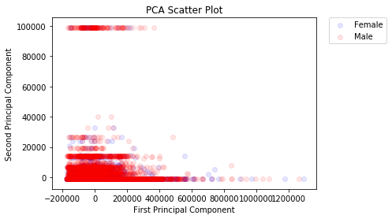

# Three types of Machine Learning Algorithms

## Supervised Learning

The algorithm consist of a target/outcome variable (or dependent variable) which is to be predicted from a given set of predictors (independent variables). Using these set of variables, we generate a function that map inputs to desired outputs. The training process continues until the model achieves a desired level of accuracy on the training data.

Examples of Supervised Learning: Regression, Decision Tree, Random Forest, kNN, Logistic Regression, etc.

## Unsupervised Learning

In this algorithm, we do not have any target or outcome variable to predict/estimate. It is used for clustering population in different groups, which is widely used for segmenting customers in different groups for specific intervention.

Examples of Unsupervised Learning: Apriori, k-means.

## Reinforcement Learning

Using this algorithm, the machine is trained to make specific decisions. It works this way: the machine is exposed to an environment where it trains itself continually using trial and error. This machine learns from past experience and tries to capture the best possible knowledge to make accurate business decisions.

Example of Reinforcement Learning: Markov Decision Process.

# The scikit-learn Module


# Basic Supervised Learning

## With a Hard-Coded Dataset


```python
# [height, weight, shoe_size]
X = [[181, 80, 44],
     [177, 70, 43],
     [160, 60, 38],
     [154, 54, 37],
     [166, 65, 40],
     [190, 90, 47],
     [175, 64, 39],
     [177, 70, 40],
     [159, 55, 37],
     [171, 75, 42],
     [181, 85, 43]]

Y = ['male', 'male', 'female', 'female', 'male', 'male', 'female', 'female', 'female', 'male', 'male']

# Convert the strings into booleans
y_train = []
for i in Y:
    if i == 'male':
        y_train.append(1)
    else:
        y_train.append(0)

y_train
```

## Linear Regression

We establish a relationship between independent and dependent variables by fitting the best line. This best fit line is known as the regression line: $Y = \alpha X + \beta$.

There are different steps to improve the model:

- Using Multiple Linear regressions;
- Including interaction terms;
- Removing features;
- Regularization techniques;
- Using a non-linear model (polynomial and other curvilinear regressions).

The code examples below are illustrations of the process. To handle a binary dependent variable (Y), we would rather work with classification models (including logistic regressions).

### R Code

```r
# Load train and test datasets
# Identify the feature and response variable(s)
# Values must be numeric and numpy arrays
x_train <- input_variables_values_training_datasets
y_train <- target_variables_values_training_datasets
x_test <- input_variables_values_test_datasets
x <- cbind(x_train, y_train)

# Train the model using the training sets and
# Check the score
linear <- lm(y_train ~ ., data = x_train)
summary(linear)

# Predict the output
predicted <- predict(linear, x_test) 
```

### Python Code


```python
# Import the libraries
from sklearn import linear_model
from sklearn.metrics import accuracy_score

# Load the Train and Test Datasets
# Identify feature and response variable(s) and
# Values must be numeric and numpy arrays
#x_train = input_variables_values_training_datasets
x_train = X
#y_train = target_variables_values_training_datasets
y_train = y_train
#x_test = input_variables_values_test_datasets
x_test = [[190, 70, 43], [160, 60, 38]]
y_test = [1, 0] # y_true

# Create the linear regression object
model = linear_model.LinearRegression()

# Train the model
model.fit(x_train, y_train)
```


    LinearRegression(copy_X=True, fit_intercept=True, n_jobs=None,
             normalize=False)


```python
# Compute accuracy
model.score(x_train, y_train)
```


    0.7754597107685945


```python
# Equation intercept and coefficient
print('Intercept (alpha): \n', model.intercept_)
print('Coefficient (betas): \n', model.coef_)
```

    Intercept (alpha): 
     -2.5061026710063232
    Coefficient (betas): 
     [-0.03917782  0.00991846  0.22230002]


```python
# Predict the output
y_pred = model.predict(x_test)
y_pred
```


    array([0.30330465, 0.26795454])


```python
# Compute accuracy
model.score(x_test, y_test)
```


    -0.11436808286011502


## Linear Regression with StatsModels

[For more](http://www.statsmodels.org/stable/index.html).


```python
# Import the library
import statsmodels.formula.api as sm
import pandas as pd

# Load the Train and Test Datasets
# Identify feature and response variable(s) and
# Values must be numeric and numpy arrays
#x_train = input_variables_values_training_datasets
x_train = X
#y_train = target_variables_values_training_datasets
y_train = y_train
#x_test = input_variables_values_test_datasets
x_test = [[190, 70, 43], [160, 60, 38]]
y_test = [1, 0] # y_true

# Create a DataFrame
df1 = pd.DataFrame(x_train, columns=['height', 'weight', 'shoe_size'])
df2 = pd.DataFrame(y_train, columns=['gender'])
df = pd.concat([df1, df2], axis=1)
```


```python
df.head(3)
```


<div>
<style scoped>
    .dataframe tbody tr th:only-of-type {
        vertical-align: middle;
    }

    .dataframe tbody tr th {
        vertical-align: top;
    }

    .dataframe thead th {
        text-align: right;
    }
</style>
<table border="1" class="dataframe">
  <thead>
    <tr style="text-align: right;">
      <th></th>
      <th>height</th>
      <th>weight</th>
      <th>shoe_size</th>
      <th>gender</th>
    </tr>
  </thead>
  <tbody>
    <tr>
      <th>0</th>
      <td>181</td>
      <td>80</td>
      <td>44</td>
      <td>1</td>
    </tr>
    <tr>
      <th>1</th>
      <td>177</td>
      <td>70</td>
      <td>43</td>
      <td>1</td>
    </tr>
    <tr>
      <th>2</th>
      <td>160</td>
      <td>60</td>
      <td>38</td>
      <td>0</td>
    </tr>
  </tbody>
</table>
</div>


```python
# State the OLS model
model = sm.ols(formula = 'gender ~ height + weight + shoe_size',
               data = df).fit()

# Print the coefficients
model.params
```


    Intercept   -2.506103
    height      -0.039178
    weight       0.009918
    shoe_size    0.222300
    dtype: float64


```python
# Print the stats
model.summary()
```

    /home/ugo/miniconda3/lib/python3.6/site-packages/scipy/stats/stats.py:1394: UserWarning: kurtosistest only valid for n>=20 ... continuing anyway, n=11
      "anyway, n=%i" % int(n))


<table class="simpletable">
<caption>OLS Regression Results</caption>
<tr>
  <th>Dep. Variable:</th>         <td>gender</td>      <th>  R-squared:         </th> <td>   0.775</td>
</tr>
<tr>
  <th>Model:</th>                   <td>OLS</td>       <th>  Adj. R-squared:    </th> <td>   0.679</td>
</tr>
<tr>
  <th>Method:</th>             <td>Least Squares</td>  <th>  F-statistic:       </th> <td>   8.058</td>
</tr>
<tr>
  <th>Date:</th>             <td>Wed, 21 Nov 2018</td> <th>  Prob (F-statistic):</th>  <td>0.0113</td> 
</tr>
<tr>
  <th>Time:</th>                 <td>13:16:06</td>     <th>  Log-Likelihood:    </th> <td> 0.27729</td>
</tr>
<tr>
  <th>No. Observations:</th>      <td>    11</td>      <th>  AIC:               </th> <td>   7.445</td>
</tr>
<tr>
  <th>Df Residuals:</th>          <td>     7</td>      <th>  BIC:               </th> <td>   9.037</td>
</tr>
<tr>
  <th>Df Model:</th>              <td>     3</td>      <th>                     </th>     <td> </td>   
</tr>
<tr>
  <th>Covariance Type:</th>      <td>nonrobust</td>    <th>                     </th>     <td> </td>   
</tr>
</table>
<table class="simpletable">
<tr>
      <td></td>         <th>coef</th>     <th>std err</th>      <th>t</th>      <th>P>|t|</th>  <th>[0.025</th>    <th>0.975]</th>  
</tr>
<tr>
  <th>Intercept</th> <td>   -2.5061</td> <td>    2.924</td> <td>   -0.857</td> <td> 0.420</td> <td>   -9.420</td> <td>    4.407</td>
</tr>
<tr>
  <th>height</th>    <td>   -0.0392</td> <td>    0.022</td> <td>   -1.777</td> <td> 0.119</td> <td>   -0.091</td> <td>    0.013</td>
</tr>
<tr>
  <th>weight</th>    <td>    0.0099</td> <td>    0.028</td> <td>    0.352</td> <td> 0.735</td> <td>   -0.057</td> <td>    0.077</td>
</tr>
<tr>
  <th>shoe_size</th> <td>    0.2223</td> <td>    0.097</td> <td>    2.287</td> <td> 0.056</td> <td>   -0.008</td> <td>    0.452</td>
</tr>
</table>
<table class="simpletable">
<tr>
  <th>Omnibus:</th>       <td> 0.165</td> <th>  Durbin-Watson:     </th> <td>   2.858</td>
</tr>
<tr>
  <th>Prob(Omnibus):</th> <td> 0.921</td> <th>  Jarque-Bera (JB):  </th> <td>   0.201</td>
</tr>
<tr>
  <th>Skew:</th>          <td> 0.201</td> <th>  Prob(JB):          </th> <td>   0.904</td>
</tr>
<tr>
  <th>Kurtosis:</th>      <td> 2.473</td> <th>  Cond. No.          </th> <td>6.25e+03</td>
</tr>
</table><br/><br/>Warnings:<br/>[1] Standard Errors assume that the covariance matrix of the errors is correctly specified.<br/>[2] The condition number is large, 6.25e+03. This might indicate that there are<br/>strong multicollinearity or other numerical problems.


## Logistic Regression

We estimate discrete values (binary values like 0/1, yes/no, true/false). It predicts the probability of occurrence of an event by fitting data to a logit function. Since, it predicts the probability, its output values lies between 0 and 1.

Note: we can work with strings in `Y`.

### The R code

```r
# Load train and test datasets
# Identify the feature and response variable(s)
# Values must be numeric and numpy arrays
x_train <- input_variables_values_training_datasets
y_train <- target_variables_values_training_datasets
x_test <- input_variables_values_test_datasets
x <- cbind(x_train, y_train)

# Train the model using the training sets and
# Check the score
logistic <- glm(y_train ~ ., data = x_train, family='binomial')
summary(logistic)

# Predict the output
predicted <- predict(logistic, x_test)
```

### The Python Code


```python
# Import the libraries
import numpy as np
from sklearn.linear_model import LogisticRegression
from sklearn.metrics import confusion_matrix
from sklearn.metrics import accuracy_score

# Load the Train and Test Datasets
# Identify feature and response variable(s) and
# Values must be numeric and numpy arrays
#x_train = input_variables_values_training_datasets
x_train = X
#y_train = target_variables_values_training_datasets
y_train = y_train
#x_test = input_variables_values_test_datasets
x_test = [[190, 70, 43], [160, 60, 38]]
y_test = [1, 0] # y_true

# Assume we have, X (predictor) and Y (target) for
# training data set and x_test(predictor) of
# test_dataset
# Create the logistic regression object
model = LogisticRegression(C = 1.0,
                           class_weight = None,
                           dual = False,
                           fit_intercept = True,
                           intercept_scaling = 1, 
                           max_iter = 100, 
                           multi_class = 'ovr',
                           n_jobs = 1,
                           penalty = 'l2',
                           random_state = None,
                           solver = 'liblinear',
                           tol = 0.0001,
                           verbose = 0, 
                           warm_start = False)

# Train the model
model.fit(x_train, y_train)
```


    LogisticRegression(C=1.0, class_weight=None, dual=False, fit_intercept=True,
              intercept_scaling=1, max_iter=100, multi_class='ovr', n_jobs=1,
              penalty='l2', random_state=None, solver='liblinear', tol=0.0001,
              verbose=0, warm_start=False)


```python
# Compute accuracy
model.score(x_train, y_train)
```


    1.0


```python
# Equation intercept and coefficient
print('Coefficient: \n', model.coef_)
print('Intercept: \n', model.intercept_)
```

    Coefficient: 
     [[-0.43920419  0.62276186  0.8290359 ]]
    Intercept: 
     [-0.00585817]


```python
# Predict the output
y_pred = model.predict(x_test)
y_pred
```


    array([0, 0])


```python
# Compute accuracy
model.score(x_test, y_test)
```


    0.5


```python
# Print the metrics
print(confusion_matrix(y_test, list(y_pred)))
```

    [[1 0]
     [1 0]]


```python
print(classification_report(y_test, list(y_pred)))
```

                  precision    recall  f1-score   support
    
               0       0.50      1.00      0.67         1
               1       0.00      0.00      0.00         1
    
       micro avg       0.50      0.50      0.50         2
       macro avg       0.25      0.50      0.33         2
    weighted avg       0.25      0.50      0.33         2
    


    /home/ugo/miniconda3/lib/python3.6/site-packages/sklearn/metrics/classification.py:1143: UndefinedMetricWarning: Precision and F-score are ill-defined and being set to 0.0 in labels with no predicted samples.
      'precision', 'predicted', average, warn_for)


## Decision tree

It is a type of supervised learning algorithm that is mostly used for classification problems. Surprisingly, it works for both categorical and continuous dependent variables. In this algorithm, we split the population into two or more homogeneous sets. This is done based on most significant attributes/independent variables to make as distinct groups as possible.

[Decision Tree Simplified](https://www.analyticsvidhya.com/blog/2016/04/complete-tutorial-tree-based-modeling-scratch-in-python/).

Note: we can work with strings in `Y`.

### The R Code

```r
library(rpart)

# Load train and test datasets
# Identify the feature and response variable(s)
# Values must be numeric and numpy arrays
x_train <- input_variables_values_training_datasets
y_train <- target_variables_values_training_datasets
x_test <- input_variables_values_test_datasets
x <- cbind(x_train, y_train)

# Grow the tree 
fit <- rpart(y_train ~ ., data = x_train, method = "class")
summary(fit)

# Predict the output 
predicted <- predict(fit, x_test)
```

### The Python Code


```python
# Import the libraries
from sklearn import tree
from sklearn.metrics import confusion_matrix
from sklearn.metrics import accuracy_score

# Load the Train and Test Datasets
# Identify feature and response variable(s) and
# Values must be numeric and numpy arrays
#x_train = input_variables_values_training_datasets
x_train = X
#y_train = target_variables_values_training_datasets
y_train = y_train
#x_test = input_variables_values_test_datasets
x_test = [[190, 70, 43], [160, 60, 38]]
y_test = [1, 0] # y_true

# Assumed you have, X (predictor) and Y (target) for
# training data set and x_test(predictor) of
# test_dataset
# Create the tree object 
model = tree.DecisionTreeClassifier(criterion = 'gini')

# For classification, we can change the algorithm
# as 'gini' or 'entropy' (information gain)
# by default it is 'gini'

# For regression
#model = tree.DecisionTreeRegressor()

# Train the model
model.fit(x_train, y_train)
```


    DecisionTreeClassifier(class_weight=None, criterion='gini', max_depth=None,
                max_features=None, max_leaf_nodes=None,
                min_impurity_decrease=0.0, min_impurity_split=None,
                min_samples_leaf=1, min_samples_split=2,
                min_weight_fraction_leaf=0.0, presort=False, random_state=None,
                splitter='best')


```python
# Compute accuracy
model.score(x_train, y_train)
```


    1.0


```python
# Predict the output
y_pred = model.predict(x_test)
y_pred
```


    array([1, 0])


```python
# Compute accuracy
model.score(x_test, y_test)
```


    1.0


```python
# Print the metrics
print(confusion_matrix(y_test, list(y_pred)))
```

    [[1 0]
     [0 1]]


```python
print(classification_report(y_test, list(y_pred)))
```

                  precision    recall  f1-score   support
    
               0       1.00      1.00      1.00         1
               1       1.00      1.00      1.00         1
    
       micro avg       1.00      1.00      1.00         2
       macro avg       1.00      1.00      1.00         2
    weighted avg       1.00      1.00      1.00         2
    


## Random Forests

Random Forest is a term for an ensemble of decision trees. In Random Forest, we have collection of decision trees (so known as “Forest”). To classify a new object based on attributes, each tree gives a classification and we say the tree “votes” for that class. The forest chooses the classification having the most votes (over all the trees in the forest).

Each tree is planted and grown as follows:

1. If the number of cases in the training set is N, then a sample of N cases is taken at random but with replacement. This sample will be the training set for growing the tree.
1. If there are M input variables, a number m < M is specified such that at each node, m variables are selected at random out of the M and the best split on these m is used to split the node. The value of m is held constant during the forest growing.
1. Each tree is grown to the largest extent possible. There is no pruning.

For more:
- [Introduction to Random forest – Simplified](https://www.analyticsvidhya.com/blog/2014/06/introduction-random-forest-simplified/)
- [Comparing a CART model to Random Forest (Part 1)](https://www.analyticsvidhya.com/blog/2014/06/comparing-cart-random-forest-1/)
- [Comparing a Random Forest to a CART model (Part 2)](https://www.analyticsvidhya.com/blog/2014/06/comparing-random-forest-simple-cart-model/)
- [Tuning the parameters of your Random Forest model](https://www.analyticsvidhya.com/blog/2015/06/tuning-random-forest-model/)

Note: we can work with strings in `Y`.

### The R Code

```r
library(randomForest)

# Load train and test datasets
# Identify the feature and response variable(s)
# Values must be numeric and numpy arrays
x_train <- input_variables_values_training_datasets
y_train <- target_variables_values_training_datasets
x_test <- input_variables_values_test_datasets
x <- cbind(x_train, y_train)

# Fitting the model
fit <- randomForest(y_train ~ ., x_train, ntree = 500)
summary(fit)

# Predict the output 
predicted <- predict(fit, x_test)
```

### The Python Code


```python
# Import the libraries
from sklearn.ensemble import RandomForestClassifier
from sklearn.metrics import confusion_matrix
from sklearn.metrics import accuracy_score

# Load the Train and Test Datasets
# Identify feature and response variable(s) and
# Values must be numeric and numpy arrays
#x_train = input_variables_values_training_datasets
x_train = X
#y_train = target_variables_values_training_datasets
y_train = y_train
#x_test = input_variables_values_test_datasets
x_test = [[190, 70, 43], [160, 60, 38]]
y_test = [1, 0] # y_true

# Assume we have, X (predictor) and Y (target) for
# training data set and x_test(predictor) of
# test_dataset
# Create the Random Forest object
model = RandomForestClassifier(n_estimators = 1000)

# Train the model
model.fit(x_train, y_train)
```


    RandomForestClassifier(bootstrap=True, class_weight=None, criterion='gini',
                max_depth=None, max_features='auto', max_leaf_nodes=None,
                min_impurity_decrease=0.0, min_impurity_split=None,
                min_samples_leaf=1, min_samples_split=2,
                min_weight_fraction_leaf=0.0, n_estimators=1000, n_jobs=None,
                oob_score=False, random_state=None, verbose=0,
                warm_start=False)


```python
# Compute accuracy
model.score(x_train, y_train)
```


    1.0


```python
# Predict the output
y_pred = model.predict(x_test)
y_pred
```


    array([1, 0])


```python
# Compute accuracy
model.score(x_test, y_test)
```


    1.0


```python
# Print the metrics
print(confusion_matrix(y_test, list(y_pred)))
```

    [[1 0]
     [0 1]]


```python
print(classification_report(y_test, list(y_pred)))
```

                  precision    recall  f1-score   support
    
               0       1.00      1.00      1.00         1
               1       1.00      1.00      1.00         1
    
       micro avg       1.00      1.00      1.00         2
       macro avg       1.00      1.00      1.00         2
    weighted avg       1.00      1.00      1.00         2
    


## k-Nearest Neighbours

kNN can be used for both classification and regression problems. However, it is more widely used in classification problems in the industry. k-NN is a simple algorithm that stores all available cases and classifies new cases by a majority vote of its k neighbors. The case being assigned to the class is most common amongst its kNN measured by a distance function.

These distance functions can be:

- Euclidean, 
- Manhattan, 
- Minkowski, and 
- Hamming. 

First three functions are used for continuous function and fourth one (Hamming) for categorical variables. If `k = 1`, then the case is simply assigned to the class of its nearest neighbor. At times, choosing k turns out to be a challenge while performing kNN modeling.

Things to consider before selecting kNN:

- kNN is computationally expensive;
- Variables should be **normalized**/standardized/rescaled or else higher range variables can bias it;
- Works on pre-processing stage more before going for kNN like outlier, noise removal.

Note: we can work with strings in `Y`.

### The R Code

```r
library(knn)

# Load train and test datasets
# Identify the feature and response variable(s)
# Values must be numeric and numpy arrays
x_train <- input_variables_values_training_datasets
y_train <- target_variables_values_training_datasets
x_test <- input_variables_values_test_datasets
x <- cbind(x_train, y_train)

# Fitting the model
fit <- knn(y_train ~ ., data = x_train, k = 5)
summary(fit)

# Predict the output 
predicted <- predict(fit, x_test)
```

### Rescaling

Normalization: $x = \frac{ x - x_{min} }{ x_{max} - x_{min} }$, transforms features by scaling each feature to a given range.

Standardization: $x = \frac{x - \mu}{\sigma}$, centers to the mean and component wise scale to unit variance.

Consult the documentation for more.

```python
# Standardize
from sklearn.preprocessing import scale

# Scale the independent variables
X_s = scale(X)

from sklearn.preprocessing import StandardScaler
scaler = StandardScaler()
X_s = scaler.transform(X)


# Normalize
from sklearn.preprocessing import MinMaxScaler

# Scale the independent variables
min_max_scaler = MinMaxScaler()
X_s = min_max_scaler.transform(X)

from sklearn.preprocessing import minmax_scale
X_s = minmax_scale(X)
```

### The Python Code


```python
# Import the libraries
from sklearn.neighbors import KNeighborsClassifier
from sklearn.metrics import confusion_matrix
from sklearn.metrics import accuracy_score

# Load the Train and Test Datasets
# Identify feature and response variable(s) and
# Values must be numeric and numpy arrays
#x_train = input_variables_values_training_datasets
x_train = X
#y_train = target_variables_values_training_datasets
y_train = y_train
#x_test = input_variables_values_test_datasets
x_test = [[190, 70, 43], [160, 60, 38]]
y_test = [1, 0] # y_true

# Assume we have, X (predictor) and Y (target) for
# training data set and x_test(predictor) of
# test_dataset
# Create the KNeighbors classifier object model 
KNeighborsClassifier(n_neighbors = 6,
                     algorithm = 'auto',
                     leaf_size = 30,
                     metric = 'minkowski',
                     metric_params = None,
                     n_jobs = 1,
                     p = 2,
                     weights = 'uniform') # default value for n_neighbors is 5

# Train the model
model.fit(x_train, y_train)
```


    RandomForestClassifier(bootstrap=True, class_weight=None, criterion='gini',
                max_depth=None, max_features='auto', max_leaf_nodes=None,
                min_impurity_decrease=0.0, min_impurity_split=None,
                min_samples_leaf=1, min_samples_split=2,
                min_weight_fraction_leaf=0.0, n_estimators=1000, n_jobs=None,
                oob_score=False, random_state=None, verbose=0,
                warm_start=False)


```python
# Compute accuracy
model.score(x_train, y_train)
```


    1.0


```python
# Predict the output
y_pred = model.predict(x_test)
y_pred
```


    array([1, 0])


```python
# Compute accuracy
model.score(x_test, y_test)
```


    1.0


```python
# Print the metrics
print(confusion_matrix(y_test, list(y_pred)))
```

    [[1 0]
     [0 1]]


```python
print(classification_report(y_test, list(y_pred)))
```

                  precision    recall  f1-score   support
    
               0       1.00      1.00      1.00         1
               1       1.00      1.00      1.00         1
    
       micro avg       1.00      1.00      1.00         2
       macro avg       1.00      1.00      1.00         2
    weighted avg       1.00      1.00      1.00         2
    


## Naïve Bayes

It is a classification technique based on Bayes’ theorem with an assumption of independence between predictors. In simple terms, a Naive Bayes classifier assumes that the presence of a particular feature in a class is unrelated to the presence of any other feature. For example, a fruit may be considered to be an apple if it is red, round, and about 3 inches in diameter. Even if these features depend on each other or upon the existence of the other features, a naive Bayes classifier would consider all of these properties to independently contribute to the probability that this fruit is an apple.

Naive Bayesian model is easy to build and particularly useful for very large data sets. Along with simplicity, Naive Bayes is known to outperform even highly sophisticated classification methods.

[Documentation](https://scikit-learn.org/stable/modules/naive_bayes.html).

Note: we can work with strings in `Y`.

### The R Code

```r
library(e1071)

# Load train and test datasets
# Identify the feature and response variable(s)
# Values must be numeric and numpy arrays
x_train <- input_variables_values_training_datasets
y_train <- target_variables_values_training_datasets
x_test <- input_variables_values_test_datasets
x <- cbind(x_train, y_train)

# Fitting the model
fit <- naiveBayes(y_train ~ ., data = x_train)
summary(fit)

# Predict the output 
predicted <- predict(fit, x_test)
predicted
```

### The Python Code


```python
# Import the libraries
from sklearn.naive_bayes import GaussianNB
from sklearn.metrics import confusion_matrix
from sklearn.metrics import accuracy_score

# Load the Train and Test Datasets
# Identify feature and response variable(s) and
# Values must be numeric and numpy arrays
#x_train = input_variables_values_training_datasets
x_train = X
#y_train = target_variables_values_training_datasets
y_train = y_train
#x_test = input_variables_values_test_datasets
x_test = [[190, 70, 43], [160, 60, 38]]
y_test = [1, 0] # y_true

# Assume you have, X (predictor) and Y (target) for
# training data set and x_test(predictor) of
# test_dataset
# Create SVM classification object
model = GaussianNB() 

# There is other distribution for
# multinomial classes like Bernoulli Naive Bayes

# Train the model
model.fit(x_train, y_train)
```


    GaussianNB(priors=None, var_smoothing=1e-09)


```python
# Compute accuracy
model.score(x_train, y_train)
```


    0.8181818181818182


```python
# Predict the output
y_pred = model.predict(x_test)
y_pred
```


    array([1, 0])


```python
# Compute accuracy
model.score(x_test, y_test)
```


    1.0


```python
# Print the metrics
print(confusion_matrix(y_test, list(y_pred)))
```

    [[1 0]
     [0 1]]


```python
print(classification_report(y_test, list(y_pred)))
```

                  precision    recall  f1-score   support
    
               0       1.00      1.00      1.00         1
               1       1.00      1.00      1.00         1
    
       micro avg       1.00      1.00      1.00         2
       macro avg       1.00      1.00      1.00         2
    weighted avg       1.00      1.00      1.00         2
    


## Support Vector Machine

SVM is a classification method. In this algorithm, we plot each data item as a point in n-dimensional space (where n is number of features you have) with the value of each feature being the value of a particular coordinate.

[For more](https://www.analyticsvidhya.com/blog/2014/10/support-vector-machine-simplified/).

Note: we can work with strings in `Y`.

### The R Code

```r
library(e1071)

# Load train and test datasets
# Identify the feature and response variable(s)
# Values must be numeric and numpy arrays
x_train <- input_variables_values_training_datasets
y_train <- target_variables_values_training_datasets
x_test <- input_variables_values_test_datasets
x <- cbind(x_train, y_train)

# Fitting the model
fit <- svm(y_train ~ ., data = x_train)
summary(fit)

# Predict the output 
predicted <- predict(fit, x_test)
```

### The Python Code


```python
# Import the libraries
from sklearn import svm
from sklearn.metrics import confusion_matrix
from sklearn.metrics import accuracy_score

# Load the Train and Test Datasets
# Identify feature and response variable(s) and
# Values must be numeric and numpy arrays
#x_train = input_variables_values_training_datasets
x_train = X
#y_train = target_variables_values_training_datasets
y_train = y_train
#x_test = input_variables_values_test_datasets
x_test = [[190, 70, 43], [160, 60, 38]]
y_test = [1, 0] # y_true

# Assume we have, X (predictor) and Y (target) for
# training data set and x_test(predictor) of
# test_dataset
# Create the SVM classification object 
model = svm.SVC(gamma = 'auto') 

# There is various option associated with it,
# this is simple for classification

# Train the model
model.fit(x_train, y_train)
```


    SVC(C=1.0, cache_size=200, class_weight=None, coef0=0.0,
      decision_function_shape='ovr', degree=3, gamma='auto', kernel='rbf',
      max_iter=-1, probability=False, random_state=None, shrinking=True,
      tol=0.001, verbose=False)


```python
# Compute accuracy
model.score(x_train, y_train)
```


    1.0


```python
# Predict the output
y_pred = model.predict(x_test)
y_pred
```


    array([1, 0])


```python
# Compute accuracy
model.score(x_test, y_test)
```


    1.0


```python
# Print the metrics
print(confusion_matrix(y_test, list(y_pred)))
```

    [[1 0]
     [0 1]]


```python
print(classification_report(y_test, list(y_pred)))
```

                  precision    recall  f1-score   support
    
               0       1.00      1.00      1.00         1
               1       1.00      1.00      1.00         1
    
       micro avg       1.00      1.00      1.00         2
       macro avg       1.00      1.00      1.00         2
    weighted avg       1.00      1.00      1.00         2
    


# Split a dataset

We can automate the split.

```python
# Import the libraries
from sklearn.model_selection import train_test_split

# Split the dataset
# 80% for training (train set)
# 20% for testing (test set)
Xs_train, Xs_test, y_train, y_test = train_test_split(X,
                                                      Y,
                                                      test_size = 0.2,
                                                      random_state = 42)
```

# Intermediate Supervised Learning

## Logistic regression


```python
# Import the libraries
import pandas as pd
from sklearn.preprocessing import LabelEncoder

# Import the data
data = pd.read_csv('data/adults.txt', sep=',')

# Convert the string labels to numeric labels
for label in ['race', 'occupation']:
    data[label] = LabelEncoder().fit_transform(data[label])
data.head(3)
```


<div>
<style scoped>
    .dataframe tbody tr th:only-of-type {
        vertical-align: middle;
    }

    .dataframe tbody tr th {
        vertical-align: top;
    }

    .dataframe thead th {
        text-align: right;
    }
</style>
<table border="1" class="dataframe">
  <thead>
    <tr style="text-align: right;">
      <th></th>
      <th>age</th>
      <th>workclass</th>
      <th>final_weight</th>
      <th>education</th>
      <th>education_num</th>
      <th>marital_status</th>
      <th>occupation</th>
      <th>relationship</th>
      <th>race</th>
      <th>sex</th>
      <th>capital_gain</th>
      <th>capital_loss</th>
      <th>hours_per_week</th>
      <th>native_country</th>
      <th>salary</th>
    </tr>
  </thead>
  <tbody>
    <tr>
      <th>0</th>
      <td>39</td>
      <td>State-gov</td>
      <td>77516</td>
      <td>Bachelors</td>
      <td>13</td>
      <td>Never-married</td>
      <td>1</td>
      <td>Not-in-family</td>
      <td>4</td>
      <td>Male</td>
      <td>2174</td>
      <td>0</td>
      <td>40</td>
      <td>United-States</td>
      <td>&lt;=50K</td>
    </tr>
    <tr>
      <th>1</th>
      <td>50</td>
      <td>Self-emp-not-inc</td>
      <td>83311</td>
      <td>Bachelors</td>
      <td>13</td>
      <td>Married-civ-spouse</td>
      <td>4</td>
      <td>Husband</td>
      <td>4</td>
      <td>Male</td>
      <td>0</td>
      <td>0</td>
      <td>13</td>
      <td>United-States</td>
      <td>&lt;=50K</td>
    </tr>
    <tr>
      <th>2</th>
      <td>38</td>
      <td>Private</td>
      <td>215646</td>
      <td>HS-grad</td>
      <td>9</td>
      <td>Divorced</td>
      <td>6</td>
      <td>Not-in-family</td>
      <td>4</td>
      <td>Male</td>
      <td>0</td>
      <td>0</td>
      <td>40</td>
      <td>United-States</td>
      <td>&lt;=50K</td>
    </tr>
  </tbody>
</table>
</div>


```python
# Take the fields of interest and
# plug them into variable X
X = data[['race', 'hours_per_week', 'occupation']]

# Provide the corresponding values
Y = data['sex'].values.tolist()
```


```python
# Import the libraries
from sklearn.linear_model import LogisticRegression
from sklearn.model_selection import train_test_split
from sklearn.metrics import confusion_matrix
from sklearn.metrics import accuracy_score

# Split the data into a test (30%) and train set (70%)
X_train, X_test, Y_train, Y_test = train_test_split(X, Y, test_size = 0.3)
```


```python
# Instantiate the classifier
clf = LogisticRegression()

# Train the model
clf = clf.fit(X_train, Y_train)

# Compute accuracy
accuracy = clf.score(X_test, Y_test)
print('Accuracy: ' + str(accuracy))
```

    /home/ugo/miniconda3/lib/python3.6/site-packages/sklearn/linear_model/logistic.py:432: FutureWarning: Default solver will be changed to 'lbfgs' in 0.22. Specify a solver to silence this warning.
      FutureWarning)


    Accuracy: 0.6801105537926093


```python
# Predict the output
prediction = clf.predict(X_test)
prediction
```

    ['Male' 'Male' 'Male' ... 'Male' 'Male' 'Male']


    array(['Male', 'Male', 'Male', ..., 'Male', 'Male', 'Male'], dtype='<U6')


```python
# Print the confusion matrix and report
print(confusion_matrix(prediction, Y_test))
```

    [[ 498  446]
     [2679 6146]]


```python
print(classification_report(prediction, Y_test))
```

                  precision    recall  f1-score   support
    
          Female       0.16      0.53      0.24       944
            Male       0.93      0.70      0.80      8825
    
       micro avg       0.68      0.68      0.68      9769
       macro avg       0.54      0.61      0.52      9769
    weighted avg       0.86      0.68      0.74      9769
    


## Decision tree


```python
# Import the libraries
from sklearn import tree
from sklearn.preprocessing import LabelEncoder
from sklearn.model_selection import train_test_split
from sklearn.metrics import confusion_matrix
from sklearn.metrics import accuracy_score

# Instantiate the classifier
clf = tree.DecisionTreeClassifier()

# Train the model
clf = clf.fit(X_train, Y_train)

# Compute accuracy
accuracy = clf.score(X_test, Y_test)
print('Accuracy: ' + str(accuracy))
```

    Accuracy: 0.7340567100010237


```python
# Predict the output
prediction = clf.predict(X_test)
prediction

# Print the confusion matrix and report
print(confusion_matrix(prediction, Y_test))
```

    [[1592 1013]
     [1585 5579]]


```python
print(classification_report(prediction, Y_test))
```

                  precision    recall  f1-score   support
    
          Female       0.50      0.61      0.55      2603
            Male       0.85      0.78      0.81      7166
    
       micro avg       0.73      0.73      0.73      9769
       macro avg       0.67      0.69      0.68      9769
    weighted avg       0.75      0.73      0.74      9769
    


## Random Forests


```python
# Import the libraries
from sklearn.ensemble import RandomForestClassifier
from sklearn.preprocessing import LabelEncoder
from sklearn.model_selection import train_test_split
from sklearn.metrics import confusion_matrix
from sklearn.metrics import accuracy_score


# Instantiate the classifier
clf = RandomForestClassifier(n_estimators = 1000)

# Train the model
clf = clf.fit(X_train, Y_train)

# Compute accuracy
accuracy = clf.score(X_test, Y_test)
print('Accuracy: ' + str(accuracy))
```

    Accuracy: 0.73303306377316


```python
# Predict the output
prediction = clf.predict(X_test)
prediction

# Print the confusion matrix and report
print(confusion_matrix(prediction, Y_test))
```

    [[1497  928]
     [1680 5664]]


```python
print(classification_report(prediction, Y_test))
```

                  precision    recall  f1-score   support
    
          Female       0.47      0.62      0.53      2425
            Male       0.86      0.77      0.81      7344
    
       micro avg       0.73      0.73      0.73      9769
       macro avg       0.67      0.69      0.67      9769
    weighted avg       0.76      0.73      0.74      9769
    


## k-Nearest Neighbours


```python
# Import the libraries
from sklearn.neighbors import KNeighborsClassifier
from sklearn.preprocessing import LabelEncoder
from sklearn.model_selection import train_test_split
from sklearn.metrics import confusion_matrix
from sklearn.metrics import accuracy_score

# Instantiate the classifier
clf = KNeighborsClassifier(n_neighbors = 3)

# Train the model
clf = clf.fit(X_train, Y_train)

# Compute accuracy
accuracy = clf.score(X_test, Y_test)
print('Accuracy: ' + str(accuracy))
```

    Accuracy: 0.6849216910635685


```python
# Predict the output
prediction = clf.predict(X_test)
prediction
```


    array(['Female', 'Female', 'Male', ..., 'Female', 'Male', 'Male'],
          dtype='<U6')


```python
# Print the confusion matrix and report
print(confusion_matrix(prediction, Y_test))
```

    [[1745 1646]
     [1432 4946]]


```python
print(classification_report(prediction, Y_test))
```

                  precision    recall  f1-score   support
    
          Female       0.55      0.51      0.53      3391
            Male       0.75      0.78      0.76      6378
    
       micro avg       0.68      0.68      0.68      9769
       macro avg       0.65      0.65      0.65      9769
    weighted avg       0.68      0.68      0.68      9769
    


## Naïve Bayes


```python
# Import the libraries
from sklearn.naive_bayes import GaussianNB
from sklearn.preprocessing import LabelEncoder
from sklearn.model_selection import train_test_split
from sklearn.metrics import confusion_matrix
from sklearn.metrics import accuracy_score

# Instantiate the classifier
clf = GaussianNB()

# Train the model
clf = clf.fit(X_train, Y_train)

# Compute accuracy
accuracy = clf.score(X_test, Y_test)
print('Accuracy: ' + str(accuracy))
```

    Accuracy: 0.6708977377418365


```python
# Predict the output
prediction = clf.predict(X_test)
print(prediction)
```

    ['Male' 'Female' 'Male' ... 'Male' 'Male' 'Male']


```python
# Print the confusion matrix and report
print(confusion_matrix(prediction, Y_test))
```

    [[ 636  674]
     [2541 5918]]


```python
print(classification_report(prediction, Y_test))
```

                  precision    recall  f1-score   support
    
          Female       0.20      0.49      0.28      1310
            Male       0.90      0.70      0.79      8459
    
       micro avg       0.67      0.67      0.67      9769
       macro avg       0.55      0.59      0.53      9769
    weighted avg       0.80      0.67      0.72      9769
    


## Support Vector Machine


```python
# Import the libraries
from sklearn import svm
from sklearn.preprocessing import LabelEncoder
from sklearn.model_selection import train_test_split
from sklearn.metrics import confusion_matrix
from sklearn.metrics import accuracy_score

# Instantiate the classifier
clf = svm.SVC(gamma = 'auto')

# Train the model
clf = clf.fit(X_train, Y_train)

# Compute accuracy
accuracy = clf.score(X_test, Y_test)
print('Accuracy: ' + str(accuracy))
```

    Accuracy: 0.7360016378339646


```python
# Predict the output
prediction = clf.predict(X_test)
print(prediction)
```

    ['Male' 'Female' 'Female' ... 'Female' 'Male' 'Male']


```python
# Print the confusion matrix and report
print(confusion_matrix(prediction, Y_test))
```

    [[1519  921]
     [1658 5671]]


```python
print(classification_report(prediction, Y_test))
```

                  precision    recall  f1-score   support
    
          Female       0.48      0.62      0.54      2440
            Male       0.86      0.77      0.81      7329
    
       micro avg       0.74      0.74      0.74      9769
       macro avg       0.67      0.70      0.68      9769
    weighted avg       0.76      0.74      0.75      9769
    


# Unsupervised Learning

## k-Means

It is an unsupervised algorithm which solves clustering problems. Assume k clusters, data points inside one cluster are homogeneous, but heterogeneous to peer groups.

In k-means, we have clusters and each cluster has its own centroid. Sum of square of difference between centroid and the data points within a cluster constitutes within sum of square value for that cluster. Also, when the sum of square values for all the clusters are added, it becomes total within sum of square value for the cluster solution.

We know that as the number of cluster increases, this value keeps on decreasing but if you plot the result you may see that the sum of squared distance decreases sharply up to some value of k, and then much more slowly after that. Here, we can find the optimum number of cluster.

### The R Code

```r
library(cluster)

# Load train and test datasets
# Identify the feature and response variable(s)
# Values must be numeric and numpy arrays
x_train <- input_variables_values_training_datasets
y_train <- target_variables_values_training_datasets
x_test <- input_variables_values_test_datasets
x <- cbind(x_train, y_train)

fit <- kmeans(x_train, 3)
```

### The Python Code


```python
# Import the Libraries
from sklearn.cluster import KMeans
from sklearn.metrics import accuracy_score

# Instantiate the classifier
clf = KMeans(n_clusters = 3, random_state = 0)

# Train the model
clf = clf.fit(X_train)

# Compute accuracy
accuracy = clf.score(X_test)
print('Accuracy: ' + str(accuracy))
```

    Accuracy: -478732.018200623


```python
# Extract the parameters
clf.get_params()
```


    {'algorithm': 'auto',
     'copy_x': True,
     'init': 'k-means++',
     'max_iter': 300,
     'n_clusters': 3,
     'n_init': 10,
     'n_jobs': None,
     'precompute_distances': 'auto',
     'random_state': 0,
     'tol': 0.0001,
     'verbose': 0}


```python
# Predict the output
prediction = clf.predict(X_test)
prediction
```


    array([1, 0, 0, ..., 0, 0, 2], dtype=int32)


# Dimension Reduction

## Principal Component Analysis


```python
# Import the Libraries
from sklearn.decomposition import PCA
from sklearn.preprocessing import LabelEncoder
import matplotlib.pyplot as plt
%matplotlib inline
```


```python
data['sex'][0:3]
```


    0    Male
    1    Male
    2    Male
    Name: sex, dtype: object


```python
# % Male
sum(data['sex'] == 'Male')/len(data)
```


    0.6692054912318418


```python
# Convert the string labels to numeric labels
for label in ['race', 'occupation', 'sex']:
    data[label] = LabelEncoder().fit_transform(data[label])
data.head(3)
```


<div>
<style scoped>
    .dataframe tbody tr th:only-of-type {
        vertical-align: middle;
    }

    .dataframe tbody tr th {
        vertical-align: top;
    }

    .dataframe thead th {
        text-align: right;
    }
</style>
<table border="1" class="dataframe">
  <thead>
    <tr style="text-align: right;">
      <th></th>
      <th>age</th>
      <th>workclass</th>
      <th>final_weight</th>
      <th>education</th>
      <th>education_num</th>
      <th>marital_status</th>
      <th>occupation</th>
      <th>relationship</th>
      <th>race</th>
      <th>sex</th>
      <th>capital_gain</th>
      <th>capital_loss</th>
      <th>hours_per_week</th>
      <th>native_country</th>
      <th>salary</th>
    </tr>
  </thead>
  <tbody>
    <tr>
      <th>0</th>
      <td>39</td>
      <td>State-gov</td>
      <td>77516</td>
      <td>Bachelors</td>
      <td>13</td>
      <td>Never-married</td>
      <td>1</td>
      <td>Not-in-family</td>
      <td>4</td>
      <td>1</td>
      <td>2174</td>
      <td>0</td>
      <td>40</td>
      <td>United-States</td>
      <td>&lt;=50K</td>
    </tr>
    <tr>
      <th>1</th>
      <td>50</td>
      <td>Self-emp-not-inc</td>
      <td>83311</td>
      <td>Bachelors</td>
      <td>13</td>
      <td>Married-civ-spouse</td>
      <td>4</td>
      <td>Husband</td>
      <td>4</td>
      <td>1</td>
      <td>0</td>
      <td>0</td>
      <td>13</td>
      <td>United-States</td>
      <td>&lt;=50K</td>
    </tr>
    <tr>
      <th>2</th>
      <td>38</td>
      <td>Private</td>
      <td>215646</td>
      <td>HS-grad</td>
      <td>9</td>
      <td>Divorced</td>
      <td>6</td>
      <td>Not-in-family</td>
      <td>4</td>
      <td>1</td>
      <td>0</td>
      <td>0</td>
      <td>40</td>
      <td>United-States</td>
      <td>&lt;=50K</td>
    </tr>
  </tbody>
</table>
</div>


```python
# Take the fields of interest and
# plug them into variable X
X = data[['age', 'final_weight', 'education_num', 'occupation', 'race', 'capital_gain', 'hours_per_week']]

# Instantiate the PCA model
pca = PCA(n_components = 2) # default value of k = min(n_sample, n_features)

# For factor analysis
#fa = decomposition.FactorAnalysis()

# Transform the data
reduced_data_pca = pca.fit_transform(X)

# Inspect the shape
reduced_data_pca.shape
```


    (32561, 2)


```python
# Print the transformed data
reduced_data_pca[0:3]
```


    array([[-112262.33316765,    1099.76011639],
           [-106467.39923916,   -1074.41772634],
           [  25867.60075685,   -1078.43450794]])


```python
# Plot the results
x = reduced_data_pca[:, 0]
y = reduced_data_pca[:, 1]

plt.scatter(x, y)

plt.xlabel('First Principal Component')
plt.ylabel('Second Principal Component')
plt.title("PCA Scatter Plot")

plt.show()
```


```python
male = [data['sex'] == 1][0:3]
type(male)
```


    list


```python
# Is Male?
male[0][0:3]
```


    0    True
    1    True
    2    True
    Name: sex, dtype: bool


```python
female = [data['sex'] == 0][0:3]

# Is Female?
female[0][0:3]
```


    0    False
    1    False
    2    False
    Name: sex, dtype: bool


```python
colors = ['blue', 
          'red']

for i in range(len(colors)):
    print(i)
```

    0
    1


```python
data.sex = data.sex.astype(int)
data.head(3)
```


<div>
<style scoped>
    .dataframe tbody tr th:only-of-type {
        vertical-align: middle;
    }

    .dataframe tbody tr th {
        vertical-align: top;
    }

    .dataframe thead th {
        text-align: right;
    }
</style>
<table border="1" class="dataframe">
  <thead>
    <tr style="text-align: right;">
      <th></th>
      <th>age</th>
      <th>workclass</th>
      <th>final_weight</th>
      <th>education</th>
      <th>education_num</th>
      <th>marital_status</th>
      <th>occupation</th>
      <th>relationship</th>
      <th>race</th>
      <th>sex</th>
      <th>capital_gain</th>
      <th>capital_loss</th>
      <th>hours_per_week</th>
      <th>native_country</th>
      <th>salary</th>
    </tr>
  </thead>
  <tbody>
    <tr>
      <th>0</th>
      <td>39</td>
      <td>State-gov</td>
      <td>77516</td>
      <td>Bachelors</td>
      <td>13</td>
      <td>Never-married</td>
      <td>1</td>
      <td>Not-in-family</td>
      <td>4</td>
      <td>1</td>
      <td>2174</td>
      <td>0</td>
      <td>40</td>
      <td>United-States</td>
      <td>&lt;=50K</td>
    </tr>
    <tr>
      <th>1</th>
      <td>50</td>
      <td>Self-emp-not-inc</td>
      <td>83311</td>
      <td>Bachelors</td>
      <td>13</td>
      <td>Married-civ-spouse</td>
      <td>4</td>
      <td>Husband</td>
      <td>4</td>
      <td>1</td>
      <td>0</td>
      <td>0</td>
      <td>13</td>
      <td>United-States</td>
      <td>&lt;=50K</td>
    </tr>
    <tr>
      <th>2</th>
      <td>38</td>
      <td>Private</td>
      <td>215646</td>
      <td>HS-grad</td>
      <td>9</td>
      <td>Divorced</td>
      <td>6</td>
      <td>Not-in-family</td>
      <td>4</td>
      <td>1</td>
      <td>0</td>
      <td>0</td>
      <td>40</td>
      <td>United-States</td>
      <td>&lt;=50K</td>
    </tr>
  </tbody>
</table>
</div>


```python
# 0 Female, blue
# 1 Male, red
for i in range(len(colors)):
    x = reduced_data_pca[:, 0]*[data['sex'] == i]
    y = reduced_data_pca[:, 1]*[data['sex'] == i]
    plt.scatter(x, y, c=colors[i], alpha=0.1) 

# 0 Female, 1 Male
plt.legend(['Female','Male'], 
           bbox_to_anchor=(1.05, 1), 
           loc=2, 
           borderaxespad=0.)

plt.xlabel('First Principal Component')
plt.ylabel('Second Principal Component')
plt.title("PCA Scatter Plot")

plt.show()
```




