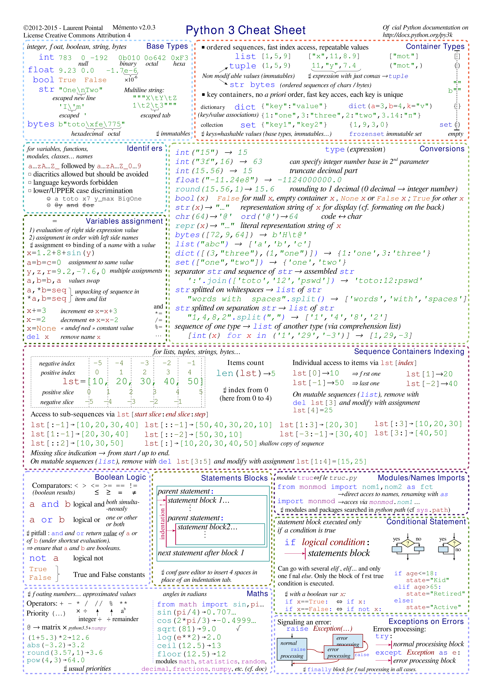
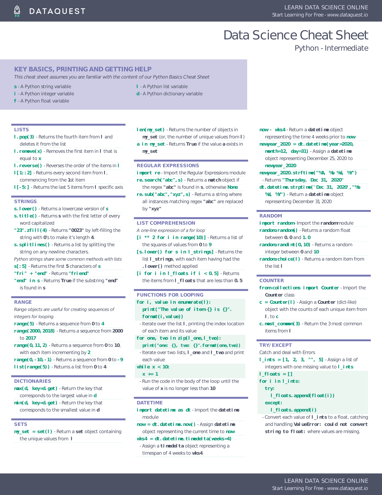
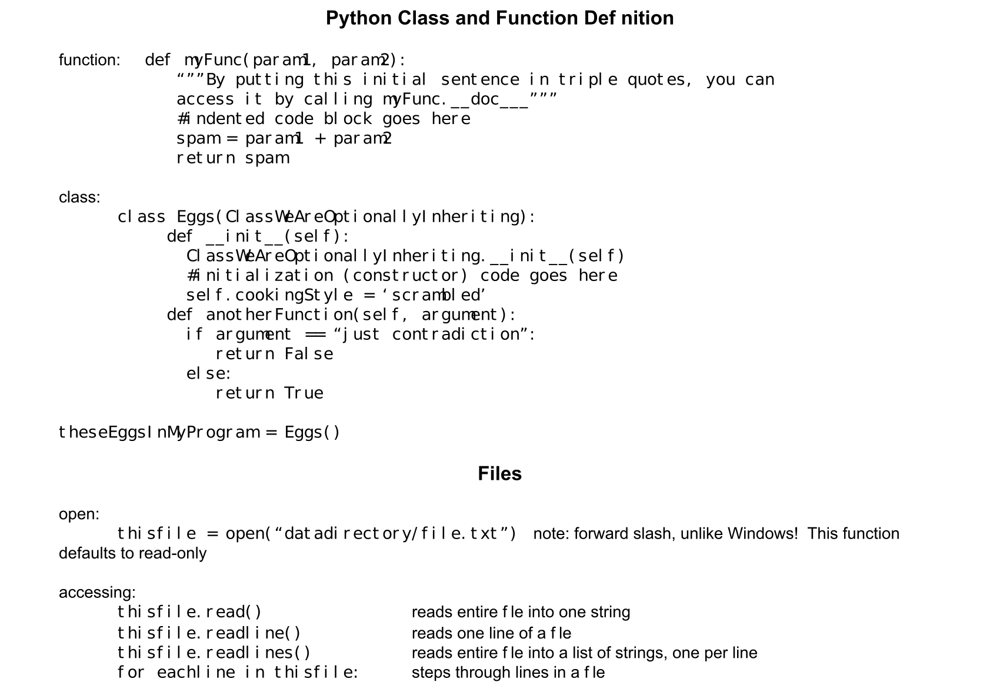

# Python 3

- [Python 3 Notes](pdf/Python_Notes.pdf). PDF only.
- [Python 3](pdf/Python-3-Cheatsheet.pdf). PDF.

- [Python, Intermediate](pdf/python-cheat-sheet-intermediate.pdf). PDF.

- [Python 3](pdf/Python-Cheat-Sheet-by-CodeConquestDOTcom.pdf). PDF.

# Libraries

## Debugger

- [Python Debugger](pdf/Python-Debugger-Cheatsheet.pdf). PDF.

## Decorators

- [Python Decorators](pdf/Python-Decorators.pdf). PDF.

## Pip

- [Pip Cheat Sheet](pdf/Pip-Cheatsheet.pdf). PDF.

# Python 2

- [Python 2](pdf/Python-Cheatsheet-1.pdf). PDF.

- [Python 2](pdf/Python-Cheatsheet-2.pdf). PDF.
   

- [Python 2 Quick Reference](pdf/Python-Quick-Reference'Sheet.pdf). PDF.

img/

- [Python 2](pdf/PythonCheatsheet-3.pdf). PDF.

