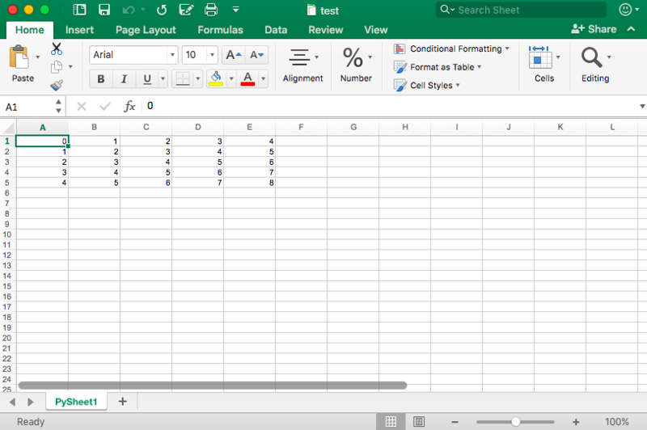

---

**Foreword**

Code snippets and excerpts from the tutorial. Python 3. From DataCamp.

---

# The Data as the Starting Point

Work with packages such as `pandas, openpyxl, xlrd, xlutils, pyexcel`.

Datasets from Kaggle, Quandl, Google or on repositories (GitHub, Bitbucket, GitLab, etc.).

## Check the Quality of the Spreadsheet

- Does the spreadsheet represent static data?
- Does the spreadsheet mix data, calculations, and reporting?
- Is the data in the spreadsheet complete and consistent?
    - Does the spreadsheet have a systematic worksheet structure?
    - Are the live formulas in the spreadsheet valid?

## Best Practices for Spreadsheet Data

- The first row of the spreadsheet is usually reserved for the header, while the first column is used to identify the sampling unit;
- Avoid names, values or fields with blank spaces. Otherwise, each word will be interpreted as a separate variable, resulting in errors that are related to the number of elements per line in the dataset. Consider using:
    - Underscores,
    - Dashes,
    - Camel case, where the first letter of each section of text is capitalized, or
    - Concatenating words
- Short names are preferred over longer names;
- Try to avoid using names that contain symbols such as `?, %, ^, &, *, (, ), -, #, ?, <, >, /, |, \, [ ,] , {, }` and `,` and dollar sign;
- Delete any comments that were made in the file to avoid extra columns or NA’s to be added to the file; and
- Make sure that any missing values in the dataset are indicated with NA.

Save in `.xls, .xlsx, .csv, .txt`.

# Preparing the Workspace


```python
# Import `os` 
import os

# Retrieve current working directory (`cwd`)
cwd = os.getcwd()
```

Print it with `cwd` or `print(cwd)`.

```python
# Change directory 
os.chdir("/path/to/your/folder")

# List all files and directories in current directory
os.listdir('.')
```

# Using Virtual Environments

In a Python virtualenv: we can multiple projects running at the same time and we don’t want them to share the same Python installation or when projects have conflicting requirements.

```bash
# Install virtualenv
$ pip install virtualenv

# Go to the folder of the project
$ cd my_folder

# Create a virtual environment `venv`
$ virtualenv venv

# Indicate the Python interpreter to use for `venv`
$ virtualenv -p /usr/bin/python2.7 venv

# Activate `venv`
$ source venv/bin/activate

# Deactivate `venv`
$ deactivate
```

# Check the Loaded Dataset

```python
# Check the first entries of the DataFrame
df1.head()

# Check the last entries of the DataFrame
df1.tail()

# Inspect the shape 
data.shape

# Inspect the number of dimensions
data.ndim

# Inspect the data type
data.dtype
```

# Install Packages to Read and Write Excel Files

`pandas, openpyxl, xlrd, xlutils, pyexcel`...

- `pip install`.
- `conda install` (Anaconda includes [100 of the most popular Python](https://docs.continuum.io/anaconda/packages/pkg-docs), [R](https://docs.continuum.io/anaconda/packages/r-language-pkg-docs) and Scala packages for data science and several open source development environments such as Jupyter and Spyder).

## Packages to Parse Excel Files and Write them back with Python

From the [site](http://www.python-excel.org/):

- `openpyxl`, the recommended package for reading and writing Excel 2010 files (ie: .xlsx). [Documentation](https://openpyxl.readthedocs.io/en/default/).
- `xlsxwriter`, an alternative package for writing data, formatting information and, in particular, charts in the Excel 2010 format (ie: .xlsx). [Documentation](https://xlsxwriter.readthedocs.io/).
- `xlrd`, this package is for reading data and formatting information from older Excel files (ie: .xls). [Documentation](https://github.com/python-excel/xlrd).
- `xlwt`, this package is for writing data and formatting information to older Excel files (ie: .xls). [Documentation](http://xlwt.readthedocs.io/en/latest/).
- `xlutils`, this package collects utilities that require both xlrd and xlwt, including the ability to copy and modify or filter existing excel files. [Documentation](http://xlutils.readthedocs.io/en/latest/).

# Load Excel & CSV Files as Pandas DataFrames

## Excel

```python
# Import pandas
import pandas as pd

# Assign spreadsheet filename to `file`
file = 'example.xlsx'

# Load spreadsheet
xl = pd.ExcelFile(file)

# Print the sheet names
print(xl.sheet_names)

# Load a sheet into a DataFrame by name: df1
df1 = xl.parse('Sheet1')
```

## CSV 

```python
# Import pandas
import pandas as pd

# Load csv
df = pd.read_csv("example.csv") 
```

[More options](http://pandas.pydata.org/pandas-docs/stable/generated/pandas.read_csv.html).

## Flat files, tables

Also: `read_table()` and `read_fwf()`. [More options](http://pandas.pydata.org/pandas-docs/stable/api.html#input-output).

# Write Pandas DataFrames to Excel and CSV Files

## Excel

```python
# Specify a writer
writer = pd.ExcelWriter('example.xlsx', engine='xlsxwriter')

# Write the DataFrame to a file     
yourData.to_excel(writer, 'Sheet1')

# Save the result 
writer.save()
```

Pass the writer variable to the `to_excel()` function and specify the sheet name. Add a sheet with the data to an existing workbook: `ExcelWriter` save multiple, (slightly) different DataFrames to one workbook.

```python
# Specify a writer
writer = pd.ExcelWriter('example.xlsx')

# Write the DataFrame to a file     
yourData.to_excel(writer, 'Sheet1')

# Save the result 
writer.save()
```

Save one DataFrame to a file, don’t specify the engine argument in the `pd.ExcelWriter()` function. The rest of the steps stay the same.

## CSV, flat files, tables

```python
# Write the DataFrame to csv
df.to_csv("example.csv")
```

Tab-separated file, pass the `sep = '\t'` argument.

# Read and Write Excel Files with `openyxl`

Read and write .xlsx, xlsm, xltx, xltm files.

The general advice for installing this package is to do it in a Python virtual environment without system packages. We can use virtual environment to create isolated Python environments: it creates a folder which contains all the necessary executables to use the packages that a Python project would need.

- Go to the directory in which the project is located and re-activate the virtual environment `venv`. 
- Then proceed to install `openpyxl` with `pip` to make sure that we can read and write files with it:

```python
# Activate virtualenv
$ source activate venv

# Install `openpyxl` in `venv`
$ pip install openpyxl
```

- Install `openpyxl` and start loading in the data.
- Make sure that we’re in the right directory where the spreadsheet is located (change the working directory with `os.chdir()`).

```python
# Import `load_workbook` module from `openpyxl`
from openpyxl import load_workbook

# Load in the workbook
wb = load_workbook('./test.xlsx')
type(wb)

# Get sheet names
print(wb.get_sheet_names())
```

- Which sheet is currently active.

```python
# Get a sheet by name 
sheet = wb.get_sheet_by_name('Sheet3')

# Print the sheet title 
sheet.title

# Get currently active sheet
anotherSheet = wb.active

# Check `anotherSheet` 
anotherSheet
```

- Retrieve information in the workbook's sheet.

```python
# Retrieve the value of a certain cell
sheet['A1'].value

# Select element 'B2' of the sheet 
c = sheet['B2']

# Retrieve the row number of the element
c.row

# Retrieve the column letter of the element
c.column

# Retrieve the coordinates of the cell 
c.coordinate

# Retrieve cell value 
sheet.cell(row=1, column=2).value

# Print out values in column 2 
for i in range(1, 4):
     print(i, sheet.cell(row=i, column=2).value)
     
# Import relevant modules from `openpyxl.utils`
from openpyxl.utils import get_column_letter, column_index_from_string

# Return 'A'
get_column_letter(1)

# Return '1'
column_index_from_string('A')
```

Print the coordinate and the value that is contained within that cell.

```python
# Print row per row
for cellObj in sheet['A1':'C3']:
      for cell in cellObj:
              print(cells.coordinate, cells.value)
      print('--- END ---')
```

```python
('A1', u'M')
('B1', u'N')
('C1', u'O')
--- END ---
('A2', 10L)
('B2', 11L)
('C2', 12L)
--- END ---
('A3', 14L)
('B3', 15L)
('C3', 16L)
--- END ---
```

Check up on the result of import.

```python
# Retrieve the maximum amount of rows 
sheet.max_row

# Retrieve the maximum amount of columns
sheet.max_column
```

Pandas DataFrames.

```python
# Import `pandas` 
import pandas as pd

# Convert Sheet to DataFrame
df = pd.DataFrame(sheet.values)
```

Specify headers and indices.

```python
# Put the sheet values in `data`
data = sheet.values

# Indicate the columns in the sheet values
cols = next(data)[1:]

# Convert the data to a list
data = list(data)

# Read in the data at index 0 for the indices
idx = [r[0] for r in data]

# Slice the data at index 1 
data = (islice(r, 1, None) for r in data)

# Make the DataFrame
df = pd.DataFrame(data, index=idx, columns=cols)
```

Write the Pandas DataFrames back to an Excel file.

```python
# Import `dataframe_to_rows`
from openpyxl.utils.dataframe import dataframe_to_rows

# Initialize a workbook 
wb = Workbook()

# Get the worksheet in the active workbook
ws = wb.active

# Append the rows of the DataFrame to the worksheet
for r in dataframe_to_rows(df, index=True, header=True):
    ws.append(r)
```

More options: change cell styles or use the write-only mode.

# Read and Format Excel Files with `xlrd`

.xls or .xlsx extensions.

```python
# Import `xlrd`
import xlrd

# Open a workbook 
workbook = xlrd.open_workbook('example.xls')

# Loads only current sheets to memory
workbook = xlrd.open_workbook('example.xls', on_demand = True)
```

Retrieve the sheets, then cells.

```python
# Load a specific sheet by name
worksheet = workbook.sheet_by_name('Sheet1')

# Load a specific sheet by index 
worksheet = workbook.sheet_by_index(0)

# Retrieve the value from cell at indices (0,0) 
sheet.cell(0, 0).value
```

# Write to Excel Files with `xlwt`

.xls extension

```python
# Import `xlwt` 
import xlwt

# Initialize a workbook 
book = xlwt.Workbook(encoding="utf-8")

# Add a sheet to the workbook 
sheet1 = book.add_sheet("Python Sheet 1") 

# Write to the sheet of the workbook 
sheet1.write(0, 0, "This is the First Cell of the First Sheet") 

# Save the workbook 
book.save("spreadsheet.xls")
```

Loop: every element in the range from 0 to 4 (5 not included).

```python
# Initialize a workbook
book = xlwt.Workbook()

# Add a sheet to the workbook
sheet1 = book.add_sheet("Sheet1")

# The data
cols = ["A", "B", "C", "D", "E"]
txt = [0,1,2,3,4]

# Loop over the rows and columns and fill in the values
for num in range(5):
      row = sheet1.row(num)
      for index, col in enumerate(cols):
          value = txt[index] + num
          row.write(index, value)

# Save the result
book.save("test.xls")
```




# A Collection of Utilities: `xlutils`

Collection of utilities that require both `xlrd` and `xlwt`, which includes the ability to copy and modify or filter existing files. Generally speaking, these use cases are now covered by `openpyxl`.

# Read with `pyexcel`

Python Wrapper that provides one API for reading, manipulating and writing data in .csv, .ods, .xls, .xlsx and .xlsm.

[Documentation](https://pyexcel.readthedocs.io/en/latest/index.html).

In an array.

```python
# Import `pyexcel`
import pyexcel

# Get an array from the data
my_array = pyexcel.get_array(file_name="test.xls")
```

In an ordered dictionary of lists; even obtain all the workbook sheets in a single dictionary.

```python
# Import `OrderedDict` module 
from pyexcel._compact import OrderedDict

# Get the data in an ordered dictionary of lists
my_dict = pyexcel.get_dict(file_name="test.xls", name_columns_by_row=0)

# Get the data in a dictionary of 2D arrays
book_dict = pyexcel.get_book_dict(file_name="test.xls")
```

The arrays and dictionaries of the spreadsheet, allow creating DataFrames of the data with `pd.DataFrame()`.

Just retrieve the records.
 
```python
# Retrieve the records of the file
records = pyexcel.get_records(file_name="test.xls")
```

# Write with `pyexcel`

Arrays.

```python
# Get the data
data = [[1, 2, 3], [4, 5, 6], [7, 8, 9]]

# Save the array to a file
pyexcel.save_as(array=data, dest_file_name="array_data.xls")
```

`dest_delimiter = ";"`

Dictionary.

```python
# The data
2d_array_dictionary = {'Sheet 1': [
                                   ['ID', 'AGE', 'SCORE']
                                   [1, 22, 5],
                                   [2, 15, 6],
                                   [3, 28, 9]
                                  ],
                       'Sheet 2': [
                                    ['X', 'Y', 'Z'],
                                    [1, 2, 3],
                                    [4, 5, 6]
                                    [7, 8, 9]
                                  ],
                       'Sheet 3': [
                                    ['M', 'N', 'O', 'P'],
                                    [10, 11, 12, 13],
                                    [14, 15, 16, 17]
                                    [18, 19, 20, 21]
                                   ]}

# Save the data to a file                        
pyexcel.save_book_as(bookdict=2d_array_dictionary, dest_file_name="2d_array_data.xls")
```

The order of the data in the dictionary will not be kept.

# Read and Write .csv Files

```python
# import `csv`
import csv

# Read in csv file 
for row in csv.reader(open('data.csv'), delimiter=','):
      print(row)
      
# Write csv file
data = [[1, 2, 3], [4, 5, 6], [7, 8, 9]]
outfile = open('data.csv', 'w')
writer = csv.writer(outfile, delimiter=';', quotechar='"')
writer.writerows(data)
outfile.close()
```

## Numpy

`genfromtxt()` allows to load in the data that is contained within .csv files into arrays which we can then put in DataFrames.
