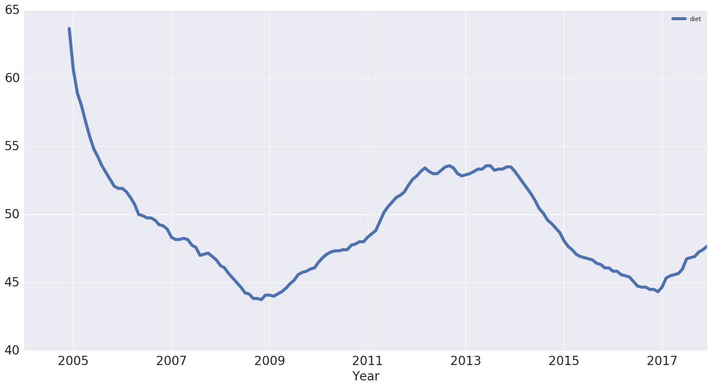
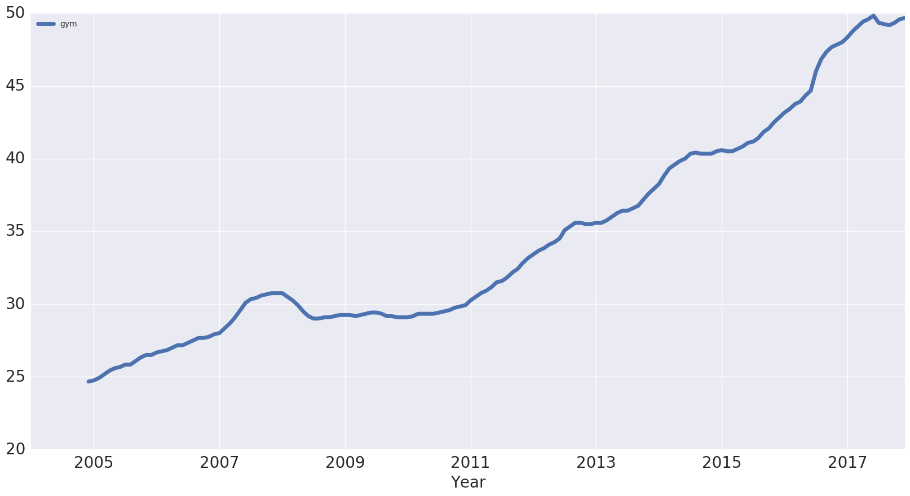
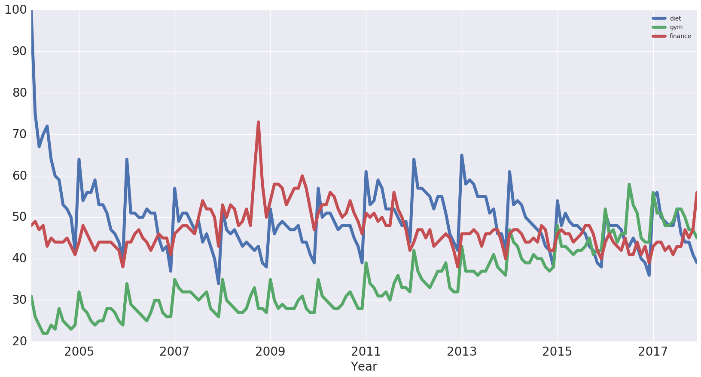
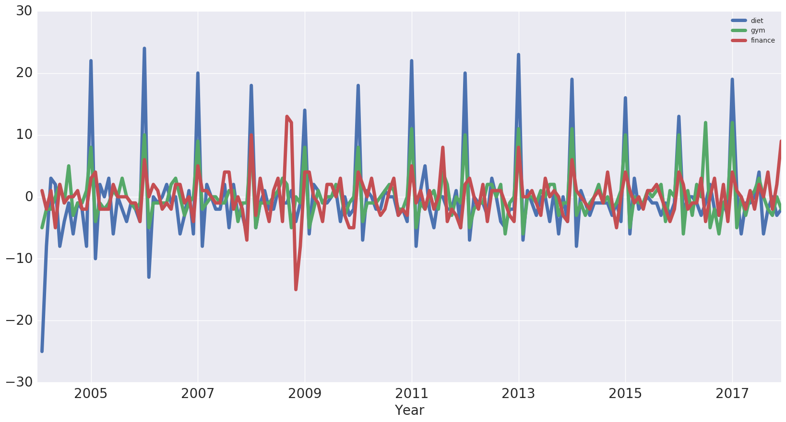

---

**Foreword**

Code snippets and excerpts from the tutorial. Python 3. From DataCamp.

---

# Approach

Get Google Trends data of keywords such as 'diet' and 'gym' and see how they vary over time while learning about trends and seasonality in time series data.

- Source the data
- Wrangle the data
- Exploratory Data Analysis
- Trends and seasonality in time series data
    - Identifying Trends
    - Seasonal patterns
        - First Order Differencing
        - Periodicity and Autocorrelation

# Importing Packages and the Data

The data are from [Google Trends](https://trends.google.com/trends/explore?date=all&q=diet,gym,finance).


```python
# Import the packages
import numpy as np
import pandas as pd
import matplotlib.pyplot as plt
import seaborn as sns
%matplotlib inline

# Switch to the Seaborn defaults
sns.set()
```


```python
# Import the data
# Check out the first rows
df = pd.read_csv('multiTimeline.csv', skiprows=1)
df.head(3)
```


<div>
<style>
    .dataframe thead tr:only-child th {
        text-align: right;
    }

    .dataframe thead th {
        text-align: left;
    }

    .dataframe tbody tr th {
        vertical-align: top;
    }
</style>
<table border="1" class="dataframe">
  <thead>
    <tr style="text-align: right;">
      <th></th>
      <th>Month</th>
      <th>diet: (Worldwide)</th>
      <th>gym: (Worldwide)</th>
      <th>finance: (Worldwide)</th>
    </tr>
  </thead>
  <tbody>
    <tr>
      <th>0</th>
      <td>2004-01</td>
      <td>100</td>
      <td>31</td>
      <td>48</td>
    </tr>
    <tr>
      <th>1</th>
      <td>2004-02</td>
      <td>75</td>
      <td>26</td>
      <td>49</td>
    </tr>
    <tr>
      <th>2</th>
      <td>2004-03</td>
      <td>67</td>
      <td>24</td>
      <td>47</td>
    </tr>
  </tbody>
</table>
</div>


```python
# Check out the data types, number of rows and more
df.info()
```

    <class 'pandas.core.frame.DataFrame'>
    RangeIndex: 168 entries, 0 to 167
    Data columns (total 4 columns):
    Month                   168 non-null object
    diet: (Worldwide)       168 non-null int64
    gym: (Worldwide)        168 non-null int64
    finance: (Worldwide)    168 non-null int64
    dtypes: int64(3), object(1)
    memory usage: 5.3+ KB


# Wrangle the Data

Rename the columns of the DataFrame `df` so that they have no whitespaces in them.


```python
df.columns = ['month', 'diet', 'gym', 'finance']
df.head()
```


<div>
<style>
    .dataframe thead tr:only-child th {
        text-align: right;
    }

    .dataframe thead th {
        text-align: left;
    }

    .dataframe tbody tr th {
        vertical-align: top;
    }
</style>
<table border="1" class="dataframe">
  <thead>
    <tr style="text-align: right;">
      <th></th>
      <th>month</th>
      <th>diet</th>
      <th>gym</th>
      <th>finance</th>
    </tr>
  </thead>
  <tbody>
    <tr>
      <th>0</th>
      <td>2004-01</td>
      <td>100</td>
      <td>31</td>
      <td>48</td>
    </tr>
    <tr>
      <th>1</th>
      <td>2004-02</td>
      <td>75</td>
      <td>26</td>
      <td>49</td>
    </tr>
    <tr>
      <th>2</th>
      <td>2004-03</td>
      <td>67</td>
      <td>24</td>
      <td>47</td>
    </tr>
    <tr>
      <th>3</th>
      <td>2004-04</td>
      <td>70</td>
      <td>22</td>
      <td>48</td>
    </tr>
    <tr>
      <th>4</th>
      <td>2004-05</td>
      <td>72</td>
      <td>22</td>
      <td>43</td>
    </tr>
  </tbody>
</table>
</div>


Turn the `month` column into a `DateTime` data type (vs. `object`).


```python
df.month = pd.to_datetime(df.month)
```

Make it the index of the DataFrame. Include the `inplace` argument when setting the index of the DataFrame `df` so that we alter the original index and set it to the `month` column.


```python
df.set_index('month', inplace=True)
df.head()
```


<div>
<style>
    .dataframe thead tr:only-child th {
        text-align: right;
    }

    .dataframe thead th {
        text-align: left;
    }

    .dataframe tbody tr th {
        vertical-align: top;
    }
</style>
<table border="1" class="dataframe">
  <thead>
    <tr style="text-align: right;">
      <th></th>
      <th>diet</th>
      <th>gym</th>
      <th>finance</th>
    </tr>
    <tr>
      <th>month</th>
      <th></th>
      <th></th>
      <th></th>
    </tr>
  </thead>
  <tbody>
    <tr>
      <th>2004-01-01</th>
      <td>100</td>
      <td>31</td>
      <td>48</td>
    </tr>
    <tr>
      <th>2004-02-01</th>
      <td>75</td>
      <td>26</td>
      <td>49</td>
    </tr>
    <tr>
      <th>2004-03-01</th>
      <td>67</td>
      <td>24</td>
      <td>47</td>
    </tr>
    <tr>
      <th>2004-04-01</th>
      <td>70</td>
      <td>22</td>
      <td>48</td>
    </tr>
    <tr>
      <th>2004-05-01</th>
      <td>72</td>
      <td>22</td>
      <td>43</td>
    </tr>
  </tbody>
</table>
</div>


# Exploratory Data Analysis (EDA)

Use a built-in `pandas` visualization method `.plot()` to plot the data. Specify the label on the x-axis.


```python
df.plot(figsize=(20,10), linewidth=5, fontsize=20)
plt.xlabel('Year', fontsize=20);
```


A value of 100 is the peak popularity for the term. A value of 50 means that the term is half as popular. Likewise a score of 0 means the term was less than 1% as popular as the peak.

Plot one column.


```python
df[['diet']].plot(figsize=(20,10), linewidth=5, fontsize=20)
plt.xlabel('Year', fontsize=20);
```


# Trends and Seasonality in Time Series

## Identifying Trends in Time Series

Take a rolling average to remove the seasonality and see the trend. 12 months for example (before and after each point).


```python
# Extract one column, 
# but do not create a Series with df['diet']
diet = df[['diet']]

# Chain: rolling, avg, plot
diet.rolling(12).mean().plot(figsize=(20,10), linewidth=5, fontsize=20)

# Plot
plt.xlabel('Year', fontsize=20)
```


    <matplotlib.text.Text at 0x7f3c0630c240>





```python
# Another column
gym = df[['gym']]

# Chain
gym.rolling(12).mean().plot(figsize=(20,10), linewidth=5, fontsize=20)

# Plot
plt.xlabel('Year', fontsize=20)
```


    <matplotlib.text.Text at 0x7f3c0da837f0>





```python
# Create a new df with both
df_rm = pd.concat([diet.rolling(12).mean(), gym.rolling(12).mean()], axis=1)

# Chain
df_rm.plot(figsize=(20,10), linewidth=5, fontsize=20)

# Plot
plt.xlabel('Year', fontsize=20)
```


    <matplotlib.text.Text at 0x7f3c0621c7f0>


## Seasonal Patterns in Time Series

We can remove the trend from the time series by subtracting the rolling mean from the original signal, leaving the seasonality only and turning the data into a stationary time series (such as mean and variance don't change over time). Many time series forecasting methods are based on the assumption that the time series is approximately stationary.

Another way to remove the trend is called "differencing".

### First-order differencing

Difference between one data point and the one before it.

**Second-order differencing** means that we would be looking at the difference between one data point and the two that precede it.

[More on differencing](https://www.otexts.org/fpp/8/1).


```python
# Differencing
diet.diff().plot(figsize=(20,10), linewidth=5, fontsize=20)

# Plot
plt.xlabel('Year', fontsize=20);
```


## Periodicity and Autocorrelation

A time series is periodic if it repeats itself at equally spaced intervals, say, every 12 months.

Yet another way of thinking about this is that the time series is correlated with itself shifted by 12 months. That means that, if we took the time series and moved it 12 months backwards or forwards, it would map onto itself in some way: autocorrelation.

### A Word about Correlation


```python
from sklearn import datasets

iris = datasets.load_iris()

df_iris = pd.DataFrame(data = np.c_[iris['data'], iris['target']],
                       columns = iris['feature_names'] + ['target'])
df_iris.head(3)
```


<div>
<style>
    .dataframe thead tr:only-child th {
        text-align: right;
    }

    .dataframe thead th {
        text-align: left;
    }

    .dataframe tbody tr th {
        vertical-align: top;
    }
</style>
<table border="1" class="dataframe">
  <thead>
    <tr style="text-align: right;">
      <th></th>
      <th>sepal length (cm)</th>
      <th>sepal width (cm)</th>
      <th>petal length (cm)</th>
      <th>petal width (cm)</th>
      <th>target</th>
    </tr>
  </thead>
  <tbody>
    <tr>
      <th>0</th>
      <td>5.1</td>
      <td>3.5</td>
      <td>1.4</td>
      <td>0.2</td>
      <td>0.0</td>
    </tr>
    <tr>
      <th>1</th>
      <td>4.9</td>
      <td>3.0</td>
      <td>1.4</td>
      <td>0.2</td>
      <td>0.0</td>
    </tr>
    <tr>
      <th>2</th>
      <td>4.7</td>
      <td>3.2</td>
      <td>1.3</td>
      <td>0.2</td>
      <td>0.0</td>
    </tr>
  </tbody>
</table>
</div>


```python
sns.lmplot(x='sepal length (cm)', y='sepal width (cm)',
           fit_reg=False, data=df_iris)
```


    <seaborn.axisgrid.FacetGrid at 0x7f3c060fb5f8>


```python
sns.lmplot(x='sepal length (cm)', y='sepal width (cm)',
           fit_reg=True, data=df_iris);
```


```python
sns.lmplot(x='sepal length (cm)', y='sepal width (cm)',
           fit_reg=False, data=df_iris, hue='target')
```


    <seaborn.axisgrid.FacetGrid at 0x7f3c060b7438>


```python
df_iris.corr()
```


<div>
<style>
    .dataframe thead tr:only-child th {
        text-align: right;
    }

    .dataframe thead th {
        text-align: left;
    }

    .dataframe tbody tr th {
        vertical-align: top;
    }
</style>
<table border="1" class="dataframe">
  <thead>
    <tr style="text-align: right;">
      <th></th>
      <th>sepal length (cm)</th>
      <th>sepal width (cm)</th>
      <th>petal length (cm)</th>
      <th>petal width (cm)</th>
      <th>target</th>
    </tr>
  </thead>
  <tbody>
    <tr>
      <th>sepal length (cm)</th>
      <td>1.000000</td>
      <td>-0.109369</td>
      <td>0.871754</td>
      <td>0.817954</td>
      <td>0.782561</td>
    </tr>
    <tr>
      <th>sepal width (cm)</th>
      <td>-0.109369</td>
      <td>1.000000</td>
      <td>-0.420516</td>
      <td>-0.356544</td>
      <td>-0.419446</td>
    </tr>
    <tr>
      <th>petal length (cm)</th>
      <td>0.871754</td>
      <td>-0.420516</td>
      <td>1.000000</td>
      <td>0.962757</td>
      <td>0.949043</td>
    </tr>
    <tr>
      <th>petal width (cm)</th>
      <td>0.817954</td>
      <td>-0.356544</td>
      <td>0.962757</td>
      <td>1.000000</td>
      <td>0.956464</td>
    </tr>
    <tr>
      <th>target</th>
      <td>0.782561</td>
      <td>-0.419446</td>
      <td>0.949043</td>
      <td>0.956464</td>
      <td>1.000000</td>
    </tr>
  </tbody>
</table>
</div>


```python
df_iris.groupby(['target']).corr()
```


<div>
<style>
    .dataframe thead tr:only-child th {
        text-align: right;
    }

    .dataframe thead th {
        text-align: left;
    }

    .dataframe tbody tr th {
        vertical-align: top;
    }
</style>
<table border="1" class="dataframe">
  <thead>
    <tr style="text-align: right;">
      <th></th>
      <th></th>
      <th>petal length (cm)</th>
      <th>petal width (cm)</th>
      <th>sepal length (cm)</th>
      <th>sepal width (cm)</th>
    </tr>
    <tr>
      <th>target</th>
      <th></th>
      <th></th>
      <th></th>
      <th></th>
      <th></th>
    </tr>
  </thead>
  <tbody>
    <tr>
      <th rowspan="4" valign="top">0.0</th>
      <th>petal length (cm)</th>
      <td>1.000000</td>
      <td>0.306308</td>
      <td>0.263874</td>
      <td>0.176695</td>
    </tr>
    <tr>
      <th>petal width (cm)</th>
      <td>0.306308</td>
      <td>1.000000</td>
      <td>0.279092</td>
      <td>0.279973</td>
    </tr>
    <tr>
      <th>sepal length (cm)</th>
      <td>0.263874</td>
      <td>0.279092</td>
      <td>1.000000</td>
      <td>0.746780</td>
    </tr>
    <tr>
      <th>sepal width (cm)</th>
      <td>0.176695</td>
      <td>0.279973</td>
      <td>0.746780</td>
      <td>1.000000</td>
    </tr>
    <tr>
      <th rowspan="4" valign="top">1.0</th>
      <th>petal length (cm)</th>
      <td>1.000000</td>
      <td>0.786668</td>
      <td>0.754049</td>
      <td>0.560522</td>
    </tr>
    <tr>
      <th>petal width (cm)</th>
      <td>0.786668</td>
      <td>1.000000</td>
      <td>0.546461</td>
      <td>0.663999</td>
    </tr>
    <tr>
      <th>sepal length (cm)</th>
      <td>0.754049</td>
      <td>0.546461</td>
      <td>1.000000</td>
      <td>0.525911</td>
    </tr>
    <tr>
      <th>sepal width (cm)</th>
      <td>0.560522</td>
      <td>0.663999</td>
      <td>0.525911</td>
      <td>1.000000</td>
    </tr>
    <tr>
      <th rowspan="4" valign="top">2.0</th>
      <th>petal length (cm)</th>
      <td>1.000000</td>
      <td>0.322108</td>
      <td>0.864225</td>
      <td>0.401045</td>
    </tr>
    <tr>
      <th>petal width (cm)</th>
      <td>0.322108</td>
      <td>1.000000</td>
      <td>0.281108</td>
      <td>0.537728</td>
    </tr>
    <tr>
      <th>sepal length (cm)</th>
      <td>0.864225</td>
      <td>0.281108</td>
      <td>1.000000</td>
      <td>0.457228</td>
    </tr>
    <tr>
      <th>sepal width (cm)</th>
      <td>0.401045</td>
      <td>0.537728</td>
      <td>0.457228</td>
      <td>1.000000</td>
    </tr>
  </tbody>
</table>
</div>


### Periodicity and Autocorrelation (continued)

The time series again.


```python
df.plot(figsize=(20,10), linewidth=5, fontsize=20)
plt.xlabel('Year', fontsize=20)
```


    <matplotlib.text.Text at 0x7f3c062fd390>





```python
df.corr()
```


<div>
<style>
    .dataframe thead tr:only-child th {
        text-align: right;
    }

    .dataframe thead th {
        text-align: left;
    }

    .dataframe tbody tr th {
        vertical-align: top;
    }
</style>
<table border="1" class="dataframe">
  <thead>
    <tr style="text-align: right;">
      <th></th>
      <th>diet</th>
      <th>gym</th>
      <th>finance</th>
    </tr>
  </thead>
  <tbody>
    <tr>
      <th>diet</th>
      <td>1.000000</td>
      <td>-0.100764</td>
      <td>-0.034639</td>
    </tr>
    <tr>
      <th>gym</th>
      <td>-0.100764</td>
      <td>1.000000</td>
      <td>-0.284279</td>
    </tr>
    <tr>
      <th>finance</th>
      <td>-0.034639</td>
      <td>-0.284279</td>
      <td>1.000000</td>
    </tr>
  </tbody>
</table>
</div>


`diet` and `gym` are negatively correlated. However, from looking at the times series, it looks as though their seasonal components would be positively correlated and their trends negatively correlated. The actual correlation coefficient is actually capturing both of those.


```python
# first-order differences
df.diff().plot(figsize=(20,10), linewidth=5, fontsize=20)
plt.xlabel('Year', fontsize=20)
```


    <matplotlib.text.Text at 0x7f3c05fcfac8>





`diet` and `gym` are incredibly correlated once we remove the trend.


```python
df.diff().corr()
```


<div>
<style>
    .dataframe thead tr:only-child th {
        text-align: right;
    }

    .dataframe thead th {
        text-align: left;
    }

    .dataframe tbody tr th {
        vertical-align: top;
    }
</style>
<table border="1" class="dataframe">
  <thead>
    <tr style="text-align: right;">
      <th></th>
      <th>diet</th>
      <th>gym</th>
      <th>finance</th>
    </tr>
  </thead>
  <tbody>
    <tr>
      <th>diet</th>
      <td>1.000000</td>
      <td>0.758707</td>
      <td>0.373828</td>
    </tr>
    <tr>
      <th>gym</th>
      <td>0.758707</td>
      <td>1.000000</td>
      <td>0.301111</td>
    </tr>
    <tr>
      <th>finance</th>
      <td>0.373828</td>
      <td>0.301111</td>
      <td>1.000000</td>
    </tr>
  </tbody>
</table>
</div>


### Autocorrelation

Autocorrelation of the 'diet' series: on the x-axis, we have the lag and on the y-axis, we have how correlated the time series is with itself at that lag.

So, this means that if the original time series repeats itself every two days, we would expect to see a spike in the autocorrelation function at 2 days.


```python
pd.plotting.autocorrelation_plot(diet)
```


    <matplotlib.axes._subplots.AxesSubplot at 0x7f3c05f587b8>


This is 12 months at which we have this huge peak in correlation. We have another peak at a 24 month interval, where it's also correlated with itself. We have another peak at 36, but as we move further away, there's less and less of a correlation.

The dotted lines in the above plot actually tell us about the statistical significance of the correlation.

# Forecasts, ARIMA...

Use ARIMA modeling to make some time series forecasts as to what these search trends will look like over the coming years.
